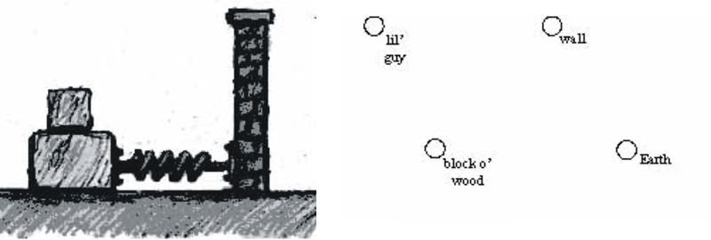
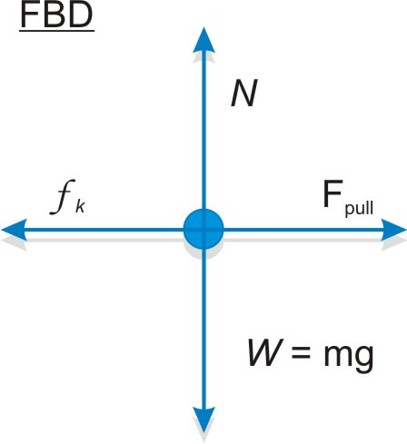
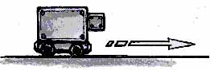
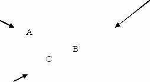
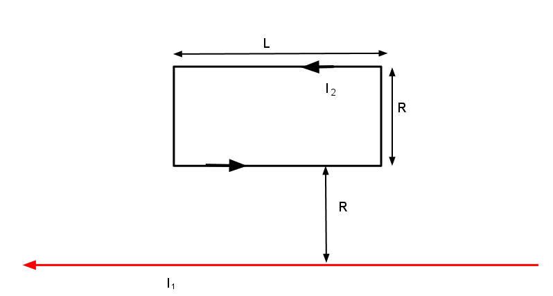
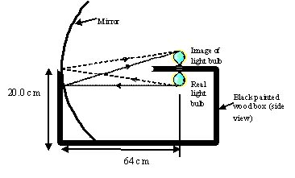
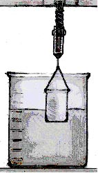

<!--
author:   James H Dann, Ph.D.

email:    LiaScript@web.de

version:  0.0.1

language: en

narrator: US English Female

comment:  Adopts a multifaceted strategy to teach physics conceptually and mathematically.

logo:     ../cover.jpg

tags:      Physics, conservation, electricity, energy, fluids, forces, light, magnetism, momentum, motion, Newton, physics, thermodynamics, waves

-->

# People's Physics Concepts

> This document was automatically translated to LiaScript from
>
> https://www.ck12.org/book/peoples-physics-concepts/

## 1.0 Units and Problem Solving

<article>

Introduction
------------

Units identify what a specific number refers to. For instance, the number 42 can be used to represent 42 miles, 42 pounds, or 42 elephants! Numbers are _mathematical_ objects, but units give them _physical_ meaning. Keeping track of units can help you avoid mistakes when you work out problems.

</article>

### 1.1 Metric Units

<article>

 

Every answer to a physics problem must include units. Even if a problem explicitly asks for a [speed](/cbook/ck-12-middle-school-physical-science-flexbook-2.0/section/9.4/primary/lesson/speed-ms-ps "speed") in meters per second (m/s), the answer is 5 m/s, not 5.

If a unit is named after a person, it is capitalized. So you write “10 Newtons,” or “10 N,” but “10 meters,” or “10 m.”

Metric units use a base numbering system of 10. Thus a centimeter is ten times larger than a millimeter. A decimeter is 10 times larger than a centimeter and a meter is 10 times larger than a decimeter. Thus a meter is 100 times larger than a centimeter and 1000 times larger than a millimeter. Going the other way, one can say that there are 100 cm contained in a meter.

### Frequently Used Measurements, Greek Letters, and Prefixes

|     |     |     |
| --- | --- | --- |Types of Measurements
| Type of measurement | Commonly used symbols | Fundamental units |
| --- | --- | --- |
| length or position | $d, x, L$ | meters (m) |
| time | $t$ | seconds (s) |
| [velocity](/cbook/ck-12-middle-school-physical-science-flexbook-2.0/section/9.6/primary/lesson/velocity-ms-ps "velocity") or speed | $v, u$ | meters per second (m/s) |
| mass | $m$ | kilograms (kg) |
| force | $\mathbf{F}$ | Newtons (N) |
| [energy](/cbook/ck-12-middle-school-physical-science-flexbook-2.0/section/14.1/primary/lesson/energy-ms-ps "energy") | $E, K, U, Q$ | Joules (J) |
| power | $P$ | Watts (W) |
| electric charge | $q, e$ | Coulombs (C) |
| [temperature](/cbook/ck-12-middle-school-physical-science-flexbook-2.0/section/15.2/primary/lesson/temperature-ms-ps "temperature") | $T$ | Kelvin (K) |
| electric current | $I$ | Amperes (A) |
| electric field | $\mathbf{E}$ | Newtons per Coulomb (N/C) |
| [magnetic field](/cbook/ck-12-physics-flexbook-2.0/section/18.2/primary/lesson/electric-currents-and-magnetic-fields-phys "magnetic field") | $\mathbf{B}$ | Tesla (T) |

|     |     |     |
| --- | --- | --- |Common Prefixes
| SI prefix | In Words | Factor |
| --- | --- | --- |
| nano (n) | billionth | $1*10^{-9}$ |
| micro (µ) | millionth | $1*10^{-6}$ |
| milli (m) | thousandth | $1*10^{-3}$ |
| centi (c) | hundreth | $1*10^{-2}$ |
| deci (d) | tenth | $1*10^{-1}$ |
| deca (da) | ten | $1*10^{1}$ |
| hecto (h) | hundred | $1*10^{2}$ |
| kilo (k) | thousand | $1*10^{3}$ |
| mega (M) | million | $1*10^{6}$ |
| giga (G) | billion | $1*10^{9}$ |

|     |     |     |     |     |
| --- | --- | --- | --- | --- |Frequently Used Greek Letters
| $\mu$ “mu” | $\tau$ “tau” | $\Phi$ “Phi”_\*_ | $\omega$ “omega” | $\rho$ “rho” |
| --- | --- | --- | --- | --- |
| $\theta$ “theta” | $\pi$ “pi ” | $\Omega$ “Omega”_\*_ | $\lambda$ “lambda” | $\Sigma$ “Sigma”_\*_ |
| $\alpha$ “alpha” | $\beta$ “beta” | $\gamma$ “gamma” | $\Delta$ “Delta”_\*_ | $\epsilon$ “epsilon” |

Two very common Greek letters are $\Delta$ and $\Sigma$ . $\Delta$ is used to indicate that we should use the change or difference between the final and initial values of that specific variable. $\Sigma$ denotes the sum or net value of a variable.

### Examples

#### Example 1

Convert 2500 m/s into km/s

A km (kilometer) is 1000 times bigger than a meter. Thus, one simply divides by 1000 and arrives at 2.5 km/s

#### Example 2

The lengths of the sides of a cube are doubling each second. At what rate is the volume increasing?

The cube side length, $x$, is doubling every second. Therefore after 1 second it becomes $2{x}$. The volume of the first cube of side ${x}$ is ${x}\times{x}\times{x}={{x}^3}$. The volume of the second cube of side $2{x}$ is $2{x}\times2{x}\times2{x}={8{x}^3}$. The ratio of the second volume to the first volume is ${8{x}^3}/{{x}^3}=8$. Thus the volume is increasing by a factor of 8 every second.

### CK-12 Interactive

!?[undefined](media/214301.mp4 "video")

### Review

1.  A tortoise travels $15$ meters $\;\mathrm{(m)}$ west, then another $13$ centimeters $\;\mathrm{(cm)}$ west. How many meters total has she walked? \[Figure 1\]
2.  A tortoise, Bernard, starting at point A travels $12 \;\mathrm{m}$ west and then $150$ millimeters $\;\mathrm{(mm)}$ east. How far west of point $A$ is Bernard after completing these two motions?
3.  $80 \;\mathrm{m} + 145 \;\mathrm{cm} + 7850 \;\mathrm{mm} =  X\ \;\mathrm{mm}$. What is$X$ ?
4.  A square has sides of length $45 \;\mathrm{mm}$. What is the area of the square in $\;\mathrm{mm}^2$?
5.  A square with area $49 \;\mathrm{cm}^2$ is stretched so that each side is now twice as long. What is the area of the square now? Include a sketch.
6.  A rectangular solid has a square face with sides $5 \;\mathrm{cm}$ in length, and a length of $10 \;\mathrm{cm}$. What is the volume of the solid in $\;\mathrm{cm}^3$? Sketch the object, including the dimensions in your sketch.
7.  As you know, a cube with each side $4 \;\mathrm{m}$ in length has a volume of $64 \;\mathrm{m}^3$. Each side of the cube is now doubled in length. What is the _ratio_ of the new volume to the old volume? Why is this ratio **not** simply $2$? Include a sketch with dimensions.
8.  What is the ratio of the mass of the Earth to the mass of a single proton? (The mass of the Earth is 5.97 x 10 _24_ kg and the mass of a single proton is 1.67 x 10 _\-27_ kg). 
9.  A spacecraft can travel $20 \;\mathrm{km/s}$. How many km can this spacecraft travel in 1 hour $\;\mathrm{(h)}$?

### **Review (Answers)**

1.  $15.13 \;\mathrm{m}$
2.  $11.85 \;\mathrm{m}$
3.  $89,300 \;\mathrm{mm}$
4.  $2025 \;\mathrm{mm}^2$
5.  $196 \;\mathrm{cm}^2$
6.  $250 \;\mathrm{cm}^3$
7.  $8:1,$ each side goes up by $2 \;\mathrm{cm}$, so it will change by $2^3$
8.  $3.5 \times 10^{51}:1$
9.  $72,000 \;\mathrm{km/h}$

</article>

### 1.2 Unit Conversions

<article>

The key to converting units is to multiply by a clever factor of one. You can always multiply by 1, because it does not change the number. Since 1 in. is equal to 2.54 cm, then $1 = {\frac{2.54 \;\mathrm{cm}}{1 \;\mathrm{in}}} = {\frac{1 \;\mathrm{in}}{2.54 \;\mathrm{cm}}}$. Thus, one can multiply by this form of 1 in order to cancel units (see video below).

Write out every step and show all your units cancelling as you go.

When converting speeds from metric to American units, remember the following rule of thumb: a [speed](/cbook/ck-12-middle-school-physical-science-flexbook-2.0/section/9.4/primary/lesson/speed-ms-ps "speed") measured in mi/hr is about double the value measured in m/s (_i.e.,_ $10 \mathrm{m/s}$ is equal to about 20 MPH). Remember that the speed itself hasn’t changed, just our representation of the speed in a certain set of units.

When you’re not sure how to approach a problem, you can often get insight by considering how to obtain the units of the desired result by combining the units of the given variables. For instance, if you are given a [distance](/cbook/ck-12-middle-school-physical-science-flexbook-2.0/section/9.2/primary/lesson/distance-ms-ps "distance") (in meters) and a time (in hours), the only way to obtain units of speed (meters/hour) is to divide the distance by the time. This is a simple example of a method called _dimensional analysis_, which can be used to find equations that govern various physical situations without any knowledge of the phenomena themselves.

> ###   Key Conversions
> 
> $$
> \begin{align*}
> 1\ \text{meter} & = 3.28\ \text{feet} && \\
> 1\ \text{mile} & = 1.61 \text{~kilometers} && \\
> 1\ \text{lb. (1\ pound)} & = 4.45\ \text{Newtons}
> \end{align*}
> $$

!?[0](https://www.youtube.com/watch?v=Be2i_9Wu3pk)

 

### Examples

#### Example 1

20 m/s = ? mi/hr

20 m/s (1 mi/1600 m) = .0125 mi/s

0.0125 mi/s (60 s/min) = .75 mi/min

0.75 mi/min (60 min/hr) = 45 mi/hr

### Interactive Simulation

!?[undefined](media/183721.mp4 "video")

### Review

1.  Estimate or measure your height.
    1.  Convert your height from feet and inches to meters.
    2.  Convert your height from feet and inches to centimeters $(100 \;\mathrm{cm} = 1 \;\mathrm{m})$
2.  Estimate or measure the amount of time that passes between breaths when you are sitting at rest.
    1.  Convert the time from seconds into hours
    2.  Convert the time from seconds into milliseconds $\;\mathrm{(ms)}$
3.  Convert the French speed limit of $140 \;\mathrm{km/hr}$ into $\;\mathrm{mi/hr}$.
4.  Estimate or measure your weight.
    1.  Convert your weight in pounds into a mass in $kg$
    2.  Convert your mass from $kg$ into $\mu g$
    3.  Convert your weight into Newtons
5.  Find the $SI$ unit for pressure.
6.  An English lord says he weighs $12$ stone.
    1.  Convert his weight into pounds (you may have to do some research online)
    2.  Convert his weight in stones into a mass in kilograms
7.  If the speed of your car increases by $10 \;\mathrm{mi/hr}$ every 2 seconds, how many $\;\mathrm{mi/hr}$ is the speed increasing every second? State your answer with the units $\;\mathrm{mi/hr/s}$.

### **Review (Answers)**

1.  a. A person of height $5 \;\mathrm{ft}$. $11 \;\mathrm{in}$. is $1.80 \;\mathrm{m}$ tall b. The same person is $180 \;\mathrm{cm}$
2.  a. $3 \;\mathrm{seconds} = 1/1200 \;\mathrm{hours}$ b. $3x10^3 \;\mathrm{ms}$
3.  $87.5 \;\mathrm{mi/hr}$
4.  If the person weighs $150 \;\mathrm{lb}$ then a. 67.9 kg (on Earth) b. 67.9 billion $\mu g$ c. this is equivalent to $668 \;\mathrm{N}$
5.  Pascals (Pa), which equals $\;\mathrm{N/m}^2$
6.  a. $168 \;\mathrm{lb}$.,b. $76.2 \;\mathrm{kg}$
7.  $5 \;\mathrm{mi/hr/s}$

</article>

## 2.0 One-Dimensional Motion

<article>

Introduction
------------

One dimensional motion describes objects moving in straight lines. Speed is a scalar measure of how quickly an object is moving along this line. Velocity is speed with a direction, making it a vector. If an object’s velocity changes with time, the object is said to be accelerating. When restricted to one dimension, there are only two possible directions for the velocity and acceleration vectors to point in. As we’ll see in the next chapters, understanding an object's acceleration is the key to understanding its motion.

</article>

### 2.1 Position and Displacement

<article>

Position is the location of the object (whether it's a person, a ball, or a particle) at a given moment in time. Displacement is the difference in the object's position from one time to another. [Distance](/cbook/ck-12-middle-school-physical-science-flexbook-2.0/section/9.2/primary/lesson/distance-ms-ps "Distance") is the total amount the object has traveled in a certain period of time. Displacement is a vector quantity (direction matters), where as distance is a scalar (only the amount matters). Distance and displacement are the same in the case where the object travels in a straight line and always moving in the same direction. 

> ###   Key Equations
> 
> $$
> \begin{align*}
> \text{Symbols}\begin{cases}
> \Delta \text{(anything)} & \text{Final value - initial value}\\
> \text{anything}_0 & \text{Value at time 0}
> \end{cases}
> \end{align*}
> $$
> 
> 
> 
> $$
> \begin{align*}
> \text{Scalars}\begin{cases}
> t & \text{Time in seconds, s}\\
> d = |{\Delta x_1}| + |{\Delta x_2}| & \text{Distance (in meters, m}\text{)}\\
> v = |{v}| & \text{Speed (in meters per second,}\ \text{m}/\text{s}\text{)}
> \end{cases}
> \end{align*}
> $$
> 
>  
> 
> $$
> \begin{align*}
> \text{Vectors}\begin{cases}
> x = x(t) & \text{Position} \\
> \Delta x = x_f-x_i  & \text{Displacement}\\
> \end{cases}
> \end{align*}
> $$
> 
>

When beginning a one dimensional problem, define a positive direction. The other direction is then taken to be negative. Traditionally, "positive" is taken to mean "to the right"; however, any definition of direction used consistently throughout the problem will yield the right answer.

### Examples

#### Example 1

An indecisive car goes 120 m North, then 30 m south then 60m North. What is the car's distance and displacement?

Distance is the total amount traveled. Thus distance = 120 + 30 + 60 m = 210 m

Displacement is the amount displaced from the starting position. Thus displacement = 120 - 30 + 60 m = 150 m.

#### Example 2

An $8^{\text{th}}$ grader is timed to run 24 feet in 12 seconds, what is her [speed](/cbook/ck-12-middle-school-physical-science-flexbook-2.0/section/9.4/primary/lesson/speed-ms-ps "speed") in meters per second?

$$
\begin{align*}
D & = vt\\
24 \ ft & = v(12 \ s)\\ 
v & = 24 \ ft/12 \ s = 2 \ ft/s\\
v & = 2 \ ft/s \ast (1 m/3.28 \ ft) = 0.61 \ m/s
\end{align*}
$$

### Interactive Simulation

!?[undefined](media/192953.mp4 "video")

### Review

1.  What is the difference between distance $d$ and displacement $\triangle x$ Write a few sentences explaining this.
2.  Does the odometer reading in a car measure distance or displacement?
3.  Imagine a fox darting around in the woods for several hours. Can the displacement $\triangle x$ of the fox from his initial position ever be larger than the total distance $d$ he traveled? Explain.
4.  Your brother borrowed the scissors from your room and now you want to use them. Do you care about the distance the scissors have traveled or their displacement? Explain your answer.
5.  You’re trying to predict how long it’s going to take to get to Los Angeles for the long weekend. Do you care about the distance you’ll travel or your displacement? Explain your answer.

### **Review (Answers)**

1.  Distance is a scalar while displacement is a vector.
2.  Distance
3.  The distance traveled is always equal to or greater than the displacement, since it is impossible to 'untravel’ a distance, but is possible to reduce displacement.
4.  Displacement
5.  Distance

</article>

### 2.2 Average Velocity

<article>

**[Speed](/cbook/ck-12-middle-school-physical-science-flexbook-2.0/section/9.4/primary/lesson/speed-ms-ps "Speed")** is the [distance](/cbook/ck-12-middle-school-physical-science-flexbook-2.0/section/9.2/primary/lesson/distance-ms-ps "distance") traveled divided by the time it took to travel that distance.

**[Velocity](/cbook/ck-12-middle-school-physical-science-flexbook-2.0/section/9.6/primary/lesson/velocity-ms-ps "Velocity")** is the instantaneous speed and direction.

**Average** velocity is the displacement divided by the time.

> ###   Key Equations
> 
> Speed = distance/time
> 
> The equation for average velocity is 
> 
> $$
> \begin{align*}
> v_{avg} & = \frac{\boldsymbol{\Delta} x}{\Delta t} \\
> \end{align*}
> $$

!?[0](https://www.youtube.com/watch?v=YPJAoi9bIaA)

 

### Examples

#### Example 1

Pacific loggerhead sea turtles migrate over 7,500 miles (12,000 km) between nesting beaches in Japan and feeding grounds off the coast of Mexico. If the average speed of a loggerhead is about 45 km/day, how long does it take for it to complete the distance of a one-way migration?

Question:  $t = ?$ \[days\]

Given: $d = 12,000 \ km$

${\;} \qquad v_{avg} = 45 \ km/day$

Equations: $v_{avg} = \frac{d}{t}$ therefore $t = \frac{d}{v_{avg}}$

Plug n' Chug: $t = \frac{d}{v_{avg}} = \frac{12,000 \ km}{45 \ km/day} = 267 \ days$

The answer is 267 days.

### Interactive Simulations

!?[undefined](media/181141.mp4 "video")

### Review

1.  Two cars are heading right towards each other, but are 12 km apart. One car is going 70 km/hr and the other is going 50 km/hr. How much time do they have before they collide head on?
2.  You drive the 10 miles to work at an average speed of 40 mph. On the way home you hit severe traffic and drive at an average speed of 10 mph. What is your average speed for the trip?
3.  The following data represent the first 30 seconds of actor Crispin Glover’s drive to work.

| Time (s) | Position (m) | Distance (m) |
| --- | --- | --- |
| 0   | 0   | 0   |
| 5   | 10  | 10  |
| 10  | 30  | 30  |
| 15  | 30  | 30  |
| 20  | 20  | 40  |
| 25  | 50  | 70  |
| 30  | 80  | 120 |

Sketch the graphs of position vs. time and distance vs. time. Label your $x$ and $y$ axes appropriately.

1.  1.  Why is there a discrepancy between the distance covered and the change in position during the time period between $t = 25 \;\mathrm{s}$ and $t = 30 \;\mathrm{s}$?
    2.  What do you think is going on between $t = 10 \;\mathrm{s}$ and $t = 15 \;\mathrm{s}$?
    3.  What is the displacement between $t = 10 \;\mathrm{s}$ and $t = 25 \;\mathrm{s}$?
    4.  What is the distance covered between $t = 10 \;\mathrm{s}$ and $t = 25 \;\mathrm{s}$?
    5.  What is the average velocity during the first $30$ seconds of the trip?
    6.  What is the average velocity between the times $t = 20 \;\mathrm{s}$ and $t = 30 \;\mathrm{s}$?
    7.  During which time interval(s) was the velocity negative?
    8.  Sketch the velocity vs. time and speed vs. time graphs. Label your $x$ and $y$ axes appropriately.

### **Review (Answers)**

1. 0.1 hours = 6 minutes

2. 16 mph

3. a. He changed directions  b. He is not moving  c. 20 m  d. 40 m  e. 2.67 m/s  f. 6 m/s,               g. 15-20 s

</article>

### 2.3 Velocity and Acceleration

<article>

[Acceleration](/cbook/ck-12-middle-school-physical-science-flexbook-2.0/section/9.7/primary/lesson/acceleration-ms-ps "Acceleration") is the rate of change of [velocity](/cbook/ck-12-middle-school-physical-science-flexbook-2.0/section/9.6/primary/lesson/velocity-ms-ps "velocity"). So in other words, acceleration tells you how quickly the velocity is increasing or decreasing. An acceleration of $5 \ m/s^2$ indicates that the velocity is increasing by $5 m/s$ in the positive direction every second.

Gravity near the Earth pulls an object downwards toward the surface of the Earth with an acceleration of $9.8 \ m/s^2 ( \approx 10 \ m/s^2)$. In the absence of air [resistance](/cbook/ck-12-middle-school-physical-science-flexbook-2.0/section/20.8/primary/lesson/electric-resistance-ms-ps "resistance"), all objects will fall with the same acceleration. The letter $g$ is used as the symbol for the acceleration of gravity.

When talking about an object's acceleration, whether it is due to gravity or not, the acceleration of gravity is sometimes used as a unit of measurement where $1g=9.8m/s^2$. So an object accelerating at 2g's is accelerating at $2*9.8m/s^2$ or $19.6m/s^2$

**Deceleration** is the term used when an object’s _[speed](/cbook/ck-12-middle-school-physical-science-flexbook-2.0/section/9.4/primary/lesson/speed-ms-ps "speed")_ (i.e. magnitude of its velocity) is decreasing due to acceleration in the opposite direction of its velocity.

> ###   Key Equations
> 
> $v =$ velocity (m/s)
> 
> $v_i =$ initial velocity
> 
> $v_f =$ final velocity
> 
> $\Delta v =$ change in velocity $= v_f - v_i$
> 
> $v_{avg} = \frac{\Delta x}{\Delta t}$
> 
> $a =$ acceleration $(m/s^2)$
> 
> $a_{avg} = \frac{\Delta v}{\Delta t}$

!?[0](https://www.youtube.com/watch?v=muDS2Cgl5vA)

### Examples

#### Example 1

A Top Fuel dragster can accelerate from 0 to 100 mph (160 km/hr) in 0.8 seconds. What is the [average acceleration](/cbook/ck-12-physics-flexbook-2.0/section/2.4/primary/lesson/average-acceleration-phys "average acceleration") in $m/s^2$?

Question: $a_{avg} = ? \ [m/s^2]$

Given: $v_i = 0 \ m/s$

 ${\;} \qquad \ \ v_f = 160 \ km/hr$

${\;} \qquad \ \quad t = 0.8 \ s$

Equations: $a_{avg} = \frac{\Delta v }{t}$

Plug n' Chug: Convert km/hr to m/s

$v_f = \left( 160 \frac{km}{hr} \right ) \left( \frac{1,000 \ m}{1 \ km} \right ) \left ( \frac{1 \ hr}{3,600 \ s} \right ) = 44.4 \ m/s$

Solve for average acceleration

$a_{avg} = \frac{\Delta v}{t} = \frac{v_f - v_i}{t} = \frac{44.4 \ m/s - 0 \ m/s}{0.8 \ s} = 56 \ m/s^2$

The answer is 56 m/s_2_.  
Note that this is over $5 \frac{1}{2}$ g’s!

### Interactive Simulation

!?[undefined](media/181132.mp4 "video")

### Review

1.  Ms. Reitman’s scooter starts from rest and accelerates at $2.0 m/s^2$.
    1.  Where will the scooter be relative to its starting point after 7.0 seconds?
    2.  What is the scooter's velocity after 1s? after 2s? after 7s?
2.  A horse is galloping forward with an acceleration of $3 \;\mathrm{m/s}^2$. Which of the following statements is not necessarily true? You may choose more than one.
    1.  The horse is increasing its speed by 3 m/s every second, from 0 m/s to 3 m/s to 6 m/s to 9 m/s.
    2.  The speed of the horse will triple every second, from 0 m/s to 3 m/s to 9 m/s to 27 m/s.
    3.  Starting from rest, the horse will cover 3 m of ground in the first second.
    4.  Starting from rest, the horse will cover 1.5 m of ground in the first second.
3.  Below are images from a race between Ashaan (above) and Zyan (below), two daring racecar drivers. High speed cameras took four pictures in rapid succession. The first picture shows the positions of the cars at $t = 0.0$. Each car image to the right represents times 0.1, 0.2, and 0.3 seconds later. \[Figure 1\]
    1.  Who is ahead at $t = 0.2 \;\mathrm{s}$ ? Explain.
    2.  Who is accelerating? Explain.
    3.  Who is going fastest at $t = 0.3 \;\mathrm{s}$? Explain.
    4.  Which car has a constant velocity throughout? Explain.
    5.  Graph $x$ vs. $t$ and $v$ vs. $t$. Put both cars on same graph; label which line is which car.
    6.  Which car is going faster at $t = 0.2 \;\mathrm{s}$ (Hint: Assume they travel the same distance between 0.1 and 0.2 seconds)?

### **Review (Answers)**

1. a. 49 m b. 2 m/s, 4 m/s, 14 m/s

2. a. not necessarily true (we are not given initial velocity) b. false c. false d. true

3. a. Zyan b. Ashaan c. Ashaan d. Zyan’s f. Ashaan

</article>

### 2.4 Graphing Motion

<article>

One must first read a graph correctly. For example on a position vs. time graph (thus the position is graphed on the y-axis and the time on the x-axis) for a given a data point, go straight down from it to get the time and straight across to get the position.

If there is constant [acceleration](/cbook/ck-12-middle-school-physical-science-flexbook-2.0/section/9.7/primary/lesson/acceleration-ms-ps "acceleration") the graph $x$ vs. $t$ produces a parabola. The slope of the $x$ vs. $t$ graph equals the [instantaneous velocity](/cbook/ck-12-physics-flexbook-2.0/section/2.3/primary/lesson/instantaneous-velocity-phys "instantaneous velocity"). The slope of a $v$ vs. $t$ graph equals the acceleration.

The **slope** of the graph $v$ vs. $t$ can be used to find **acceleration;** the **area** of the graph $v$ vs. $t$ can be used to find **displacement.** Welcome to calculus!

For a graph of position vs. time. The slope is the rise over the run, where the rise is the displacement and the run is the time. thus,

Slope = $v_{avg} = \frac{\Delta x}{\Delta t}$

Slope of the tangent line for a particular point in time = the instantaneous velocity

For a graph of [velocity](/cbook/ck-12-middle-school-physical-science-flexbook-2.0/section/9.6/primary/lesson/velocity-ms-ps "velocity") vs. time. The slope is the rise over the run, where the rise is the change in velocity and the run is the time. thus,

Slope = $a_{avg} = \frac{\Delta v}{\Delta t}$

Slope of the tangent line for a particular point in time = the instantaneous acceleration

!?[0](https://www.youtube.com/watch?v=kFGfBCDr75Y)

 

!?[0](https://www.youtube.com/watch?v=b_p0ZG_9w0M)

 

!?[0](https://www.youtube.com/watch?v=TXeL9bPkRwI)

###  Interactive Simulation

!?[undefined](media/190345.mp4 "video")

### Review

1.  The position graph below is of the movement of a fast turtle who can turn on a dime.
    
    
    
    \[Figure 1\]a. Sketch the velocity vs. time graph of the turtle below.
    
    
    
    \[Figure 2\]b. Explain what the turtle is doing (including both _speed_ and _direction_) from: i) 0-2s. ii) 2-3s. iii) 3-4s. c. How much distance has the turtle covered after 4s? d. What is the turtle’s displacement after 4s?
2.  Draw the position vs. time graph that corresponds to the velocity vs. time graph below. You may assume a starting position $x_0 = 0$. Label the $y-$axis with appropriate values.
    
    
    
    \[Figure 3\]
    
    
    
    \[Figure 4\]
3.  The following velocity-time graph represents 10 seconds of actress Halle Berry’s drive to work (it’s a rough morning).

|     |     |     | **Instantaneous Time (s)** | **Position (m)** |
| --- | --- | --- | --- | --- |
| Interval (s) | Displacement (m) | Acceleration$(m/s^2)$ | 0 sec | 0 m |
| 0-2 sec |     |     |     |     |
|     |     |     | 2 sec |     |
| 2-4 sec |     |     |     |     |
|     |     |     | 4 sec |     |
| 4-5 sec |     |     |     |     |
|     |     |     | 5 sec |     |
| 5-9 sec |     |     |     |     |
|     |     |     | 9 sec |     |
| 9-10 sec |     |     |     |     |
|     |     |     | 10 sec |     |

b. On the axes below, draw an _acceleration-time_ graph for the car trip. Include numbers on your acceleration axis.

 traveling at a constant velocity of 30 m/s. a. On the axes below, show a line for each car representing its speed as a function of time. Label each line.")
    
    
    
    \[Figure 8\]

      b. At what time will the two cars have the same speed (use your graph)?

      c. On the axes below, draw a line (or curve) for each car representing its _position_ as a function of time. Label each curve. 

\[Figure 9\]      

    d. At what time would the two cars meet (other than at the start)?

### Review (Answers)

1 b. i) 5 m/s  ii) 0 m/s  iii) -15 m/s c. 25 m d. -5 m

4 b. 3 seconds   d. 6 seconds

</article>

### 2.5 Motion

<article>

When beginning a one dimensional problem, define a positive direction. The other direction is then taken to be negative. Traditionally, "positive" is taken to mean "up" for vertical problems and "to the right" for horizontal problems; however, any definition of direction used consistency throughout the problem will yield the right answer.

Gravity near the Earth pulls an object toward the surface of the Earth with an [acceleration](/cbook/ck-12-middle-school-physical-science-flexbook-2.0/section/9.7/primary/lesson/acceleration-ms-ps "acceleration") of $9.8 \;\mathrm{m/s}^2$$(\approx10 \;\mathrm{m/s}^2)$. In the absence of air [resistance](/cbook/ck-12-middle-school-physical-science-flexbook-2.0/section/20.8/primary/lesson/electric-resistance-ms-ps "resistance"), all objects will fall with the same acceleration. Air resistance can cause low-mass, large area objects to accelerate more slowly.

The Big Three equations define the graphs of position and [velocity](/cbook/ck-12-middle-school-physical-science-flexbook-2.0/section/9.6/primary/lesson/velocity-ms-ps "velocity") as a function of time. When there is no acceleration (constant velocity), position increases linearly with time -- [distance](/cbook/ck-12-middle-school-physical-science-flexbook-2.0/section/9.2/primary/lesson/distance-ms-ps "distance") equals rate times time. Under constant acceleration, velocity increases linearly with time but distance does so at a quadratic rate. The slopes of the position and velocity graphs will give [instantaneous velocity](/cbook/ck-12-physics-flexbook-2.0/section/2.3/primary/lesson/instantaneous-velocity-phys "instantaneous velocity") and acceleration, respectively.

> ### Key Equations  
> 
> **Averages**
> 
> $$
> \begin{align*}
> v_{avg} & = \frac{\boldsymbol{\Delta} x}{\Delta t} \\
> a_{avg} & = \frac{\boldsymbol{\Delta} v}{\Delta t}
> \end{align*}
> $$
> 
>  **The Big Three**
> 
> $$
> \begin{align*}
> x(t) & = x_0 +v_0 t + \tfrac{1}{2} a t^2 \\
> v(t) & = v_0 +at \\
> {v_f}^2 & = {v_0}^2 + 2a \Delta x
> \end{align*}
> $$

### Examples

#### Example 1

While driving through Napa you observe a hot air balloon in the sky with tourists on board. One of the passengers accidentally drops a wine bottle and you note that it takes 2.3 seconds for it to reach the ground. (a) How high is the balloon? (b) What was the wine bottle’s velocity just before it hit the ground?

(a) Question: $h = ? [m]$

Given: $t = 2.3 \ s$

${\;} \qquad \quad g = 10 \ m/s^2$

${\;} \qquad \quad v_i = 0 \ m/s$

Equations:$\Delta x = v_it + \frac{1}{2}at^2$ or $h = v_it + \frac{1}{2}gt^2$

Plug n' Chug:$h = 0 + \frac{1}{2}(10 \ m/s^2)(2.3 \ s)^2 = 26.5 \ m$

The answer is 26.5 m.

(b) Question: $v_f = ? [m/s]$

_Given: (same as above)_

Equation:$v_f = v_i + at$

Plug n' Chug:$v_f = v_i +at = 0 + (10 \ m/s^2)(2.3 \ s) = 23 \ m/s$

The answer is 23 m/s.

#### Example 2

The second tallest building in the world is the Petronas Tower in Malaysia. If you were to drop a penny from the roof which is 378.6 m (1242 ft) high, how long would it take to reach the ground? You may neglect air [friction](/cbook/ck-12-physics-flexbook-2.0/section/3.2/primary/lesson/friction-phys "friction").

Question: $t = ? [s]$

Given:$h = 378.6 \ m$

${\;} \qquad \quad g = 10 \ m/s^2$

${\;} \qquad \quad v_i = 0 \ m/s$

Equations:$\Delta x = v_it + \frac{1}{2}at^2$ or $h = v_it + \frac{1}{2}gt^2$

Plug n' Chug: Since $v_i = 0$, the equation simplifies to $h = \frac{1}{2} gt^2$ rearranging for the unknown variable, $t$, yields

$t = \sqrt{\frac{2h}{g}} = \sqrt{\frac{2(378.6 \ m)}{10.0 \ m/s^2}} = 8.70 \ s$

The answer is 8.70 s.

!?[0](https://www.youtube.com/watch?v=GVYkfgeP48U)

!?[0](https://www.youtube.com/watch?v=_3qyj9gR8R0)

!?[0](https://www.youtube.com/watch?v=KujTxuwJ0Pk)

### Interactive Simulation

!?[undefined](media/193014.mp4 "video")

### Review

1.  Sketchy LeBaron, a used car salesman, claims his car is able to go from 0 to 60 mi/hr in 3.5 seconds.
    1.  What is the average acceleration of this car? Give your answer in $\;\mathrm{m/s}^2$. (Hint: you will have to perform a conversion.)
    2.  How much distance does this car cover in these 3.5 seconds? Express your answer twice: in meters and in feet.
    3.  What is the speed of the car in mi/hr after 2 seconds?
2.  Michael Jordan had a vertical jump of about 48 inches.
    1.  Convert this height into meters.
    2.  Assuming no air resistance, at what speed did he leave the ground?
    3.  What is his speed 3/4 of the way up?
    4.  What is his speed just before he hits the ground on the way down?
3.  You are sitting on your bike at rest. Your brother comes running at you from behind at a speed of 2 m/s. At the exact moment he passes you, you start up on your bike with an acceleration of $2 \;\mathrm{m/s}^2$.
    
    1.  Draw a picture of the situation, defining the starting positions, speeds, etc.
    2.  At what time $t$ do you have the same speed as your brother?
    3.  At what time $t$ do you pass your brother?
    4.  Draw another picture of the exact moment you catch your brother. Label the drawing with the positions and speeds at that moment.
    5.  Sketch a position vs. time graph for both you and your brother, labeling the important points (_i.e.,_ starting point, when you catch him, etc.)
    6.  Sketch a speed vs. time graph for both you and your brother, labeling the important points (_i.e.,_ starting point, when you catch him, etc.)
    
    \[Figure 1\]
4.  You are standing at the foot of the Bank of America building in San Francisco, which is 52 floors (237 m) high. You launch a ball straight up in the air from the edge of the foot of the building. The initial vertical speed is 70 m/s. (For this problem, you may ignore your own height, which is very small compared to the height of the building.)
    1.  How high up does the ball go?
    2.  How fast is the ball going right before it hits the top of the building?
    3.  For how many seconds total is the ball in the air?
5.  Measure how high you can jump vertically on Earth. Then, figure out how high you would be able to jump on the Moon, where acceleration due to gravity is $1/6^{th}$ that of Earth. Assume you launch upwards with the same speed on the Moon as you do on the Earth.
6.  A car is smashed into a wall during Weaverville’s July $4^{th}$ Destruction Derby. The car is going 25 m/s just before it strikes the wall. It comes to a stop 0.8 seconds later. What is the average acceleration of the car during the collision?\[Figure 2\]
7.  A helicopter is traveling with a velocity of 12 m/s directly upward. Directly below the helicopter is a very large and very soft pillow. As it turns out, this is a good thing, because the helicopter is lifting a large man. When the man is 20 m above the pillow, he lets go of the rope.
    1.  What is the speed of the man just before he lands on the pillow?
    2.  How long is he in the air after he lets go?
    3.  What is the greatest height reached by the man above the ground? (Hint: this should be greater than 20 m. Why?
    4.  What is the distance between the helicopter and the man three seconds after he lets go of the rope?
8.  You are speeding towards a brick wall at a speed of 55 MPH. The brick wall is only 100 feet away.
    1.  What is your speed in m/s?
    2.  What is the distance to the wall in meters?
    3.  What is the minimum acceleration you should use to avoid hitting the wall?
9.  What acceleration should you use to increase your speed from 10 m/s to 18 m/s over a distance of 55 m?
10. You drop a rock from the top of a cliff. The rock takes 3.5 seconds to reach the bottom.
    1.  What is the initial speed of the rock?
    2.  What is the magnitude (i.e., _numerical value_) of the acceleration of the rock at the moment it is dropped?
    3.  What is the magnitude of the acceleration of the rock when it is half-way down the cliff?
    4.  What is the height of the cliff?

### Review (Answers)

1.  a. $7.7 \;\mathrm{m/s}^2$ b. 47 m, 150 feet c. 34 mi/hr
2.  a. 1.22 m b. 4.9 m/s c. 2.46 m/s d. -4.9 m/s
3.  b. 1 second c. at 2 seconds d. 4 m
4.  a. 250 m b. 13 m/s, -13 m/s c. 14 s for round trip
5.  Let’s say we can jump 20 feet (6.1 m) in the air. ☺ Then, on the moon, we can jump 36.5 m straight up.
6.  $-31\mathrm{m/s}^2$
7.  a. 23 m/s b. 3.6 seconds c. 28 m d. 45 m
8.  a. 25 m/s b. 30 m c. $2.5 \;\mathrm{m/s}^2$
9.  $2.04 \;\mathrm{m/s}^2$
10. a. $v_0 = 0$ b. $10 \;\mathrm{m/s}^2$ c. $- 10 \;\mathrm{m/s}^2$ d. 60 m

</article>

## 3.0 Two-Dimensional and Projectile Motion

<article>

Introduction
------------

In this chapter, we explore the motion of projectiles under the influence of gravity --- fired cannonballs, thrown basketballs, and other objects that have no way of propelling themselves and do not experience significant air resistance. We know that vectors can be separated into components (see first lesson); if they are separated into perpendicular components the motion along each component can be treated independently.

This is the insight that allows us to solve two dimensional projectile motion problems: we break any initial velocity vector into a component parallel to the ground and a component perpendicular to it. The force of gravity --- which will be explained in more detail later --- accelerates any object near the surface of the earth toward its center at a rate of $g = 9.8 \mathrm{m/s^2}$. This acceleration is in the direction perpendicular to the surface of the earth, conventionally labeled $y$.

Since in projectile motion under the sole influence of gravity any acceleration the object experiences is in the $y$ direction, its horizontal, or $x$, velocity remains constant throughout its flight (at least in the absence of air resistance, which we ignore for the time being). To solve two dimensional motion problems, we apply the kinematics equations of one-dimensional motion to each of the two directions. In the $y$ direction, we can use the uniform acceleration equations to solve for time in flight. Using this time, we can find how far the object traveled in the $x$ direction also.

</article>

### 3.1 Vectors

<article>

 

In order to solve two dimensional problems it is necessary to break all vectors into their x and y components. Different dimensions do not 'talk' to each other. Thus one must use the equations of motion once for the x-direction and once for the y-direction. For example, when working with the x-direction, one only includes the x-component values of the vectors in the calculations. Note that if an object is 'launched horizontally', then the full value is in the x-direction and there is no component in the y-direction.

### Vectors

The first new concept introduced here is that of a vector: a scalar magnitude with a direction. In a sense, we are almost as good at natural vector manipulation as we are at adding numbers. Consider, for instance, throwing a ball to a friend standing some [distance](/cbook/ck-12-middle-school-physical-science-flexbook-2.0/section/9.2/primary/lesson/distance-ms-ps "distance") away. To perform an accurate throw, one has to figure out both where to throw and how hard. We can represent this concept graphically with an arrow: it has an obvious direction, and its length can represent the distance the ball will travel in a given time. Such a vector (an arrow between the original and final location of an object) is called a displacement:

From the above examples, it should be clear that two vectors add to make another vector. Sometimes, the opposite operation is useful: we often want to represent a vector as the sum of two other vectors. This is called breaking a vector into its components. When vectors point along the same line, they essentially add as scalars. If we break vectors into components along the same lines, we can add them by adding their components. The lines we pick to break our vectors into components along are often called a **basis**. Any basis will work in the way described above, but we usually break vectors into _perpendicular_ components, since it will frequently allow us to use the Pythagorean theorem in time-saving ways. Specifically, we usually use the $x$ and $y$ axes as our basis, and therefore break vectors into what we call their $x$ and $y$ components:

> ### Breaking the Initial [Velocity](/cbook/ck-12-middle-school-physical-science-flexbook-2.0/section/9.6/primary/lesson/velocity-ms-ps "Velocity") into its Components
> 
> 
> 
> 
> 
> \[Figure 3\]

### Examples

#### Example 1

A tennis ball is launched $32^\circ$ above the horizontal at a [speed](/cbook/ck-12-middle-school-physical-science-flexbook-2.0/section/9.4/primary/lesson/speed-ms-ps "speed") of 7.0 m/s. What are the horizontal and vertical velocity components?

Question: $v_x$ and $v_y = \ ? \ [m/s]$

Given: $v = 7.0 \ m/s$

${\;} \qquad \quad \theta = 32^\circ$

Equations: $v_x = v \cos \theta \qquad v_y = v \sin \theta$

Plug n' chug: $v_x = v \cos \theta = (7.0 \ m/s) \cos (32^\circ)=5.9 \ m/s$

${\;}\qquad \qquad \qquad \ v_y = v \sin \theta = (7.0 \ m/s) \sin (32^\circ)= 3.7 \ m/s$

The answer is 5.9 m/s, 3.7 m/s.

!?[0](https://www.youtube.com/watch?v=kicyfJ5Qb9U)

###   
Interactive Simulation

!?[undefined](media/181144.mp4 "video")

### Review

1.  Find the missing legs or angles of the triangles shown. \[Figure 4\]
2.  Draw in the $x-$ and $y-$velocity components for each dot along the path of the cannonball. The first one is done for you. \[Figure 5\]

### Review (Answers)

1. a. 13m  b. 40.6°  c. vx\= 45.03 m/s, vy\=26 m/s  d. 56.31°, vx = 16.1 m/s

</article>

### 3.2 Velocity

<article>

 

The only equation you need is that displacement in a certain direction equals the component of velocity in that direction multiplied by the time it takes. You'll use this once for the x-direction and once for the y-direction and solve for what is asked.

> ### Key Equations
> 
> $v_{x} = v \cos \theta$, where $\theta$ is the angle between the velocity vector and the horizontal.
> 
> $v_{y} = v \sin \theta$, where $\theta$ is the angle between the velocity vector and the horizontal.
> 
> $\Delta x = v_{x} t$
> 
> $\Delta y = v_{y} t$

### Examples

#### Example 1

If a river is flowing north at 2 m/s and you swim straight across (i.e. east) at 1.5 m/s, how far up shore will you be from your starting point once you reach the other side? The river is 9 m wide.

First, solve for the time it takes you to reach the other side. Let's let north be the y-direction and the direction across the river be the x-direction.

$\Delta x = v_{x} t$

$9 m = 1.5 m/s \times t$

thus, $t = 6 s$

Now, use the time you are in the water to find how far the river has carried you north.

$\Delta y = v_{y} t$

$\Delta y = 2 m/s \times 6 s$

$\Delta y = 12 m$

 

###   
Interactive Simulations

!?[undefined](media/193000.mp4 "video")

### Review

1.  If a river is flowing south at 4 m/s and you swim straight across (i.e. east) at 2 m/s; admittedly, you're going to drift a bit south. That said, calculate that distance that you drifted south from your starting point. The river is 16 m wide.
2.  If a river is flowing south at 3 m/s and you swim at an angle of 30 degrees north of directly east at 1 m/s, how far did you drift up or down stream from your starting point once you reach the other side? The river is 10 m wide.
3.  If a river is flowing north at 2 m/s and you can swim at 4 m/s, what angle should you swim at such that you arrive directly across the river (i.e. no drift north or south from starting point on other side)? The river is 10 m wide.
4.  If a river is flowing south at 5 m/s and you can swim at 4 m/s maximum, is it possible to arrive directly across? Why or why not?

### Review (Answers)

1.  $32 \;\mathrm{m}$
2.  $28.9 \;\mathrm{m}$ south of starting point
3.  $30$ degrees
4.  No, even if you swim directly north the river will still take you south at 1 m/s.

</article>

### 3.3 Projectile Motion

<article>

 

Motion in one direction is unrelated to motion in other perpendicular directions. Once the object has been thrown, the only [acceleration](/cbook/ck-12-middle-school-physical-science-flexbook-2.0/section/9.7/primary/lesson/acceleration-ms-ps "acceleration") is in the $y$ (up/down) direction due to gravity. The $x$ (right/left) direction [velocity](/cbook/ck-12-middle-school-physical-science-flexbook-2.0/section/9.6/primary/lesson/velocity-ms-ps "velocity") remains unchanged.

In projectile motion, the horizontal displacement of an object from its starting point is called its _range._

Vertical ($y$) [speed](/cbook/ck-12-middle-school-physical-science-flexbook-2.0/section/9.4/primary/lesson/speed-ms-ps "speed") is zero only at the highest point of a thrown object's flight.

Since in the absence of air [resistance](/cbook/ck-12-middle-school-physical-science-flexbook-2.0/section/20.8/primary/lesson/electric-resistance-ms-ps "resistance") there is no acceleration in the horizontal direction, this component of velocity does not change over time. This is a counter-intuitive notion for many. (Air resistance will cause velocity to decrease slightly or significantly depending on the object. But this factor is ignored for the time being.)

Motion in the vertical direction must include the [acceleration due to gravity](/cbook/ck-12-physics-flexbook-2.0/section/2.7/primary/lesson/acceleration-due-to-gravity-phys "acceleration due to gravity"), and therefore the velocity in the vertical direction changes over time.

The shape of the path of an object undergoing projectile motion in two dimensions is a parabola.

### Interactive Simulations

!?[undefined](media/196363.mp4 "video")

### Review

1.  Determine which of the following is in projectile motion. Remember that “projectile motion” means that gravity is the only means of acceleration for the object.
    1.  A jet airplane during takeoff.
    2.  A baseball during a Barry Bonds home run.
    3.  A spacecraft just after all the rockets turn off in Earth orbit.
    4.  A basketball thrown towards a basket.
    5.  A bullet shot out of a gun.
    6.  An inter-continental ballistic missile.
    7.  A package dropped out of an airplane as it ascends upward with constant speed.
2.  Decide if each of the statements below is True or False. Then, explain your reasoning.
    1.  At a projectile’s highest point, its velocity is zero.
    2.  At a projectile’s highest point, its acceleration is zero.
    3.  The rate of change of the $x$ position is changing with time along the projectile path.
    4.  The rate of change of the $y$ position is changing with time along the projectile path.
    5.  Suppose that after $2 \;\mathrm{s}$, an object has traveled $2 \;\mathrm{m}$ in the horizontal direction. If the object is in projectile motion, it must travel $2 \;\mathrm{m}$ in the vertical direction as well.
    6.  Suppose a hunter fires his gun. Suppose as well that as the bullet flies out horizontally and undergoes projectile motion, the shell for the bullet falls directly downward. Then, the shell hits the ground before the bullet.
3.  Imagine the path of a soccer ball in projectile motion. Which of the following is true at the highest point in its flight?
    1.  $v_x = 0, v_y = 0, a_x =0, a_y = 0$.
    2.  $v_x > 0, v_y = 0, a_x =0, a_y = 0$.
    3.  $v_x = 0, v_y = 0, a_x =0, a_y = -9.8\;\mathrm{m/s}^2$.
    4.  $v_x > 0, v_y = 0, a_x =0, a_y = -9.8\;\mathrm{m/s}^2$.
4.  A hunter with an air blaster gun is preparing to shoot at a monkey hanging from a tree. He is pointing his gun directly at the monkey. The monkey’s got to think quickly! What is the monkey’s best chance to avoid being smacked by the rubber ball?
    1.  The monkey should stay right where he is: the bullet will pass beneath him due to gravity.
    2.  The monkey should let go when the hunter fires. Since the gun is pointing right at him, he can avoid getting hit by falling to the ground.
    3.  The monkey should stay right where he is: the bullet will sail above him since its vertical velocity increases by $9.8 \;\mathrm{m/s}$ every second of flight.
    4.  The monkey should let go when the hunter fires. He will fall faster than the bullet due to his greater mass, and it will fly over his head.
5.  You are riding your bike in a straight line with a speed of $10 \;\mathrm{m/s}$. You accidentally drop your calculator out of your backpack from a height of $2.0 \;\mathrm{m}$ above the ground. When it hits the ground, where is the calculator in relation to the position of your backpack? (Neglect air resistance.)
    1.  You and your backpack are $6.3\;\mathrm{m}$ ahead of the calculator.
    2.  You and your backpack are directly above the calculator.
    3.  You and your backpack are $6.3 \;\mathrm{m}$ behind the calculator.
    4.  None of the above.

</article>

### 3.4 Projectile Motion Problem Solving

<article>

 

It is necessary to understand how to break a vector into its x and y components in order to solve problems for projectiles.

#### Break the Initial Velocity Vector into its Components

$$
\begin{align*}
\textbf{Vertical Direction}    &&   \textbf{Horizontal Direction}\\
y(t)  = y_i +v_{iy} t - \tfrac{1}{2} g t^2    &&         x(t) = x_{i} +v_{ix}t\\
v_{y}(t)  = v_{iy} -gt           &&                                         v_{x}(t) = v_{ix} \\
{v_y}^2  = {v_{0y}}^2 - 2g (\Delta y)              && \\
a_y = -g = -9.8 \mathrm{m/s^2}  \approx -10\mathrm{m/s^2}  &&         a_x = 0\\
\end{align*}
$$

To work these problems, separate the “Big Three” equations into two sets: one for the vertical direction, and one for the horizontal. Keep them separate.

The only variable that can go into both sets of equations is time; use time to communicate between the x and y components of the object's motion.

### Examples

#### Example 1

CSI discovers a car at the bottom of a 72 m cliff. How fast was the car going if it landed 22m horizontally from the cliff’s edge? (Note that the cliff is flat, i.e. the car came off the cliff horizontally).

$v = \ ? \ [m/s]$

Given: $h = \Delta y = 72 \ m$

${\;}\qquad \quad d = \Delta x = 22 \ m$

${\;}\qquad \quad g = 10.0 \ m/s^2$

Equation: $h = v_{iy} t + \frac{1}{2} gt^2$ and $d = v_{ix} t$

Plug n’ Chug:

Step 1: Calculate the time required for the car to freefall from a height of 72 m.

$h = v_{iy} t + \frac{1}{2} gt^2$ but since $v_{iy}=0$, the equation simplifies to $h = \frac{1}{2} gt^2$ rearranging for the unknown variable, $t$, yields

$t = \sqrt{\frac{2h}{g}} = \sqrt{\frac{2(72 \ m)}{10.0 \ m/s^2}} = 3.79 \ s$

Step 2: Solve for initial [velocity](/cbook/ck-12-middle-school-physical-science-flexbook-2.0/section/9.6/primary/lesson/velocity-ms-ps "velocity"):

$v_{ix} = \frac{d}{t} = \frac{22 \ m}{3.79 \ s} = 5.80 \ m/s$

The answer is 5.80 m/s.

#### Example 2

A ball of mass $m$ is moving horizontally with a [speed](/cbook/ck-12-middle-school-physical-science-flexbook-2.0/section/9.4/primary/lesson/speed-ms-ps "speed") of $v_i$ off a cliff of height $h$. How much time does it take the ball to travel from the edge of the cliff to the ground? Express your answer in terms of $g$ ([acceleration](/cbook/ck-12-middle-school-physical-science-flexbook-2.0/section/9.7/primary/lesson/acceleration-ms-ps "acceleration") due to gravity) and $h$ (height of the cliff).

Since we are solving or how long it takes for the ball to reach ground, any motion in the $x$ direction is not pertinent. To make this problem a little simpler, we will define down as the positive direction and the top of the cliff to be:

$$
y=0
$$

In this solution we will use the equation:

$$
y(t)=y_o+v_{oy}t+\frac{1}{2}gt^2
$$

$$
\begin{align*}
y(t)&=y_o+v_{oy}t+\frac{1}{2}gt^2 && \text{start with the equation}\\
h&=y_o+v_{oy}t+\frac{1}{2}gt^2 && \text{substitute } h \text{ for } y(t) \text{ because that's the position of the ball}\\ 
& && \text{when it hits the ground after time } t\\
h&=0+v_{oy}+\frac{1}{2}gt^2 && \text{substitute } 0 \text{ for } y_o \text{ because the ball starts at the top of the cliff}\\
h&=0+0+\frac{1}{2}gt^2 && \text{substitute } 0 \text{ for } v_{oy} \text{ because the ball starts with}\\
& && \text{no vertical component to its velocity}\\
h&=\frac{1}{2}gt^2 && \text{simplify the equation}\\
t&=\sqrt{\frac{2h}{g}} && \text{solve for } t\\
\end{align*}
$$

 

### Interactive Simulation

!?[undefined](media/196365.mp4 "video")

### Review

1.  A stone is thrown horizontally at a speed of $8.0 \;\mathrm{m/s}$ from the edge of a cliff $80 \;\mathrm{m}$ in height. How far from the base of the cliff will the stone strike the ground?
2.  A toy truck moves off the edge of a table that is $1.25 \;\mathrm{m}$ high and lands $0.40 \;\mathrm{m}$ from the base of the table.
    1.  How much time passed between the moment the car left the table and the moment it hit the floor?
    2.  What was the horizontal velocity of the car when it hit the ground?
3.  A hawk in level flight $135\;\mathrm{m}$ above the ground drops the fish it caught. If the hawk’s horizontal speed is $20.0 \;\mathrm{m/s}$, how far ahead of the drop point will the fish land?
4.  A pistol is fired horizontally toward a target $120\;\mathrm{m}$ away, but at the same height. The bullet’s velocity is $200 \;\mathrm{m/s}$. How long does it take the bullet to get to the target? How far below the target does the bullet hit?
5.  A bird, traveling at $20 \;\mathrm{m/s}$, wants to hit a waiter $10 \;\mathrm{m}$ below with his dropping (see image). In order to hit the waiter, the bird must release his dropping some distance before he is directly overhead. What is this distance? \[Figure 2\]
6.  Joe Nedney of the _San Francisco 49ers_ kicked a field goal with an initial velocity of $20 \;\mathrm{m/s}$ at an angle of $60^\circ$.
    1.  How long is the ball in the air? _Hint:_ you may assume that the ball lands at same height as it starts at.
    2.  What are the range and maximum height of the ball?
7.  A racquetball thrown from the ground at an angle of $45^\circ$ and with a speed of $22.5 \;\mathrm{m/s}$ lands exactly $2.5 \;\mathrm{s}$ later on the top of a nearby building. Calculate the horizontal distance it traveled and the height of the building.
8.  Donovan McNabb throws a football. He throws it with an initial velocity of $30 \;\mathrm{m/s}$ at an angle of $25^\circ$. How much time passes until the ball travels $35\;\mathrm{m}$ horizontally? What is the height of the ball after $0.5$ seconds? (Assume that, when thrown, the ball is $2 \;\mathrm{m}$ above the ground.)
9.  Pablo Sandoval throws a baseball with a horizontal component of velocity of $25 \;\mathrm{m/s}$. After $2$ seconds, the ball is $40 \;\mathrm{m}$ above the release point. Calculate the horizontal distance it has traveled by this time, its initial vertical component of velocity, and its initial angle of projection. Also, is the ball on the way up or the way down at this moment in time?
10. Barry Bonds hits a $125\;\mathrm{m}(450')$ home run that lands in the stands at an altitude $30 \;\mathrm{m}$ above its starting altitude. Assuming that the ball left the bat at an angle of $45^\circ$ from the horizontal, calculate how long the ball was in the air.
11. A golfer can drive a ball with an initial speed of $40.0 \;\mathrm{m/s}$. If the tee and the green are separated by $100\;\mathrm{m}$, but are on the same level, at what angle should the ball be driven? (_Hint:_ you should use $2\cos{(x)}\sin{(x)} = \sin{(2x)}$ at some point.)
12. How long will it take a bullet fired from a cliff at an initial velocity of $700 \;\mathrm{m/s}$, at an angle $30^\circ$ below the horizontal, to reach the ground $200 \;\mathrm{m}$ below?
13. A diver in Hawaii is jumping off a cliff $45 \;\mathrm{m}$ high, but she notices that there is an outcropping of rocks $7 \;\mathrm{m}$ out at the base. So, she must clear a horizontal distance of $7 \;\mathrm{m}$ during the dive in order to survive. Assuming the diver jumps horizontally, what is his/her minimum push-off speed?
14. If Monte Ellis can jump $1.0 \;\mathrm{m}$ high on Earth, how high can he jump on the moon assuming same initial velocity that he had on Earth (where gravity is $1/6$ that of Earth’s gravity)?
15. James Bond is trying to jump from a helicopter into a speeding Corvette to capture the bad guy. The car is going $30.0 \;\mathrm{m/s}$ and the helicopter is flying completely horizontally at $100 \;\mathrm{m/s}$. The helicopter is $120\;\mathrm{m}$ above the car and $440 \;\mathrm{m}$ behind the car. How long must James Bond wait to jump in order to safely make it into the car? \[Figure 3\]
16. A field goal kicker lines up to kick a $44$ yard $(40 \;\mathrm{m})$ field goal. He kicks it with an initial velocity of $22 \;\mathrm{m/s}$ at an angle of $55^\circ$. The field goal posts are $3$ meters high. \[Figure 4\]
    1.  Does he make the field goal?
    2.  What is the ball’s velocity and direction of motion just as it reaches the field goal post (_i.e.,_ after it has traveled $40\;\mathrm{m}$ in the horizontal direction)?
17. In a football game a punter kicks the ball a horizontal distance of $43$ yards $(39 \;\mathrm{m})$. On TV, they track the hang time, which reads $3.9$ seconds. From this information, calculate the angle and speed at which the ball was kicked. _(Note for non-football watchers: the projectile starts and lands at the same height. It goes $43$ yards horizontally in a time of $3.9$ seconds)_

### Review (Answers)

1.  $32 \;\mathrm{m}$
2.  a. $0.5 \;\mathrm{s}$ b. $0.8 \;\mathrm{m/s}$
3.  $104 \;\mathrm{m}$
4.  $t = 0.60 \;\mathrm{s}, 1.8 \;\mathrm{m}$ below target
5.  $28 \;\mathrm{m}$.
6.  a. $3.5 \;\mathrm{s}$. b. $35 \;\mathrm{m}; 15 \;\mathrm{m}$
7.  $40 \;\mathrm{m}; 8.5 \;\mathrm{m}$
8.  $1.3$ seconds, $7.1$ meters
9.  $50 \;\mathrm{m}; v_{0y} = 30 \;\mathrm{m/s}; 50^0$; on the way up
10. $4.4 \;\mathrm{s}$
11. $19^\circ$
12. $0.5 \;\mathrm{s}$
13. $2.3 \;\mathrm{m/s}$
14. $6 \;\mathrm{m}$
15. $1.4$ seconds
16. a. yes b. $14 \;\mathrm{m/s}$ @ $23$ degrees from horizontal
17. $22 \;\mathrm{m/s}$ @ $62$ degrees

</article>

## 4.0 Newton's Laws

<article>

Introduction
------------

Applied forces may cause objects to accelerate. All forces come in pairs because they arise in the interaction of two objects — you can’t push without being pushed back! The more force applied, the greater the acceleration that is produced. Objects with high masses are difficult to accelerate without a large force. In the absence of applied forces, objects move in a straight line at a constant speed (or remain at rest). In formal language:

> __Newton's First Law__
> 
> _Every body continues in its state of rest, or of uniform motion in a right_ (straight) _line, unless it is compelled to change that state by forces impressed upon it._
> 
> __Newton's Second Law__
> 
> _To every action there is always opposed an equal reaction: or, the mutual actions of two bodies upon each other are always equal, and directed to contrary parts._

(Taken from the Principia in modern English, Isaac Newton, University of California Press, 1934).

Understanding motion comes in two stages. The first stage you’ve already seen: you can figure out where something will go, and how fast it will get there, if you know its acceleration. The second stage is much more interesting: where did the acceleration come from? How can you predict the amount of acceleration? Mastering both stages is the key to understanding motion.

</article>

### 4.1 Newton's First Law

<article>

Newton's First Law is about [inertia](/cbook/ck-12-middle-school-physical-science-flexbook-2.0/section/11.2/primary/lesson/inertia-ms-ps "inertia"); objects at rest stay at rest unless acted upon and objects in motion continue that motion in a straight line unless acted upon. Prior to Newton and Galileo, the prevailing view on motion was still Aristotle's. According to his theory the natural state of things is at rest; force is required to keep something moving at a constant rate. This made sense to people throughout history because on earth, [friction](/cbook/ck-12-physics-flexbook-2.0/section/3.2/primary/lesson/friction-phys "friction") and air [resistance](/cbook/ck-12-middle-school-physical-science-flexbook-2.0/section/20.8/primary/lesson/electric-resistance-ms-ps "resistance") slow moving objects. When there is no air resistance (or other sources of friction), a situation approximated in space, Newton's first law is much more evident.

The amount of inertia an object has is simply related to the mass of the object. Mass and [Weight](/cbook/ck-12-physics-flexbook-2.0/section/3.1/primary/lesson/mass-versus-weight-phys "Weight") are two different things. Mass (typically in units of kg or grams) is basically a measure of what comprises an object. Weight is the measure of how much the force of gravity is pulling on you. In fact, instead of saying 'I weigh 80 lb.', one could say that 'the force of gravity is pulling on me with a force of 80 lb.' The metric unit for weight (and force) is the Newton.

### 

$$
F_g =  mg
$$

The force of gravity (i.e. your weight) is equal to the mass of the object multiplied by the [acceleration](/cbook/ck-12-middle-school-physical-science-flexbook-2.0/section/9.7/primary/lesson/acceleration-ms-ps "acceleration") of gravity for that planet.

$$
1 \text{lb.}  =  4.45 \text{N}
$$

An object will not change its state of motion (i.e., accelerate) unless a net force acts on it. Equal and oppositely directed forces do not produce acceleration.

If no net force acts on an object the object remains at constant [velocity](/cbook/ck-12-middle-school-physical-science-flexbook-2.0/section/9.6/primary/lesson/velocity-ms-ps "velocity") or at rest.

### Examples

#### Example 1

What is the weight of a 90 kg person on Earth? What about the moon?

On Earth:

$$
F_g = mg = (90 \ kg)(9.8 \ m/s^2) = 882 \ N
$$

On moon:

$$
F_g = mg = (90 \ kg)(1.6 \ m/s^2) = 144 \ N
$$

### Interactive Simulations

!?[undefined](media/196366.mp4 "video")

### Review

1.  When hit from behind in a car crash, a passenger can suffer a neck injury called whiplash. Explain in terms of inertia how this occurs, and how headrests can prevent the injury.
2.  A cheetah can outrun a gazelle in a short straight race, but the gazelle can escape with its life by zigzagging. The cheetah is more massive than the gazelle – explain how this strategy works.
3.  If your hammer develops a loose head, you can tighten it by banging it on the ground. A little physics secret though – it’s better to bang the hammer _head up_ rather than _head down_. Explain, using inertia.
4.  If a man weighs 140 lb. on Earth, what is his weight in Newtons and his mass in kg?

### **Review (Answers)**

1.  The passenger's head will remain at rest for the split second when the seat exerts a big force on the passenger's back causing a "whiplash" on your neck. This is an example of newton's first law because your head is not acted on by an unbalanced force while the rest of your body is. A head rest causes your head to accelerate with the rest of your body.
2.  The cheetah must exert a bigger force to change directions than the gazelle because the cheetah has more inertia. This extra force needed for the cheetah to change directions allows the gazelle to get away.
3.  The head of the hammer has more inertia than the tail. So when you bang the hammer "head up" the head exerts a large force on the rest of the hammer in order to come to a stop.
4.  620 N, 62 kg (using 10 m/s_2_) for acceleration of gravity)

</article>

### 4.2 Newton's Second Law

<article>

 

The [acceleration](/cbook/ck-12-middle-school-physical-science-flexbook-2.0/section/9.7/primary/lesson/acceleration-ms-ps "acceleration") experienced by an object will be proportional to the applied force and inversely proportional to its mass. If there are multiple forces, they can be added as [vectors](/c/physics/vectors "vectors") and it is the _net_ force that matters.

Newton's Second Law describes his famous equation for the motion of an object:

___The change of motion is proportional to the motive force impressed; and is made in the direction of the right_ (straight) _line in which that force is impressed.___

_The change of motion is proportional to the motive force impressed; and is made in the direction of the right_ (straight) _line in which that force is impressed._

The "motion" Newton mentions in the Second Law is, in his language, the product of the mass and [velocity](/cbook/ck-12-middle-school-physical-science-flexbook-2.0/section/9.6/primary/lesson/velocity-ms-ps "velocity") of an object --- we call this quantity [momentum](/cbook/ck-12-middle-school-physical-science-flexbook-2.0/section/11.7/primary/lesson/momentum-ms-ps "momentum") --- so the Second Law is actually the famous equation**:**

To calculate the net force on an object, you need to calculate all the individual forces acting on the object and then add them as vectors. This requires some mathematical skill.

### Examples

#### Example 1

A 175-g bluebird slams into a window with a force of 19.0 N. What is the bird’s acceleration?

Given:

Equation:

Plug n’ Chug:

The answer is 109 m/s_2_.  

#### Example 2

Calculate the acceleration of a rocket that has 500N of thrust force and a mass of 10kg.

Given:

Equations:

or, in this case,

Plug n’ Chug: Use FBD to “fill in” Newton’s second law equation:

### Interactive Simulation

!?[undefined](media/196367.mp4 "video")

### Review

1.  During a rocket launch, the rocket’s acceleration increases greatly over time. Explain, using Newton’s Second Law. (Hint: most of the mass of a rocket on the launch pad is fuel).
2.  When pulling a paper towel from a paper towel roll, why is a quick jerk more effective than a slow pull?
3.  You pull a wagon with a force of 20 N. The wagon has a mas of 10 kg. What is the wagon's acceleration?
4.  The man is hanging from a rope wrapped around a pulley and attached to both of his shoulders. The pulley is fixed to the wall. The rope is designed to hold 500 N of weight; at higher tension, it will break. Let’s say he has a mass of 80 kg. Draw a free body diagram and explain (using Newton’s Laws) whether or not the rope will break. 
5.  Now the man ties one end of the rope to the ground and is held up by the other. Does the rope break in this situation? What precisely is the difference between this problem and the one before? 
6.  A crane is lowering a box of mass 50 kg with an acceleration of .
    1.  Find the tension in the cable.
    2.  If the crane lowers the box at a constant speed, what is the tension in the cable?
7.  A physics student weighing 500 N stands on a scale in an elevator and records the scale reading over time. The data are shown in the graph below. At time , the elevator is at rest on the ground floor.  
    1.  Draw a FBD for the person, labeling all forces.
    2.  What does the scale read when the elevator is at rest?
    3.  Calculate the acceleration of the person from 5-10 sec.
    4.  Calculate the acceleration of the person from 10-15 sec. Is the passenger at rest?
    5.  Calculate the acceleration of the person from 15-20 sec. In what direction is the passenger moving?
    6.  Is the elevator at rest at ? Justify your answer.

### **Review (Answers)**

Using .

1.  According to Newton's second law: the acceleration of an object is inversely proportional to it's mass, so if you decrease it's mass while keeping the net force the same, the acceleration will increase.
2.  When you jerk the paper towel, the paper towel that you are holding onto will accelerate much more quickly than the entire roll causing it to rip. Again, acceleration is inversely proportional to the mass of the object.

4.  The rope will not break because his weight of 800 N is distributed between the two ropes.
5.  Yes, because his weight of 800 N is greater than what the rope can hold.
6.  a. 400 N b. 500 N
7.  b. 500 N c. d. 0 e.

</article>

### 4.3 Newton's Third Law

<article>

Newton's Third Law states for every force there is an equal but opposite reaction force. To distinguish a third law pair from merely oppositely directed pairs is difficult, but very important. Third law pairs must obey three rules: (1) Third law force pairs must be of the same type of force. (2) Third law force pairs are exerted on two different objects. (3) Third law force pairs are equal in magnitude and oppositely directed.

$\vec{F} = - \vec{F'}$

Consider a block sitting on a table. The Earth’s gravity on the block and the force of the table on the block are equal and opposite. But these are not third law pairs, because they are both on the same object and the forces are of different types. The proper third law pairs are: (1) earth’s gravity on block/block’s gravity on earth and (2) table pushes on block/ block pushes on table.

### Examples

#### Example 1

Tom and Mary are standing on identical skateboards. Tom and Mary push off of each other and travel in opposite directions.

a) If Tom $(M)$ and Mary $(m)$ have identical masses, who travels farther?

b) If Tom has a bigger mass than Mary, who goes farther?

c) If Tom and Mary have identical masses and Tom pushes twice as hard as Mary, who goes farther?

a) Neither. Both Tom and Mary will travel the same [distance](/cbook/ck-12-middle-school-physical-science-flexbook-2.0/section/9.2/primary/lesson/distance-ms-ps "distance"). The forced applied to each person is the same (Newton's Third Law). So 

$$
\cancel{M}a=\cancel{m}{a}
$$

 which cancels to 

$$
a=a
$$

 Therefore both people will travel the same distance because the [acceleration](/cbook/ck-12-middle-school-physical-science-flexbook-2.0/section/9.7/primary/lesson/acceleration-ms-ps "acceleration") controls how far someone will travel and Tom and Mary have equal acceleration.

b) Mary will go farther. Again, the same force is applied to both Mary and Tom so 

$$
Ma=ma
$$

 Since Tom has the larger mass, his acceleration must be smaller (acceleration and mass are inversely proportional). Finally, because Mary's acceleration is greater, she will travel farther.

c) Neither. Newton's Third Law states that for every action there is an equal and opposite reaction. Therefore if Tom pushes twice as hard as Mary, Mary will essentially be pushing back with the same strength. They will therefore travel the same distance.

 

### Interactive Simulations

!?[undefined](media/196368.mp4 "video")

### Review

1.  You are standing on a bathroom scale. Can you reduce your weight by pulling up on your shoes? (Try it.)
2.  A VW Bug hits a huge truck head-on. Each vehicle was initially going 50 MPH.
    1.  Which vehicle experiences the greater force?
    2.  Which experiences the greater acceleration? Explain briefly.
3.  You and your friend are standing on identical skateboards with an industrial-strength compressed spring in between you. After the spring is released, it falls straight to the ground and the two of you fly apart.
    1.  If you have identical masses, who travels farther?
    2.  If your friend has a bigger mass who goes farther?
    3.  If your friend has a bigger mass who feels the larger force?
    4.  If you guys have identical masses, even if you push on the spring, why isn’t it possible to go further than your friend?
4.  Analyze the situation shown here with a big kid pulling a little kid in a wagon. You’ll notice that there are a lot of different forces acting on the system. Let’s think about what happens the moment the sled begins to move. \[Figure 2\]
    1.  First, draw the free body diagram of the big kid. Include all the forces you can think of, including friction. Then do the same for the little kid.
    2.  Identify all third law pairs. Decide which forces act on the two body system and which are extraneous.
    3.  Explain what conditions would make it possible for the two-body system to move forward.

### Review (Answers)

1.  No, your shoes will pull back.
2.  a. By Newton’s third law, they experience the same amount of force. b. The VW will experience a greater acceleration, since it has less mass.
3.  a. You travel equal distances in equal periods of time.  b. You  c. You feel an equal amount of force (two third law pairs).  d. If there were no spring and you pushed your friend, you would feel an identical force. The presence of the spring does not change this.
4.  a. Forces on the big kid: tension from the rope, gravity, air resistance, friction between feet and ground. Forces on the little kid: gravity, air resistance, friction between cart and kid.  b. The forces that act on the system are gravity and friction.  c. Non-zero friction between the ground and the big kid’s shoes.

</article>

### 4.4 Free Body Diagrams

<article>

For every problem involving forces it is essential to draw a free body diagram (FBD) before proceeding to the problem solving stage. The FBD allows one to visualize the situation and also to make sure all the forces are accounted. In addition, a very solid understanding of the physics is gleaned and many questions can be answered solely from the FBD.

 

### Interactive Simulations

!?[undefined](media/196375.mp4 "video")

* http://simulations.ck12.org/FreeBody/

### Review 

1.  Draw free body diagrams (FBDs) for all of the following objects involved (in **bold**) and label all the forces appropriately. Make sure the lengths of the vectors in your FBDs are proportional to the strength of the force: smaller forces get shorter arrows!
    1.  A **man** stands in an elevator that is accelerating upward at $2 \ m/s^2$.
    2.  A boy is dragging a **sled** at a constant speed. The boy is pulling the sled with a rope at a $30^\circ$ angle.
    3.  The **picture**shown here is attached to the ceiling by three wires.
        
        
        
        \[Figure 2\]
    4.  A **bowling ball** rolls down a lane at a constant velocity.
        
    5.  A **car** accelerates down the road. There is friction $f$ between the tires and the road.
        
2.  For the following situation, identify the $3^{rd}$ law force pairs on the associated free body diagrams. Label each member of one pair $A$, each member of the next pair $B$, and so on. The spring is stretched so that it is pulling the block of wood to the right. \[Figure 3\]Draw free body diagrams for the situation below. Notice that we are pulling the bottom block _out from beneath_ the top block. There is friction between the blocks! After you have drawn your FBDs, identify the $3^{rd}$ law force pairs, as above. \[Figure 4\]

</article>

### 4.5 Friction

<article>

 

The force of **friction** can actually be described in terms of the _coefficient of friction,_ $\mu$. It is determined experimentally and varies depending upon the two surfaces in contact. **Static friction** ($\mu_s$) acts between two surfaces that are in contact but not in motion with respect to each other. This force prevents objects from sliding. It always opposes potential motion, and it rises in magnitude to a maximum value given by the formula below. **Kinetic friction** ($\mu_k$) acts between two surfaces that are in contact and in motion with respect to each other. This force reduces the [acceleration](/cbook/ck-12-middle-school-physical-science-flexbook-2.0/section/9.7/primary/lesson/acceleration-ms-ps "acceleration") and it always opposes the direction of motion.

$$
\begin{align*}
\text{Static and Kinetic Friction}
\begin{cases}
f_s \le \mu_s | F_N| & \text{Opposes potential motion of surfaces in contact}\\
f_k = \mu_k | F_N| & \text{Opposes motion of surfaces in contact}
\end{cases}
\end{align*}
$$

!?[0](https://www.youtube.com/watch?v=Fws5Ld9p0t8)

!?[0](https://www.youtube.com/watch?v=uSfAut5GMq4)

### Examples

#### Example 1

Calculate the force necessary to slide a 4.7-kg chair across a room at a constant [speed](/cbook/ck-12-middle-school-physical-science-flexbook-2.0/section/9.4/primary/lesson/speed-ms-ps "speed") if the coefficient of kinetic friction between the chair and the floor is 0.68.Example 1

Given:

$m = 4.7\ kg$

${\;}\qquad \quad \mu_k = 0.68$

${\;} \qquad \quad g = 10.0\ m/s^2$

Equations:

$\sum F = ma$

${\;}\qquad \ \qquad \sum F_y = N - mg = 0, \text{so}\ N = mg$

${\;}\qquad \ \qquad \sum F_x = ma_x$

$$
{\;}\qquad \ \qquad F_{\text{pull}} - f_k = 0 \ (\text{because the chair is moving at}\ constant \ speed,\  \text{so}\ a=0)
$$

${\;}\qquad \ \qquad F_{\text{pull}} = \mu_k N$

Plug n’ Chug:

The force necessary to move the chair at a constant speed is equal to the frictional force between the chair and the floor. However in order to calculate the frictional force you must first determine the normal force which is (in this case) equal to the [weight](/cbook/ck-12-physics-flexbook-2.0/section/3.1/primary/lesson/mass-versus-weight-phys "weight") (i.e. $F_g$) of the chair.

$$
\begin{align*}
N & = mg = (4.7 \ kg)(10 \ m/s^2) = 47 \ N \\
F_{\text{pull}}  &= \mu_k \ N = (0.68)(47 \ N) = 32 \ N
\end{align*}
$$

The answer is 32 N.

### Interactive Simulations

!?[undefined](media/196376.mp4 "video")
!?[undefined](media/196378.mp4 "video")

### Review

1.  Nathan pulls his little brother in a wagon, using a rope inclined at $30^\circ$ above the horizontal. The wagon and brother have a total mass of 80 kg, the average coefficient of friction between the wagon wheels and the floor is 0.08, and Nathan pulls on the rope with a force of 100 N. \[Figure 3\]
    1.  Draw a force diagram for the wagon, labeling all forces.
    2.  Calculate the horizontal and vertical components of Nathan’s pull. Label them on your diagram (use dotted lines for components so as not to confuse them with other forces).
    3.  Calculate the normal force acting on the wagon. (HINT: It is NOT equal to the weight! Use your FBD above).
    4.  Calculate the force of friction on the wagon.
    5.  Calculate the horizontal acceleration of the wagon.
2.  When the 20 kg box to the right is pulled with a force of 100 N, it just starts to move (i.e. the maximum value of static friction is overcome with a force of 100 N). What is the value of the coefficient of static friction, $\mu_S$? \[Figure 4\]
3.  A different box, this time 5 kg in mass, is being pulled with a force of 20 N and is sliding with an acceleration of $2 \ m/s^2$. Find the coefficient of kinetic friction, $\mu_K$.
4.  The large box on the table is $30 \;\mathrm{kg}$ and is connected via a rope and pulley to a smaller $10 \;\mathrm{kg}$ box, which is hanging. The $10 \;\mathrm{kg}$ mass is the highest mass you can hang without moving the box on the table. Find the coefficient of static friction $\mu_S$. \[Figure 5\]
5.  A block has a little block hanging out to its side, as shown: \[Figure 6\]As you know, if the situation is left like this, the little block will just fall. But if we accelerate the leftmost block to the right, this will create a normal force between the little block and the big block, and if there is a coefficient of friction between them, then the little block won’t slide down! Clever, eh?
    1.  The mass of the little block is $0.15 \;\mathrm{kg}$. What frictional force is required to keep it from falling? (State a magnitude and direction.)
    2.  If both blocks are accelerating to the right with an acceleration $a = 14.0 \;\mathrm{m/s}^2$, what is the normal force on the little block provided by the big block?
    3.  What is the minimum coefficient of static friction required?

### **Review (Answers)**

1.  b. $F_x = 87 \ N, F_y = 50 \ N$ c. $N = 750 \ N$ d. $f = 60 \ N$ e. $0.34 \ m/s^2$
2.  0.5
3.  0.2
4.  0.33
5.  a. $1.5 \;\mathrm{N}; 2.1 \;\mathrm{N}; 0.71$

</article>

### 4.6 Pressure and Force

<article>

 

**Pressure** is often confused with force. Pressure is force spread out over an area; a small force exerted on a very small area can create a very large pressure; i.e., poke a pin into your arm!

> ### Key Equations
> 
> $P = \frac{F}{A}$  Pressure is a force exerted over some area

#### Example 1

How much pressure does a 340-g Coke can exert on a table if the diameter of the can is 8.0 cm?

Given: $m = 340\ grams = 0.340\ kg$

${\;}\qquad \quad \text{diameter} = 8.0\ cm = 0.08\ m$

${\;}\qquad \quad g = 10\ m/s^2$

Equations: $P = \frac{F}{A}$ Area of a circle: $A = \pi \cdot r^2$

Plug n’ Chug: $P = \frac{F}{A} = \frac{mg}{ \pi \cdot r^2} = \frac{(0.340 \ kg)\left (10 \frac{m}{s^2} \right )}{\pi \left (\frac{0.08 \ m}{2} \right )^2}= \left (\frac{3.4 \frac{kg \cdot m}{s^2}}{5.0 \times 10^{-3} m^2} \right ) = 680 \frac{N}{m^2} = 680 \ Pa$

The answer is 680 Pa.

### Interactive Simulation

!?[undefined](media/196379.mp4 "video")

### Review

1.  Why does a sharp knife cut so much better than a dull one?
2.  Every day Fakir likes to spend about an hour meditating on his bed of nails. Fakir’s mass is 60 kg, his bed contains 2000 nails, and each nail point has a surface area of $4 \ mm^2$.
    1.  Calculate the total surface area of all the nail points, then convert that area into square meters.
    2.  Calculate the pressure exerted on Fakir by the nails. Compare this to your answer from the previous question.
3.  Estimate the pressure in Pascals that you exert on the ground when you stand in your bare feet flat compared to 'tippy toes'. Clearly state your assumptions.

### **Review (Answers)**

1.  A sharp knife has much less area of contact, so the pressure is greater (pressure is inversely proportional to area).
2.  a. $0.008 \ m^2$ b. 75 kPa
3.  Estimates will vary, but expect about a force five times larger for 'tippy toes' due to the smaller area. Discuss in class.

</article>

### 4.7 Types of Forces

<article>

 

> ### Key Equations  
> 
> $$
> \begin{align*}
> \mathrm{Common~Forces}
> \begin{cases}
> F_g  = m g &  \text{Gravity}\\
> F_N  & \text{Normal force: acts perpendicular to surfaces}\\
> F_T & \text{Force of tension in strings and wires}\\
> F_{sp}= -k \Delta x  & \text{Force of spring stretched a distance } \Delta x \text{ from equilibrium}\end{cases}
> \end{align*}
> $$

### Normal Force

Often, objects experience a force that pushes them into another object, but once the objects are in contact they do not any move closer together. For instance, when you stand on the surface of the earth you are obviously not accelerating toward its center. According to Newton's Laws, there must be a force opposing the earth's gravity acting on you, so that the net force on you is zero. The same also applies for your gravity acting on the earth. We call such a force the **Normal Force**. The normal force acts between any two surfaces in contact, balancing what ever force is pushing the objects together. It is actually electromagnetic in nature (like other contact forces), and arises due to the repulsion of atoms in the two objects. Here is an illustration of the Normal force on a block sitting on earth:

Another force that often opposes gravity is known as **tension**. This force is provided by wires and strings when they hold objects above the earth. Like the Normal Force, it is electromagnetic in nature and arises due to the intermolecular bonds in the wire or string:

### Friction

[Friction](/cbook/ck-12-physics-flexbook-2.0/section/3.2/primary/lesson/friction-phys "Friction") is a force that opposes motion. Any two objects in contact have what is called a mutual coefficient of friction. To find the force of friction between them, we multiply the normal force by this coefficient. Like the forces above, it arises due to electromagnetic interactions of atoms in two objects. There are actually two coefficients of friction: static and kinetic. Static friction will oppose _initial_ motion of two objects relative to each other. Once the objects are moving, however, kinetic friction will oppose their continuing motion. Kinetic friction is lower than static friction, so it is easier to keep an object in motion than to set it in motion. 

$$
\begin{align*}
f_s \le \mu_s | \vec{F_N}| && \mathrm{[5]~Static~friction~opposes~potential~motion~of~surfaces~in~contact}\\
f_k = \mu_k | \vec{F_N}| && \mathrm{[6]~Kinetic~frictions~opposes~motion~of~surfaces~in~contact}
\end{align*}
$$

 There are some things about friction that are not very intuitive:

* The magnitude of the friction force does not depend on the surface areas in contact.
* The magnitude of kinetic friction does not depend on the relative [velocity](/cbook/ck-12-middle-school-physical-science-flexbook-2.0/section/9.6/primary/lesson/velocity-ms-ps "velocity") or [acceleration](/cbook/ck-12-middle-school-physical-science-flexbook-2.0/section/9.7/primary/lesson/acceleration-ms-ps "acceleration") of the two objects.
* Friction always points in the direction opposing motion. If the net force (not counting friction) on an object is lower than the maximum possible value of static friction, friction will be equal to the net force in magnitude and opposite in direction.

### Spring Force

Any spring has some equilibrium length, and if stretched in either direction it will push or pull with a force equal to: 

$$
\begin{align*}
\vec{F_{sp}} = -k \vec{\Delta x}  && \mathrm{[7]~Force~of~spring~}\vec{\Delta x}\mathrm{~from~equilibrium}
\end{align*}
$$

### Examples

#### Example 1

A woman of mass 70.0 kg weighs herself in an elevator.

\[Figure 3\]__a) If she wants to weigh less, should she weigh herself when accelerating upward or downward?__

c) When the elevator is accelerating upward at 2.00 m/s_2_, what does the scale read?

a) If she wants to weigh less, she has to decrease her force (her [weight](/cbook/ck-12-physics-flexbook-2.0/section/3.1/primary/lesson/mass-versus-weight-phys "weight") is the force) on the scale. We will use the equation 

$$
F=ma
$$

 to determine in which situation she exerts less force on the scale.

If the elevator is accelerating upward then the acceleration would be greater. She would be pushed toward the floor of the elevator making her weight increase. Therefore, she should weigh herself when the elevator is going down.

b) When the elevator is not accelerating, the scale would read $70.0\mathrm{kg}$.

c) If the elevator was accelerating upward at a [speed](/cbook/ck-12-middle-school-physical-science-flexbook-2.0/section/9.4/primary/lesson/speed-ms-ps "speed") of $2.00\mathrm{m/s^2}$, then the scale would read 

$$
F=ma=70\mathrm{kg}\times (9.8\mathrm{m/s^2}+2\mathrm{m/s^2})=826\mathrm{N}
$$

 which is $82.6\mathrm{kg}$.

#### Example 2

A spring with a spring constant of $k=400\mathrm{N/m}$ has an uncompressed length of $.23\mathrm{m}$ and a fully compressed length of $.15\mathrm{m}$. What is the force required to fully compress the spring?

We will use the equation$F=kx$ to solve this. We simply have to plug in the known value for the spring and the [distance](/cbook/ck-12-middle-school-physical-science-flexbook-2.0/section/9.2/primary/lesson/distance-ms-ps "distance") to solve for the force. 

$$
F=kx=(400\mathrm{N/m})(.23\mathrm{m}-.15\mathrm{m})=32\mathrm{N}
$$

### Interactive Simulations

!?[undefined](media/196367.mp4 "video")
!?[undefined](media/196380.mp4 "video")

</article>

### 4.8 Problem Solving 1

<article>

 > ###   Key Equations
> 
> $$
> \begin{align*}
> \mathrm{Common~Forces}
> \begin{cases}
> F_g  = m g &  \text{Gravity}\\
> F_N  & \text{Normal force: acts perpendicular to surfaces}\\
> F_T & \text{Force of tension in strings and wires}\\
> F_{sp}= -k \Delta x = & \text{Force of spring} \Delta x \text{from equilibrium}\end{cases}
> \end{align*}
> $$
> 
> $$
> \begin{align*}
> \text{Force Sums} \begin{cases}
> F_{\text{net}} = \sum_{i} F_i = m a & \text{Net force is the vector sum of all the forces}\\
> F_{\text{net,}x} = \sum_{i} {F_{ix}} = m{a}_{x} & \text{Horizontal components add also}\\
> F_{\text{net,}y} = \sum_{i} {F_{iy}} = m{a}_{y} & \text{As do vertical ones}
> \end{cases}
> \end{align*}
> $$
> 
> $$
> \begin{align*}
> \text{Static and Kinetic Friction'}
> \begin{cases}
> f_s \le \mu_s | F_N| & \text{Opposes potential motion of surfaces in contact}\\
> f_k = \mu_k | F_N| & \text{Opposes motion of surfaces in contact}
> \end{cases}
> \end{align*}
> $$

Ultimately, many of these “contact” forces are due to attractive and repulsive electromagnetic forces between atoms in materials.

### **Step-by-Step Problem Solving for Newton’s Laws**

#### Step 1

Figure out which object is “of interest.”

1.  If you're looking for the motion of a rolling cart, the cart is the object of interest.
2.  If the object of interest is not moving, that's OK, don't panic yet.
3.  Draw a sketch! This may help you sort out which object is which in your problem.

#### Step 2

Identify all the forces acting on the object and draw them on object. (This is a free-body diagram --FBD)

1.  If the object has mass and is near the Earth, the easiest (and therefore, first) force to write down is the force of gravity, pointing downward, with value _mg_.
2.  If the object is in contact with a flat surface, it means there is a normal force acting on the object. This normal force points away from and is perpendicular to the surface.
3.  There may be more than one normal force acting on an object. For instance, if you have a bologna sandwich, remember that the slice of bologna feels normal forces from both the slices of bread!
4.  If a rope, wire, or cord is pulling on the object in question, you've found yourself a tension force. The direction of this force is in the same direction that the rope is pulling.
5.  Don't worry about any forces acting on other objects. For instance, if you have a bologna sandwich as your object of interest, and you're thinking about the forces acting on the slice of bologna, don't worry about the force of gravity acting on either piece of bread.
6.  Remember that Newton's $3^{rd}$ Law, calling for “equal and opposite forces,” does not apply to a single object. None of your forces should be “equal and opposite” on the same object in the sense of Newton's $3^{rd}$ Law. Third law pairs act on two different objects.
7.  Recall that scales (like a bathroom scale you weigh yourself on) read out the normal force acting on you, not your [weight](/cbook/ck-12-physics-flexbook-2.0/section/3.1/primary/lesson/mass-versus-weight-phys "weight"). If you are at rest on the scale, the normal force equals your weight. If you are accelerating up or down, the normal force had better be higher or lower than your weight, or you won’t have an unbalanced force to accelerate you.
8.  Never include “m**a**” as a force acting on an object. “m**a**” is the _result_ of the net force $F_{net}$ which is found by summing all the forces acting on your object of interest.

#### Step 3

Determine how to orient your axes

1.  A good rule to generally follow is that you want one axis (usually the x-axis) to be parallel to the surface your object of interest is sitting on.
2.  If your object is on a ramp, tilt your axes so that the x-axis is parallel to the incline and the y-axis is perpendicular. In this case, this will force you to break the force of gravity on the object into its components. But by tilting your axes, you will generally have to break up fewer [vectors](/c/physics/vectors "vectors"), making the whole problem simpler.

#### Step 4

Identify which forces are in the $x-$ direction, which are in the $y-$ direction, and which are at an angle.

1.  If a force is upward, make it in the $y-$direction and give it a positive sign. If it is downward, make it in the $y-$direction and give it a negative sign.
2.  Same thing applies for right vs. left in the $x-$direction. Make rightward forces positive.
3.  If forces are at an angle, draw them at an angle. A great example is that when a dog on a leash runs ahead, pulling you along, it’s pulling both forward _and_ down on your hand.
4.  Draw the free body diagram (FBD).
5.  Remember that the FBD is supposed to be helping you with your problem. For instance, if you forget a force, it'll be really obvious on your FBD.

#### Step 5

Break the forces that are at angles into their $x$ and $y$ components

1.  Use right triangle trigonometry
2.  Remember that these components aren't _new_ forces, but are just what makes up the forces you've already identified.
3.  Consider making a second FBD to do this component work, so that your first FBD doesn't get too messy.

#### Step 6

Add up all the $x-$forces and $x-$components.

1.  Remember that all the rightward forces add with a plus $(+)$ sign, and that all the leftward forces add with a minus $(-)$ sign.
2.  Don't forget about the $x-$components of any forces that are at an angle!
3.  When you've added them all up, call this "the sum of all $x$ forces" or "the net force in the $x-$direction."

#### Step 7

Add up all the $y-$forces and $y-$components.

1.  Remember that all the upward forces add with a $(+)$ sign, all the downward forces add with a $(-)$ sign.
2.  Don't forget about the $y-$components of any forces that are at an angle!
3.  When you've added them all up, call this "the sum of all $y$ forces" or "net force in the $y-$direction."

#### Step 8

Use Newton's Laws twice.

1.  The sum of all $x-$forces, divided by the mass, is the object's [acceleration](/cbook/ck-12-middle-school-physical-science-flexbook-2.0/section/9.7/primary/lesson/acceleration-ms-ps "acceleration") in the $x-$direction.
2.  The sum of all $y-$forces, divided by the mass, is the object's acceleration in the $y-$direction.
3.  If you happen to know that the acceleration in the $x-$direction or $y-$direction is zero (say the object is just sitting on a table), then you can plug this in to Newton’s $2^{nd}$ Law directly.
4.  If you happen to know the acceleration, you can plug this in directly too.

#### Step 9

Each body should have a FBD.

1.  Draw a separate FBD for each body.
2.  Set up a sum of forces equation based on the FBD for each body.
3.  Newton’s Third Law will tell you which forces on different bodies are the same in magnitude.
4.  Your equations should equal your unknown variables at this point.

### Examples

#### Example 1

Using the diagram below, find the net force on the block. The block weighs $3\mathrm{kg}$ and the [inclined plane](/cbook/ck-12-middle-school-physical-science-flexbook-2.0/section/13.7/primary/lesson/inclined-plane-ms-ps "inclined plane") has a coefficient of [friction](/cbook/ck-12-physics-flexbook-2.0/section/3.2/primary/lesson/friction-phys "friction") of $.6$.

Next, we need to draw a free-body diagram. To do this, we need to identify all of the forces acting on the block and their direction. The forces are friction, which acts in the negative x direction, the normal force, which acts in the positive y direction, and gravity, which acts in a combination of the negative y direction and the positive x direction. Notice that we have rotated the picture so that the majority of the forces acting on the block are along the y or x axis. This does not change the answer to the problem because the direction of the forces is still the same relative to each other. When we have determined our answer, we can simply rotate it back to the original position.

Now we need to break down gravity (the only force not along one of the axises) into its component vectors (which do follow the axises). 

$$
\mathrm{The~x~component~of~gravity:}~9.8\mathrm{m/{s^2}}\times cos{60}=4.9\mathrm{m/{s^2}}\\
\mathrm{The~y~component~of~gravity:}~9.8\mathrm{m/{s^2}}\times sin{60}=8.5\mathrm{m/{s^2}}
$$

 Yet these are only the acceleration of gravity so we need to multiply them by the weight of the block to get the force. 

$$
F=ma=3\mathrm{kg}\times 4.9\mathrm{m/{s^2}}=14.7\mathrm{N}
F=ma=3\mathrm{kg}\times 8.5\mathrm{m/{s^2}}=25.5\mathrm{N}
$$

Now that we have solved for the force of the y-component of gravity we know the normal force (they are equal). Therefore the normal force is $25.5 \mathrm{N}$. Now that we have the normal force and the coefficient of static friction, we can find the force of friction. 

$$
F_s=\mu _sF_N=.6\times 25.5\mathrm{N}=15.3\mathrm{N}
$$

The force of static friction is greater than the component of gravity that is forcing the block down the inclined plane. Therefore the force of friction will match the force of the x-component of gravity. So the net force on the block is 

$$
\mathrm{net~force~in~the~x-direction:}~\overbrace{14.7\mathrm{N}}^{x-component~of~gravity}-\overbrace{14.7\mathrm{N}}^{force~of~friction}=0\mathrm{N}\\
\mathrm{net~force~in~the~y-direction:}~\underbrace{25.5\mathrm{N}}_{Normal~Force}-\underbrace{25.5\mathrm{N}}_{y-component~of~gravity}=0\mathrm{N}
$$

 Therefore the net force on the block is $0\mathrm{N}$.

!?[0](https://www.youtube.com/watch?v=8HQEs6lkDmM)

###   
Interactive Simulations

!?[undefined](media/196371.mp4 "video")
!?[undefined](media/196372.mp4 "video")

### Review

1.  Find the mass of the painting. The tension in the leftmost rope is $7.2\;\mathrm{N}$, in the middle rope it is $16 \;\mathrm{N}$, and in the rightmost rope it is $16 \;\mathrm{N}$. \[Figure 2\]
2.  Find Brittany’s acceleration down the frictionless waterslide in terms of her mass $m$, the angle $\theta$ of the incline, and the acceleration of gravity $g$. \[Figure 3\]\[Figure 4\]
3.  The physics professor holds an eraser up against a wall by pushing it directly against the wall with a completely horizontal force of $20 \;\mathrm{N}$. The eraser has a mass of $0.5 \;\mathrm{kg}$. The wall has coefficients of friction $\mu_S = 0.8$ and $\mu_K = 0.6.$
    1.  Draw a free body diagram for the eraser.
    2.  What is the normal force $F_N$ acting on the eraser?
    3.  What is the frictional force $F_S$ equal to?
    4.  What is the maximum mass m the eraser could have and still not fall down?
    5.  What would happen if the wall and eraser were both frictionless?
4.  A tractor of mass $580 \;\mathrm{kg}$ accelerates up a $10^\circ$ incline from rest to a speed of $10 \;\mathrm{m/s}$ in $4 \;\mathrm{s}$. For all of answers below, provide a magnitude and a direction. \[Figure 5\]
    
    1.  What net force $F_{net}$ has been applied to the tractor?
    2.  What is the normal force, $F_N$ on the tractor?
    3.  What is the force of gravity $F_g$ on the tractor?
    4.  What force has been applied to the tractor so that it moves uphill?
    5.  What is the source of this force?
    
    
    
    \[Figure 6\]
5.  A heavy box (mass $25 \;\mathrm{kg}$) is dragged along the floor by a kid at a $30^\circ$ angle to the horizontal with a force of $80 \;\mathrm{N}$ (which is the maximum force the kid can apply).
    1.  Draw the free body diagram.
    2.  What is the normal force $F_N$?
    3.  Does the normal force decrease or increase as the angle of pull increases? Explain.
    4.  Assuming no friction, what is the acceleration of the box?
    5.  Assuming it begins at rest, what is its speed after ten seconds?
    6.  Is it possible for the kid to lift the box by pulling straight up on the rope?
    7.  In the absence of friction, what is the net force in the $x-$direction if the kid pulls at a $30^\circ$ angle?
    8.  In the absence of friction, what is the net force in the $x-$direction if the kid pulls at a $45^\circ$ angle?
    9.  In the absence of friction, what is the net force in the $x-$direction if the kid pulls at a$60^\circ$ angle?
    10. The kid pulls the box at constant velocity at an angle of $30^\circ$. What is the coefficient of kinetic friction $\mu_K$ between the box and the floor?
    11. The kid pulls the box at an angle of $30^\circ$, producing an acceleration of $2 \;\mathrm{m/s}^2$. What is the coefficient of kinetic friction $\mu_{K}$ between the box and the floor?
6.  Spinal implant problem — this is a real life bio-med engineering problem! \[Figure 7\]Here’s the situation: both springs are compressed by an amount $x_o$. The rod of length $L$ is fixed to both the top plate and the bottom plate. The two springs, each with spring constant $k$, are wrapped around the rod on both sides of the middle plate, but are free to move because they are not attached to the rod or the plates. The middle plate has negligible mass, and is constrained in its motion by the compression forces of the top and bottom springs. The medical implementation of this device is to screw the top plate to one vertebrae and the middle plate to the vertebrae directly below. The bottom plate is suspended in space. Instead of fusing broken vertebrates together, this implant allows movement somewhat analogous to the natural movement of functioning vertebrae. Below you will do the exact calculations that an engineer did to get this device patented and available for use at hospitals.
    1.  Find the force, $F$, on the middle plate for the region of its movement $\triangle x \le x_o$. Give your answer in terms of the constants given. (_Hint: In this region both springs are providing opposite compression forces_.)
    2.  Find the force, $F$, on the middle plate for the region of its movement $\triangle x \ge x_o$. Give your answer in terms of the constants given. (_Hint: In this region, only one spring is in contact with the middle plate._)
    3.  Graph $F$ vs. $x$. Label the values for force for the transition region in terms of the constants given.
7.  You design a mechanism for lifting boxes up an inclined plane by using a vertically hanging mass to pull them, as shown in the figure below. \[Figure 8\]The pulley at the top of the incline is massless and frictionless. The larger mass, $M$, is accelerating downward with a measured acceleration a. The smaller masses are $m_A$ and $m_B$ ; the angle of the incline is $\theta$, and the coefficient of kinetic friction between each of the masses and the incline has been measured and determined to be $\mu_K$.
    1.  Draw free body diagrams for each of the three masses.
    2.  Calculate the magnitude of the frictional force on each of the smaller masses in terms of the given quantities.
    3.  Calculate the net force on the hanging mass in terms of the given quantities.
    4.  Calculate the magnitudes of the two tension forces $T_A$ and $T_B$ in terms of the given quantities.
    5.  Design and state a strategy for solving for how long it will take the larger mass to hit the ground, assuming at this moment it is at a height $h$ above the ground. Do not attempt to solve this: simply state the strategy for solving it.
8.  You build a device for lifting objects, as shown below. A rope is attached to the ceiling and two masses are allowed to hang from it. The end of the rope passes around a pulley (right) where you can pull it downward to lift the two objects upward. The angles of the ropes, measured with respect to the vertical, are shown. Assume the bodies are at rest initially. \[Figure 9\]
    
    1.  Suppose you are able to measure the masses $m_1$ and $m_2$ of the two hanging objects as well as the tension $T_C$. Do you then have enough information to determine the other two tensions, $T_A$ and $T_B$? Explain your reasoning.
    2.  If you only knew the tensions $T_A$ and $T_C$, would you have enough information to determine the masses $m_1$ and $m_2$? If so, write $m_1$ and $m_2$ in terms of $T_A$ and $T_C$. If not, what further information would you require?
    
    
    
    \[Figure 10\]
9.  A stunt driver is approaching a cliff at very high speed. Sensors in his car have measured the acceleration and velocity of the car, as well as all forces acting on it, for various times. The driver’s motion can be broken down into the following steps: Step 1: The driver, beginning at rest, accelerates his car on a horizontal road for ten seconds. Sensors show that there is a force in the direction of motion of $6000\;\mathrm{N}$, but additional forces acting in the opposite direction with magnitude $1000 \;\mathrm{N}$. The mass of the car is $1250 \;\mathrm{kg}$. Step 2: Approaching the cliff, the driver takes his foot off of the gas pedal (There is no further force in the direction of motion.) and brakes, increasing the force opposing motion from $1000 \;\mathrm{N}$ to $2500 \;\mathrm{N}$. This continues for five seconds until he reaches the cliff. Step 3: The driver flies off the cliff, which is $44.1 \;\mathrm{m}$ high and begins projectile motion.
    1.  Ignoring air resistance, how long is the stunt driver in the air?
    2.  For Step 1:
        1.  Draw a free body diagram, naming all the forces on the car.
        2.  Calculate the magnitude of the net force.
        3.  Find the change in velocity over the stated time period.
        4.  Make a graph of velocity in the $x-$direction vs. time over the stated time period.
        5.  Calculate the distance the driver covered in the stated time period. Do this by finding the area under the curve in your graph of (iv). Then, check your result by using the equations for kinematics.
    3.  Repeat (b) for Step 2.
    4.  Calculate the distance that the stunt driver should land from the bottom of the cliff.

### **Review (Answers)**

1.  $3.6 \;\mathrm{kg}$
2.  $\mathrm{g} \sin \theta$
3.  b.$20\;\mathrm{N}$ c. $4.9\;\mathrm{N}$ d. $1.63 \;\mathrm{kg}$ e. Eraser would slip down the wall
4.  a. $1450\;\mathrm{N}$ b. $5600\;\mathrm{N}$ c. $5700\;\mathrm{N}$ d. Friction between the tires and the ground e. Fuel, engine, or equal and opposite reaction
5.  b. $210\;\mathrm{N}$ c. no, the box is flat so the normal force doesn’t change d. $2.8 \;\mathrm{m/s}^2$ e.$28 \;\mathrm{m/s}$ f. no g. $69\;\mathrm{N}$ h. $57\;\mathrm{N}$ i. $40\;\mathrm{N}$ j. $0.33$ k. $0.09$
6.  a. zero b. $-kx0$
7.  b. $f_1= \mu_km_1\mathrm{g} \cos\theta; f_2 = \mu_km_2\mathrm{g} \cos\theta$ c. Ma d. $T_A= (m_1 + m_2) (a + \mu \cos\theta)$ and $T_B = m_2a + \mu m_2 \cos\theta$ e. Solve by using $d = 1/2at^2$ and substituting $h$ for $d$
8.  a. Yes, because it is static and you know the angle and $m_1$ b. Yes, $T_A$ and the angle gives you $m_1$ and the angle and $T_C$ gives you $m_2, m_1 = T_A \cos 25/\mathrm{g}$ and $m_2 = T_C \cos 30/\mathrm{g}$
9.  a. $3$ seconds  b. ii. 5000 N iii. 40 m/s v. 200m  c. ii. 2500 N iii. It decelerates 10 m/s over a 5 second period (a= \-2 m/s _2)_ v. 175m   d. $90 \;\mathrm{m}$

</article>

## 5.0 Centripetal Forces

<article>

Introduction
------------

In the absence of a net force, objects move in a straight line. If they turn — that is, if their velocity changes, _even only in direction_ — there must be an applied force. Forces which cause objects to turn around continuously in a circle are known as _centripetal_ forces. When an object moves in a circle its velocity at any particular instant points in a direction _tangent_ to the circle. The acceleration points towards the center of the circle, and so does the force acting on it. This is only natural, when you think about it — if you feel a force pushing you towards your left as you walk forward, you will walk in a circle, always turning left.

</article>

### 5.1 Circular Motion

<article>

 

In circular motion there is always an [acceleration](/cbook/ck-12-middle-school-physical-science-flexbook-2.0/section/9.7/primary/lesson/acceleration-ms-ps "acceleration") (and hence a force) that points to the center of the circle defined by the objects motion. This force changes the direction of the [velocity](/cbook/ck-12-middle-school-physical-science-flexbook-2.0/section/9.6/primary/lesson/velocity-ms-ps "velocity") vector of the object but not the [speed](/cbook/ck-12-middle-school-physical-science-flexbook-2.0/section/9.4/primary/lesson/speed-ms-ps "speed"). You can calculate that speed using the period of motion and the length of its path (circumference of the circle it traces out).

> ### Key Equations
> 
> * $v = \frac{2 \pi r} {T}$
>     
> * If a particle travels a [distance](/cbook/ck-12-middle-school-physical-science-flexbook-2.0/section/9.2/primary/lesson/distance-ms-ps "distance") $2 \pi r$ in an amount of time $T$, then its speed is distance over time or $\frac{2 \pi r}{T}$
>     
> * The Earth-Sun distance is about $1.5 \times 10^{11} \ m$ The Earth-Moon distance is about $3.84 \times 10^8 \ m$
>     
> * An orbital period, $T$, is the time it takes to make one complete rotation.
> 
> * If a particle travels a distance $2\pi r$ in an amount of time $T$, then its speed is distance over time or $2 \pi r /T$.
> 
> * An object moving in a circle has an [instantaneous velocity](/cbook/ck-12-physics-flexbook-2.0/section/2.3/primary/lesson/instantaneous-velocity-phys "instantaneous velocity") vector _tangential_ to the circle of its path. The force and acceleration [vectors](/c/physics/vectors "vectors") point to the center of the circle.
> 
> * Net force and acceleration _always_ have the same direction.
> 
> * [Centripetal acceleration](/c/physics/centripetal-acceleration "Centripetal acceleration") is just the acceleration provided by centripetal forces.

### Interactive Simulation

!?[undefined](media/196386.mp4 "video")

### Review

1.  When you make a right turn at constant speed in your car what is the force that causes _you_ (not the car) to change the direction of _your_ velocity? Choose the best possible answer.
    1.  Friction between your butt and the seat
    2.  Inertia
    3.  Air resistance
    4.  Tension
    5.  All of the above
    6.  None of the above
2.  A pendulum consisting of a rope with a ball attached at the end is swinging back and forth. As it swings downward to the right the ball is released at its lowest point. Decide which way the ball attached at the end of the string will go at the moment it is released. \[Figure 1\]
    1.  Straight upwards
    2.  Straight downwards
    3.  Directly right
    4.  Directly left
    5.  It will stop
3.  A ball is spiraling outward in the tube shown to the right. Which way will the ball go after it leaves the tube? \[Figure 2\]
    1.  Towards the top of the page
    2.  Towards the bottom of the page
    3.  Continue spiraling outward in the clockwise direction
    4.  Continue in a circle with the radius equal to that of the spiral as it leaves the tube
    5.  None of the above
4.  Explain using Newton’s Second Law why an object moving in a circle must experience a net force towards the center of the circle.
5.  Using the known distance Earth is from the sun, calculate the speed that Earth is moving through space in relation to the sun.
6.  Using the known distance the moon is from Earth, calculate the speed that the moon is moving through space in relation to Earth.

</article>

### 5.2 Angular Speed

<article>

 

When something rotates in a circle, it moves through a _position angle_ $\theta$ that runs from $0$ to $2\pi$ radians and starts over again at $0$. The physical [distance](/cbook/ck-12-middle-school-physical-science-flexbook-2.0/section/9.2/primary/lesson/distance-ms-ps "distance") it moves is called the _path length._ If the radius of the circle is larger, the path length traveled is longer. According to the arc length formula $s = r\theta$, the path length $\Delta s$ traveled by something at radius $r$ through an angle $\theta$ is:

$$
\Delta s = r \Delta \theta  \text{ [1]}
$$

Just like the linear [velocity](/cbook/ck-12-middle-school-physical-science-flexbook-2.0/section/9.6/primary/lesson/velocity-ms-ps "velocity") is the rate of change of distance, angular velocity, usually called $\omega$, is the rate of change of $\theta$. The direction of angular velocity is either clockwise or counterclockwise. Analogously, the rate of change of $\omega$ is the angular [acceleration](/cbook/ck-12-middle-school-physical-science-flexbook-2.0/section/9.7/primary/lesson/acceleration-ms-ps "acceleration") $\alpha$. 

For an object moving in a circle, the objects tangential [speed](/cbook/ck-12-middle-school-physical-science-flexbook-2.0/section/9.4/primary/lesson/speed-ms-ps "speed") is directly proportional to the distance it is from the rotation axis. the tangential speed (as shown in the key equations) equals this distance multiplied by the angular speed (in radians/sec).

> ### Key Equations
> 
> $\omega = 2\pi / T = 2\pi f$ ; Relationship between period and angular frequency.
> 
> $\omega = \frac{\Delta \theta}{\Delta t} = \frac{\Delta s}{rt}= \frac{v}{r}$
> 
> $v = \omega r$

#### Example

A Merry Go Round is rotating once every 4 seconds. If you are on a horse that is 15 m from the rotation axis, how fast are you moving (i.e. what is your tangential speed)?

$v = r \omega$

Now we need to convert the angular speed to units of radians per second.

$$
\omega = \frac{1}{4} \frac{\cancel{rotations} }{second} * \frac{2 \pi}{1} \frac{radians}{\cancel{rotation}} 
= \frac{\pi}{2} \frac{radians}{second}
$$

$v = 15 m \times \frac{\pi}{2} = \frac {15}{2} \pi \approx 23.6 \frac{radians}{second}$

### Interactive Simulations

!?[undefined](media/196388.mp4 "video")

### Review

1.  You are riding your bicycle and going 8 m/s. Your bicycle wheel is 0.25 m in radius.
    1.  What is its angular speed in radians per second?
    2.  What is the angular speed in rotations per minute?
2.  The angular speed of a record player is 33 rotations per minute. It has a diameter of 12 inches.
    1.  What is the angular speed in radians per second?
    2.  What is the tangential speed of the outer most part of the record?
    3.  What is its tangential speed halfway out on the record?

### **Review (Answers)**

1.  a. 32 rads/s b. 306 rot/min
2.  a.3.5 rads/s b. 0.53 m/s c. 0.26 m/s

</article>

### 5.3 Centripetal Acceleration

<article>

 

If a mass $m$ is traveling with [velocity](/cbook/ck-12-middle-school-physical-science-flexbook-2.0/section/9.6/primary/lesson/velocity-ms-ps "velocity") $\vec{v}$  and experiences a centripetal --- always perpendicular --- force $\vec{F_c}$, it will travel in a circle of radius

$$
r = \frac{m v^2}{|\vec{F}|}\text{ [1]}
$$

Alternatively, to keep this mass moving at this velocity in a circle of this radius, one needs to apply a [centripetal force](/cbook/ck-12-physics-flexbook-2.0/section/5.2/primary/lesson/centripetal-force-phys "centripetal force") of

$$
\vec{F_c} = \frac{mv^2}{r} \text{ [2]}
$$

By [Newton's Second Law](/cbook/ck-12-middle-school-physical-science-flexbook-2.0/section/11.3/primary/lesson/newtons-second-law-ms-ps "Newton's Second Law"), this is equivalent to a centripetal acceleration of  

$$
\vec{F_c} =\cancel{m}\vec{a_c} = \cancel{m}\frac{v^2}{r} \text{ [3]}
$$ 

> ### Key Equations  
> 
> Centripetal Force
> 
> $$
> \begin{align*}
> F_C = \frac{mv^2}{r} \begin{cases}
> m & \text{mass (in kilograms, kg)}\\
> v & \text{speed (in meters per second, m/s}\text{)}\\
> r & \text{radius of circle}
> \end{cases}
> \end{align*}
> $$
> 
> Centripetal Acceleration
> 
> $$
> \begin{align*}
> a_C = \frac{v^2}{r} \begin{cases}
> v & \text{speed (in meters per second, m/s}\text{)}\\
> r & \text{radius of circle}
> \end{cases}
> \end{align*}
> $$

#### Example

If you are 4m from the center of a Merry-Go-Round that is rotating at 1 revolution every 2 seconds, what is your centripetal acceleration?

First, we need to find your tangential velocity. We can do this using the given angular velocity.

$$
\begin{align*}
\omega&=\frac{2\pi\text{ rad}}{2\text{ s}}\\
\omega&=\pi\text{ rad/s}\\
\omega&=\frac{v}{r}\\
v&=\omega r\\
v&=\pi\;\text{rad/s}*4\;\text{m}\\
v&=4\pi\;\text{m/s}
\end{align*}
$$

Now we can find your centripetal acceleration using the radius of your rotation.

$$
\begin{align*}
a_c&=\frac{v^2}{r}\\
a_c&=\frac{(4\pi\;\text{m/s})^2}{4\;\text{m}}\\
a_c&=4\pi^2\;\text{m/s}^2\\
\end{align*}
$$

### Interactive Simulations

!?[undefined](media/196389.mp4 "video")
!?[undefined](media/196390.mp4 "video")

### Review

1.  A 6000 kg roller coaster goes around a loop of radius 30m at 6 m/s. What is the centripetal acceleration?

### **Review (Answers)**

1. 1.2 m/s_2_

2. 24 m/s

</article>

### 5.4 Centripetal Force Problems

<article>

 

Any force can be a centripetal force. Centripetal force is the umbrella term given to any force that is acting perpendicular to the motion of an object and thus causing it to go in a circle. Keep the following in mind when solving centripetal force type problems:

* The [speed](/cbook/ck-12-middle-school-physical-science-flexbook-2.0/section/9.4/primary/lesson/speed-ms-ps "speed") of the object remains constant. The centripetal force is changing the direction but not the speed of the object.
* Although the object 'feels' an outward pull, this is not a true force, but merely the objects [inertia](/cbook/ck-12-middle-school-physical-science-flexbook-2.0/section/11.2/primary/lesson/inertia-ms-ps "inertia"). Remember, [Newton's first law](/cbook/ck-12-middle-school-physical-science-flexbook-2.0/section/11.1/primary/lesson/newtons-first-law-ms-ps "Newton's first law") maintains that the natural state of an object is to go in a straight line at constant speed. Thus, when you make a right turn in your car and the basketball in the back seat flies to the left, that is because the car is moving right and the basketball is maintaining it's position and thus from your point of view moves to the left. Your point of view in this case is different from reality because you are in a rotating reference frame.

> ### Key Equations
> 
> Centripetal Force
> 
> $$
> \begin{align*}
> F_C = \frac{mv^2}{r} \begin{cases}
> m & \text{mass (in kilograms, kg)}\\
> v & \text{speed (in meters per second, m/s}\text{)}\\
> r & \text{radius of circle}
> \end{cases}
> \end{align*}
> $$

#### Applications

* To find the maximum speed that a car can take a corner on a flat road without skidding out, set the force of [friction](/cbook/ck-12-physics-flexbook-2.0/section/3.2/primary/lesson/friction-phys "friction") equal to the centripetal force.

* To find the tension in the rope of a swinging [pendulum](/c/physics/pendulum "pendulum"), remember that it is the _sum_ of the tension and gravity that produces a net upward centripetal force. A common mistake is just setting the centripetal force equal to the tension.

* To find the speed of a planet or satellite in an orbit, set the force of gravity equal to the centripetal force.

* Banked turns (the road is not flat, but rather at an angle) allow for a greater speed before skidding out. In this case the normal force aids the force of friction in creating a larger centripetal force than that which can be obtained by friction alone on a flat road. It’s not as simple as adding them together, one must consider the components of these two forces in the direction to the center of the circle.

### Interactive Simulations

!?[undefined](media/196391.mp4 "video")

### Review

1.  A 700kg car makes a turn going at 30 m/s with radius of curvature of 120m. What is the force of friction between the car’s tires and the road?
2.  An object of mass $10 \;\mathrm{kg}$ is in a circular orbit of radius $10 \;\mathrm{m}$ at a velocity of $10 \;\mathrm{m/s}$.
    1.  Calculate the centripetal force (in $N$) required to maintain this orbit.
    2.  What is the acceleration of this object?
3.  Suppose you are spinning a child around in a circle by her arms. The radius of her orbit around you is $1$ meter. Her speed is $1 \;\mathrm{m/s}$. Her mass is $25 \;\mathrm{kg}$.
    1.  What is the magnitude and direction of tension in your arms?
    2.  In her arms?
4.  A racecar is traveling at a speed of $80.0 \;\mathrm{m/s}$ on a circular racetrack of radius $450 \;\mathrm{m}$.
    1.  What is its centripetal acceleration in $\;\mathrm{m/s}^2$?
    2.  What is the centripetal force on the racecar if its mass is $500 \;\mathrm{kg}$?
    3.  What provides the necessary centripetal force in this case?
5.  The radius of the Earth is $6380 \;\mathrm{km}$. Calculate the velocity of a person standing at the equator due to the Earth’s 24 hour rotation. Calculate the centripetal acceleration of this person and express it as a fraction of the acceleration g due to gravity. Is there any danger of “flying off”?
6.  Neutron stars are the corpses of stars left over after supernova explosions. They are the size of a small city, but can spin several times per second. (Try to imagine this in your head.) Consider a neutron star of radius $10\;\mathrm{km}$ that spins with a period of $0.8$ seconds. Imagine a person is standing at the equator of this neutron star.
    1.  Calculate the centripetal acceleration of this person and express it as a multiple of the acceleration $g$ due to gravity (on Earth).
    2.  Now, find the minimum acceleration due to gravity that the neutron star must have in order to keep the person from flying off.

### Review (Answers)

1.  5250 N
2.  a. $100 \;\mathrm{N}$ b. $10 \;\mathrm{m/s}^2$
3.  a. $25 \;\mathrm{N}$ towards her b. $25 \;\mathrm{N}$ towards you
4.  a. $14.2 \;\mathrm{m/s}^2$ b. $7.1 \times 10^3 \;\mathrm{N}$ c. friction between the tires and the road
5.  $.0034\mathrm{g}$
6.  a. $6.3 \times 10^4g\;\mathrm{m/s}^2$ b. The same as a.

</article>

## 6.0 Gravity

<article>

Introduction
------------

Over 2500 years ago Aristotle proposed two laws of physics governing motion. One for ‘Earthly bodies’ (objects on Earth) that states objects naturally go in straight lines and one for ‘Heavenly bodies’ (objects in space) that states objects naturally go in circles. This idea held steady for 2,000 years until Isaac Newton, in a triumph of brilliance, declared that there is one law of physics that governs motion and he unified “earthly” bodies and “heavenly” bodies with the The Universal Law of Gravitation. Newton used the universal law of gravity to prove that the moon is accelerating towards Earth just as a body on Earth is falling towards it. The acceleration of both the moon and the object on Earth is calculated using the same formula. This theory is so well regarded that it has been used to hypothesize the existence of black holes and dark matter, later verified by observation. The search to unify the laws of physics into one theory continues today and is often referred to as the yet undiscovered Grand Unified Theory (GUT).

</article>

### 6.1 Universal Law of Gravity

<article>

> ### Key Equations
> 
> * ; the force of gravity between an object with mass and another object of mass and a [distance](/cbook/ck-12-middle-school-physical-science-flexbook-2.0/section/9.2/primary/lesson/distance-ms-ps "distance") between them of .
> * ; the universal constant of gravity
> * ; gravitational field strength or gravitational [acceleration](/cbook/ck-12-middle-school-physical-science-flexbook-2.0/section/9.7/primary/lesson/acceleration-ms-ps "acceleration") of a planet with mass and radius . Note that this is not really a separate equation but comes from Newton’s second law and the law of universal gravitation.
> * Some data needed for the problems:
> 
> __The radius of Earth is__
> 
> The Earth-Moon distance is about

* When using the Universal Law of Gravity formula and the constant above, make sure to use units of meters and kilograms.
* The direction of the force of gravity is in a straight line between two objects. It is always attractive.
* Newton invented calculus in order to prove that for a spherical object (like Earth) one can assume all of its mass is at the center of the sphere (thus in his formula, one can use the radius of Earth for the distance between a falling rock and Earth).
* Newton's Laws apply to all forces; but when he developed them only one was known: gravity. Newton's major insight --- and one of the greatest in the history of science --- was that the same force that causes objects to fall when released is also responsible for keeping the planets in orbit.

#### Universal Gravity

Any two objects in the universe, with masses and with their centers of mass at a distance apart will experience a force of mutual attraction along the line joining their centers of mass equal to:

where G is the Gravitational constant:

Here is an illustration of this law for two objects, for instance the earth and the sun:

#### Gravity on the Earth's Surface

On the surface of a planet --- such as earth --- the in formula \[3. is very close to the radius of the planet, since a planet's center of mass is --- usually --- at its center. It also does not vary by much: for instance, the earth's radius is about 6,000 km, while the heights we consider for this book are on the order of at most a few kilometers --- so we can say that for objects near the surface of the earth, the in formula \[3. is constant and equal to the earth's radius. This allows us to say that gravity is more or less constant on the surface of the earth. Here's an illustration:

For any object a height above the surface of the earth, the force of gravity may be expressed as:

We can do this because the quantity in braces only has constants; we can combine them and call their product . Remember, _this is an approximation that holds_ **_only_** _when the in formula \[3. is more or less constant._

We call the quantity an object's **[weight](/cbook/ck-12-physics-flexbook-2.0/section/3.1/primary/lesson/mass-versus-weight-phys "weight")**. Unlike an object's mass, an object's weight can change and depends on the gravitational force it experiences. In fact, an object's weight is the magnitude of the gravitational force on it. To find the weight of an object on another planet, star, or moon, use the appropriate values in the formula for the force of gravity.

### Interactive Simulation

!?[undefined](media/196392.mp4 "video")

### Review

1.  Which is greater – the gravitational force that the Sun exerts on the moon, or the force the Earth exerts on the moon? Does the moon orbit the Earth or the Sun? Explain.
2.  Use Newton’s Law of Universal Gravitation to explain why even though Jupiter has 300 times the mass of the earth, on the “surface” of Jupiter you’d weigh only 3 times what you weigh on earth. What other factor has to be considered here?
3.  Prove is _approximately_ on Earth by following these steps:
    1.  Calculate the force of gravity between a falling object (for example an apple) and that of Earth. Use the symbol to represent the mass of the falling object.
    2.  Now divide that force by the object’s mass to find the acceleration of the object.
    3.  Calculate the force of gravity between the Sun and the Earth. (sun mass average distance from sun to earth = 150 million km)
4.  Calculate the gravitational force that your pencil or pen pulls on you. Use the center of your chest as the center of mass (and thus the mark for the distance measurement) and estimate all masses and distances.
    1.  If there were no other forces present, what would your acceleration be towards your pencil? Is this a large or small acceleration?
    2.  Why, in fact, doesn’t your pencil accelerate towards you?
5.  Mo and Jo have been traveling through the galaxy for eons when they arrive at the planet Remulak. Wanting to measure the gravitational field strength of the planet they drop Mo’s lava lamp from the top deck of their spacecraft, collecting the velocity-time data shown below.

| **velocity (m/s)** | **time (s)** |
| --- | --- |
| 0   | 0   |
| 3.4 | 1.0 |
| 7.0 | 2.0 |
| 9.8 | 3.0 |
| 14.0 | 4.0 |
| 17.1 | 5.0 |

(a) Plot a velocity-time graph using the axes above. Put numbers, labels and units on your axes. Then draw a best-fit line (use a ruler) and use that line to find the gravitational field strength of Remulak. Explain below how you did that.

(b) Mo and Jo go exploring and drop a rock into a deep canyon – it hits the ground in 8.4 s. How deep is the canyon?

(c) If the rock has a mass of 25 g and makes a hole in the ground 1.3 cm deep, what force does the ground exert to bring it to a stop?

(d) Mo and Jo observe the shadows of their lava lamps at different positions on the planet and determine (a la Eratosthenes, the Greek astronomer, around 200 B.C.) that the radius of Remulak is 4500 km. Use that and your result for to find the mass of Remulak.

**Review (Answers)**

5a.

5b.

5c.

5d.

</article>

### 6.2 Gravity and Space Problems

<article>

 

### When Can Gravity Act as a Centripetal Force?

We saw in the Centripetal Forces chapter that the force of Gravity causes an attraction between two objects of mass $m_1$ and $m_2$ at a [distance](/cbook/ck-12-middle-school-physical-science-flexbook-2.0/section/9.2/primary/lesson/distance-ms-ps "distance") $r$ of 

$$
\vec{F_G} = \frac{Gm_1 m_2}{r^2}. \text{ [4]}
$$

 By [Newton's Third Law](/cbook/ck-12-physics-flexbook-2.0/section/3.4/primary/lesson/newton%e2%80%99s-third-law-of-motion-phys "Newton's Third Law"), both objects experience the force: equal in magnitude and opposite in direction, and both will move as an effect of it. If one of the objects is much lighter than the other (like the earth is to the sun, or a satellite is to earth) we can approximate the situation by saying that the heavier mass (the sun) does not move, since its [acceleration](/cbook/ck-12-middle-school-physical-science-flexbook-2.0/section/9.7/primary/lesson/acceleration-ms-ps "acceleration") will be far smaller due to its large mass. Then, if the lighter mass remains at a relatively constant absolute distance from the heavier one (remember, [centripetal force](/cbook/ck-12-physics-flexbook-2.0/section/5.2/primary/lesson/centripetal-force-phys "centripetal force") needs to be constant in magnitude), we can say that the lighter mass experiences an _effectively_ centripetal force and thus has a [centripetal acceleration](/c/physics/centripetal-acceleration "centripetal acceleration").

> ###   Key Equations
> 
> $v = \frac{2 \pi r}{T}$
> 
> for a particle travels a distance $2\pi r$ in an amount of time _$T$_
> 
> $\vec{F_G} = \frac{Gm_1 m_2}{r^2}$
> 
> $\vec{a_c} = \frac{v^2}{r}$

#### Math of Centripetal Gravity

Gravity is not always a centripetal force. This is a really important point. It only acts as a centripetal force when conditions approximate those listed above --- very much like it isn't constant near the surface of the earth, but very close to it.

If gravity provides centripetal force and acceleration, we can set \[2. equal to \[4\]. It's important to remember that in \[2. $m$ refers to the lighter mass, since that is the one traveling. Then, 

$$
\frac{G\cancel{m_1}m_2}{\cancelto{r}{r^2}} = \frac{\cancel{m_1}v^2}{\cancel{r}}
$$

So, the relationship between [velocity](/cbook/ck-12-middle-school-physical-science-flexbook-2.0/section/9.6/primary/lesson/velocity-ms-ps "velocity") and radius for a circular orbit of a light object around an heavy mass (note the mass of the lighter object cancels) is:

$$
Gm_2 = {v_{\text{orb}}}^2 r_{\text{orb}}
$$

 

#### Geosynchronous Orbit

This is the orbit where a satellite completes one orbit of the Earth every 24 hours, staying above the same spot (longitude) on Earth. This is a very important orbit for spy satellites and TV satellites among others. You force the [speed](/cbook/ck-12-middle-school-physical-science-flexbook-2.0/section/9.4/primary/lesson/speed-ms-ps "speed") of the satellite to be a value such that the satellite makes one rotation every 24 hours.

###  Interactive Simulation

!?[undefined](media/183030.mp4 "video")

### Review

1.  A digital TV satellite is placed in geosynchronous orbit around Earth, so it is always in the same spot in the sky.
    1.  Using the fact that the satellite will have the same period of revolution as Earth, calculate the radius of its orbit.
    2.  What is the ratio of the radius of this orbit to the radius of the Earth?
    3.  Draw a sketch, to scale, of the Earth and the orbit of this digital TV satellite.
    4.  If the mass of the satellite were to double, would the radius of the satellite’s orbit be larger, smaller, or the same? Why?
2.  A top secret spy satellite is designed to orbit the Earth twice each day (_i.e.,_ twice as fast as the Earth’s rotation). What is the height of this orbit above the Earth’s surface?
3.  Two stars with masses $3.00\times10^{31} \;\mathrm{kg}$ and $7.00\times10^{30} \;\mathrm{kg}$ are orbiting each other under the influence of each other’s gravity. We want to send a satellite in between them to study their behavior. However, the satellite needs to be at a point where the gravitational forces from the two stars are equal. The distance between the two stars is $2.0\times10^{10} \;\mathrm{m}$. Find the distance from the more massive star to where the satellite should be placed. (_Hint:_ Distance from the satellite to one of the stars is the variable.)
4.  Calculate the mass of the Earth using _only: (i)_ Newton’s Universal Law of Gravity; _(ii)_ the Moon-Earth distance (3.85 x 10_8_ m); and _(iii)_ the fact that it takes the Moon 27 days to orbit the Earth.

    
    1.  If the radius of the station is $80 \;\mathrm{m}$, what is its rotational speed, $v$?
    2.  Draw vectors representing the astronaut’s velocity and acceleration.
    3.  Draw a free body diagram for the astronaut.
    4.  Is the astronaut exerting a force on the space station? If so, calculate its magnitude. Her mass $m=65\;\mathrm{kg}$.
    5.  The astronaut drops a ball, which _appears_ to accelerate to the ‘floor,’ (see picture) at $9.8 \;\mathrm{m/s}^2.$
        1.  Draw the velocity and acceleration vectors for the ball while it is in the air.
        2.  What force(s) are acting on the ball while it is in the air?
        3.  Draw the acceleration and velocity vectors after the ball hits the floor and comes to rest.
        4.  What force(s) act on the ball after it hits the ground?
    
    
    
    \[Figure 2\]

### Review (Answers)

1.  a. $4.23  \times  10^7\mathrm{m}$ b. $6.6 \ R_e$ d. The same, the radius is independent of mass
2.  $1.9  \times  10^7\mathrm{m}$
3.  You get two answers for $r$, one is outside of the two stars one is between them, that’s the one you want, $1.32  \times  10^{10}\mathrm{m}$ from the larger star.
4.  mass Earth \= 5.9772 × 10_24_ kg
5.  a. $v = 28\;\mathrm{m/s}$ b. $v-$down, $a-$right c. $f-$right d. Yes, $640\mathrm{N}$

</article>

## 7.0 Momentum Conservation

<article>

Introduction
------------

The universe has many remarkable qualities, among them a rather beautiful symmetry: the total amount of motion in the universe is constant. This law only makes sense if we measure “motion” in a specific way: as the product of mass and velocity. This product, called _momentum,_ can be transferred from one object to another in a collision. The rapidity with which momentum is exchanged over time is determined by the forces involved in the collision. This is the second of the five fundamental conservation laws in physics. The other four are conservation of energy, angular momentum, charge, and CPT. (See Feynman's Diagrams for an explanation of CPT.)

</article>

### 7.1 Momentum

<article>

Momentum is a vector that points in the direction of the [velocity](/cbook/ck-12-middle-school-physical-science-flexbook-2.0/section/9.6/primary/lesson/velocity-ms-ps "velocity") vector. The magnitude of this vector is the product of mass and [speed](/cbook/ck-12-middle-school-physical-science-flexbook-2.0/section/9.4/primary/lesson/speed-ms-ps "speed"). The total momentum of the universe is always the same and is equal to zero. The total momentum of an isolated system never changes. Momentum can be transferred from one body to another. In an isolated system in which momentum is transferred internally, the total initial momentum is the same as the total final momentum. Momentum conservation is especially important in collisions, where the total momentum just before the collision is the same as the total momentum after the collision.

> ###   Key Equations
> 
> $p=mv$ Momentum is equal to the object's mass multiplied by its velocity
> 
> $\sum p_{\text{initial}} = \sum p_{\text{final}}$ The total momentum does not change in closed systems

### Examples

#### Example 1

A truck with mass 500 kg and originally carrying 200 kg of dirt is rolling forward with the transmission in neutral and shooting out the dirt backwards at 2 m/s (so that the dirt is at relative speed of zero compared with the ground). If the truck is originally moving at 2 m/s, how fast will it be moving after it has shot out all the dirt. You may ignore the effects of [friction](/cbook/ck-12-physics-flexbook-2.0/section/3.2/primary/lesson/friction-phys "friction").

To solve this problem we will apply [conservation of momentum](/cbook/ck-12-middle-school-physical-science-flexbook-2.0/section/11.8/primary/lesson/law-of-conservation-of-momentum-ms-ps "conservation of momentum") to the truck when it is full of dirt and when it has dumped all the dirt.

$$
\begin{align*}
m_iv_i&=m_fv_f && \text{initial momentum is equal to final momentum}\\
(m_t+m_d)v_i&=m_tv_f && \text{substitute the mass of the truck plus the mass}\\
&  && \text{of the dirt in the truck at initial and final states}\\
v_f&=\frac{(m_t+m_d)v_i}{m_t} && \text{solve for the final velocity}\\
v_f&=\frac{(500\;\text{kg} + 200\;\text{kg})*2\;\text{m/s}}{500\;\text{kg}} && \text{plug in the numerical values}\\
v_f&=2.8\;\text{m/s}\\
\end{align*}
$$

#### Example 2

John and Bob are standing at rest in middle of a frozen lake so there is no friction between their feet and the ice. Both of them want to get to shore so they simultaneously push off each other in opposite directions. If John's mass is 50 kg and Bob's mass is 40 kg and John moving at 5 m/s after pushing off Bob, how fast is Bob moving?

For this problem, we will apply conservation of momentum to the whole system that includes both John and Bob. Since both of them are at rest to start, we know that the total momentum of the whole system must always be zero. Therefore, we know that the sum of John's and Bob's momentum after they push off each other is also zero. We can use this to solve for Bob's velocity.

$$
\begin{align*}
0&=m_jv_j+m_bv_b\\
-m_bv_b&=m_jv_j\\
v_b&=-\frac{m_jv_j}{m_b}\\
v_b&=-\frac{50\;\text{kg}*5\;\text{m/s}}{40\;\text{kg}}\\
v_b&=-6.25\;\text{m/s}\\
\end{align*}
$$

The answer is negative because Bob is traveling in the opposite direction to John.

### Interactive Simulation

!?[undefined](media/196393.mp4 "video")

### Review

1.  You find yourself in the middle of a frozen lake. There is no friction between your feet and the ice of the lake. You need to get home for dinner. Which strategy will work best?
    1.  Press down harder with your shoes as you walk to shore.
    2.  Take off your jacket. Then, throw it in the direction opposite to the shore.
    3.  Wiggle your butt until you start to move in the direction of the shore.
    4.  Call for help from the great Greek god Poseidon.
2.  You and your sister are riding skateboards side by side at the same speed. You are holding one end of a rope and she is holding the other. Assume there is no friction between the wheels and the ground. If your sister lets go of the rope, how does your speed change?
    
    1.  It stays the same.
    2.  It doubles.
    3.  It reduces by half.
    
    
    
    \[Figure 1\]
3.  You and your sister are riding skateboards (see Problem 3), but now she is riding behind you. You are holding one end of a meter stick and she is holding the other. At an agreed time, you push back on the stick hard enough to get her to stop. What happens to your speed? Choose one. (For the purposes of this problem pretend you and your sister weigh the same amount.)
    1.  It stays the same.
    2.  It doubles.
    3.  It reduces by half.
4.  An astronaut is using a drill to fix the gyroscopes on the Hubble telescope. Suddenly, she loses her footing and floats away from the telescope. What should she do to save herself?
5.  A $5.00\;\mathrm{kg}$ firecracker explodes into two parts: one part has a mass of $3.00 \;\mathrm{kg}$ and moves at a velocity of $25.0 \;\mathrm{m/s}$ towards the west. The other part has a mass of $2.00 \;\mathrm{kg}$. What is the velocity of the second piece as a result of the explosion?
6.  A firecracker lying on the ground explodes, breaking into two pieces. One piece has twice the mass of the other. What is the ratio of their speeds?
7.  While driving in your pickup truck down Highway $280$ between San Francisco and Palo Alto, an asteroid lands in your truck bed! Despite its $220 \;\mathrm{kg}$ mass, the asteroid does not destroy your $1200\;\mathrm{kg}$ truck. In fact, it landed perfectly vertically. Before the asteroid hit, you were going $25 \;\mathrm{m/s}$. After it hit, how fast were you going?
8.  An astronaut is $100\;\mathrm{m}$ away from her spaceship doing repairs with a $10.0 \;\mathrm{kg}$ wrench. The astronaut’s total mass is $90.0 \;\mathrm{kg}$ and the ship has a mass of $1.00 \times10^4\;\mathrm{kg}$. If she throws the wrench in the opposite direction of the spaceship at $10.0 \;\mathrm{m/s}$ how long would it take for her to reach the ship?

### Review (Answers)

1.  b
2.  a
3.  b
4.  She should throw the drill in the direction opposite of the telescope to give herself momentum in the direction of the telescope.
5.  $37.5 \;\mathrm{m/s}$
6.  $v_1 = 2v_2$
7.  $21 \;\mathrm{m/s}$
8.  $90 \;\mathrm{sec}$

</article>

### 7.2 Impulse

<article>

 

The force imparted on an object is equal to the change in [momentum](/cbook/ck-12-middle-school-physical-science-flexbook-2.0/section/11.7/primary/lesson/momentum-ms-ps "momentum") divided by the time interval over which the objects are in contact. 

**Internal forces** are forces for which both Newton’s Third Law force pairs are contained within the system. For example, consider a two-car head-on collision. Define the _system_ as just the two cars. In this case, internal forces include that of the fenders pushing on each other, the contact forces between the bolts, washers, and nuts in the engines, etc. 

**External forces** are forces that act on the system from outside. In our previous example, external forces include the force of gravity acting on both cars (because the other part of the force pair, the pull of gravity the Earth experiences coming from the cars, is not included in the system) and the forces of [friction](/cbook/ck-12-physics-flexbook-2.0/section/3.2/primary/lesson/friction-phys "friction") between the tires and the road. If there are no external forces acting on a system of objects, the initial momentum of the system will be the same as the final momentum of the system. Otherwise, the final momentum will change by $\Delta \vec{p} = \vec{F}\Delta t$. We call such a change in momentum $\Delta \vec{p}$  an **impulse**.

> ### Key Equations
> 
> $\Delta \vec{p} = \vec{p_{f}} - \vec{p_{i}}$
> 
> $\Delta \vec{p} = \vec{F_{net}} \Delta t$

!?[0](https://www.youtube.com/watch?v=seoPklidAio)

### Interactive Simulation

!?[undefined](media/196394.mp4 "video")

### Review

1.  You jump off of the top of your house and hope to land on a wooden deck below. Consider the following possible outcomes:
    1.  You hit the deck, but it isn’t wood! A camouflaged trampoline slows you down over a time period of $0.2$ seconds and sends you flying back up into the air.
    2.  You hit the deck with your knees locked in a straight-legged position. The collision time is $0.01$ seconds.
    3.  You hit the deck and bend your legs, lengthening the collision time to $0.2$ seconds.
    4.  You hit the deck, but it isn’t wood! It is simply a piece of paper painted to look like a deck. Below is an infinite void and you continue to fall, forever.
        1.  Which method will involve the greatest force acting on you?
        2.  Which method will involve the least force acting on you?
        3.  Which method will land you on the deck in the least pain?
        4.  Which method involves the least impulse delivered to you?
        5.  Which method involves the greatest impulse delivered to you?
2.  You punch the wall with your fist. Clearly your fist has momentum before it hits the wall. It is equally clear that after hitting the wall, your fist has no momentum. But momentum is always conserved! Explain.
3.  You look up one morning and see that a $30 \;\mathrm{kg}$ chunk of asbestos from your ceiling is falling on you! Would you be better off if the chunk hit you and stuck to your forehead, or if it hit you and bounced upward? Explain your answer.
4.  A baseball player faces a $80.0 \;\mathrm{m/s}$ pitch. In a matter of $.020$ seconds he swings the bat, hitting a $50.0\;\mathrm{m/s}$ line drive back at the pitcher. Calculate the force on the bat while in contact with the ball.
5.  A place kicker applies an average force of $2400 \;\mathrm{N}$ to a football of $0.40 \;\mathrm{kg}$. The force is applied at an angle of $20.0$ degrees from the horizontal. Contact time is .$010$sec.
    1.  Find the velocity of the ball upon leaving the foot.
    2.  Assuming no air resistance find the time to reach the goal posts $40.0 \;\mathrm{m}$ away.
    3.  The posts are $4.00 \;\mathrm{m}$ high. Is the kick good? By how much?
6.  Your author’s Italian cousin crashed into a tree. He was originally going $36 \;\mathrm{km/hr}$. Assume it took $0.40$ seconds for the tree to bring him to a stop. The mass of the cousin and the car is $450\;\mathrm{kg}$. \[Figure 1\]
    1.  What average force did he experience? Include a direction in your answer.
    2.  What average force did the tree experience? Include a direction in your answer.
    3.  Express this force in pounds.
    4.  How many g’s of acceleration did he experience?
7.  Serena Williams volleys a tennis ball hit to her at $30\;\mathrm{m/s}$. She blasts it back to the other court at $50 \;\mathrm{m/s}$. A standard tennis ball has mass of $0.057 \;\mathrm{kg}$. If Serena applied an average force of $500\;\mathrm{N}$ to the ball while it was in contact with the racket, how long did the contact last? \[Figure 2\]

### Review (Answers)

4 a. $60 \;\mathrm{m/s}$ b. $.700 \;\mathrm{sec}$ c. yes, $8.16 \;\mathrm{m}$

6 a. $11000 \;\mathrm{N}$ to the left b. tree experienced same average force of $11000 \;\mathrm{N}$ but to the right c. $2500 \;\mathrm{lb}$. d. about $2.5$ “g”s of acceleration

7 a. $0.00912 \;\mathrm{s}$

</article>

### 7.3 Elastic Collisions

<article>

An elastic collision is a collision where both [momentum](/cbook/ck-12-middle-school-physical-science-flexbook-2.0/section/11.7/primary/lesson/momentum-ms-ps "momentum") and [kinetic energy](/cbook/ck-12-physics-flexbook-2.0/section/6.6/primary/lesson/kinetic-energy-phys "kinetic energy") are conserved. The only true case of elastic collisions are in particle physics. However, pool balls, bumper cars, etc. loose very little of their kinetic energy during the collision and approximate an elastic collision. These types of collisions are used as elastic collision problems. In elastic collisions the objects can not stick together (this would suck kinetic energy out of the system) and one can use [conservation of momentum](/cbook/ck-12-middle-school-physical-science-flexbook-2.0/section/11.8/primary/lesson/law-of-conservation-of-momentum-ms-ps "conservation of momentum") and [conservation of energy](/cbook/ck-12-physics-flexbook-2.0/section/6.7/primary/lesson/conservation-of-energy-phys "conservation of energy") to solve the problem.

> ###   Key Equations
> 
> $\sum p_{\text{initial}} = \sum p_{\text{final}}$ The total momentum does not change in closed systems
> 
> $\sum KE_{\text{initial}} = \sum KE_{\text{final}}$ The total kinetic energy does not change in elastic collisions

#### Example 

Chris and Ashley are playing pool. Ashley hits the cue ball into the $8$ ball with a [velocity](/cbook/ck-12-middle-school-physical-science-flexbook-2.0/section/9.6/primary/lesson/velocity-ms-ps "velocity") of $2.0\mathrm{m/s}$. The cue ball $(c)$ and the $8$ ball ($e$) react as shown in the diagram. The $8$ ball and the cue ball both have a mass of $.17\mathrm{kg}$. What is the velocity of the cue ball? What is the direction (the angle) of the cue ball?

We know the equation for conservation of momentum, along with the masses of the objects in question as well two of the three velocities. Therefore all we need to do is manipulate the conservation of momentum equation so that it is solved for the velocity of the cue ball after the collision and then plug in the known values to get the velocity of the cue ball.

$$
\begin{align*}
m_{c}v_{ic}+m_{e}v_{ie}&=m_{c}v_{fc}+m_{e}v_{fe}\\
v_{fc}&=\frac{m_{c}v_{ic}+m_{e}v_{ie}-m_{e}v_{fe}}{m_{c}}\\
v_{fc}&=\frac{.17\mathrm{kg}\times 2.0\mathrm{m/s}+.17\mathrm{kg}\times 0\mathrm{m/s}-.17\mathrm{kg}\times 1.2\mathrm{m/s}}{.17\mathrm{kg}}\\
v_{fc}&=.80\mathrm{m/s}\\
\end{align*}
$$

Now we want to find the direction of the cue ball. To do this we will use the diagram below.

\[Figure 1\]

We know that the momentum in the y direction of the two balls is equal. Therefore we can say that the velocity in the y direction is also equal because the masses of the two balls are equal. 

$$
m_cv_cy=m_ev_ey \rightarrow v_cy=v_ey
$$

Given this and the diagram, we can find the direction of the cue ball. After 1 second, the $8$ ball will have traveled $1.2\mathrm{m}$. Therefore we can find the [distance](/cbook/ck-12-middle-school-physical-science-flexbook-2.0/section/9.2/primary/lesson/distance-ms-ps "distance") it has traveled in the y direction. 

$$
sin25^o=\frac{\text{opposite}}{\text{hypotenuse}}=\frac{x}{1.2\mathrm{m}} \rightarrow x=sin25\times 1.2\mathrm{m}=.51\mathrm{m}
$$

 Therefore, in one second the cue ball will have traveled $.51\mathrm{m}$ in the y direction as well. We also know how far in total the cue ball travels in one second $(.80\mathrm{m})$. Thus we can find the direction of the cue ball. 

$$
sin^{-1}\frac{\text{opposite}}{\text{hypotenuse}}=sin^{-1}\frac{.51\mathrm{m}}{.80\mathrm{m}}=40^o
$$

 

### Interactive Simulation

!?[undefined](media/196395.mp4 "video")

### Review

1.  You are playing pool and you hit the cue ball with a speed of 2 m/s at the 8-ball (which is stationary). Assume an elastic collision and that both balls are the same mass. Find the speed and direction of both balls after the collision, assuming neither flies off at any angle.
2.  A 0.045 kg golf ball with a speed of 42.0 m/s collides elastically head-on with a 0.17 kg pool ball at rest. Find the speed and direction of both balls after the collision.
3.  Ball A is traveling along a flat table with a speed of 5.0 m/s, as shown below. Ball B, which has the same mass, is initially at rest, but is knocked off the table (1.5m in height) in an elastic collision with Ball A. Find the horizontal distance that Ball B travels before hitting the floor.\[Figure 2\]
4.  Students are doing an experiment on the lab table. A steel ball is rolled down a small ramp and allowed to hit the floor. Its impact point is carefully marked. Next a second ball of the same mass is put upon a set screw and a collision takes place such that both balls go off at an angle and hit the floor. All measurements are taken with a meter stick on the floor with a co-ordinate system such that just below the impact point is the origin. The following data is collected:
    1.  no collision: $41.2 \;\mathrm{cm}$
    2.  target ball: $37.3 \;\mathrm{cm}$ in the direction of motion and $14.1 \;\mathrm{cm}$ perpendicular to the direction of motion\[Figure 3\]
        1.  From this data predict the impact position of the other ball.
        2.  One of the lab groups declares that the data on the floor alone demonstrate to a $2$% accuracy that the collision was elastic. Show their reasoning.
        3.  Another lab group says they can’t make that determination without knowing the velocity the balls have on impact. They ask for a timer. The instructor says you don’t need one; use your meter stick. Explain.
        4.  Design an experiment to prove momentum conservation with balls of different masses, giving apparatus, procedure and design. Give some sample numbers.
5.  A 3 kg ball is moving 2 m/s in the positive $x-$direction when it is struck dead center by a 2 kg ball moving in the positive $y-$direction at 1 m/s. After collision the 3 kg ball moves at 1 m/s 130 degrees from the positive $x-$axis.\[Figure 4\]Find the velocity and direction of the 2 kg ball.

### Review (Answers)

1.  $2 \;\mathrm{m/s}$ same direction as the cue ball and $0 \;\mathrm{m/s}$
2.  $\mathrm{v}_{golf} =-24.5 \;\mathrm{m/s}; \mathrm{vpool} = 17.6 \;\mathrm{m/s}$
3.  $2.8\;\mathrm{m}$
4.  Answers will vary
5.  $1.5 \ m/s \ 54^\circ$

</article>

### 7.4 Inelastic Collisions

<article>

In an inelastic collision, [momentum](/cbook/ck-12-middle-school-physical-science-flexbook-2.0/section/11.7/primary/lesson/momentum-ms-ps "momentum") is conserved within the system but [kinetic energy](/cbook/ck-12-physics-flexbook-2.0/section/6.6/primary/lesson/kinetic-energy-phys "kinetic energy") is not; [energy](/cbook/ck-12-middle-school-physical-science-flexbook-2.0/section/14.1/primary/lesson/energy-ms-ps "energy") from the collision is turned into other forms besides kinetic energy. For example, some of the kinetic energy goes into producing [heat](/cbook/ck-12-middle-school-physical-science-flexbook-2.0/section/15.3/primary/lesson/heat-ms-ps "heat") and deforming the objects.You can find the change in kinetic energy by calculating the kinetic energy of all the objects before and after the collision, but you must first use [conservation of momentum](/cbook/ck-12-middle-school-physical-science-flexbook-2.0/section/11.8/primary/lesson/law-of-conservation-of-momentum-ms-ps "conservation of momentum") to solve for the unknown values.

In a perfectly inelastic collision, the objects will stick together and combine into a single mass. This means that when you calculate the final momentum of the system, you should consider there to be only one object with a larger total mass. Remember, you can only use conservation of momentum to solve a problem involving an inelastic collision

> ### Key Equations
> 
> $\sum p_{\text{initial}} = \sum p_{\text{final}}$ The total momentum does not change in closed systems

#### Example

Two blocks collide on a frictionless surface. Afterwards, they have a combined mass of 10kg and a [speed](/cbook/ck-12-middle-school-physical-science-flexbook-2.0/section/9.4/primary/lesson/speed-ms-ps "speed") of $2.5\mathrm{m/s}$. Before the collision, block A, which has a mass of 8.0kg, was at rest. What was the mass and initial speed of block B?

$$
10\mathrm{kg}-8.0\mathrm{kg}=2.0\mathrm{kg}
$$

Now that we know the mass of both blocks we can find the speed of block B. We will use conservation of momentum. This was a completely inelastic collision. We know this because the blocks stuck together after the collision. This problem is one dimensional, because all motion happens along the same line. Thus we will use the equation 

$$
(m_A+m_B)v_f=m_A\times v_A+m_B\times v_B
$$

 and solve for the [velocity](/cbook/ck-12-middle-school-physical-science-flexbook-2.0/section/9.6/primary/lesson/velocity-ms-ps "velocity") of block B. 

$$
(m_A+m_B)v_f=m_A\times v_A+m_Bv_B \Rightarrow \frac{(m_A+m_B)(v_f)-(m_A)(v_A)}{m_B}=v_B
$$

!?[0](https://www.youtube.com/watch?v=Dria9CuEHds)

### Interactive Simulation

!?[undefined](media/196395.mp4 "video")

### Review

2.  In the above picture, the carts are moving on a level, frictionless track. After the collision all three carts stick together. Determine the direction and speed of the combined carts after the collision.
3.  The train engine and its four boxcars are coasting at $40 \;\mathrm{m/s}$. The engine train has mass of $5,500 \;\mathrm{kg}$ and the boxcars have masses, from left to right, of $1,000 \;\mathrm{kg}$, $1,500 \;\mathrm{kg}$, $2,000 \;\mathrm{kg},$ and $3,000 \;\mathrm{kg}$. (For this problem, you may neglect the small external forces of friction and air resistance.) \[Figure 4\]
    1.  What happens to the speed of the train when it releases the last boxcar? (_Hint: Think before you blindly calculate._)
    2.  If the train can shoot boxcars backwards at $30 \;\mathrm{m/s}$_relative to the train’s speed,_ how many boxcars does the train need to shoot out in order to obtain a speed of $58.75 \;\mathrm{m/s}$?
4.  In Sacramento a $4000 \;\mathrm{kg}$ SUV is traveling $30 \;\mathrm{m/s}$ south on Truxel crashes into an empty school bus, $7000 \;\mathrm{kg}$traveling east on San Juan. The collision is perfectly inelastic.
    1.  Find the velocity of the wreck just after collision
    2.  Find the direction in which the wreck initially moves
5.  Manrico $(80.0\;\mathrm{kg})$ and Leonora $(60.0\;\mathrm{kg})$ are figure skaters. They are moving toward each other. Manrico’s speed is $2.00\;\mathrm{m/s}$; Leonora’s speed is $4.00\;\mathrm{m/s}$. When they meet, Leonora flies into Manrico’s arms.
    1.  With what speed does the entwined couple move?
    2.  In which direction are they moving?
    3.  How much kinetic energy is lost in the collision?

### Review (Answers)

1.  $2.0 \;\mathrm{kg}, 12.5 \;\mathrm{m/s}$
2.  $0.13 \;\mathrm{m/s}$ to the left
3.  a. no change b. the last two cars
4.  a.$15 \;\mathrm{m/s}$ b. $49^\circ \;\mathrm{S}$ of $\;\mathrm{E}$
5.  a. 0.57 m/s b. the direction Leonora was originally travelling c. 297.26 J

</article>

## 8.0 Energy Conservation

<article>

Introduction
------------

The law of _conservation of momentum_ states that in any closed system (including the universe) the total quantity of momentum is constant. Momentum can be transferred from one body to another, but none is lost or gained. If a system has its momentum changed from the outside it is caused by an _impulse,_ which transfers momentum from one body to another.

When any two bodies in the universe interact, they can exchange energy, momentum, or both. The law of _conservation of energy_ states that in any closed system (including the universe) the total quantity of energy remains fixed. Energy is transferred from one form to another, but not lost or gained. If energy is put into a system from the outside or vice versa it is often in the form of _work,_ which is a transfer of energy between bodies.

</article>

### 8.1 Potential Energy

<article>

 > ###   Key Equations
> 
> **Gravitational Potential Energy**
> 
> $$
> \begin{align*}
> U_g= m g h \begin{cases} 
> h & \text{height above the ground in meters(m)}\\
> g & \text{acceleration due to gravity,}\ 9.8\ \text{m/s}^{2}\\   
> U_{g} & \text{Potential energy of gravity (in Joules; 1 J}  = 1 \text{kg} \ \text{m}^{2}/\text{s}^{2}\text{)}
> \end{cases}
> \end{align*}
> $$
> 
>  
> 
> **Spring Potential Energy**
> 
> $$
> \begin{align*}
> U_{sp} = \tfrac{1}{2}k{\Delta x}^2 \begin{cases}
> k & \text{spring constant measured in Newtons(N) per meters(m)}\\
> x & \text{amount spring is displaced from resting position}\\   
> U_{sp} & \text{potential energy of a spring (in Joules; 1 J}  = 1 \text{kg} \ \text{m}^{2}/\text{s}^{2}\text{)}
> \end{cases}
> \end{align*}
> $$
> 
>

#### Example

A 2 kg block of wood is suspended 5m above a spring of spring constant 3000 N/m. When the block is dropped on the spring, how far will the spring be compressed from it's equilibrium position.

We can solve for the [distance](/cbook/ck-12-middle-school-physical-science-flexbook-2.0/section/9.2/primary/lesson/distance-ms-ps "distance") the spring will be compressed using [conservation of energy](/cbook/ck-12-physics-flexbook-2.0/section/6.7/primary/lesson/conservation-of-energy-phys "conservation of energy"). In this problem, the gravitational potential energy of the block will be turned into spring potential energy.

$$
\begin{align*}
U_g&=U_{sp} && \text{start with by setting the gravitational potential energy equal to the spring potential energy}\\
mgh&=\frac{1}{2}k\Delta x^2 && \text{substitute the equations for gravitational and spring potential energy}\\
\Delta x&=\sqrt{\frac{2mgh}{k}} && \text{solve for } \Delta x\\
\Delta x&=\sqrt{\frac{2*2\;\text{kg} * 9.8\;\text{m/s}^2 * 5\;\text{m}}{3000\;\text{N/m}}} && \text{plug in the known values}\\
\Delta x&=.26\;\text{m}\\
\end{align*}
$$

### Interactive Simulation

!?[undefined](media/190938.mp4 "video")

### Review

1.  If you lift a 30 kg weight 0.5 meters, how much Potential energy has it gained?
2.  A spring has a spring constant _k_ equal to 200 N/m. If it is stretched 0.4 m, what is its potential energy?
3.  A 12 kg box is resting on a table 1.5 m off the ground. It is then lifted up to 3.2 m off the ground. What is its increase in potential energy?

### Review (Answers)

The following answers use g = 10 m/s_2_.

1.  150 J
2.  16 J
3.  204 J

</article>

### 8.2 Kinetic Energy

<article>

The [energy](/cbook/ck-12-middle-school-physical-science-flexbook-2.0/section/14.1/primary/lesson/energy-ms-ps "energy") of motion is kinetic energy, KE. Whenever an object is in motion it has kinetic energy. The faster it is going, the more energy it has.

> ### Key Equation
> 
> **Kinetic Energy**
> 
> $$
> \begin{align*}
> K = \frac{1}{2}mv^2 \begin{cases}
> m & \text{mass~(in~kilograms,~kg)}\\
> v & \text{speed~(in~meters~per~second,~}\text{m}/\text{s}\text{)}
> \end{cases}
> \end{align*}
> $$

#### Example

You are using a sling to throw a small stone. If the sling is .5 m long and you are spinning it at 15 rad/s, how high would the rock go if you throw it straight up?

We'll start by setting the kinetic energy of rock to it's gravitational [potential energy](/cbook/ck-12-physics-flexbook-2.0/section/6.5/primary/lesson/potential-energy-phys "potential energy") at it's maximum height and then solving for the rock's height.

$$
\begin{align*}
KE_i&=PE_f\\
\frac{1}{2}mv^2&=mgh\\
h&=\frac{v^2}{2g}\\
\end{align*}
$$

We still don't know the rock's linear [velocity](/cbook/ck-12-middle-school-physical-science-flexbook-2.0/section/9.6/primary/lesson/velocity-ms-ps "velocity"), but we do know the sling's angular velocity and radius so we can put those into the equation instead.

$$
\begin{align*}
h&=\frac{(\omega r)^2}{2g}\\
h&=\frac{(15\;\text{rad/s} * .5\;\text{m})^2}{2*9.8\;\text{m/s}^2}\\
h&=2.9\;\text{m}\\
\end{align*}
$$

### Interactive Simulation

!?[undefined](media/196614.mp4 "video")

### Review

1.  A bomb with 8 x 10_4_ J of potential energy explodes. Assume 20% of its potential energy is converted to kinetic energy of the metal pieces flying outward (shrapnel).
    1.  What is the total kinetic energy of the shrapnel?
    2.  Assume the average mass of the shrapnel is 0.4 kg and that there are 200 pieces. What is the average speed of one piece?
2.  A 1500 kg car starts at rest and speeds up to 3.0 m/s.
    1.  What is the gain in kinetic energy?
    2.  We define efficiency as the ratio of output energy (in this case kinetic energy) to input energy. If this car’s efficiency is 0.30, how much input energy was provided by the gasoline?
    3.  If 0.15 gallons were used up in the process, what is the energy content of the gasoline in Joules per gallon?
3.  An airplane with mass $200,000 \;\mathrm{kg}$ is traveling with a speed of $268 \;\mathrm{m/s}$.
    
    1.  What is the kinetic energy of the plane at this speed?
    
    A wind picks up, which causes the plane to lose $1.20 \times 10^8 \;\mathrm{J}$ per second.
    
    2.  How fast is the plane going after $25.0$ seconds?

### Review (Answers)

1.  The answers are:
    1.  $1.2 \times 10^4 J$
    2.  $20 m/s$
2.  The answers are:
    1.  $6750 J$
    2.  $2.25 \times 10^4 \;\mathrm{J}$
    3.  $1.5 \times 10^5 \;\mathrm{J/gallon \ of \ gas}$
3.  The answers are:
    1.  7.18 x 10_9_ J
    2.  204.5 m/s

</article>

### 8.3 Conservation of Energy

<article>

 

[Energy](/cbook/ck-12-middle-school-physical-science-flexbook-2.0/section/14.1/primary/lesson/energy-ms-ps "Energy") is conserved in a closed system. That is, if you add up all the energy of an object(s) at one time it will equal all the energy of said object(s) at a later time. A closed system is a system where no energy is transferred in or out. The total energy of the universe is a constant (i.e. it does not change). The problems below do not consider the situation of energy transfer (called work). So [friction](/cbook/ck-12-physics-flexbook-2.0/section/3.2/primary/lesson/friction-phys "friction") and other sources where energy leaves the system are not present. Thus, one simply adds up all the [potential energy](/cbook/ck-12-physics-flexbook-2.0/section/6.5/primary/lesson/potential-energy-phys "potential energy") and [kinetic energy](/cbook/ck-12-physics-flexbook-2.0/section/6.6/primary/lesson/kinetic-energy-phys "kinetic energy") _before_ and sets it equal to the addition of the total potential energy and kinetic energy _after_.

> ### Key Equations
> 
> $\sum E_{\text{initial}} = \sum E_{\text{final}}$ The total energy does not change in closed systems

#### Example

Billy is standing at the bottom of a ramp inclined at 30 degrees. Billy slides a 2 kg puck up the ramp with an initial [velocity](/cbook/ck-12-middle-school-physical-science-flexbook-2.0/section/9.6/primary/lesson/velocity-ms-ps "velocity") of 4 m/s. How far up the ramp does the ball travel before it begins to roll back down? Ignore the effects of friction.

The potential energy of the puck when it stops at the top of it's path will be equal to the kinetic energy that it was initially rolled with. We can use this to determine the how high above the ground the puck will be above the ground when it stops, and then use trigonometry to find out how far up the ramp the puck will be when it stops.

$$
\begin{align*}
PE_i + KE_i &= PE_f + KE_f && \text{start with conservation of energy}\\
0 + \frac{1}{2}mv^2 &= mgh + 0 && \text{take out the energy terms we know will be zero and substitute}\\
& && \text{the equations for potential and kinetic energy}\\
\frac{1}{2}v^2 &= gh && \text{simplify the equation}\\
h&=\frac{v^2}{2g} && \text{solve for }h\\
h&=\frac{(4\;\text{m/s})^2}{2*9.8\;\text{m/s}^2} && \text{substitute in the known values}\\
h&=0.82\;\text{m}\\
\end{align*}
$$

Now we can find the [distance](/cbook/ck-12-middle-school-physical-science-flexbook-2.0/section/9.2/primary/lesson/distance-ms-ps "distance") up the ramp the ball traveled since we know the angle of the ramp and the height of the ball above the ground.

$$
\begin{align*}
\sin(30)&=\frac{h}{x}\\
x&=\frac{h}{\sin(30)}\\
x&=\frac{0.82\;\text{m}}{\sin(30)}\\
x&=1.6\;\text{m}\\
\end{align*}
$$

### Interactive Simulation

!?[undefined](media/196615.mp4 "video")

### Review

1.  At 8:00 AM, a bomb exploded in mid-air. Which of the following is true of the pieces of the bomb after explosion? (Select all that apply.)
    1.  The vector sum of the momenta of all the pieces is zero.
    2.  The total kinetic energy of all the pieces is zero.
    3.  The chemical potential energy of the bomb has been converted entirely to the kinetic energy of the pieces.
    4.  Energy is lost from the system to sound, heat, and a pressure wave.
2.  You are at rest on your bicycle at the top of a hill that is $20 \;\mathrm{m}$ tall. You start rolling down the hill. At the bottom of the hill you have a speed of $22 \;\mathrm{m/s}$. Your mass is $80 \;\mathrm{kg}$. Assuming no energy is gained by or lost to any other source, which of the following must be true?
    1.  The wind must be doing work on you.
    2.  You must be doing work on the wind.
    3.  No work has been done on either you or the wind.
    4.  Not enough information to choose from the first three.
3.  A stationary bomb explodes into hundreds of pieces. Which of the following statements best describes the situation?
    1.  The kinetic energy of the bomb was converted into heat.
    2.  The chemical potential energy stored in the bomb was converted into heat and gravitational potential energy.
    3.  The chemical potential energy stored in the bomb was converted into heat and kinetic energy.
    4.  The chemical potential energy stored in the bomb was converted into heat, sound, kinetic energy, and gravitational potential energy.
    5.  The kinetic and chemical potential energy stored in the bomb was converted into heat, sound, kinetic energy, and gravitational potential energy.
4.  You hike up to the top of Granite Peak in the Trinity Alps to think about physics.
    1.  Do you have more potential or kinetic energy at the top of the mountain than you did at the bottom? Explain.
    2.  Do you have more, less, or the same amount of energy at the top of the mountain than when you started? (Let’s assume you did not eat anything on the way up.) Explain.
    3.  How has the total energy of the Solar System changed due to your hike up the mountain? Explain.
    4.  If you push a rock off the top, will it end up with more, less, or the same amount of energy at the bottom? Explain.
    5.  For each of the following types of energy, describe whether you _gained_ it, you _lost_it, or it stayed the same during your hike:
        1.  Gravitational potential energy
        2.  Energy stored in the atomic nuclei in your body
        3.  Heat energy
        4.  Chemical potential energy stored in the fat cells in your body
        5.  Sound energy from your footsteps
        6.  Energy given to you by a wind blowing at your back
5.  A 1200 kg> car traveling with a speed of 29 m/s drives horizontally off of a 90 m cliff.
    1.  Sketch the situation.
    2.  Calculate the potential energy, the kinetic energy, and the total energy of the car as it leaves the cliff.
    3.  Make a graph displaying the kinetic, gravitational potential, and total energy of the car at each 10 m increment of height as it drops
6.  A roller coaster begins at rest $120 \;\mathrm{m}$ above the ground, as shown. Assume no friction from the wheels and air, and that no energy is lost to heat, sound, and so on. The radius of the loop is $40 \;\mathrm{m}$. \[Figure 1\]
    1.  Find the speed of the roller coaster at points $B, C, D, E, F$, and $H$.
    2.  Assume that $25$% of the initial potential energy of the coaster is lost due to heat, sound, and air resistance along its route. How far short of point $H$ will the coaster stop?
7.  A pendulum has a string with length 1.2 m. You hold it at an angle of 22 degrees to the vertical and release it. The pendulum bob has a mass of 2.0 kg. \[Figure 2\]
    1.  What is the potential energy of the bob before it is released? (_Hint: use geometry to determine the height when released._)
    2.  What is its speed when it passes through the midpoint of its swing?
    3.  Now the pendulum is transported to Mars, where the acceleration of gravity g is $2.3 \;\mathrm{m/s}^2$. Answer parts (a) and (b) again, but this time using the acceleration on Mars.

### Review (Answers)

1.  d
2.  a
3.  d
4.  a. more PE  b. same  c. same  d. same  e. i. gained  ii. same  iii. gained  iv. lost  v. lost  vi. gained   
5.  b. $KE = 504,600 \;\mathrm{J}; U_g = 1,058,400 \;\mathrm{J}; E_{total} = 1,563,000 \;\mathrm{J}$
6.  a. $34 \;\mathrm{m/s \ at \ B}; 49 \;\mathrm{m/s \ at \ C \ and \ F};  28 \;\mathrm{m/s \ at \ D}, 40 \;\mathrm{m/s \ at \ E}, 0 \;\mathrm{m/s \ at \ H}$ b. it will make it up to only 90m, so 30m short of point H
7.  a. 1.7 J b. 1.3 m/s c. 0.4 J, 0.63 m/s

</article>

### 8.4 Work

<article>

 

> ###   Key Equations
> 
> $W = F_{x} \Delta x = Fd \ \cos \circleddash$ Work is equal to the [distance](/cbook/ck-12-middle-school-physical-science-flexbook-2.0/section/9.2/primary/lesson/distance-ms-ps "distance") an object moves multiplied by the component of the force in the direction that object is moving.
> 
> $W=$ work (in Joules) is [energy](/cbook/ck-12-middle-school-physical-science-flexbook-2.0/section/14.1/primary/lesson/energy-ms-ps "energy") being transferred

When an object moves in the direction of an applied force, we say that the force does **work** on the object. Note that the force may be slowing the object down, speeding it up, maintaining its [velocity](/cbook/ck-12-middle-school-physical-science-flexbook-2.0/section/9.6/primary/lesson/velocity-ms-ps "velocity") --- any number of things. In all cases, the net work done is given by this formula:

$$
\begin{align*}
W = \vec{F}\cdot \vec{d} = \vec{F}\cdot \Delta \vec{x} &&  \text {Work is the dot product of force and displacement.}
\end{align*}
$$

In other words, if an object has traveled a distance $d$ under force $\vec{F}$ , the work done on it will equal to $d$ multiplied by the component of $\vec{F}$  along the object's path. Consider the following example of a block moving horizontally with a force applied at some angle:

### Examples

#### Example 1

A 1kg ball has been attached to a 2m string and is at rest on a frictionless surface. If you exert a constant force of 10N on the string and pull the ball over the course of 5m and then begin spinning the ball in a circle, after 3 revolutions, what is the total amount of work you have done on the ball?

Since the [centripetal force](/cbook/ck-12-physics-flexbook-2.0/section/5.2/primary/lesson/centripetal-force-phys "centripetal force") you exert on the ball in order to make it spin is perpendicular to the ball's path, you do not work on the ball while spinning it in a circle. Therefore, the only work you do on the ball is when you are pulling it in a straight line.

$$
\begin{align*}
W&=Fd\\
W&=10\text{N} * 5\text{m}\\
W&=50\text{J}\\
\end{align*}
$$

#### Example 2

A block of mass 5kg is sliding down a ramp inclined at 45 degrees. If the coefficient of kinetic [friction](/cbook/ck-12-physics-flexbook-2.0/section/3.2/primary/lesson/friction-phys "friction") between the ramp and the block is 0.3, how much work does the force of friction do as the block slides 3m down to the bottom of the ramp.

In order to find the work done by friction, we first want to find out the magnitude of the force of friction.

$$
\begin{align*}
f&=\mu_kN && \text{start with the equation for the force of friction}\\
f&=\mu_kmg\cos(30) && \text{substitute the y-component of the weight of the block for the normal force}\\
\end{align*}
$$

Now that we have the magnitude of the force of friction, we can plug that into the equation for work.

$$
\begin{align*}
W&=Fd\\
W&=\mu_kmgcos(45)\\
W&=0.3*5\text{kg}*9.8\text{m/s}^2*\cos(45)\\
W&=10.4J
\end{align*}
$$

### Interactive Simulation

!?[undefined](media/196616.mp4 "video")

### Review

1.  You slide down a hill on top of a big ice block as shown in the diagram. Your speed at the top of the hill is zero. The coefficient of kinetic friction on the slide down the hill is zero $(\mu_k = 0)$. The coefficient of kinetic friction on the level part just beneath the hill is $0.1 (\mu_k = 0.1)$. \[Figure 2\]
    1.  What is your speed just as you reach the bottom of the hill?
    2.  How far will you slide before you come to a stop?
2.  Marciel is at rest on his skateboard (total mass $50\;\mathrm{kg}$) until he catches a ball traveling with a speed of $50\;\mathrm{m/s}$. The baseball has a mass of $2\;\mathrm{kg}$. What percent of the original kinetic energy is transferred into heat, sound, deformation of the baseball, and other non-mechanical forms when the collision occurs? \[Figure 3\]
3.  Investigating a traffic collision, you determine that a fast-moving car (mass $600\;\mathrm{kg}$) hit and stuck to a second car (mass $800\;\mathrm{kg}$), which was initially at rest. The two cars slid a distance of $30.0\;\mathrm{m}$ over rough pavement with a coefficient of friction of $0.60$ before coming to a halt. What was the speed of the first car? Was the driver above the posted $60\;\mathrm{MPH}$ speed limit?
4.  Force is applied in the direction of motion to a $15.0\;\mathrm{kg}$ cart on a frictionless surface. The motion is along a straight line and when $t = 0$, then $x = 0$ and $v = 0$. (The displacement and velocity of the cart are initially zero.) Look at the following graph: \[Figure 4\]
    1.  What is the change in momentum during the first $5$ sec?
    2.  What is the change in velocity during the first $10$ sec?
    3.  What is the acceleration at $4$ sec?
    4.  What is the total work done on the cart by the force from $0 - 10$ sec?
    5.  What is the displacement after $5$ sec?
5.  Force is applied in the direction of motion to a $4.00\;\mathrm{kg}$ cart on a frictionless surface. The motion is along a straight line and when $t = 0, v = 0$ and $x = 0$. look at the following graph: \[Figure 5\]
    1.  What is the acceleration of the cart when the displacement is $4\;\mathrm{m}$?
    2.  What work was done on the cart between $x = 3\;\mathrm{m}$ and $x = 8\;\mathrm{m}$?
    3.  What is the total work done on the cart between $0 -10\;\mathrm{m}$?
    4.  What is the speed of the cart at $x = 10\;\mathrm{m}$?
    5.  What is the impulse given the cart by the force from $1 - 10\;\mathrm{m}$?
    6.  What is the speed at $x = 8\;\mathrm{m}$?
    7.  How much time elapsed from when the cart was at $x = 8$ to when it got to $x = 10\;\mathrm{m}$?

### Review (Answers)

1.  a. $10 \;\mathrm{m/s}$ b. $52\;\mathrm{m}$
2.  $96$%
3.  $43.8 \;\mathrm{m/s}$

</article>

### 8.5 Energy Problem Solving

<article>

 

The main thing to always keep prescient in your mind is that the total [energy](/cbook/ck-12-middle-school-physical-science-flexbook-2.0/section/14.1/primary/lesson/energy-ms-ps "energy") before must equal the total energy after. If some energy has transferred out of or into the system via work, you calculate that work done and include it in the energy sum equation. Generally work done by [friction](/cbook/ck-12-physics-flexbook-2.0/section/3.2/primary/lesson/friction-phys "friction") is listed on the 'after' side and work put into the system, via a jet pack for example, goes on the 'before' side. Another important point is that on turns or going over hills or in rollercoaster loops, one must include the centripetal motion equations -for example to insure that you have enough [speed](/cbook/ck-12-middle-school-physical-science-flexbook-2.0/section/9.4/primary/lesson/speed-ms-ps "speed") to make the loop.

> ###   Key Equations
> 
>   
> 
> $\sum E_{\text{initial}} = \sum E_{\text{final} }$ ; The total energy does not change in closed systems
> 
> $KE = \frac{1}{2} \ mv^2$ ; [Kinetic energy](/cbook/ck-12-physics-flexbook-2.0/section/6.6/primary/lesson/kinetic-energy-phys "Kinetic energy")
> 
> $PE_g = mgh$ ; [Potential energy](/cbook/ck-12-physics-flexbook-2.0/section/6.5/primary/lesson/potential-energy-phys "Potential energy") of gravity
> 
> $PE_{sp} = \frac{1}{2} \ kx^2$; Potential energy of a spring
> 
> $W = F_{x} \Delta x = Fd \ \cos \theta$ ; Work is equal to the [distance](/cbook/ck-12-middle-school-physical-science-flexbook-2.0/section/9.2/primary/lesson/distance-ms-ps "distance") multiplied by the component of the force in the direction it is moving.

!?[0](https://www.youtube.com/watch?v=fnmjdOSKEhg)

### Interactive Simulation

!?[undefined](media/196617.mp4 "video")

### Review

1.  A rock with mass $m$ is dropped from a cliff of height $h$. What is its speed when it gets to the bottom of the cliff?
    
    1.  $\sqrt{mg}$
    2.  $\sqrt{ \frac{2g}{h} }$
    3.  $\sqrt{2gh}$
    4.  $gh$
    5.  None of the above
    
    
    
    \[Figure 1\]
2.  In the picture above, a $9.0 \;\mathrm{kg}$ baby on a skateboard is about to be launched horizontally. The spring constant is $300 \;\mathrm{N/m}$ and the spring is compressed $0.4 \;\mathrm{m}$. For the following questions, ignore the small energy loss due to the friction in the wheels of the skateboard and the rotational energy used up to make the wheels spin.
    
    1.  What is the speed of the baby after the spring has reached its uncompressed length?
    2.  After being launched, the baby encounters a hill $7 \;\mathrm{m}$ high. Will the baby make it to the top? If so, what is his speed at the top? If not, how high does he make it?
    3.  Are you finally convinced that your authors have lost their minds? Look at that picture!
    
    
    
    \[Figure 2\]
3.  When the biker is at the top of the ramp shown above, he has a speed of $10 \;\mathrm{m/s}$ and is at a height of $25\;\mathrm{m}$. The bike and person have a total mass of $100 \;\mathrm{kg}$. He speeds into the contraption at the end of the ramp, which slows him to a stop.
    1.  What is his initial total energy? (Hint: Set $U_g = 0$ at the very bottom of the ramp.)
    2.  What is the length of the spring when it is maximally compressed by the biker? (Hint: The spring does _not_ compress all the way to the ground so there is still some gravitational potential energy. It will help to draw some triangles.)
4.  An elevator in an old apartment building in Switzerland has four huge springs at the bottom of the shaft to cushion its fall in case the cable breaks. The springs have an uncompressed height of about $1$meter. Estimate the spring constant necessary to stop this elevator, following these steps:
    1.  First, guesstimate the mass of the elevator with a few passengers inside.
    2.  Now, estimate the height of a five-story building.
    3.  Lastly, use conservation of energy to estimate the spring constant.
5.  You are skiing down a hill. You start at rest at a height $120 \;\mathrm{m}$ above the bottom. The slope has a $10.0^\circ$ grade. Assume the total mass of skier and equipment is $75.0 \;\mathrm{kg}$. \[Figure 3\]
    1.  Ignore all energy losses due to friction. What is your speed at the bottom?
    2.  If, however, you just make it to the bottom with zero speed what would be the average force of friction, including air resistance?
6.  Two horrific contraptions on frictionless wheels are compressing a spring $(k = 400 \;\mathrm{N/m})$ by $0.5 \;\mathrm{m}$ compared to its uncompressed (equilibrium) length. Each of the $500 \;\mathrm{kg}$ vehicles is stationary and they are connected by a string. The string is cut! Find the speeds of the vehicles once they lose contact with the spring. \[Figure 4\]
7.  A roller coaster begins at rest $120 \;\mathrm{m}$ above the ground, as shown. Assume no friction from the wheels and air, and that no energy is lost to heat, sound, and so on. The radius of the loop is $40 \;\mathrm{m}$. \[Figure 5\]
    1.  If the height at point G is 76 m, then how fast is the coaster going at point G?
    2.  Does the coaster actually make it through the loop without falling? (Hint: You might review the material from centripetal motion lessons to answer this part.)

### Review (Answers)

1.  c
2.  a. $2.3 \;\mathrm{m/s}$ c. No, the baby will not clear the hill.
3.  a. $29,500 \;\mathrm{J}$ b. Spring has maximum compressed length of $13 \;\mathrm{m}$
4.  Answers will vary
5.  a. $48.5 \;\mathrm{m/s}$ b. $128 \;\mathrm{N}$
6.  $0.32 \;\mathrm{m/s}$ each
7.  a.29 m/s b. just barely, $a_C = 9.8 \;\mathrm{m/s}^2$

</article>

### 8.6 Energy and Momentum Problems

<article>

When attacking these problems remember that in a collision, [energy](/cbook/ck-12-middle-school-physical-science-flexbook-2.0/section/14.1/primary/lesson/energy-ms-ps "energy") is transferred out of the system to the environment, via [heat](/cbook/ck-12-middle-school-physical-science-flexbook-2.0/section/15.3/primary/lesson/heat-ms-ps "heat"), sound, breaking of molecular bonds, etc. Thus this is not a closed system during a collision of two objects. Thus you cannot use [energy conservation](/cbook/ck-12-physics-flexbook-2.0/section/6.7/primary/lesson/conservation-of-energy-phys "energy conservation") immediately before the collision to immediately after the collision. However, [momentum](/cbook/ck-12-middle-school-physical-science-flexbook-2.0/section/11.7/primary/lesson/momentum-ms-ps "momentum") is conserved during the collision. Thus break the problem into two parts. For the collision part use momentum conservation. You can use energy conservation for the other parts, where it is conserved.

> ### Key Equations
> 
> $\sum E_{\text{initial}} = \sum E_{\text{final}}$ The total energy does not change in closed systems
> 
> $\sum p_{\text{initial}} = \sum p_{\text{final}}$ The total momentum does not change in closed systems

!?[0](https://www.youtube.com/watch?v=7sIE03Ac3t0)

### Interactive Simulation

!?[undefined](media/196619.mp4 "video")

### Review

1.  You throw a $0.5\;\mathrm{kg}$ lump of clay with a speed of $5\;\mathrm{m/s}$ at a $15\;\mathrm{kg}$ bowling ball hanging from a vertical rope. The bowling ball swings up to a height of $0.01\;\mathrm{m}$ compared to its initial height. Was this an elastic collision? Justify your answer. \[Figure 1\]
2.  The $20\;\mathrm{g}$ bullet shown above is traveling to the right with a speed of $20\;\mathrm{m/s}$. A $1.0\;\mathrm{kg}$ block is hanging from the ceiling from a rope $2.0\;\mathrm{m}$in length.
    1.  What is the maximum height that the bullet-block system will reach, if the bullet embeds itself in the block?
    2.  What is the maximum angle the rope makes with the vertical after the collision?
3.  A new fun foam target on wheels for archery students has been invented. The arrow of mass, $m$, and speed, $v_0$, goes through the target and emerges at the other end with reduced speed, $v_0/2$. The mass of the target is $7\;\mathrm{m}$. Ignore friction and air resistance. \[Figure 2\]
    1.  What is the final speed of the target?
    2.  What is the kinetic energy of the arrow after it leaves the target?
    3.  What is the final kinetic energy of the target?
    4.  What percent of the initial energy of the arrow was lost in the shooting?

### Review (Answers)

1.  No, it was inelastic because the energy before and after the collision were not equal.
2.  a. $.008\;\mathrm{m}$ b. 5.$12^\circ$
3.  a. $v_0 /14$ b. $mv_{0}{^{2}}/8$ c. $7mv_{0}{^{2}}/392$ d. $71$%

</article>

### 8.7 Power and Efficiency

<article>

 

Power is the rate at which [energy](/cbook/ck-12-middle-school-physical-science-flexbook-2.0/section/14.1/primary/lesson/energy-ms-ps "energy") is being transferred. Power tells you how many Joules per second of energy is being used to drive something. Thus power is simply the change in energy divided by the time. Since work is by definition the transfer of energy (in or out of a system), power is also equal to the work divided by the time. Efficiency tells you how efficient something is and gives a number between 0 and 1. If the efficiency is equal to 1, then the [machine](/cbook/ck-12-physics-flexbook-2.0/section/7.2/primary/lesson/simple-machines-phys "machine") is perfectly efficient (that is all the power used to drive it goes to the out put of the machine with no energy losses). If the efficiency is zero, then all of the input power is lost in the machine and the machine can not output any energy.

> ### Key Equations
> 
> $P = \frac{W} {\Delta t}$ Power is equal to the energy released per second and has units of Watts (1 Watt = J/s)
> 
> $\text{Eff} = \frac{P_{out}}{P_{in}}$ The efficiency equals the output power divided by the input power

#### Example

 of 20 m in 1.1 sec. It uses 225 kW of supplied power to do this.")

a) How much work was done by the pile driver?

We will use the equation for work (which gives us the amount of energy transferred) and plug in the known values to get the amount of work done by the pile driver. 

$$
W=Fd=mgd=500\mathrm{kg}\times 9.8\mathrm{m/s^2}\times 20\mathrm{m}=9.8\times 10^4\mathrm{J}
$$

b) How much power was used in actually lifting the mass?

We will use the power equation and plug in the known values and then convert to kW at the end. 

$$
P=\frac{W}{\Delta t}=\frac{9.8\times 10^4\mathrm{J}}{1.1\mathrm{s}}=89000\mathrm{W} \times \frac{1 \mathrm{kW}}{1000\mathrm{W}}=89\mathrm{kW}
$$

c) What is the efficiency of the machine? (This is the ratio of power used to power supplied.)

Efficiency is defined as the Power out divided by the Power in. Thus, this is simply a division problem. 

$$
Eff = \frac{\mathrm{power~used}}{\mathrm{power~supplied}}=\frac{89\mathrm{kW}}{225\mathrm{kW}}=.40
$$

d) The mass is dropped on a pile and falls 20 m. If it loses 40,000 J on the way down to the ground due to air [resistance](/cbook/ck-12-middle-school-physical-science-flexbook-2.0/section/20.8/primary/lesson/electric-resistance-ms-ps "resistance"), what is its [speed](/cbook/ck-12-middle-school-physical-science-flexbook-2.0/section/9.4/primary/lesson/speed-ms-ps "speed") when it hits the pile?

We have already solved for the amount of energy the mass has after the pile driver performs work on it (it has $9.8\times 10^4\mathrm{J}$). If on the way down it loses $40000\mathrm{J}$ due to air resistance, then it effectively has 

$$
98000\mathrm{J}-40000\mathrm{J}=58000\mathrm{J}
$$

 of energy. So we will set the [kinetic energy](/cbook/ck-12-physics-flexbook-2.0/section/6.6/primary/lesson/kinetic-energy-phys "kinetic energy") equation equal to the total energy and solve for v. This will give us the [velocity](/cbook/ck-12-middle-school-physical-science-flexbook-2.0/section/9.6/primary/lesson/velocity-ms-ps "velocity") of the mass when it hits the ground because right before the mass hits the ground, all of the [potential energy](/cbook/ck-12-physics-flexbook-2.0/section/6.5/primary/lesson/potential-energy-phys "potential energy") will have been converted into kinetic energy. 

$$
58000\mathrm{J}=\frac{1}{2}mv^2 \Rightarrow v=\sqrt{\frac{58000\mathrm{J}\times 2}{m}}=\sqrt{\frac{58000\mathrm{J}\times 2}{500\mathrm{kg}}}=15.2\mathrm{m/s}
$$

!?[0](https://www.youtube.com/watch?v=dk96zfYZQXo)

 

### Interactive Simulation

!?[undefined](media/196620.mp4 "video")

### Review

1.  Before a run, you eat an apple with 1,000,000 Joules of binding energy.
    1.  550,000 Joules of binding energy are wasted during digestion. How much remains?
    2.  Some 95% of the remaining energy is used for the basic processes in your body (which is why you can warm a bed at night!). How much is available for running?
    3.  Let’s say that, when you run, you lose 25% of your energy overcoming friction and air resistance. How much is available for conversion to kinetic energy?
    4.  Let’s say your mass is 75 kg. What could be your top speed under these idealized circumstances?
    5.  But only 10% of the available energy goes to KE, another 50% goes into heat exhaust from your body. Now you come upon a hill if the remaining energy is converted to gravitational potential energy. How high do you climb before running out of energy completely?
2.  A pile driver’s motor expends 310,000 Joules of energy to lift a 5400 kg mass. The motor is rated at an efficiency of 0.13. How high is the mass lifted?
3.  15. A 1500 kg car starts at rest and speeds up to 3.0 m/s in 1.2 seconds with a constant acceleration.
    1.  What is the car’s gain in kinetic energy?
    2.  What power is exerted by the engine?
    3.  We define efficiency as the ratio of output energy (in this case kinetic energy) to input energy. If this car’s efficiency is 0.30, how much input energy was provided by the gasoline?
    4.  If 0.00015 gallons were used up in the process, what is the energy content of the gasoline in Joules per gallon?
    5.  Compare that energy to the food energy in a gallon of Coke, if a 12-oz can contains 150 Calories (food calories) and one gallon is 128 ounces.

### Review (Answers)

1.  a. 450,000 J b. 22,500 J c. 5,625 J d. 21.2 m/s e. 9.18 m
2.  0.76 m
3.  a. 6750 J b. 5.6 kW c. 22.5 kJ d. 150 MJ/gallon of gas e. 6.7 MJ/gallon Coke

</article>

### 8.8 Mechanical Advantage

<article>

 

Mechanical Advantage is the ability to lift or move objects with great force while utilizing only a little force. The trade-off is that you must operate the smaller input force for a large [distance](/cbook/ck-12-middle-school-physical-science-flexbook-2.0/section/9.2/primary/lesson/distance-ms-ps "distance"). This is all seen through the work Equation. Work equals force times distance. [Energy](/cbook/ck-12-middle-school-physical-science-flexbook-2.0/section/14.1/primary/lesson/energy-ms-ps "Energy") is conserved. Thus one can get a large force for a small distance equal to a small force for a large distance.Mechanical advantage equals the distance of effort divided by the distance the object moves. It is also equal to the output force divided by the input force.

> ### Key Equation
> 
> **Mechanical Advantage (MA)**
> 
> $MA = \frac{d_1}{d_2} = \frac{F_{out}}{F_{in}}$ ; d1 is the distance of effort, d2 is the distance the object is moved

#### Example

You need to push a 500 kg grand piano onto a stage that is 3 m above the ground. If you can only apply a maximum force of 1000 N, what is the minimum distance from the stage that you should begin building your ramp?

We should start this problem by determining the mechanical advantage required to move the piano based on the [weight](/cbook/ck-12-physics-flexbook-2.0/section/3.1/primary/lesson/mass-versus-weight-phys "weight") of the piano and the force you can apply. We'll define $F_{out}$ to be the force it would take to lift the piano straight up and $F_{in}$ to be the force you can apply.

$$
\begin{align*}
MA&=\frac{F_{out}}{F_{in}}\\
MA&=\frac{500\;\text{kg} * 9.8\;\text{m/s}^2}{1000\;\text{N}}\\
MA&=\frac{4900\;\text{N}}{1000\;\text{N}}\\
MA&=4.9\\
\end{align*}
$$

Now we can use this to find how long the ramp needs to be.

$$
\begin{align*}
MA&=\frac{d_{in}}{d_{out}}\\
d_{in}&=MAd_{out}\\
d_{in}&=4.9*3\;\text{m}\\
d_{in}&=14.7\;\text{m}
\end{align*}
$$

Now we can just use the Pythagorean theorem to determine how far away from the stage the ramp should start.

$$
\begin{align*}
a^2+b^2&=c^2\\
b&=\sqrt{c^2-a^2}\\
b&=\sqrt{(14.7\;\text{m})^2-(3\;\text{m})^2}\\
b&=14.4\;\text{m}\\
\end{align*}
$$

### Interactive Simulation

!?[undefined](media/196621.mp4 "video")

### Review

1.  A crowbar is a very handy tool to get out tough nails, demolition of a wall or breaking into or out of jail. It can be used from either end. The man shown is prying out a board. He is applying 30 N of force, study the picture to see how he is using it and which dimensions should be used. \[Figure 1\]\[Figure 2\]
    1.  What is the Mechanical Advantage of this crowbar, shown above with its dimensions?
    2.  How much force is being applied to the wood plank?
2.  A mover loads a 100-kg box into the back of a moving truck by pushing it up a ramp. The ramp is 4 m long and the back of the truck is 1.5 m high.
    1.  Calculate the potential energy gained by the box when it’s loaded into the truck.
    2.  Calculate the mechanical advantage of the ramp.
    3.  Calculate the force required to push the box up the ramp in the absence of friction.

### **Review (Answers)**

1.  a. M.A. = 12 b. Force out = 360 N
2.  a. 1500 J b. 2.7 c. 375 N

</article>

## 9.0 Rotational Motion

<article>

Introduction
------------

The third conservation law is _conservation of angular momentum._ This vector quantity is the product of rotational velocity and rotational inertia. In any closed system (including the universe) the quantity of angular momentum is fixed. Angular momentum can be transferred from one body to another, but cannot be lost or gained. If a system has its angular momentum changed from the outside it is caused by a torque. Torque is a force applied at a distance from the center of rotation.

</article>

### 9.1 Kinematics of Rotation

<article>

> ###   Key Equations
> 
>  
> 
> $$
> v = r \omega
> $$
> 
> linear [speed](/cbook/ck-12-middle-school-physical-science-flexbook-2.0/section/9.4/primary/lesson/speed-ms-ps "speed") _v_ is equal to the [angular speed](/c/physics/angular-speed "angular speed") 
> 
> $$
> \omega
> $$
> 
>  multiplied by the radius of the rotating object.
> 
> $$
> a = r \alpha
> $$
> 
> linear [acceleration](/cbook/ck-12-middle-school-physical-science-flexbook-2.0/section/9.7/primary/lesson/acceleration-ms-ps "acceleration") _a_ is equal to the angular acceleration 
> 
> $$
> \alpha
> $$
> 
>  multiplied by the radius of the rotating object.
> 
> $$
> \theta (t) = \theta_0 + \omega_0 t + 1/2 \alpha t^2
> $$
> 
> Rotational equivalent of 
> 
> $$
> x (t) = x_i + v_i t +1/2at^2
> $$
> 
> $$
> \omega (t) = \omega_0 + \alpha t
> $$
> 
> Rotational equivalent of 
> 
> $$
> v_f = v_i + at
> $$
> 
> $$
> \omega^2 = \omega_0^2 + 2 \alpha (\triangle \theta)
> $$
> 
> Rotational equivalent of 
> 
> $$
> v_f^2 = v_i^2 + 2a \Delta x
> $$

These equations work in the case of constant angular acceleration. Use them just as you would use the linear kinematic equations studied in the One-Dimensional Motion lessons. Just replace displacement with the change in angle, the [velocity](/cbook/ck-12-middle-school-physical-science-flexbook-2.0/section/9.6/primary/lesson/velocity-ms-ps "velocity") with the angular velocity and the acceleration with the angular acceleration.

* When something rotates in a circle, it moves through a _position angle_ $\theta$ that runs from $0$ to $2\pi$ radians and starts over again at $0$. The physical [distance](/cbook/ck-12-middle-school-physical-science-flexbook-2.0/section/9.2/primary/lesson/distance-ms-ps "distance") it moves is called the _path length._ If the radius of the circle is larger, the path length traveled is longer.

* The angular velocity $\omega$ tells you how quickly the angle $\theta$ changes. In more formal language, the rate of change of $\theta$, the angular position, is called the angular velocity $\omega$. The direction of angular velocity is either clockwise or counterclockwise. Analogously, the rate of change of $\omega$ is the angular acceleration $\alpha$.

* The linear velocity and linear acceleration of rotating object also depend on the radius of rotation, which is called the _moment arm_ (See figure below.) If something is rotating at a constant angular velocity, it moves more quickly if it is farther from the center of rotation. For instance, people at the Earth’s equator are moving faster than people at northern latitudes, even though their day is still 24 hours long – this is because they have a greater circumference to travel in the same amount of time.

A 2 kg mass is attached to a .5 m long string. Starting from rest, the mass is given a constant angular acceleration of 2 rad/s_2_. If the string breaks when the tension exceeds 50 N, how long will it be before the string breaks and what will the object's angular displacement be?

To start, we first want to find the object's linear speed when the string breaks.

$$
\begin{align*}
F_c&=\frac{mv^2}{r}\\
v&=\sqrt{\frac{F_cr}{m}}\\
v&=\sqrt{\frac{50\:\text{N} * .5\:\text{m}}{2\:\text{kg}}}\\
v&=3.53\:\text{m/s}\\
\end{align*}
$$

Now, we can find the angular speed.

$$
\begin{align*}
\omega&=\frac{v}{r}\\
\omega&=\frac{3.53\:\text{m/s}}{.5\:\text{m}}\\
\omega&=7.06\:\text{rad/s}\\
\end{align*}
$$

Now we can begin finding the values asked in the problem based on this information using the equations from the section above. We'll start by finding the time before the string breaks.

$$
\begin{align*}
\omega&=\alpha*t\\
t&=\frac{\omega}{\alpha}\\
t&=\frac{7.1\:\text{rad/s}}{2\:\text{rad/s}^2}\\
t&=3.53\:\text{s}\\
\end{align*}
$$

Lastly, we'll find the angular displacement of the mass.

$$
\begin{align*}
\omega^2&=\omega_o^2 + 2\alpha\Delta\theta\\
\omega^2&= 0 + 2\alpha\Delta\theta\\
\Delta\theta&=\frac{\omega^2}{2\alpha}\\
\Delta\theta&=\frac{(7.06\;\text{rad/s})^2}{2*2\:\text{rad/s}^2}\\
\Delta\theta&=12.5\;\text{rad}\\
\end{align*}
$$

 

### Interactive Simulation

!?[undefined](media/196622.mp4 "video")

### Review

1.  You spin up some pizza dough from rest with an angular acceleration of $5\;\mathrm{rad/s}^2$.
    1.  How many radians has the pizza dough spun through in the first $10$ seconds?
    2.  How many times has the pizza dough spun around in this time?
    3.  What is its angular velocity after $5$ seconds?
2.  1.  What is the rotating speed of the ant in rads per second?
    2.  How many radians has the ant covered in 4 seconds?
    3.  How many times did the ant go fully around in the 4 seconds (i.e. how many full revolutions did the ant make?Driving in your truck, you notice that your speed is 30 m/s. The wheels of your truck are 0.5 meters in radius. An ant is stuck on one of your wheels.

Now the truck begins to accelerate at $2 m/s^2$ for the next 6 seconds.

d. What is the ants angular acceleration?

e. After 6 seconds, what is the ants rotational speed in radians per second?

f. how many full revolutions has the ant made in these 6 seconds while the truck was acceleration?

### **Review (Answers)**

1.  a. $250 \;\mathrm{rad}$ b. almost $40 \;\mathrm{revolutions}$ c. $25 \;\mathrm{rad/s}$
2.  a. 60 rads/s b. 240 radians c. 38 full revolutions d. $4 rads/s^2$ e. 84 rads/s f. 432 revolutions

</article>

### 9.2 Moment of Inertia

<article>

 

Moment of inertia tells you how difficult it is to rotate an object. It is equivalent to the mass in linear problems. Moment of inertia is proportional to an objects mass and to it's [distance](/cbook/ck-12-middle-school-physical-science-flexbook-2.0/section/9.2/primary/lesson/distance-ms-ps "distance") from the rotational axis squared. The distance from the rotational axis dominates over the objects mass due to the square power. Thus the more mass an object has at it's 'edges' the more moment of inertia it has. Thus if you grab a big long pole and hold it at the center, it is fairly easy to rotate. However, if you hold the same pole at the end and try to rotate it -not so easy! Finally, moment of inertias can be added as long as the rotating parts in question are rotating around the same axis. For example, the moment of inertia of a pole with a mass at its end is the sum of the individual moment of inertias of each object involved. See example 2 for another problem where the moment of inertias are added together.

> ###   Key Equations
> 
> $I = \sum m_{\text{i}} r^2_{\text{i}}$ 
> 
> 
> 
> \[Figure 1\]

#### Example

Two 2 kg masses is placed at either end of a rod that has a mass of .5 kg and a length of 3 m. What is the moment of inertia if the system it is rotated about (a) one end of the rod and (b) the center of the rod?

For both parts of this problem we will be summing the moment of inertia's for each component of the system based on the table above. We will treat the masses as satellites when calculating their moment of inertia's.

(a) For this part, we'll only add the value for the rod being rotated about one end and one of the masses because one of the masses is at the axis of rotation.

$$
\begin{align*}
I&=\Sigma I_i = \frac{1}{3}mL^2 + ML^2\\
 I&=\frac{1}{3}.5\text{kg} * (3\;\text{m})^2 + 2\;\text{kg} * (3\;\text{m})^2\\
 I&=19.5\;\text{kg*m}^2\\
\end{align*}
$$

(b) For the second part, we'll sum the moment of inertia's of both masses and the rod being rotated about it's center.

$$
\begin{align*}
I&=\frac{1}{12}m(\frac{L}{2})^2 + 2M(\frac{L}{2})^2\\
 I&=\frac{1}{12}.5\;\text{kg}*(\frac{3\text{m}}{2})^2 + 2 * 2\;\text{kg} * (\frac{3\text{m}}{2})^2\\
 I&=9.1\;\text{kg*m}^2\\
\end{align*}
$$

!?[0](https://www.youtube.com/watch?v=POHD6GRoZEI)

### Interactive Simulation

!?[undefined](media/196623.mp4 "video")

### Review

1.  You have two coins; one is a standard U.S. quarter, and the other is a coin of equal mass and size, but with a hole cut out of the center. Which coin has a higher moment of inertia?
2.  The wood plug, shown below, has a lower moment of inertia than the steel plug because it has a lower mass. \[Figure 2\]
    
    1.  Which of these plugs would be easier to spin on its axis? Explain.
    
    Even though they have the same mass, the plug on the right has a higher moment of inertia (I), than the plug on the left, since the mass is distributed at greater radius. 
    
    \[Figure 3\]
    2.  Which of the plugs would be harder to slow down? Explain.
3.  Use the moment of inertia table in the _Key Equations_ section in order to answer the following questions:
    1.  Calculate the moment of inertia of the Earth about its spin axis.
    2.  Calculate the moment of inertia of the Earth as it revolves around the Sun.
    3.  Calculate the moment of inertia of a hula hoop with mass $2 \;\mathrm{kg}$ and radius $0.5 \;\mathrm{m}$.
    4.  Calculate the moment of inertia of a rod $0.75 \;\mathrm{m}$ in length and mass $1.5 \;\mathrm{kg}$ rotating about one end.
    5.  Repeat d., but calculate the moment of inertia about the center of the rod.
4.  If most of the mass of the Earth were concentrated at the core (say, in a ball of dense iron), would the moment of inertia of the Earth be higher or lower than it is now? (Assume the total mass stays the same.)
5.  Two spheres of the same mass are spinning in your garage. The first is $12 \;\mathrm{cm}$ in diameter and made of solid plastic. The second is $10 \;\mathrm{cm}$ in diameter but is a thin sphere shell of iron filled with air. Which is harder to slow down? Why? (And why are two spheres spinning in your garage?)

### **Review (Answers)**

1.  Coin with hole in the middle because has more mass farther from rotational axis and thus a larger moment of inertia
2.  a. wood b. plug on the right
3.  a. $9.74 \times 10^{37} \;\mathrm{kg \ m}^2$ b. $1.33 \times 10^{47} \;\mathrm{kg \ m}^2$ c. $0.5 \;\mathrm{kg \ m}^2$ d. $0.28 \;\mathrm{kg \ m}^2$ e. $0.07 \;\mathrm{kg \ m}^2$
4.  Lower
5.  Iron ball, discuss why in class

</article>

### 9.3 Torque

<article>

 

Torque is equal to the cross product as stated above. In general, one can simplify by saying that the torque is equal to the force acting on the object multiplied by the perpendicular [distance](/cbook/ck-12-middle-school-physical-science-flexbook-2.0/section/9.2/primary/lesson/distance-ms-ps "distance") from the application of the force to the rotational axis. Say you had a seesaw. It is easier to exert torque, get the seesaw to move, if you pushed on the board near the end rather than near the middle. It is the rotational version of Force.

Individual torques are determined by multiplying the force applied by the _perpendicular_ component of the moment arm

> ### Key Equations
> 
> $\vec{\tau} = \vec{r} \times \vec{F} = r _\perp F = rF _\perp$

#### Example

A 1 m long 2 kg rod is attached to the side of a building with a hinge at one end. The rod is held level by a cable that makes an angle of 45 degrees with the rod and is also attached to the building above the rod. What is the tension in the cable? The situation is illustrated in a diagram below.

 in torque problems is just as important as in Newton's Laws problems. In the diagram, the force of tension from the cable, the rod's [weight](/cbook/ck-12-physics-flexbook-2.0/section/3.1/primary/lesson/mass-versus-weight-phys "weight"), and the forces from the hinge are shown. For the purposes of calculating torque, an object's weight acts from its center of mass (half way along the rod in this case). In the diagram below, the force on the rod from the hinge is already broken into it's components to make it easier to visualize.")

$$
\begin{align*}
\Sigma\tau&=0\\
mg\frac{r}{2} - T\sin(\theta)r&=0\\
T&=\frac{mgr}{2\sin(\theta)r}\\
T&=\frac{mg}{2\sin(\theta)}\\
T&=\frac{2\;\text{kg} * 9.8\;\text{m/s}^2}{2\sin(45)}\\
T&=13.85\;\text{N}\\
\end{align*}
$$

!?[0](https://www.youtube.com/watch?v=8yMUn6RoHn4)

### Interactive Simulation

!?[undefined](media/196624.mp4 "video")

### Review

1.  Consider hitting someone with a Wiffle ball bat. Will it hurt them more if you grab the end or the middle of the bat when you swing it? Explain your thinking, but do so using the vocabulary of _moment of inertia_ (treat the bat as a rod) and _torque_ (in this case, torques caused by the contact forces the other person’s head and the bat are exerting on each other).
2.  A wooden plank is balanced on a pivot, as shown below. Weights are placed at various places on the plank. \[Figure 3\]Consider the torque on the plank caused by weight $A$.
    1.  What force, precisely, is responsible for this torque?
    2.  What is the magnitude (value) of this force, in Newtons?
    3.  What is the moment arm of the torque produced by weight $A$?
    4.  What is the magnitude of this torque, in $N \cdot m$?
    5.  Repeat parts (a – d) for weights $B$ and $C$.
    6.  Calculate the net torque. Is the plank balanced? Explain.
3.  There is a uniform rod of mass $2.0 \;\mathrm{kg}$ of length $2.0 \;\mathrm{m}$. It has a mass of $2.6 \;\mathrm{kg}$ at one end. It is attached to the ceiling $.40 \;\mathrm{m}$ from the end with the mass. The string comes in at a $53$ degree angle to the rod.
    1.  Calculate the total torque on the rod.
    2.  Determine its direction of rotation.
    3.  Explain, but don’t calculate, what happens to the angular acceleration as it rotates toward a vertical position.

### **Review (Answers)**

1.  At End. Discuss in class. Moment of inertia at the end $1/3 \;\mathrm{ML}^2$ at the center $1/12 \;\mathrm{ML}^2$ and torque, $\tau = I\alpha$ change the in the same way
2.  a. weight b. $19.6 \;\mathrm{N}$ c. plank’s length $(0.8\mathrm{m})$ left of the pivot d. $15.7 \;\mathrm{N \ m}$, e. Ba. weight, Bb. $14.7 \;\mathrm{N}$, Bc. plank’s length $(0.3\mathrm{m})$ left of the pivot, Bd. $4.4 \;\mathrm{N \ m}$, Ca. weight, Cb. $13.6\;\mathrm{N}$, Cc. plank’s length $(1.00 \;\mathrm{m})$ right of the pivot, Cd. $13.6 \;\mathrm{N \ m}$, f) $6.5 \;\mathrm{N \ m \ CC}$, g) no, net torque doesn’t equal zero
3.  a. 1.25 Nm counterclockwise  b. It will rotate so that the center of the mass of the rod descends c. Angular acceleration will decrease

</article>

### 9.4 Newton's Second Law for Rotation

<article>

Use this law just as you did in the Newton's Laws lessons. First choose a pivot point to take **all** torques around, and then add up all the torques acting on an object and that will equal the [moment of inertia](/c/physics/moment-of-inertia "moment of inertia") multiplied by the angular [acceleration](/cbook/ck-12-middle-school-physical-science-flexbook-2.0/section/9.7/primary/lesson/acceleration-ms-ps "acceleration").

**Torques** produce angular accelerations, but just as masses resist acceleration (due to inertia), there is an [inertia](/cbook/ck-12-middle-school-physical-science-flexbook-2.0/section/11.2/primary/lesson/inertia-ms-ps "inertia") that opposes angular acceleration. The measure of this inertial [resistance](/cbook/ck-12-middle-school-physical-science-flexbook-2.0/section/20.8/primary/lesson/electric-resistance-ms-ps "resistance") depends on the mass, but more importantly on the distribution of the mass in a given object. **The** **_moment of inertia,_** $I,$ **is the rotational version of mass.** Values for the moment of inertia of common objects are given above. Torques have only two directions: those that produce clockwise (CW) and those that produce counterclockwise (CCW) rotations. The angular acceleration or change in $\omega$ would be in the direction of the [torque](/cbook/ck-12-physics-flexbook-2.0/section/8.1/primary/lesson/torque-physics-intermediate "torque").

Many separate torques can be applied to an object. The angular acceleration produced is $\alpha = \tau_{net}/I$.

> ### Key Equations
> 
> $\alpha = \tau_{net} / I$
> 
> Angular accelerations are produced by net torques,with inertia opposing acceleration; because $\alpha$ is the rotational version of a, linear acceleration, $\tau$ is the rotational version of F, force, and I is the rotational version of mass.
> 
> This is the rotational analog of Newton's 2nd law $a = F_{net} / m$
> 
> $\tau_{net} = \Sigma \tau_i = I \alpha$
> 
> The net torque is the vector sum of all the torques acting on the object. When adding torques it is necessary to subtract CW from CCW torques.

#### Example

Some old doors have the door knob in the center of the door like in the picture below. If you had a door of mass 20 kg and 1.5 m wide, what would be the angular acceleration if you pushed at the center of the door with a force of 50 N? What would the angular acceleration be if you pushed at the far end of the door with the same force? Where should you push the door if you want to open it the fastest?

\[Figure 1\]

To solve this problem, we will plug in the known values into Newton's second law for rotation and solve for $\alpha$. When calculating the moment of inertia of the door, we'll consider it a rod being rotated about one end. We'll first calculate the angular acceleration when pushing from the center of the door.

$$
\begin{align*}
\Sigma\tau&=I\alpha\\
Fr&=I\alpha\\
Fr&=\frac{1}{3}mr^2\alpha\\
\alpha&=\frac{3Fr}{mr^2}\\
\alpha&=\frac{3*50\;\text{N}*.75\;\text{m}}{20\;\text{kg}*(1.5\;\text{m})^2}\\
\alpha&=2.5\;\text{rad/s}^2\\
\end{align*}
$$

Now we'll calculate the angular acceleration when pushing from the end of the door.

$$
\begin{align*}
\alpha&=\frac{3Fr}{mr^2}\\
\alpha&=\frac{3*50\;\text{N}*1.5\text{m}}{20\;\text{kg}*(1.5\;\text{m})^2}\\
\alpha&=5\;\text{rad/s}^2\\
\end{align*}
$$

Clearly, it is much faster and easier to open doors when pushing from the point farthest from the hinge.

!?[0](https://www.youtube.com/watch?v=mYWvmRj-CSg)

### Interactive Simulation

!?[undefined](media/196625.mp4 "video")

### Review

1.  In the figure we have a horizontal beam of length, $L$, pivoted on one end and supporting $2000 \ N$ on the other. Find the tension in the supporting cable, which is at the same point at the weight and is at an angle of $30$ degrees to the vertical. Ignore the weight of the beam.
2.  Two painters are on the fourth floor of a Victorian house on a scaffold, which weighs $400 \ N$. The scaffold is $3.00 \ m$ long, supported by two ropes, each located $0.20 \ m$ from the end of the scaffold. The first painter of mass $75 \ kg$ is standing at the center; the second of mass, $65.0 \ kg$, is standing $1.00 \ m$ from one end.\[Figure 2\]
    1.  Draw a free body diagram, showing all forces and all torques. (Pick one of the ropes as a pivot point.)
    2.  Calculate the tension in the two ropes.
    3.  Calculate the moment of inertia for rotation around the pivot point, which is supported by the rope with the least tension. (This will be a compound moment of inertia made of three components.)
    4.  Calculate the instantaneous angular acceleration assuming the rope of greatest tension breaks.
3.  A horizontal beam of weight $60 \;\mathrm{N}$ and $1.4 \;\mathrm{m}$ in length has a $100 \;\mathrm{N}$ weight on the end. It is supported by a cable, which is connected to the horizontal beam at an angle of $37$ degrees at $1.0 \;\mathrm{m}$from the wall. Further support is provided by the wall hinge, which exerts a force of unknown direction, but which has a vertical (friction) component and a horizontal (normal) component.
    
    1.  Find the tension in the cable.
    2.  Find the two components of the force on the hinge (magnitude and direction).
    3.  Find the coefficient of friction of wall and hinge.
    
    \[Figure 3\]
4.  On a busy intersection a $3.00 \;\mathrm{m}$ beam of $150 \;\mathrm{N}$ is connected to a post at an angle upwards of $20.0$ degrees to the horizontal. From the beam straight down hang a $200 N$ sign $1.00 \;\mathrm{m}$ from the post and a $500\;\mathrm{N}$ signal light at the end of the beam. The beam is supported by a cable, which connects to the beam $2.00 \;\mathrm{m}$ from the post at an angle of $45.0$degrees measured from the beam; also by the hinge to the post, which has horizontal and vertical components of unknown direction.
    
    1.  Find the tension in the cable.
    2.  Find the magnitude and direction of the horizontal and vertical forces on the hinge.
    3.  Find the total moment of inertia around the hinge as the axis.
    4.  Find the instantaneous angular acceleration of the beam if the cable were to break.
    
    \[Figure 4\]
5.  The medieval catapult consists of a $200 \;\mathrm{kg}$ beam with a heavy ballast at one end and a projectile of $75.0 \;\mathrm{kg}$ at the other end. The pivot is located $0.5 \;\mathrm{m}$ from the ballast and a force with a downward component of $550 \;\mathrm{N}$ is applied by prisoners to keep it steady until the commander gives the word to release it. The beam is $4.00 \;\mathrm{m}$ long and the force is applied $0.900 \;\mathrm{m}$from the projectile end. Consider the situation when the beam is perfectly horizontal.
    1.  Draw a free-body diagram labeling all torques.
    2.  Find the mass of the ballast.
    3.  Find the force on the vertical support.
    4.  How would the angular acceleration change as the beam moves from the horizontal to the vertical position. (Give a qualitative explanation.)
    5.  In order to maximize range at what angle should the projectile be released?
    6.  What additional information and/or calculation would have to be done to determine the range of the projectile?

### **Review (Answers)**

1.  $2300\;\mathrm{N}$
2.  b. $771\;\mathrm{N}, 1030\;\mathrm{N}$ c. $554 \;\mathrm{kgm}^2$ d. $4.81\mathrm{rad/sec}^2$
3.  a. $300\;\mathrm{N}$ b. $240N, -22\;\mathrm{N}$ c. $.092$
4.  a. $2280\;\mathrm{N}$ b. $856 \;\mathrm{n}$ toward beam, $106\;\mathrm{N}$ down c. $480 \;\mathrm{kgm}^2$ d. $3.8 \;\mathrm{rad/sec}^2$
5.  b. $345 \;\mathrm{kg}$ using $9.8 \;\mathrm{m/s}^2$ for acceleration of gravity c. 4690 N d. The angular acceleration will decrease e. About 45 degrees f. The initial velocity of the projectile

</article>

### 9.5 Yo-Yo Type Problems

<article>

 

In these types of problems it is very important to realize where the application of the force is acting. Remember that [Torque](/cbook/ck-12-physics-flexbook-2.0/section/8.1/primary/lesson/torque-physics-intermediate "Torque") is equal to the Force multiplied by the **perpendicular** [distance](/cbook/ck-12-middle-school-physical-science-flexbook-2.0/section/9.2/primary/lesson/distance-ms-ps "distance") from the rotation axis. So if the CM is the rotation axis then there is not torque from gravity, as the distance from the rotation axis is zero. Also, in these types of problems, make sure to use Newton's laws in the linear form (i.e. $\Sigma F = ma$) and also in the rotation form (i.e. $\Sigma \tau_i = I \alpha$). Then you can substitute in for one of the unknowns and solve for the other.

> ### Key Equations
> 
> $$
> \alpha = \tau_{net} / I
> $$
> 
> angular accelerations are produced by net torques,with [inertia](/cbook/ck-12-middle-school-physical-science-flexbook-2.0/section/11.2/primary/lesson/inertia-ms-ps "inertia") opposing [acceleration](/cbook/ck-12-middle-school-physical-science-flexbook-2.0/section/9.7/primary/lesson/acceleration-ms-ps "acceleration"); this is the rotational analog of $a = F_{net} / m$
> 
> $$
> \tau_{net} = \Sigma \tau_i = I \alpha
> $$
> 
> the net torque is the vector sum of all the torques acting on the object. When adding torques it is necessary to subtract CW from CCW torques.
> 
> $$
> \tau = r \times F = r _\perp F = rF _\perp
> $$
> 
> individual torques are determined by multiplying the force applied by the _perpendicular_ component of the moment arm

#### Example

A wooden disk of mass m and radius r has a string of negligible mass is wrapped around it. If the the disk is allowed to fall and the string is held so that it unravels without sliding as the disk is falling, what will be the wooden disk's acceleration?

First, we'll draw a free body diagram for the situation. In the diagram below the force of gravity and the tension from the string have been labeled and are drawn from they points they are acting.

 to this object and we'll let the positive direction be downward.")

$$
\begin{align*}
\Sigma F&=ma\\
mg-T&=ma\\
\end{align*}
$$

As you can see, we have two unknowns in this equation($T$ and $a$), so we're going to use [Newton's second law for rotation](/c/physics/newtons-second-law-for-rotation "Newton's second law for rotation") as our second equation and solve for $T$. The rotation axis is at the cm of the cylinder, thus there is no torque from gravity.

$$
\begin{align*}
\Sigma \tau&=I\alpha\\
Tr&=I\alpha\\
T&=\frac{I\alpha}{r}\\
\end{align*}
$$

Now we will substitute in values for $I$ and $\alpha$. In order to calculate the [moment of inertia](/c/physics/moment-of-inertia "moment of inertia") of the wooden disk, we use the known formula for a disk being rotated about it's center.

$$
\begin{align*}
T&=\frac{\frac{1}{2}mr^2\alpha}{r} && \text{substituting for } I\\
T&=\frac{1}{2}mr^2\frac{a}{r}\frac{1}{r} && \text{substituting for } \alpha \text{ in terms of } a\\
T&=\frac{1}{2}ma && \text{simplifying the equation.}\\
\end{align*}
$$

We can now plug this back into our original Newton's second law equation from the first step.

$$
\begin{align*}
mg-T&=ma && \text{start with the equation from we derived in the first step}\\
mg-\frac{1}{2}ma&=ma && \text{substitute for T}\\
a&=\frac{2}{3}g && \text{simplifying and solving for a}\\
\end{align*}
$$

!?[0](https://www.youtube.com/watch?v=QJ1ho3QM6ds)

### Interactive Simulation

!?[undefined](media/196627.mp4 "video")

### Review

1.  A game of tug-o-war is played … but with a twist (ha!). Each team has its own rope attached to a merry-go-round. One team pulls clockwise, the other counterclockwise. Each pulls at a different point and with a different force, as shown. \[Figure 2\]
    
    1.  Who wins?
    2.  By how much? That is, what is the net torque?
    3.  Assume that the merry-go-round is weighted down with a large pile of steel plates. It is so massive that it has a moment of inertia of $2000 \;\mathrm{kg}\cdot m^2$. What is its angular acceleration?
    4.  How long will it take the merry-go-round to spin around once completely?
    
    
    
    \[Figure 3\]
2.  A spherical Yo-Yo is given to you for Christmas. Being the good physicist that you are, you immediately calculate it’s acceleration and then test it with a motion detector. The Yo-Yo, of mass of 200g and a radius of 10cm. is a solid sphere (I = 2/5MR2), with two strings attached, both at a 20° from the top. See figure. The string thickness is negligible compared to the Sphere radius.
    1.  Calculate the final linear velocity of the Yo-Yo when dropped from a height of 0.5m.
    2.  Calculate the angular acceleration of the Yo-Yo.
    3.  If the string thickness is not ignored, how would this change your results in parts a. and b.

### **Review (Answers)**

1.  a. $200 \;\mathrm{N}$ team b. $40 \;\mathrm{Nm}$ c. $0.02 \;\mathrm{rad/s}^2$ d. $25 \;\mathrm{s}$
2.  a. 2.6 m/s b. 72 ${rad/s}^2$ c. Effectively makes r bigger, thus acceleration goes up and thus final velocity goes up.

</article>

### 9.6 Rolling Objects

<article>

 

When an object is rolling without slipping this means that $v = r \omega$ and $a = r \alpha$. This is also true in the situation of a rope on a [pulley](/cbook/ck-12-middle-school-physical-science-flexbook-2.0/section/13.12/primary/lesson/pulley-ms-ps "pulley") that is rotating the pulley without slipping. Using this correspondence between linear and [angular speed](/c/physics/angular-speed "angular speed") and [acceleration](/cbook/ck-12-middle-school-physical-science-flexbook-2.0/section/9.7/primary/lesson/acceleration-ms-ps "acceleration") is very useful for solving problems, but is only true if there is no slipping. Also, know that when the object is sliding, kinetic [friction](/cbook/ck-12-physics-flexbook-2.0/section/3.2/primary/lesson/friction-phys "friction") is in play. When it is rolling, then static friction. Often, an object will start out rolling and sliding (kinetic friction) until it slows enough that it is rolling without sliding (static friction). One can set up a condition by forcing $v = r \omega$ and $a = r \alpha$ in order to find the point where it stops sliding. Finally, when this rolling object rolls down the incline, it gains [kinetic energy](/cbook/ck-12-physics-flexbook-2.0/section/6.6/primary/lesson/kinetic-energy-phys "kinetic energy") and loses [potential energy](/cbook/ck-12-physics-flexbook-2.0/section/6.5/primary/lesson/potential-energy-phys "potential energy"), just like any object going down an incline. However, for rolling objects the kinetic energy is split between two forms: rotational and kinetic:

$KE_{Rolling Object} = \frac{1}2 m{v}^2 + \frac{1}2 I{\omega}^2$

Remember, if the object isn't sliding but perfectly rolling: $v = \omega r$

> ### Key Equations
> 
> $$
> \tau_{net} = \Sigma \tau_i = I \alpha = F_{Friction} R_{RollingRadius} = \mu F_{normal} R_{RollingRadius}
> $$
> 
> $$
> \begin{align*}
> \text{Static and Kinetic Friction'}
> \begin{cases}
> f_s \le \mu_s | F_N| & \text{Opposes potential motion of surfaces in contact}\\
> f_k = \mu_k | F_N| & \text{Opposes motion of surfaces in contact}
> \end{cases}
> \end{align*}
> $$
> 
> 

#### Example

You throw a bowling ball of mass $m$ and radius $r$ with an initial [speed](/cbook/ck-12-middle-school-physical-science-flexbook-2.0/section/9.4/primary/lesson/speed-ms-ps "speed") $v_o$ down a flat bowling lane with a coefficient of kinetic friction $\mu_k$. Initially, the ball slides down the lane not rotating at all, but after a time $\Delta t$, it begins to roll perfectly without sliding. Find $\Delta t$ in terms of the values given above.

We'll start by drawing an FBD for the bowling ball.

 to the bowling ball. The force of friction is the only force in the x-direction.")

$$
\begin{align*}
\Sigma F_x&=ma_x && \text{start with Newton's second law}\\
f&=ma && \text{put in friction for the net force}\\
f&=m\frac{\Delta v}{\Delta t} && \text{substitute in the definition of acceleration. } \Delta t \text{ is the time it takes for the ball to begin rolling}\\
f&=m\frac{v_f-v_o}{\Delta t} && \text{substitute in } v_f \text{ and } v_o \text{, where } v_f \text{ is the velocity at the moment the ball begins rolling without sliding}\\
\end{align*}
$$

We now have two unknowns in our equation so we'll use [Newton's second law for rotation](/c/physics/newtons-second-law-for-rotation "Newton's second law for rotation") as our second equation to help us solve this problem. Using Newton's second law for rotation, we're going to determine a value for $v_f$ in terms of the other values.

$$
\begin{align*}
\Sigma\tau&=I\alpha && \text{start Newton's second law for rotation}\\
fr&=I\alpha&& \text{substitute in friction for the net torque}\\
fr&=I\frac{\Delta\omega}{\Delta t} && \text{substitute in the definition of angular acceleration. } \Delta t \text{ is the time it takes for the ball to begin rolling}\\
fr&=I\frac{\omega_f - w_o}{\Delta t} && \text{substitute in } \omega_f \text{ and } \omega_o \text{ for } \Delta\omega\\
fr&=I\frac{\omega_f}{\Delta t} && \omega_o \text{ is zero so we an simplify the equation}\\
fr&=I\frac{v_f}{r\Delta t} && \text{since } \omega_f \text{ is the angular speed when the ball begins rolling without sliding, we can express it in terms of } v_f\\
v_f&=\frac{fr^2\Delta t}{I} && \text{solving for }v_f\\
\end{align*}
$$

Now, we can put that value we just found back into our Newton's second law equation and solve for $\Delta t$.

$$
\begin{align*}
f&=m\frac{\frac{fr^2\Delta t}{I} - v_o}{\Delta t} && \text{making the substitution}\\
\Delta t&=\frac{mv_o}{\frac{mfr^2}{I} - f} && \text{solving for } \Delta t\\
\Delta t&=\frac{mv_o}{\frac{\mu_km^2gr^2}{I} - \mu_kmg} && \text{substitute the known values for } f \\
\Delta t&=\frac{mv_o}{\frac{\mu_km^2gr^2}{\frac{2}{5}mr^2} - \mu_kmg} && \text{substitute the known value for } I\\
\Delta t&=\frac{2}{3}\frac{v_o}{\mu_kg} && \text{simplify to get the answer}\\
\end{align*}
$$

### Interactive Simulation

!?[undefined](media/196622.mp4 "video")
!?[undefined](media/196628.mp4 "video")

### Review

1.  A solid cylinder of mass, M, and radius R rolls without slipping down an inclined plane that makes an angle $\theta$. The cylinder starts from rest at a height H. The inclined plane makes an angle $\theta$ with the horizontal. Express all solutions in terms of M, $\theta$ , R, H, and g.
    1.  Draw the free body diagram for the cylinder.
    2.  Determine the acceleration of the center of mass of the cylinder while it is rolling down the inclined plane.
    3.  Determine the minimum coefficient of friction between the cylinder and the inclined plane that is required for the cylinder to roll without slipping.
    4.  The coefficient of friction μ is now made less than the value determined in part d so that the cylinder both rotates and slips. How does the translational speed change from above (i.e. larger, smaller, same). Justify your answer.
2.  For a ball rolling without slipping with a radius of $0.10 \;\mathrm{m}$, a moment of inertia of $25.0 \;\mathrm{kg}m^2$, and a linear velocity of $10.0 \;\mathrm{m/s}$ calculate the following:
    1.  The angular velocity.
    2.  The rotational kinetic energy.
    3.  The angular momentum.
    4.  The torque needed to double its linear velocity in $0.2$ sec.

### Review (Answers)

1.  b. 2gsinθ/3  c. (tan θ) /3 d. The translational, or linear speed increases because some of the energy that would have gone into rotational kinetic energy now goes to linear kinetic energy, hence making the linear speed greater.
2.  a. $100 \;\mathrm{rad/s}$ b. $1.25  \times  10^5 \;\mathrm{J}$ c. $2500 \;\mathrm{Js}$ d. $12,500 \;\mathrm{Nm}$

</article>

### 9.7 Rolling Energy Problems

<article>

 

You can use [energy conservation](/cbook/ck-12-physics-flexbook-2.0/section/6.7/primary/lesson/conservation-of-energy-phys "energy conservation") in rotation problems just like you did in the energy conservation lessons for linear motion. Note that rotating objects also have [kinetic energy](/cbook/ck-12-physics-flexbook-2.0/section/6.6/primary/lesson/kinetic-energy-phys "kinetic energy") of rotation and this must be included when accounting for energy conservation.

> ### Key Equations
> 
> $\sum E_{\text{initial}} = \sum E_{\text{final}} \; \; \text{The total energy does not change in closed systems}$
> 
> $KE_{rot} = \frac{1}{2} I\omega^2$

#### Example

A hoop of mass 1 kg and radius .75 m, begins at rest at the top of a ramp, 3m above the ground. What is it's rotational [velocity](/cbook/ck-12-middle-school-physical-science-flexbook-2.0/section/9.6/primary/lesson/velocity-ms-ps "velocity") at the bottom of the ramp if the hoop rolls down the ramp without slipping?

To solve this problem, we'll apply energy conservation to the hoop. The hoop only has gravitational [potential energy](/cbook/ck-12-physics-flexbook-2.0/section/6.5/primary/lesson/potential-energy-phys "potential energy") at the top of the ramp, and it has both rotational and linear kinetic energy at the bottom of the ramp.

$$
\begin{align*}
E_i&=E_f\\
PE&=KE + KE_{rot} && \text{start with conservation of energy}\\
mgh&=\frac{1}{2}mv^2 + \frac{1}{2}I\omega^2 && \text{substitute the proper value for each energy term}\\
mgh&=\frac{1}{2}mv^2 + \frac{1}{2}mr^2\omega^2 && \text{substitute in the moment of inertia of the hoop}\\
mgh&=\frac{1}{2}m(\omega r)^2 + \frac{1}{2}mr^2\omega^2 && \text{we can put } v \text{ in terms of omega because the hoop is rolling without sliding}\\
2gh&=(\omega r)^2 + r^2\omega^2 && \text{now we will multiply by 2 and divide by m to simplify the equation}\\
2gh&=2\omega^2r^2\\
\omega&=\frac{\sqrt{gh}}{r} && \text{solving for }\omega\\
\omega&=\frac{\sqrt{9.8\;\text{m/s}^2 * 3\;\text{m}}}{.75\;\text{m}} && \text{plug in the known values}\\
\omega&=7.2\;\text{rad/s}\\
\end{align*}
$$

### Interactive Simulation

!?[undefined](media/196629.mp4 "video")

### Review

1.  Your bike brakes went out! You put your feet on the wheel to slow it down. The rotational kinetic energy of the wheel begins to decrease. Where is this energy going?

    1.  With what velocity will the 12kg mass hit the ground if μk=0?
    2.  With what velocity will the 12kg mass hit the ground if μk=0.2?

### Review (Answers)

1. The energy goes into the heat generated by the friction between your foot and the tire.

2. a. 5.87m/s b. 4.79 m/s

</article>

### 9.8 Angular Momentum

<article>

 

The same principles that hold with linear [momentum](/cbook/ck-12-middle-school-physical-science-flexbook-2.0/section/11.7/primary/lesson/momentum-ms-ps "momentum") conservation can be applied here with angular momentum conservation. The direction of _L_  is given by the right hand rule. Simply wrap your fingers around and in the direction the object is spinning and your thumb tells you the direction the vector is pointing.

 is applied to the object.")

Recall that momentum is a vector quantity, thus the direction a spinning object is pointing can not change without an applied torque.

> ###   Key Equations
> 
> $L = I\omega$
> 
> $\vec{L} = \vec{r} \times \vec{p} = r _\perp p = rp _\perp$

The _angular momentum_ of a spinning object can be found in two equivalent ways. Just like linear momentum, one way, shown in the first equation, is to multiply the [moment of inertia](/c/physics/moment-of-inertia "moment of inertia"), the rotational analog of mass, with the angular [velocity](/cbook/ck-12-middle-school-physical-science-flexbook-2.0/section/9.6/primary/lesson/velocity-ms-ps "velocity"). The other way is simply multiplying the linear momentum by the radius, as shown in the second equation.

$\tau = \frac{\Delta L}{\Delta{t}}$

Just the same as linear momentum, the torque required to change the momentum L in t time (L/t) can be compared to the force required to change the momentum p in t time. (p/t) Torques produce a change in angular momentum with time.

!?[0](https://www.youtube.com/watch?v=OIoJ6mLdHnU)

 

### Interactive Simulation

!?[undefined](media/183033.mp4 "video")

### Review

1.  You have two coins; one is a standard U.S. quarter, and the other is a coin of equal mass and size, but with a hole cut out of the center.
    1.  Which coin has a higher moment of inertia?
    2.  Which coin would have the greater angular momentum if they are both spun at the same angular velocity?
2.  A star is rotating with a period of 10.0 days. It collapses with no loss in mass to a white dwarf with a radius of $.001$ of its original radius.
    1.  What is its initial angular velocity?
    2.  What is its angular velocity after collapse?
3.  A merry-go-round consists of a uniform solid disc of $225 \;\mathrm{kg}$ and a radius of $6.0 \;\mathrm{m}$. A single $80 \;\mathrm{kg}$ person stands on the edge when it is coasting at $0.20$ revolutions per sec. How fast would the device be rotating after the person has walked $3.5 \;\mathrm{m}$ toward the center. (The moments of inertia of compound objects add.)

### **Review (Answers)**

1.  a. Coin with the hole b. Coin with the hole
2.  a. $7.27  \times  10^{-6} \;\mathrm{rad/s}$ b. $7.27 \;\mathrm{rad/s}$
3.  $0.30 \;\mathrm{rev/sec}$

</article>

## 10.0 Simple Harmonic Motion

<article>

Introduction
------------

The development of devices to measure time, like the pendulum, led to the analysis of _periodic motion_. Such motion repeats itself in equal intervals of time (called periods) and is also referred to as _harmonic motion._ When an object moves back and forth over the _same path_ in harmonic motion it is said to be _oscillating._ If the distance such an object travels in one oscillation remains constant, it is called _simple_ harmonic motion (SHM). A grandfather clock’s pendulum and the quartz crystal in a modern watch are examples of SHM.

</article>

### 10.1 Harmonic Period and Frequency

<article>

> ###   Key Equations
> 
> __$$
> \begin{align*}
> \mathrm{Period~Equations}
> 	\begin{cases}
> 		T = \frac{1}{f} & \mathrm{Period~is~the~inverse~of~frequency}\\
> 		T_{\mathrm{spring}} = 2\pi\sqrt{\frac{m}{k}} & \mathrm{Period~of~mass~} m \mathrm{~on~a~spring~with~constant~} k\\
> 		T_{\mathrm{pendulum}} = 2\pi\sqrt{\frac{L}{g}} & \mathrm{Period~of~a~pendulum~of~length~} L
> 	\end{cases}
> \end{align*}
> $$__
> 
> $$
> \begin{align*}
> \mathrm{Period~Equations}
> 	\begin{cases}
> 		T = \frac{1}{f} & \mathrm{Period~is~the~inverse~of~frequency}\\
> 		T_{\mathrm{spring}} = 2\pi\sqrt{\frac{m}{k}} & \mathrm{Period~of~mass~} m \mathrm{~on~a~spring~with~constant~} k\\
> 		T_{\mathrm{pendulum}} = 2\pi\sqrt{\frac{L}{g}} & \mathrm{Period~of~a~pendulum~of~length~} L
> 	\end{cases}
> \end{align*}
> $$
> 
> __$$
> \begin{align*}
> \mathrm{Kinematics~of~SHM}
> 	\begin{cases}
> 		x(t) = x_0 +  A\cos{2\pi f(t-t_0)} & \mathrm{Position~of~an~object~in~SHM~of~Amplitude~}A\\
> 		v(t) =  -2\pi f A\cos{2\pi f(t-t_0)} & \mathrm{Velocity~of~an~object~in~SHM~of~Amplitude~}A
> 	\end{cases}
> \end{align*}
> $$__
> 
> $$
> \begin{align*}
> \mathrm{Kinematics~of~SHM}
> 	\begin{cases}
> 		x(t) = x_0 +  A\cos{2\pi f(t-t_0)} & \mathrm{Position~of~an~object~in~SHM~of~Amplitude~}A\\
> 		v(t) =  -2\pi f A\cos{2\pi f(t-t_0)} & \mathrm{Velocity~of~an~object~in~SHM~of~Amplitude~}A
> 	\end{cases}
> \end{align*}
> $$

### Examples

#### Example 1

A bee flaps its wings at a rate of approximately 190 Hz. How long does it take for a bee to flap its wings once (down and up)?

Question: $T = ?$ \[sec\]

Given: $f = 190 \ Hz$

Equation: $T = \frac{1}{f}$

Plug n’ Chug_:_ $T = \frac{1}{f} = \frac{1}{190 \ Hz} = 0.00526 \ s = 5.26 \ ms$

The answer is 5.26 ms.

#### Example 2

The effective $k$ of a diving board is $800\mathrm{N/m}$ (we say effective because it bends in the direction of motion instead of stretching like a spring, but otherwise behaves the same). A pudgy diver is bouncing up and down at the end of the diving board. The y vs. t graph is shown below.

\[Figure 1\]\[Figure 2\]

a) What is the [distance](/cbook/ck-12-middle-school-physical-science-flexbook-2.0/section/9.2/primary/lesson/distance-ms-ps "distance") between the lowest and the highest point of oscillation?

As we can see from the graph the highest point is 2m and the lowest point is $-2\mathrm{m}$. Therefore the distance is 

$$
|2\mathrm{m}-(-2\mathrm{m})|=4\mathrm{m}
$$

b) What is the Period and frequency of the diver?

We know that 

$$
f=\frac{1}{T}
$$

 From the graph we know that the period is 2 seconds, so the frequency is $\frac{1}{2 }$hz.

c) What is the diver's mass?

To find the diver's mass we will use the equation 

$$
T=2\pi \sqrt{\frac{m}{k}}
$$

 and solve for $m$. Then it is a simple matter to plug in the known values to get the mass. 

$$
T=2\pi \sqrt{\frac{m}{k}} \Rightarrow \frac{T}{2\pi}=\sqrt{\frac{m}{k}} \Rightarrow (\frac{T}{2\pi})^2=\frac{m}{k} \Rightarrow k(\frac{T}{2\pi})^2=m
$$

 Now we plug in what we know. 

$$
m=k(\frac{T}{2\pi})^2=800\frac{N}{m}(\frac{\pi {\mathrm{s}}}{2\pi})^2=200\mathrm{kg}
$$

d) Write the sinusoidal equation of motion for the diver.

To get the sinusoidal equation we must first choose whether to go with a cosine graph or a sine graph. Then we must find the amplitude (A), vertical shift (D), horizontal shift (C), and period (B). Cosine is easier in this case so we will work with it instead of sine. As we can see from the graph, the amplitude is 2, the vertical shift is 0, and the horizontal shift is $-.4$. We solved for the period already. Therefore, we can write the sinusoidal equation of this graph. 

$$
AcosB(x-C)+D=2cos\pi(x+.4)
$$

### Review

1.  While treading water, you notice a buoy way out towards the horizon. The buoy is bobbing up and down in simple harmonic motion. You only see the buoy at the most upward part of its cycle. You see the buoy appear 10 times over the course of one minute.
    1.  What kind of force that is leading to simple harmonic motion?
    2.  What is the period $(T)$ and frequency $(f)$ of its cycle? Use the proper units.
2.  The pitch of a Middle $C$ note on a piano is $263\;\mathrm{Hz}$. This means when you hear this note, the hairs in your ears wiggle back and forth at this frequency.
    1.  What is the period of oscillation for your ear hairs?
    2.  What is the period of oscillation of the struck wire within the piano?
3.  The Sun tends to have dark, Earth-sized spots on its surface due to kinks in its magnetic field. The number of visible spots varies over the course of years. Use the graph of the sunspot cycle below to answer the following questions. (Note that this is real data from our sun, so it doesn’t look like a _perfect_ sine wave. What you need to do is estimate the _best_ sine wave that fits this data.)
    
    1.  Estimate the period $T$ in years.
    2.  When do we expect the next “solar maximum?”
    
    
    
    \[Figure 3\]

### Review (Answers)

1.  a. Buoyant force and gravity b. $T = 6 \;\mathrm{s}, f = 1/6 \;\mathrm{Hz}$
2.  a. $0.0038 \;\mathrm{s}$ b. $0.0038 \;\mathrm{s}$
3.  a. About 11 years b. About 2014

</article>

### 10.2 Springs

<article>

The oscillating object does not lose any [energy](/cbook/ck-12-middle-school-physical-science-flexbook-2.0/section/14.1/primary/lesson/energy-ms-ps "energy") in SHM. [Friction](/cbook/ck-12-physics-flexbook-2.0/section/3.2/primary/lesson/friction-phys "Friction") is assumed to be zero.

In harmonic motion there is always a _restorative force,_ which attempts to _restore_ the oscillating object to its equilibrium position. The restorative force changes during an oscillation and depends on the position of the object. In a spring the force is given by Hooke’s Law: $F = -kx$

The period, $T$, is the amount of time needed for the harmonic motion to repeat itself, or for the object to go one full cycle. In SHM, $T$ is the time it takes the object to return to its exact starting point and starting direction.

The frequency, $f,$ is the number of cycles an object goes through in $1$ second. Frequency is measured in Hertz $(Hz)$. $1\ Hz = 1$ cycle per sec. The amplitude, $A$, is the [distance](/cbook/ck-12-middle-school-physical-science-flexbook-2.0/section/9.2/primary/lesson/distance-ms-ps "distance") from the _equilibrium_ (or center) _point_ of motion to either its lowest or highest point (_end points_). The amplitude, therefore, is half of the total distance covered by the oscillating object. The amplitude can vary in harmonic motion, but is constant in SHM.

> ###   Key Equations
> 
>   
> 
> $T = \frac{1}{f}$ ; Period is the inverse of frequency
> 
> $T_{\text{spring}} = 2\pi\sqrt{\frac{m}{k}}$ ; Period of mass m on a spring with constant k
> 
> $F_{sp} = -kx$ ; the force of a spring equals the spring constant multiplied by the amount the spring is stretched or compressed from its equilibrium point. The negative sign indicates it is a restoring force (i.e. direction of the force is opposite its displacement from equilibrium position.
> 
> $U_{sp} = \frac{1}{2} kx^2$ ; the [potential energy](/cbook/ck-12-physics-flexbook-2.0/section/6.5/primary/lesson/potential-energy-phys "potential energy") of a spring is equal to one half times the spring constant times the distance squared that it is stretched or compressed from equilibrium

 

### Review

1.  A rope can be considered as a spring with a very high spring constant $k,$so high, in fact, that you don’t notice the rope stretch at all before it “pulls back.”
    1.  What is the $k$ of a rope that stretches by $1\;\mathrm{mm}$ when a $100\;\mathrm{kg}$ weight hangs from it?
    2.  If a boy of $50\;\mathrm{kg}$ hangs from the rope, how far will it stretch?
    3.  If the boy kicks himself up a bit, and then is bouncing up and down ever so slightly, what is his frequency of oscillation? Would he notice this oscillation? If so, how? If not, why not?
2.  If a $5.0\;\mathrm{kg}$ mass attached to a spring oscillates 4.0 times every second, what is the spring constant $k$ of the spring?
3.  A horizontal spring attached to the wall is attached to a block of wood on the other end. All this is sitting on a frictionless surface. The spring is compressed $0.3\;\mathrm{m}$. Due to the compression there is $5.0\;\mathrm{J}$ of energy stored in the spring. The spring is then released. The block of wood experiences a maximum speed of $25\;\mathrm{m/s}$.
    1.  Find the value of the spring constant.
    2.  Find the mass of the block of wood.
    3.  What is the equation that describes the position of the mass?
    4.  What is the equation that describes the speed of the mass?
    5.  Draw three complete cycles of the block’s oscillatory motion on an $x$ vs. $t$ graph.
4.  A spider of $0.5\;\mathrm{g}$ walks to the middle of her web. The web sinks by $1.0\;\mathrm{mm}$due to her weight. You may assume the mass of the web is negligible.
    1.  If a small burst of wind sets her in motion, with what frequency will she oscillate?
    2.  How many times will she go up and down in one s? In $20\;\mathrm{s}$?
    3.  How long is each cycle?
    4.  Draw the $x$ vs $t$ graph of three cycles, assuming the spider is at its highest point in the cycle at $t=0\;\mathrm{s}$.

### Review (Answers)

1.  a. $9.8 \times 10^5 \;\mathrm{N/m}$ b. $0.5 \;\mathrm{mm}$ c. $22 \;\mathrm{Hz}$
2.  $3.2 \times 10^3 \;\mathrm{N/m}$
3.  a. $110 \;\mathrm{N/m}$ b. 0.016 kg c. $0.3mcos(82t)$  d. $v(t)=(25) \cos(83\mathrm{t})$
4.  a. $16 \;\mathrm{Hz}$ b. $16$ complete cycles but $32$ times up and down, $315$ complete cycles but $630$ times up and down c. $0.063 \;\mathrm{s}$ 

</article>

### 10.3 Pendulum

<article>

In harmonic motion there is always a _restorative force_, which acts in the opposite direction of the [velocity](/cbook/ck-12-middle-school-physical-science-flexbook-2.0/section/9.6/primary/lesson/velocity-ms-ps "velocity"). The restorative force changes during oscillation and depends on the position of the object. In a pendulum it is the component of gravity along the path of motion. The force on the oscillating object is directly opposite that of the direction of velocity. For pendulums, the period gets larger as the length of the pendulum increases.

> ### Key Equations
> 
> $T_{\text{pendulum}} = 2\pi\sqrt{\frac{L}{g}}$ ; Period of a pendulum of length L

#### Example

You have a mass swinging on the end of 1 m pendulum. If the maximum linear velocity of the mass is 2 m/s, (a) calculate the period of the pendulum and (b) calculate the amplitude of the pendulum.

To calculate the period of the pendulum, we can just plug in the given length into the equation above.

$$
\begin{align*}
T&=2\pi\sqrt{\frac{l}{g}}\\
T&=2\pi\sqrt{\frac{1\:\text{m}}{9.8\:\text{m/s}^2}}\\
T&=2\:\text{s}\\
\end{align*}
$$

To find the amplitude, we'll use the equation given in the Period and Frequency lesson that gives us the velocity as a function of time. Since the problem says that the given velocity is the maximum velocity, we know that the pendulum is at the bottom of it's arc and 1/4th (or 3/4th's) of it's way through one period. Based on this knowledge, we can plug in 1/4 of the period for the change in time. We also know the frequency because we just found the period, so all we have to do is solve for the amplitude.

$$
\begin{align*}
v(t)&=-2\pi fA\cos(2\pi f\Delta t) && \text{start with the equation for velocity}\\
v_{max}&=-2\pi fA\cos(2\pi f\frac{1}{4}T) && \text{put in the terms we know}\\
A&=-\frac{v_{max}}{2\pi f\cos(2\pi f\frac{1}{4}T)} && \text{solve for the amplitude}\\
A&=-\frac{2\:\text{m/s}}{2\pi \frac{1}{2}\:\text{Hz}*\cos(2\pi *\frac{1}{2}\:\text{Hz}*\frac{1}{4}*2\:\text{s})} && \text{plug in the known values}\\
A&=.63\:\text{m}
\end{align*}
$$

 

### Interactive Simulation

### Review

1.  Why doesn’t the period of a pendulum depend on the mass of the pendulum weight? Shouldn’t a heavier weight feel a stronger force of gravity?
2.  The pendulum of a small clock is $1.553\;\mathrm{cm}$ long. How many times does it go back and forth before the second hand goes forward one second?
3.  On the moon, how long must a pendulum be if the period of one cycle is one second? The acceleration of gravity on the moon is one sixth that of Earth.

### Review (Answers)

1.  A heavier weight feels a stronger force of gravity, but is also harder to accelerate.
2.  $4$ times
3.  $0.04 \;\mathrm{m}$

### Explore More

We have explored two examples of simple harmonic motion: the pendulum and the mass-spring system in the previous lesson. The purpose of this investigation is to get you to notice the connections between the two systems. Your task: Match the period of the pendulum system with that of the spring system. You are only allowed to change the mass involved in the spring system. Consider the effective length of the pendulum to be fixed at 2m because that is the distance between the center of mass and the pivot. The spring constant(13.5N/m) is also fixed. You may use any relationships you have learned about to help you. You should view the charts to check whether you have succeeded.

Instructions: To alter the mass, simply click on the 'select' tool in the menu, and select the mass. Then use the tab at the bottom of your screen to change the density or dimensions of the block to get the mass that you want.

To view chart legend, click on Settings and you can plot velocity or position of the pendulum or mass on the spring.

!?[undefined](media/4730.mp4 "video")

The mass and the spring constant have now been changed. What is the new period of the mass-spring system? Can you change the length of the pendulum to match the periods now?

??[failed](http://www.siminsights.com/SimMotion5/SimMotion5embed.jsp?model_id=12107d33-8cbd-417b-8732-69a441af8eb9&hash=5153a4df95263d37bbd54d9ea047ffb1)

</article>

## 11.0 Wave Motion and Sound

<article>

Introduction
------------

Objects in motion that return to the same position after a fixed period of time are said to be in _harmonic motion._ Objects in harmonic motion have the ability to transfer some of their energy over large distances. They do so by creating waves in a medium. Imagine pushing up and down on the surface of a bathtub filled with water. Water acts as the medium that carries energy from your hand to the edges of the bathtub. Waves transfer energy over a distance without direct contact with the initial source. Since waves are disturbances in an existing medium, they are considered phenomena and not actual objects.

</article>

### 11.1 Types of Waves

<article>

 

The **period**, $T$, is the amount of time for the harmonic motion to repeat itself, or for the object to go one full cycle. In SHM, $T$ is the time it takes the object to return to its exact starting point and starting direction. The period of a wave depends on the period of oscillation of the object creating the wave.

The **frequency**, $f$, is the number of cycles an object or wave goes through in 1 second. Frequency is measured in Hertz (Hz). 1 Hz = 1 cycle per sec.

The **amplitude**, $A$, is the [distance](/cbook/ck-12-middle-school-physical-science-flexbook-2.0/section/9.2/primary/lesson/distance-ms-ps "distance") from the _equilibrium_ (or center) _point_ of motion to either its lowest or highest point (_end points_). The amplitude, therefore, is half of the total distance covered by the oscillating object. The amplitude can vary in harmonic motion but is constant in SHM. The amplitude of a wave often determines its strength or intensity; the exact meaning of "strength" depends on the type of wave. For example, a [sound wave](/cbook/ck-12-physics-flexbook-2.0/section/12.1/primary/lesson/sound-waves "sound wave") with a large amplitude is a loud sound and a light wave with a large amplitude is very bright.

A **medium** is the substance through which the wave travels. For example, water acts as the medium for ocean waves, while air molecules act as the medium for [sound waves](/cbook/ck-12-physics-flexbook-2.0/section/12.1/primary/lesson/sound-waves "sound waves"). When a wave passes through a medium, the medium is only temporarily disturbed. When an ocean wave travels from one side of the Mediterranean Sea to the other, no actual water molecules move this great distance. Only the _disturbance_ propagates (moves) through the medium. An object oscillating with frequency $f$ will create waves which oscillate with the same frequency $f$. The **[speed](/cbook/ck-12-middle-school-physical-science-flexbook-2.0/section/9.4/primary/lesson/speed-ms-ps "speed")** $v$ **and [wavelength](/cbook/ck-12-middle-school-physical-science-flexbook-2.0/section/16.6/primary/lesson/wavelength-ms-ps "wavelength")** $\lambda$ of a wave depend on the nature of the medium through which the wave travels.

There are two main types of waves we will consider: **longitudinal** and **transverse** waves.

In **longitudinal** waves, the vibrations of the medium are in the _same direction_ as the wave motion. A classic example is a wave traveling down a line of standing dominoes: each domino will fall in the same direction as the motion of the wave. A more physical example is a sound wave. For sound waves, high and low pressure zones move both forward and backward as the wave moves through them.

In **transverse** waves, the vibrations of the medium are _perpendicular_ to the direction of motion. A classic example is a wave created in a long rope: the wave travels from one end of the rope to the other, but the actual rope moves up and down, and not from left to right as the wave does. Water waves act as a mix of longitudinal and transverse waves. A typical water molecule pretty much moves in a circle when a wave passes through it.

Most wave media act like a series of connected oscillators. For instance, a rope can be thought of as a large number of masses (molecules) connected by [springs](/c/physics/springs "springs") (intermolecular forces). The speed of a wave through connected harmonic oscillators depends on the distance between them, the spring constant, and the mass. In this way, we can model wave media using the principles of [simple harmonic motion](/cbook/ck-12-physics-flexbook-2.0/section/11.1/primary/lesson/simple-harmonic-motion-phys "simple harmonic motion"). The speed of a wave on a string depends on the material the string is made of, as well as the tension in the string. This fact is why _tightening_ a string on your violin or guitar will _increase_ the frequency, or pitch, of the sound it produces.

### Interactive Simulation

!?[undefined](media/191500.mp4 "video")

### Review

1.  Reread the difference between transverse and longitudinal waves. For each of the following types of waves, tell what type it is and why. (Include a sketch for each.)
    1.  sound waves
    2.  water waves in the wake of a boat
    3.  a vibrating string on a guitar
    4.  a swinging jump rope
    5.  the vibrating surface of a drum
    6.  the “wave” done by spectators at a sports event
    7.  slowly moving traffic jams
2.  A mass is oscillating up and down on a spring. Below is a graph of its vertical position as a function of time. \[Figure 1\]
    1.  Determine the
        1.  amplitude,
        2.  period and
        3.  frequency.
    2.  What is the amplitude at $t = 32$ seconds?
    3.  At what times is the mass momentarily at rest? How do you know?
    4.  Velocity is defined as change in position over time. Can you see that would be the slope of this graph? (slope = rise over run and in this case the ‘rise’ is position and the ‘run’ is time). Find the instantaneous speed at $t = 20$ sec.

### **Review (Answers)**

1.  a. longitudinal b. transverse c. transverse d. transverse e. transverse f. transverse g. longitudinal
2.  a. i. 8 m ii. 20 s iii. 0.05 Hz  b. – 4 m  c. The mass is momentarily at rest at peaks (maximums) and valleys (minimums)  d. $\sim$ 2.3 m/s

</article>

### 11.2 Wave Equation

<article>

 

The wave equation is analogous to _[distance](/cbook/ck-12-middle-school-physical-science-flexbook-2.0/section/9.2/primary/lesson/distance-ms-ps "distance") equals rate multiplied by time_ equation for one cycle. Here the distance is a [wavelength](/cbook/ck-12-middle-school-physical-science-flexbook-2.0/section/16.6/primary/lesson/wavelength-ms-ps "wavelength") and the time is the period. We simply divide both sides by the period, to get [speed](/cbook/ck-12-middle-school-physical-science-flexbook-2.0/section/9.4/primary/lesson/speed-ms-ps "speed") of the wave equals the wavelength multiplied by one over the period. This is equivalent to wavelength multiplied by frequency, since frequency equals one of the period by definition.

> ###   Key Equations
> 
> $T = \frac{1}{f} \; \; \text{Wave period}$
> 
> $v = \lambda f  \; \; \text{Wave velocity}$

!?[0](https://www.youtube.com/watch?v=mfoEwsLT9IQ)

#### Example 

While on vacation in Hawaii you observe waves at the Banzai Pipeline approaching the shore at 6.0 m/s. You also note that the distance between waves is 28 m. Calculate (a) the frequency of the waves and (b) the period.

a. Question: $f= ? [Hz]$

Given: $v = 6.0 \ m/s$

${\;} \qquad \quad \lambda = 28 \ m$

Equation: $v = f \cdot \lambda$ therefore $f = \frac{v}{\lambda}$

Plug n’ Chug: $f = \frac{v} {\lambda} = \frac{6.0 \ m/s}{28 \ m} = 0.21 \ Hz$

The answer is 0.21 Hz.

b.Question: $T = ? [s]$

Given: $f = 0.21 \ Hz$

Equation: $T = \frac{1}{f}$

Plug n’ Chug: $T = \frac{1}{f} = \frac{1}{0.21 \ Hz} = 4.76 \ s$

The answer is 4.76 s.

### Interactive Simulation

!?[undefined](media/183037.mp4 "video")

### Review

1.  Bored in class, you start tapping your finger on the table. Your friend, sitting right next to you also starts tapping away. But while you are tapping once every second, you’re friend taps twice for every one tap of yours.
    1.  What is the Period and frequency of your tapping?
    2.  What is the Period and frequency of your friend’s tapping?
    3.  Your tapping starts small waves going down the desk. Sort of like hitting a bell with a hammer. The frequency of the sound you hear is 1200 Hz. You know the wave speed in wood is about 3600 m/s. Find the wavelengths generated by your tapping.
2.  You’re sitting on Ocean Beach in San Francisco one fine afternoon and you notice that the waves are crashing on the beach about 6 times every minute.
    1.  Calculate the frequency and period of the waves.
    2.  You estimate that it takes 1 wave about 4 seconds to travel from a surfer 30 m off shore to the beach. Calculate the velocity and average wavelengths of the wave.
3.  The Sun tends to have dark, Earth-sized spots on its surface due to kinks in its magnetic field. The number of visible spots varies over the course of years. Use the graph of the sunspot cycle below to answer the following questions. (Note that this is real data from our sun, so it doesn’t look like a _perfect_ sine wave. What you need to do is estimate the _best_ sine wave that fits this data.) \[Figure 1\]
    1.  Estimate the period $T$ in years.
    2.  When do we expect the next “solar maximum?”
4.  Human beings can hear sound waves in the frequency range 20 Hz – 20 kHz. Assuming a speed of sound of 343 m/s, answer the following questions.
    1.  What is the shortest wavelength the human ear can hear?
    2.  What is the longest wavelength the human ear can hear?
5.  The speed of sound in hydrogen gas at room temperature is $1270\;\mathrm{m/s}$. Your flute plays notes of $600, 750,$ and $800\;\mathrm{Hz}$ when played in a room filled with normal air. What notes would the flute play in a room filled with hydrogen gas?
6.  The speed of light $c$is 300,000 km/sec.
    1.  What is the frequency in Hz of a wave of red light $(\lambda = 0.7 \times 10^{-6} \ m)$?
    2.  What is the period $T$ of oscillation (in seconds) of an electron that is bouncing up and down in response to the passage of a packet of red light? Is the electron moving rapidly or slowly?
7.  Radio signals are carried by electromagnetic waves (i.e. light waves). The radio waves from San Francisco radio station KMEL (106.1 FM) have a frequency of 106.1 MHz. When these waves reach your antenna, your radio converts the motions of the electrons in the antenna back into sound.
    1.  What is the wavelength of the signal from KMEL?
    2.  What is the wavelength of a signal from KPOO (89.5 FM)?
    3.  If your antenna were broken off so that it was only 2 cm long, how would this affect your reception?

### **Review (Answers)**

1.  a. 1.0s, 1 Hz b. 0.5s, 2 Hz c. 3 m
2.  a. 0.1 Hz, 10.0 s b. 7.5 m/s, 75 m
3.  a. About 11 years b. About 2014 
4.  a. 1.7 cm b.17 m
5.  $2230 \;\mathrm{Hz}; 2780 \;\mathrm{Hz}; 2970 \;\mathrm{Hz}$
6.  a. $4.3 \times 10^{14} \ Hz$ b. $2.3 \times 10^{-15} \ s$
7.  a. 2.83 m b. 3.35 m c. rule of thumb, antenna should be $\frac{1}{4} \lambda$, thus quality of reception will suffer

</article>

### 11.3 Beat Frequencies

<article>

**Constructive interference** occurs when two waves combine to create a larger wave. This occurs when the peaks of two waves line up. **Destructive interference** occurs when two waves combine and cancel each other out. This occurs when a peak in one wave lines up with a trough in the other wave. When waves of two different frequencies interfere, a phenomenon known as _beating_ occurs. The frequency of a beat is the difference of the two frequencies.

> ### Key Equations
> 
> $f_{\text{beat}} = |f_1 -f_2|$ ; two interfering waves create a beat wave with frequency equal to the difference in their frequencies

#### Example 

You want to find out the frequency of a tuning fork. When you strike the unknown fork and a fork which is known to create a sound at 100 Hz at the same time, you hear a beat frequency of 3 Hz. You strike the unknown fork a second time, but this time with a tuning fork rated for 105 Hz and you hear a beat frequency of 2 Hz. What is the frequency of the unknown fork?

Each test gives us two possibilities for a frequency. Based on the first test, the unknown fork could either be rated for 97 Hz or 103 Hz. Based on the second test, the frequency of the unknown fork could either be 103 Hz or 107 Hz. The two tests agree on 103 Hz, so that must be the frequency of the unknown tuning fork.

### Review

1.  At the Sunday drum circle in Golden Gate Park, an Indian princess is striking her drum at a frequency of 2 Hz. You would like to hit your drum at another frequency, so that the sound of your drum and the sound of her drum “beat” together at a frequency of 0.1 Hz. What frequencies could you choose?
2.  You and your friend play the same note. Your friend's instrument is in tune and is playing a note at 256 Hz, but you are slightly out of tune and are playing a note at 258 Hz. What is the beat frequency?

### **Review (Answers)**

1.  1.9 Hz or 2.1 Hz
2.  2 Hz

</article>

### 11.4 Doppler Effect

<article>

 

The **Doppler Effect** occurs when either the source of a wave or the observer of a wave (or both) are moving. When a source of a wave is moving towards you, the apparent frequency of the wave you detect is higher than that emitted. For instance, if a car approaches you while playing a note at 500 Hz, the sound you hear will be slightly higher frequency. The opposite occurs (the frequency observed is lower than emitted) for a receding wave or if the observer moves away from the source. It’s important to note that the [speed](/cbook/ck-12-middle-school-physical-science-flexbook-2.0/section/9.4/primary/lesson/speed-ms-ps "speed") of the wave does not change –it’s traveling through the same medium so the speed is the same. Due to the relative motion between the source and the observer the frequency changes, but not the speed of the wave. Note that while the effect is similar for light and [electromagnetic waves](/cbook/ck-12-physics-flexbook-2.0/section/13.1/primary/lesson/electromagnetic-waves-ms-ps "electromagnetic waves") the formulas are not exactly the same as for sound.

> ### Key Equations
> 
> **Doppler Shifts**: 
> 
> $$
> \begin{align*}
> f_o &= f \frac{v+v_o}{v-v_s} && f_o \mathrm{~(observed~frequency)~is~shifted~up~when~source~and~observer~moving~closer}\\
> f_o &= f \frac{v-v_o}{v+v_s} && f_o \mathrm{~(observed~frequency)~is~shifted~down~when~source~and~observer~moving~apart, where}\\
> & && v \text{ is the speed of sound, } v_s \text{ is the speed of the source, and } v_o \text{ is the speed of the observer}
> \end{align*}
> $$
> 
>

#### Example

How fast would a student playing an A note ($440\mathrm{Hz}$) have to move towards you in order for you to hear a G note ($784\mathrm{Hz}$)?

We will use the Doppler shift equation for when the objects are getting closer together and solve for the speed of the student (the source).

$$
f_o=f(\frac{v+v_o}{v-v_s}) \Rightarrow f_o\times (v-v_s)=f\times (v+v_o) \Rightarrow vf_o-v_sf_o=f\times (v+v_o) \Rightarrow v_s=-(\frac{f\times (v+v_o)-vf_o}{f_o})
$$

Now we plug in the known values to solve for the [velocity](/cbook/ck-12-middle-school-physical-science-flexbook-2.0/section/9.6/primary/lesson/velocity-ms-ps "velocity") of the student.

$$
v_s=-(\frac{f\times (v+v_o)-vf_o}{f_o})=-(\frac{440\mathrm{Hz}\times (343\mathrm{m/s}+0\mathrm{m/s})-343\mathrm{m/s}\times 784\mathrm{Hz}}{784\mathrm{Hz}})=151\mathrm{m/s}
$$

!?[0](https://www.youtube.com/watch?v=vIqSYmjlhC8)

!?[0](https://www.youtube.com/watch?v=Py5uM4V6uWM)

### Interactive Simulation

!?[undefined](media/196630.mp4 "video")

### Review

1.  What changes about a wave in the Doppler effect: Frequency? Wavelength? Speed? Is it correct to say that if an ambulance is moving towards you the speed of the sound from its siren is faster than normal? Discuss.
2.  A friend plays an A note $(440\;\mathrm{Hz})$ on her flute while hurtling toward you in her imaginary space craft at a speed of $40\;\mathrm{m/s}$. What frequency do you hear just before she rams into you? Assume the speed of sound to be 343 m/s.
3.  How fast would a student playing an A note $(440\;\mathrm{Hz})$ have to move towards you in order for you to hear a $G$ note $(784\;\mathrm{Hz})$? Assume the speed of sound to be 343 m/s

### **Review (Answers)**

1.  The perceived frequency and the wavelength changes relative to the observer
2.  $498 \;\mathrm{Hz}$
3.  $150 \;\mathrm{m/s}$

</article>

### 11.5 Sound

<article>

Sound waves are longitudinal waves. Thus, the molecules of the medium vibrate back and forth in the same direction as the wave is traveling through. The medium for sound is normally air for humans, but sound waves can travel in water, metal, etc. as well. An object oscillating with frequency $f$ will create waves which oscillate with the same frequency $f$. The [speed](/cbook/ck-12-middle-school-physical-science-flexbook-2.0/section/9.4/primary/lesson/speed-ms-ps "speed") of a [sound wave](/cbook/ck-12-physics-flexbook-2.0/section/12.1/primary/lesson/sound-waves "sound wave") in air depends subtly on pressure, density, and [temperature](/cbook/ck-12-middle-school-physical-science-flexbook-2.0/section/15.2/primary/lesson/temperature-ms-ps "temperature"), but is about 343 m/s at room temperature.

> ### Key Equations
> 
> $T = \frac{1}{f}$ ; period and frequency are inversely related
> 
> $v \approx 331.4 \ m/s + 0.6 \ T$ ; The [speed of sound](/cbook/ck-12-physics-flexbook-2.0/section/12.2/primary/lesson/speed-of-sound-ms-ps "speed of sound") in air, where $T$ is the temperature of the air in Celsius

#### Example

Describe the pressure changes in the air as a sound wave passes a given point, then explain why a very loud sound can damage your tympanic membrane (ear drum).

As a sound wave passes a certain point, the air pressure at that point alternates between high and low pressure. When sound waves pass into the ear, the alternating pressures cause a pressure difference on either side of the tympanic membrane. The pressure differences between the inside and outside of the membrane cause the membrane to move back and forth with the same frequency as the changes in pressure. What we perceive as very loud sounds are sound waves with very large amplitudes, meaning that the differences in pressure are very large. The larger changes in pressure could cause damage to the membrane by causing it to vibrate too violently.

!?[0](https://www.youtube.com/watch?v=Zdaqrcel-pM)

###   
Review

1.  Describe how sound is produce in a speaker, travels to your ear and how your ear converts these sound waves into sound in your brain.
2.  The Indian instrument called a “sitar” uses two sets of strings, one above the other. Only one set of strings is played but both make sound. Research the sitar and explain briefly how this works. 
3.  A train, moving at some speed lower than the speed of sound, is equipped with a gun. The gun shoots a bullet forward at precisely the speed of sound, relative to the train. An observer watches some distance down the tracks, with the bullet headed towards him. Will the observer hear the sound of the bullet being fired before being struck by the bullet? Explain.
4.  The speed of sound $v$ in air is approximately $331.4 \ m/s + 0.6 \ T$, where $T$ is the temperature of the air in Celsius. The speed of light $c$ is 300,000 km/sec, which means it travels from one place to another on Earth more or less instantaneously. Let’s say on a cool night (air temperature $10^\circ$ Celsius) you see lightning flash and then hear the thunder rumble five seconds later. How far away (in km) did the lightning strike?

### **Review (Answers)**

1.  The sound from a speaker travels in the form of compression waves through the air and is channeled into your ear and onto your eardrum. This moves hairs in the inner ear that deliver electric pulses to your auditory nerve which your brain interprets as sound.
2.  When one set of strings on the sitar is plucked it vibrates a set of strings called the sympathetic strings which also vibrate and create a resonating sound.
3.  Struck by bullet first.
4.  1.7 km

</article>

### 11.6 Sound in a Tube

<article>

 

In the case of a tube that is open at one end, a node is forced at the closed end (no air molecules can vibrate up and down) and an antinode occurs at the open end (here, air molecules are free to move). A different spectrum of [standing waves](/c/physics/standing-waves "standing waves") is produced. For instance, the fundamental standing [sound wave](/cbook/ck-12-physics-flexbook-2.0/section/12.1/primary/lesson/sound-waves "sound wave") produced in a tube closed at one end is shown below. In this case, the amplitude of the standing wave is referring to the magnitude of the air pressure variations. 

 is $\lambda = 4L$. Since $v = \lambda f$, the frequency of oscillation is $f = v/4L$. In general, the frequency of oscillation is $f = nv/4L$, where $n$ is always odd.")

> ### Key Equations
> 
> $v = \lambda f$
> 
> **for a tube closed at one end**
> 
> $f =nv /4L$, where $n$ is always odd
> 
> **for a tube open at both ends**
> 
> $f =nv /2L$, where $n$ is an integer

#### Example

The objects A, B, and C below represent graduated cylinders of length 50 cm which are filled with water to the depths of 10, 20 and 30 cm, respectively as shown.

 If you blow in each of these tubes, which (A,B,C) will produce the highest frequency sound?")

The water forms the bottom of the tube and thus where the node of the wave will be. Thus the air column is where the sound wave can exist. The larger the air column, the larger the wavelength. Frequency is inversely proportional to wavelength, thus the tube with the smallest air column will have the highest frequency. So the answer is tube C.

b) What is the wavelength of the 1st harmonic (i.e. fundamental) of tube B?

The air column is 50 cm - 20 cm = 30 cm. The first harmonic has a quarter wavelength in the tube. Thus $\lambda = 4 \times L$. Thus, $\lambda = 4 \times 30 \text{cm} = 120 \text{cm}$

c) The [speed of sound](/cbook/ck-12-physics-flexbook-2.0/section/12.2/primary/lesson/speed-of-sound-ms-ps "speed of sound") at room [temperature](/cbook/ck-12-middle-school-physical-science-flexbook-2.0/section/15.2/primary/lesson/temperature-ms-ps "temperature") is about 343 m/s. What is the frequency of the 1st harmonic for tube B?

Using the [wave equation](/c/physics/wave-equation "wave equation") for the first harmonic (thus, n = 1) of a tube open at one end we get $f = \frac{v}{4L} = \frac{343 \text{m/s}}{1.2 \text{m}}= 286 \text{Hz}$

!?[0](https://www.youtube.com/watch?v=2j87HxHNMdg)

### Interactive Simulation

!?[undefined](media/196633.mp4 "video")

### Review

    1.  Knowing that when a tube is open at both ends there must be an antinode at both ends, draw the first 3 harmonics for this instrument.
    2.  Calculate the frequency of the first 3 harmonics assuming room temperature and thus a velocity of sound of 340 m/s. Then take a shot at deriving a generic formula for the frequency of the $n$th standing wave mode for the Didgeridoo, as was done for the string tied at both ends and for the tube open at one end.
2.  Students are doing an experiment to determine the speed of sound in air. They hold a tuning fork above a large empty graduated cylinder and try to create resonance. The air column in the graduated cylinder can be adjusted by putting water in it. At a certain point for each tuning fork a clear resonance point is heard. The students adjust the water finely to get the peak resonance then carefully measure the air column from water to top of air column. (The assumption is that the tuning fork itself creates an anti-node and the water creates a node.) The following data were collected:

| **Frequency of tuning fork (Hz)** | **Length of air column (cm)** | **Wavelength (m)** | **Speed of sound (m/s)** |
| --- | --- | --- | --- |
| 184 | 46  |     |     |
| 328 | 26  |     |     |
| 384 | 22  |     |     |
| 512 | 16  |     |     |
| 1024 | 24  |     |     |

a. Fill out the last two columns in the data table.

b. Explain major inconsistencies in the data or results.

c. The graduated cylinder is 50 cm high. Were there other resonance points that could have been heard? If so what would be the length of the wavelength?

d. What are the inherent errors in this experiment?

3.  Peter is playing tones by blowing across the top of a glass bottle partially filled with water. He notices that if he blows softly he hears a lower note, but if he blows harder he hears higher frequencies.

a. In the 120 cm long tubes below draw three diagrams showing the first three harmonics produced in the tube. Please draw the waves as transverse even though we know sound waves are longitudinal (reason for this, obviously, is that it is much easier to draw transverse waves rather than longitudinal). Note that the tube is CLOSED at one end and OPEN at the other. 

c. The speed of sound in carbon dioxide is lower than in air. If the bottle contained $CO2$ instead of air, would the frequencies found above be higher or lower? Knowing that the pitch of your voice gets higher when you inhale helium, what can we say about the speed of sound in $He$.

### **Review (Answers)**

1.  b. 131 Hz, 262 Hz, 393 Hz; formula is same as closed at both ends
2.  b. The last measurement seems to have come from a different frequency  c. 0.6 m 
3.  b. 70.8 Hz, 213 Hz, 354 Hz c. Voice gets lower pitch. Speed of sound in $He$ must be faster by same logic.

</article>

### 11.7 Standing Waves

<article>

 

A typical standing wave is shown below. This is the motion of a simple jump-rope. _Nodes_ are the places where the rope doesn’t move at all; _antinodes_ occur where the motion is greatest.

**Higher harmonics** can also form. Note that each end, where the rope is attached, must always be a node. Below is an example of a rope in a 5_th_ harmonic standing wave.

Importantly, each of the above standing wave examples can also apply to [sound waves](/cbook/ck-12-physics-flexbook-2.0/section/12.1/primary/lesson/sound-waves "sound waves") in a closed tube, [electromagnetic waves](/cbook/ck-12-physics-flexbook-2.0/section/13.1/primary/lesson/electromagnetic-waves-ms-ps "electromagnetic waves") in a wire or fiber optic cable, and so on. In other words, the standing wave examples can apply to _any_ kind of wave, as long as nodes are forced at both ends by whatever is containing/reflecting the wave back on itself.

Resonance is a phenomenon that occurs when something that has a natural frequency of vibration ([pendulum](/c/physics/pendulum "pendulum"), guitar, glass, etc.) is shaken or pushed at a frequency that is equal to its natural frequency of vibration. The most dramatic example is the collapse of the Tacoma Narrows bridge due to wind causing vibrations at the bridge's natural frequency. The result is the dramatic collapse of a very large suspension bridge.

> ###   Key Equations
> 
>  **Standing waves for a string restricted at both ends or unrestricted at both ends**
> 
> $f_n = \frac{n v}{2L} \; \text{ ; n is an integer}$

#### Example

You want to create a 4th harmonic standing wave standing wave of frequency 10 Hz on a rope. Prior to conducting your experiment, you are able to create a 1st harmonic standing wave with the exact same kind of rope at the same tension and you measure the frequency to be 3 Hz. What length of rope will you need to use in order to create your 4th harmonic standing wave at 10 Hz?

This is a two step problem. We'll start by finding how fast waves travel along the rope using the information from the prior test.

$$
\begin{align*}
f_1&=\frac{nv}{2L}\\
v&=\frac{f_12L}{n}\\
v&=\frac{3\:\text{Hz} * 2 * 1\:\text{m}}{1}\\
v&=6\text{m/s}\\
\end{align*}
$$

Now that we have the [speed](/cbook/ck-12-middle-school-physical-science-flexbook-2.0/section/9.4/primary/lesson/speed-ms-ps "speed") of waves on the rope, we can use that to find the length we need.

$$
\begin{align*}
f_4&=\frac{nv}{2L}\\
L&=\frac{nv}{2f_4}\\
L&=\frac{4*6\:\text{m/s}}{2*10\:\text{Hz}}\\
L&=1.2\:\text{m}\\
\end{align*}
$$

!?[0](https://www.youtube.com/watch?v=-gr7KmTOrx0)

!?[0](https://www.youtube.com/watch?v=QcoQvzNQp6Q)

### Interactive Simulation

!?[undefined](media/196634.mp4 "video")

### Review

1.  A violin string vibrates, when struck, as a standing wave with a frequency of $260\;\mathrm{Hz}$. When you place your finger on the same string so that its length is reduced to $2/3$ of its original length, what is its new vibration frequency? What is the new 3rd harmonic?
2.  The length of the western section of the Bay Bridge is 2.7 km. \[Figure 3\]
    1.  Draw a side-view of the western section of the Bay Bridge and identify the seven nodes in this section of the bridge.
    2.  Assume that the bridge is concrete (the speed of sound in concrete is 3200 m/s). What is the lowest frequency of vibration for the bridge? (You can assume that the towers are equally spaced, and that the central support is equidistant from both middle towers. The best way to approach this problem is by drawing in a wave that “works.”)
    3.  What might happen if an earthquake occurs that shakes the bridge at precisely this frequency?
3.  The simple bridge shown here oscillated up and down pretty violently four times every second as a result of an earthquake. \[Figure 4\]
    1.  What was the frequency of the shaking in $Hz$?
    2.  Why was the bridge oscillating so violently?
    3.  Calculate two other frequencies that would be considered “dangerous” for the bridge.
    4.  What could you do to make the bridge safer? (Note that earthquakes rarely shake at more than $6 \;\mathrm{Hz}$)

### **Review (Answers)**

1.  $390 \;\mathrm{Hz}$ , $1170 \;\mathrm{Hz}$
2.  a. 3 wavelengths, $6^{th}$ harmonic b. 3.56 Hz c. Resonance will occur, the amplitude will go out of control, bridge will collapse
3.  a. $4 \;\mathrm{Hz}$ b. It was being driven near its resonant frequency. c. $8 \;\mathrm{Hz}, 12 \;\mathrm{Hz}$ d. Put a support in the middle, making the fundamental frequency $8 \;\mathrm{Hz}$

</article>

## 12.0 Electricity

<article>

Introduction
------------

_Conservation of charge_ is the fourth of the five conservation laws in physics. There are two charges, positive and negative, and the conservation of electric charge indicates that the total charge in the universe remains the same. In any closed system charge can be transferred from one body to another or can move within the system but the total electric charge remains constant.

_Electromagnetism_ is associated with charge and is a fundamental force of nature, like gravity. If charges are static, the only manifestation of electromagnetism is the _Coulomb electric force._ In the same way that gravitational force depends on mass, the Coulomb electric force depends on the property known as electric _charge._ Like gravity, the Coulomb electric Force decreases with the square of the distance. The Coulomb electric force is responsible for many of the forces we discussed previously: the normal force, contact forces such as friction, and so on - _all_ of these forces arise in the mutual attraction and repulsion of charged particles.

The law determining the magnitude of the Coulomb electric force has the same form as the law of gravity. However the electric constant is $20$ orders of magnitude greater than the gravitational constant. That is why electricity normally dominates gravity at the atomic and molecular level. Since there is only one type of mass but two types of charge, gravity will dominate in large bodies _unless there is a separation of charge._

</article>

### 12.1 Electrostatics

<article>

Opposite charges attract and like charges repulse. The electron (and proton) is the fundamental charge unit. The charge of an electron and proton is $1.6 \times 10^{-19}$ C. One can determine the number of excess electrons (or protons if positive charge) by dividing the objects charge by the fundamental charge. Most objects are electrically neutral (equal numbers of electrons and protons) and that's why gravity dominates on a macro scale.

> ### Key Equations
> 
> $q = Ne \text{ }$  Any object's charge is an integer multiple of an electron's charge.

#### Example

If an object has +0.003 C of charge, how many excess protons does the object have?

$q = Ne \text{ }$  $0.003 \text{C} = N \times 1.6 \times 10^{-19}$ N = $1.875 \times 10^{16}$ ; protons

### Review

1.  After sliding your feet across the rug, you touch the sink faucet and get shocked. Explain what is happening.
2.  What is the net charge of the universe? Of your toaster?
3.  As you slide your feet along the carpet, you pick up a net charge of $+4 \;\mathrm{mC}$. Which of the following is true?
    1.  You have an excess of $2.5 \times 10^{16}$ electrons
    2.  You have an excess of $2.5 \times 10^{19}$ electrons
    3.  You have an excess of $2.5 \times 10^{16}$ protons
    4.  You have an excess of $2.5 \times 10^{19}$ protons
4.  You rub a glass rod with a piece of fur. If the rod now has a charge of $-0.6\ \mu C$, how many electrons have been added to the rod?
    1.  $3.75 \times 10^{18}$
    2.  $3.75 \times 10^{12}$
    3.  $6000$
    4.  $6.00 \times 10^{12}$
    5.  Not enough information

### Review (Answers)

1.  The net electric charge you collected from the rug gets discharged when you come in contact with the sink faucet.
2.  Neutral
3.  c
4.  b

</article>

### 12.2 Coulomb's Law

<article>

 

The Coulomb Force Law states that any two charged particles $(q_1,q_2)$ --- with charge measured in units of Coulombs --- at a [distance](/cbook/ck-12-middle-school-physical-science-flexbook-2.0/section/9.2/primary/lesson/distance-ms-ps "distance") $r$ from each other will experience a force of repulsion or attraction along the line joining them equal to:

$$
\begin{align*}
\vec{F_e} &= \frac{kq_1q_2}{r^2} && \text{The Coulomb Force [1]}\\
\text{Where }
 k &= 8.987 \times 10^9 \ \mathrm{N  \cdot m^2 \cdot C^{-2}} && \text{The Electric Constant}
\end{align*}
$$

This looks a lot like the Law of Universal Gravitation, which deals with attraction between objects with mass. The big difference is that while any two masses experience mutual _attraction_, two charges can either attract or repel each other, depending on whether the signs of their charges are alike:

 forces, Coulomb forces add as [vectors](/c/physics/vectors "vectors"). Thus to find the force on a charge from an arrangement of charges, one needs to find the vector sum of the force from each charge in the arrangement.")

> ###   Key Equations
> 
> $$
> \begin{align*}
> F = \frac{k q_1 q_2}{r^2}
> \begin{cases}
> k & \text{The electric constant,}\ k =  8.987 \times 10^9 \ \mathrm{N  \cdot m^2 C^{-2}}. \\
> q_1, \ q_2 & \text{Magnitude of the charges, units of Coulombs (C)}\\
> r & \text{Distance between charges, m}
> \end{cases}
> \end{align*}
> $$

#### Example

Two negatively charged spheres (one with $-12\mu\mathrm{C}$; the other with $-3\mu\mathrm{C}$) are $3\mathrm{m}$ apart. Where could you place an electron so that it will be suspended in space between them with a net force of zero (for this problem we will ignore the force of repulsion between the two charges because they are held in place)?

$$
\frac{kq_sq_e}{r_{s\rightarrow e}^2}=\frac{kq_lq_e}{r_{e\rightarrow l}^2}
$$

Now we can cancel. The charge of the electron cancels. The constant $k$ also cancels. We can then replace the large and small charges with the numbers. This leaves us with the distances. We can then manipulate the equation to produce a ratio of the distances.

$$
\frac{-3\mu\mathrm{C}}{r_{s\rightarrow e}^2}=\frac{-12\mu\mathrm{C}}{r_{e\rightarrow l}^2} \Rightarrow \frac{r_{s\rightarrow e}^2}{r_{e\rightarrow l}^2}=\frac{-12\mu\mathrm{C}}{-3\mu\mathrm{C}} \Rightarrow 
\frac{r_{s\rightarrow e}}{r_{e\rightarrow l}}=\sqrt{\frac{1\mu\mathrm{C}}{4\mu\mathrm{C}}}=\frac{1}{2}
$$

Given this ratio, we know that the electron is twice as far from the large charge ($-12\mu\mathrm{C}$) as from the small charge ($-3\mu\mathrm{C}$). Given that the distance between the small and large charges is $3\mathrm{m}$, we can determine that the electron must be located $2\mathrm{m}$ away from the large charge and $1\mathrm{m}$ away from the smaller charge.

!?[0](https://www.youtube.com/watch?v=LKaS7jLwLno)

!?[0](https://www.youtube.com/watch?v=w6TPj7v6-Kk)

### Interactive Simulation

!?[undefined](media/196635.mp4 "video")

](http://simulations.ck12.org/CoulombSim/)")

### Review

1.  A suspended pith ball possessing $+10 \ \mu \mathrm{C}$ of charge is placed $0.02 \;\mathrm{m}$ away from a metal plate possessing $-6 \ \mu \mathrm{C}$ of charge.
    1.  Are these objects attracted or repulsed?
    2.  What is the force on the negatively charged object?
    3.  What is the force on the positively charged object?
2.  Consider the hydrogen atom. Does the electron orbit the proton due to the force of gravity or the electric force? Calculate both forces and compare them. (You may need to look up the properties of the hydrogen atom to complete this problem.)
3.  Find the direction and magnitude of the force on the charge at the origin (see picture). The object at the origin has a charge of $8 \ \mu \mathrm{C}$, the object at coordinates $(-2 \;\mathrm{m}, \ 0)$ has a charge of $12 \ \mu \mathrm{C}$, and the object at coordinates $(0, -4 \;\mathrm{m})$ has a charge of $44 \ \mu \mathrm{C}$. All distance units are in meters. \[Figure 4\]
4.  Two pith balls of equal and like charges are repulsed from each other as shown in the figure below. They both have a mass of $2 \;\mathrm{g}$ and are separated by $30^\circ$. One is hanging freely from a $0.5 \;\mathrm{m}$ string, while the other, also hanging from a $0.5\;\mathrm{m}$ string, is stuck like putty to the wall.
    
    1.  Draw the free body diagram for the hanging pith ball
    2.  Find the distance between the leftmost pith ball and the wall (this will involve working a geometry problem)
    3.  Find the tension in the string (Hint: use $y-$direction force balance)
    4.  Find the amount of charge on the pith balls (Hint: use $x-$direction force balance)
    
    
    
    \[Figure 5\]

### **Review (Answers)**

1.  a. attracted b. $1350 \;\mathrm{N}$ c. $1350 \;\mathrm{N}$
2.  $F_g = 1.0  \times  10^{-47} \;\mathrm{N}$ and $F_e = 2.3 \times 10^{-8} \;\mathrm{N}$. The electric force is $39$ orders of magnitudes bigger.
3.  $0.293 \;\mathrm{N}$ and at $42.5^\circ$
4.  b. $0.25\mathrm{m}$ c. $F_T = 0.022\;\mathrm{N}$ d. $0.37 \mu \mathrm{C}$

</article>

### 12.3 Voltage

<article>

 

Like gravity, the electric force can do work and has a [potential energy](/cbook/ck-12-physics-flexbook-2.0/section/6.5/primary/lesson/potential-energy-phys "potential energy") associated with it. But like we use fields to keep track of electromagnetic forces, we use **electric potential**, or **voltage** to keep track of electric potential energy. So instead of looking for the potential energy of specific objects, we define it in terms of properties of the space where the objects are.

The **electric potential difference**_,_ or **voltage difference** (often just called voltage) between two points (A and B) in the presence of an electric field is defined as the work it would take to move a **positive test charge of magnitude 1** from the first point to the second against the electric force provided by the field. For any other charge $q$, then, the relationship between potential difference and work will be:

$$
\begin{align*}
\Delta V_{AB} &= \frac{W_{AB}}{q} \ \ \ \ \text{[4] Electric Potential}
\end{align*}
$$

Rearranging, we obtain:

$$
\begin{align*}
\underbrace{W}_{\text{Work}} &= \underbrace{\Delta V_{AB}}_{\text{Potential Difference}} \times \underbrace{q}_{\text{Charge}}
\end{align*}
$$

The potential of electric forces to do work corresponds to electric potential energy:  

$$
\begin{align*}
\Delta U_{E,AB} &= q\Delta V_{AB} \ \ \text{[5] Potential energy change due to voltage change}
\end{align*}
$$

The [energy](/cbook/ck-12-middle-school-physical-science-flexbook-2.0/section/14.1/primary/lesson/energy-ms-ps "energy") that the object gains or loses when traveling through a potential difference is supplied (or absorbed) by the electric field --- there is nothing else there. Therefore, it follows that [electric fields](/cbook/ck-12-physics-flexbook-2.0/section/15.2/primary/lesson/the-electric-field-phys "electric fields") contain energy.

> ###   Key Equations
> 
> $E = \frac{- \Delta V}{\Delta x} \text{ }$  Electric field vs electric potential.
> 
> $\Delta U_E = q \Delta V \text{ }$  Change in potential energy due to travel through changing voltage.
> 
> $V = \frac{k q}{r} \text{ }$  Electric potential of a single charge.

To summarize: just as an electric field denotes force per unit charge, so electric potential differences represent potential energy differences per unit charge. Voltage is by definition the electric potential energy per Coulomb. So it is the electrical potential energy value divided by the charge. Thus, voltage difference is the potential value for potential energy. A 12V battery can not produce energy without charge flowing (i.e. you must connect the two ends). Electric potential is measured in units of Volts $(V)$ – thus electric potential is often referred to as “voltage.” Electric potential is the source of the electric potential energy. You can read the electric potential lines (that is the voltage lines) just like you would a contour map while backpacking in the mountains. Positive charges move towards lower electric potential; negative charges move toward higher electric potential. Thus, positive charges go 'downhill' and negative charges go 'uphill'.

#### Example

You have a negative charge of unknown value and a positive charge of magnitude $q_1$ and mass $m$. After fixing the negative charge in place, you place the positive charge a [distance](/cbook/ck-12-middle-school-physical-science-flexbook-2.0/section/9.2/primary/lesson/distance-ms-ps "distance") $r_i$ away from the negative charge and then release it. If the [speed](/cbook/ck-12-middle-school-physical-science-flexbook-2.0/section/9.4/primary/lesson/speed-ms-ps "speed") of the positive charge when it is a distance $r_f$ away from the negative charge is $v$, what was the magnitude of the negative charge in terms of the given values?

There are multiple ways to do this problem, we will solve it using [conservation of energy](/cbook/ck-12-physics-flexbook-2.0/section/6.7/primary/lesson/conservation-of-energy-phys "conservation of energy") and the change in voltage to determine the magnitude of the negative charge. When working through this problem, we'll call the positive charge $q_1$ and the negative charge $q_2$. To start we'll say that the charge had zero potential energy when it was .5m from the negative charge; this will help us as we work through the problem. Using this assertion, we will apply conservation of energy to the positive charge.

$$
\begin{align*}
\Delta U_e&=KE_f && \text{start with conservation of energy}\\
q_1\Delta V&=\frac{1}{2}mv^2 && \text{substitute the equations for each energy term}\\
\Delta V&=\frac{mv^2}{2q_1} && \text{solve for V}\\
\end{align*}
$$

Now, since we know the voltage difference, we will express it using the equation for voltage at a certain distance from a point charge.

$$
\begin{align*}
\Delta V&=\frac{kq_2}{\Delta r} && \text{start with the equation for voltage at a certain distance}\\
\Delta V&=\frac{kq_2}{r_f}-\frac{kq_2}{r_i} && \text{express the change in radius in terms of the initial and final radius of the positive charge}\\
\Delta V&=kq_2(\frac{1}{r_f}-\frac{1}{r_i}) && \text{factor the equation}\\
\frac{mv^2}{2q_1}&=kq_2(\frac{1}{r_f}-\frac{1}{r_i}) && \text{substitute in the value from the first step}\\
q_2&=\frac{mv^2}{2q_1k(\frac{1}{r_f}-\frac{1}{r_i})} && \text{solve for }q_2\\
\end{align*}
$$

  
 

### Interactive Simulation

!?[undefined](media/196635.mp4 "video")

### Review

1.  The diagram to the right shows a negatively charged electron. Order the electric potential lines from greatest to least.
    
    1.  $A, B, C$
    2.  $C, B, A$
    3.  $B, A, C$
    4.  $B, C, A$
    5.  $A = B = C \ldots$ they’re all at the same electric potential
    
    
    
    \[Figure 1\]
2.  Below are the electric potential lines for a certain arrangement of charges. Draw the direction of the electric field for all the black dots. \[Figure 2\]
3.  A metal sphere with a net charge of $+5\ \mu \mathrm{C}$ and a mass of $400 \;\mathrm{g}$ is placed at the origin and held fixed there.
    
    1.  Find the electric potential at the coordinate $(6 \;\mathrm{m}, 0)$.
    2.  If another metal sphere of $-3 \ \mu \mathrm{C}$ charge and mass of $20 \;\mathrm{g}$ is placed at the coordinate $(6 \;\mathrm{m}, 0)$ and left free to move, what will its speed be just before it collides with the metal sphere at the origin?
    
    
    
    \[Figure 3\]
4.  Collisions of electrons with the surface of your television set give rise to the images you see. How are the electrons accelerated to high speed? Consider the following: two metal plates (The right hand one has small holes allow electrons to pass through to the surface of the screen.), separated by $30 \;\mathrm{cm}$, have a uniform electric field between them of $400 \;\mathrm{N/C}$. \[Figure 4\]
    1.  Find the force on an electron located at a point midway between the plates
    2.  Find the voltage difference between the two plates
    3.  Find the change in electric potential energy of the electron when it travels from the back plate to the front plate
    4.  Find the speed of the electron just before striking the front plate (the screen of your TV)

### **Review (Answers)**

1.  b
2.  The field lines would point towards the circle, perpendicular to their nearest equipotential.
3.  a. $7500\mathrm{V}$ b. $1.5 \;\mathrm{m/s}$
4.  a. $6.4  \times  10^{-17}\;\mathrm{N}$ b. $1300\mathrm{V}$ c. $2.1  \times  10 ^{-16} \;\mathrm{J}$ d. $2.2  \times  10^7 \;\mathrm{m/s}$

</article>

### 12.4 Electric Fields

<article>

 

Gravity and the Coulomb force have a nice property in common: they can be represented by **fields**. Fields are a kind of bookkeeping tool used to keep track of forces. Take the electromagnetic force between two charges given above: 

$$
\vec{F_e} = \frac{kq_1q_2}{r^2}
$$

 If we are interested in the [acceleration](/cbook/ck-12-middle-school-physical-science-flexbook-2.0/section/9.7/primary/lesson/acceleration-ms-ps "acceleration") of the first charge only --- due to the force from the second charge --- we can rewrite this force as the product of ${q_1}$ and $\frac{kq_2}{r^2}$. The first part of this product only depends on properties of the object we're interested in (the first charge), and the second part can be thought of as a property of the point in space where that object is.

In fact, the quantity $\frac{kq_2}{r^2}$ captures everything about the electromagnetic force on any object possible at a [distance](/cbook/ck-12-middle-school-physical-science-flexbook-2.0/section/9.2/primary/lesson/distance-ms-ps "distance") **r** from $q_2$. If we had replaced $q_1$ with a different charge, $q_3$, we would simply multiply $q_3$ by $\frac{kq_2}{r^2}$ to find the new force on the new charge. Such a quantity, $\frac{kq_2}{r^2}$ here, is referred to as the electric field from charge $q_2$ at that point: in this case, it is the electric field due to a single charge: 

$$
\vec{E_f} = \frac{kq}{r^2}
$$

The electric field is a vector quantity, and points in the direction that a force felt by a positive charge at that point would. If we are given the electric field at some point, it is just a matter of multiplication --- as illustrated above --- to find the force any charge $q_0$ would feel at that point: 

$$
\begin{align*}
\underbrace{\vec{F_e}}_{\text{Force on charge }q_0} = \underbrace{\vec{E_f}}_{\text{Field}} \underbrace{\times q_0}_{\text{Charge}} &&\text{Force on charge }q_0\text{ in an electric field}
\end{align*}
$$

 Note that this is true for _all_ electric fields, not just those from point charges. In general, the **electric field** at a point _is the force a_ **_positive test charge of magnitude 1_** _would feel at that point_. Any other charge will feel a force along the same line (but possibly in the other direction) in proportion to its magnitude. In other words, the electric field can be thought of as "force per unit charge".

> ### Key Equations  
> 
>   $E = \frac{k q}{r^2} \; \;$ ; Electric field due to charge $q$ at a distance _r_ from the charge.
> 
> $F = q E \; \;$ ; Force due to an electric field.

In the case given above, the field was due to a single charge. Such a field is shown in the figure below. Notice that this a field due to a positive charge, since the field arrows are pointing outward. The field produced by a point charge will be radially symmetric i.e., the strength of the field only depends on the distance, $r$, from the charge, not the direction; the lengths of the arrows represent the strength of the field.

Calculate the electric field a distance of $4.0\mathrm{mm}$ away from a $-2.0\mu \mathrm{C}$ charge. Then, calculate the force on a $-8.0\mu \mathrm{C}$ charge placed at this point.

To calculate the electric field we will use the equation 

$$
E=\frac{kq}{r^2}
$$

 Before we solve for the electric field by plugging in the values, we convert all of the values to the same units.

$$
\begin{align*}
4.0\mathrm{mm}\times \frac{1\mathrm{m}}{1000\mathrm{mm}}&=.004\mathrm{m}\\
-2.0\mu \mathrm{C}\times \frac{1\mathrm{C}}{1000000\mu \mathrm{C}}&=-2.0\times 10^{-6}\mathrm{C}
\end{align*}
$$

Now that we have consistent units we can solve the problem.

$$
E=\frac{kq}{r^2}=\frac{9\times 10^9\mathrm{Nm^2/C^2}\times -2.0\times 10^{-6}\mathrm{C}}{(.004\mathrm{m})^2}=-1.1\times 10^9\mathrm{N/C}
$$

To solve for the force at the point we will use the equation 

$$
F=Eq
$$

 . We already know all of the values so all we have to do is convert all of the values to the same units and then plug in the values.

$$
-8.0\mu \mathrm{C}\times \frac{1\mathrm{C}}{1000000\mu \mathrm{C}}=-8.0\times 10^{-6}\mathrm{C}\\
$$

$$
F=Eq=-8.0\times 10^{-6}\mathrm{C} \times -1.1 \times 10^9 \mathrm{N/C}=9000\mathrm{N}
$$

!?[0](https://www.youtube.com/watch?v=PssuoBBCZt4)

### Interactive Simulations

!?[undefined](media/183791.mp4 "video")

### Review

1.  What is the direction of the electric field if an electron initially at rest begins to move in the North direction as a result of the field?
    
    1.  North
    2.  East
    3.  West
    4.  South
    5.  Not enough information
    
    
    
    \[Figure 3\]
2.  Two metal plates have gained excess electrons in differing amounts through the application of rabbit fur. The arrows indicate the direction of the electric field which has resulted. Three electric potential lines, labeled $A, B,$ and $C$ are shown. Order them from the greatest electric potential to the least.
    1.  $A, B, C$
    2.  $C, B, A$
    3.  $B, A, C$
    4.  $B, C, A$
    5.  $A = B = C \ldots$ they’re all at the same potential
3.  The three arrows shown here represent the magnitudes of the electric field and the directions at the tail end of each arrow. Consider the distribution of charges which would lead to this arrangement of electric fields. Which of the following is most likely to be the case here? \[Figure 4\]
    1.  A positive charge is located at point $A$
    2.  A negative charge is located at point $B$
    3.  A positive charge is located at point $B$ and a negative charge is located at point $C$
    4.  A positive charge is located at point $A$ and a negative charge is located at point $C$
    5.  Both answers a) and b) are possible
4.  Particles $A$ and $B$ are both positively charged. The arrows shown indicate the direction of the _forces_ acting on them due to an applied electric field (not shown in the picture). For each, draw in the electric field lines that would best match the observed force. \[Figure 5\]
5.  Calculate the electric field a distance of $4.0 \;\mathrm{mm}$ away from a $-2.0 \ \mu \mathrm{C}$ charge.
6.  Copy the arrangement of charges below. Draw the electric field from the $-2 \;\mathrm{C}$ charge in one color and the electric field from the $+2 \;\mathrm{C}$ charge in a different color. Be sure to indicate the directions with arrows. Now take the individual electric field vectors, add them together, and draw the resultant vector. This is the electric field created by the two charges together. \[Figure 6\]
7.  A proton traveling to the right moves in between the two large plates. A vertical electric field, pointing downwards with magnitude $3.0 \;\mathrm{N/C}$, is produced by the plates. \[Figure 7\]
    1.  What is the direction of the force on the proton?
    2.  Draw the electric field lines on the diagram.
    3.  If the electric field is $3.0 \;\mathrm{N/C}$, what is the acceleration of the proton in the region of the plates?
    4.  Pretend the force of gravity doesn’t exist; then sketch the path of the proton.
    5.  We take this whole setup to another planet. If the proton travels straight through the apparatus without deflecting, what is the acceleration of gravity on this planet?
8.  A molecule shown by the square object shown below contains an excess of $100$ electrons. \[Figure 8\]
    1.  What is the direction of the electric field at point A, $2.0 \times 10^{-9} \;\mathrm{m}$ away?
    2.  What is the value of the electric field at point $A$?
    3.  A molecule of charge $8.0 \ \mu \mathrm{C}$ is placed at point $A$. What are the magnitude and direction of the force acting on this molecule?

### **Review (Answers)**

1.  d
2.  a
3.  c
4.  Draw electric field lines
5.  $1.1 \times 10^9 \;\mathrm{N/C}$
6.  Draw electric field lines
7.  a. downwards  b. Draw electric field lines  c. $2.9  \times  10^8 \;\mathrm{m/s}^2$ d. curve downwards e. $2.9  \times  10^8 \;\mathrm{m/s}^2$
8.  a. Toward the object b. $3.6  \times  10^4 \;\mathrm{N/C}$ c. $2.8  \times  10^{-7} \;\mathrm{N}$ to the left

</article>

## 13.0 Electric Circuits: Batteries and Resistors

<article>

Introduction
------------

The name _electric current_ is given to the phenomenon that occurs when an electric field moves down a wire at close to the speed of light. _Voltage_ is the electrical energy density (energy divided by charge) and differences in this density (voltage) cause electric current. _Resistance_ is the amount a device in the wire resists the flow of current by converting electrical energy into other forms of energy. A device, the resistor, could be a light bulb, transferring electrical energy into heat and light or an electric motor that converts electric energy into mechanical energy. The difference in energy density across a resistor or other electrical device is called _voltage drop._

In electric _circuits_ (closed loops of wire with resistors and constant voltage sources) energy must be conserved. It follows that changes in energy density, the algebraic sum of voltage drops and voltage sources, around any closed loop will equal zero.

In an electric _junction_ there is more than one possible path for current to flow. For charge to be conserved at a junction the current into the junction must equal the current out of the junction.

</article>

### 13.1 Voltage and Current

<article>

 

Conductors have an effectively infinite supply of charge, so when they are placed in an electric field, a **separation of charge** occurs. A battery with a potential drop across the ends creates such an electric field; when the ends are connected with a wire, charge will flow across it. The term given to the flow of charge is **electric current**, and it is measured in Amperes (A) --- Coulombs per second. Current is analogous to a river of water, but instead of water flowing, charge does.

**Current** is the number of Coulomb's that flow by per second. Thus 1 Amp of current is equivalent to saying that 1 C of electric charge is passing every second (i.e. the rate of change of charge is 1 C/s).

**[Voltage](/cbook/ck-12-physics-flexbook-2.0/section/16.1/primary/lesson/the-electric-potential-in-a-uniform-field-phys "Voltage")** is the electrical [energy](/cbook/ck-12-middle-school-physical-science-flexbook-2.0/section/14.1/primary/lesson/energy-ms-ps "energy") density (energy divided by charge) and differences in this density (voltage) cause electric current in the [circuit](/cbook/ck-12-middle-school-physical-science-flexbook-2.0/section/20.11/primary/lesson/electric-circuits-ms-ps "circuit"). **Batteries** and **power supplies** often provide a voltage difference across the ends of a circuit, but other **voltage sources** exist. Using the water analogy that current is a river, then differences in voltage can be thought of as pipes coming out of a water dam at different heights. The lower the pipe along the dam wall, the larger the water pressure, thus the higher the voltage. If that pipe is connected then current will flow. Current will be larger for the pipe with the greatest pressure (i.e. the lowest pipe on the dam wall).

> ### Key Equation
> 
> $I = \frac{\Delta q}{\Delta t}$ ; current is the rate at which charge passes by; the units of current are Amperes $(1 \ A = 1 \ C/s)$

#### Example

Somehow, you are able to see the electrons passing through a wire as current flows. Over the course of 5 seconds, you count $1.5*10^{20}$ electrons pass a single point in the wire. How much charge passed you and the current in the wire?

We can use the known charge of an electron to answer the first part of this problem.

$$
\begin{align*}
q&=1.5*10^{20}\:\text{electrons}*1.6*10^{-19}\:\text{C/electron}\\
q&=24\:\text{C}\\
\end{align*}
$$

Now we use the equation above to determine the current

$$
\begin{align*}
I&=\frac{\Delta q}{\Delta t}\\
I&=\frac{24\:\text{C}}{5\:\text{s}}\\
I&=4.8\:\text{A}\\
\end{align*}
$$

 

### Interactive Simulation

!?[undefined](media/192162.mp4 "video")

### Review

1.  The current in a wire is 4.5 A.
    1.  How many coulombs per second are going through the wire?
    2.  How many electrons per second are going through the wire?
2.  Which light bulb will shine brighter? Which light bulb will shine for a longer amount of time? Draw the schematic diagram for both situations. Note that the objects on the right are batteries, not resistors. \[Figure 1\]

### Review (Answers)

1.  a. $4.5\mathrm{C}$ b. $2.8 \times 10^{19}$ electrons
2.  left = brighter, right = longer

</article>

### 13.2 Ohm's Law

<article>

 

Ohm's Law is the main equation for electric [circuits](/cbook/ck-12-middle-school-physical-science-flexbook-2.0/section/20.11/primary/lesson/electric-circuits-ms-ps "circuits") but it is often misused. In order to calculate the [voltage](/cbook/ck-12-physics-flexbook-2.0/section/16.1/primary/lesson/the-electric-potential-in-a-uniform-field-phys "voltage") drop across a light bulb use the formula: $V_{lightbulb} = I_{lightbulb}R_{lightbulb}$. For the _total_ current flowing out of the power source, you need the _total_ [resistance](/cbook/ck-12-middle-school-physical-science-flexbook-2.0/section/20.8/primary/lesson/electric-resistance-ms-ps "resistance") of the [circuit](/cbook/ck-12-middle-school-physical-science-flexbook-2.0/section/20.11/primary/lesson/electric-circuits-ms-ps "circuit") and the _total_ voltage: $V_{total} = I_{total}R_{total}$.

The equations used to calculate the **power** dissipated in a circuit is $P=IV$. As with [Ohm’s Law](/cbook/ck-12-physics-flexbook-2.0/section/16.5/primary/lesson/resistance-and-ohms-law-phys "Ohm’s Law"), one must be careful not to mix apples with oranges. If you want the power of the entire circuit, then you multiply the _total_ voltage of the power source by the _total_ current coming out of the power source. If you want the power dissipated (i.e. released) by a light bulb, then you multiply the _voltage drop_ across the light bulb by the _current going through that light bulb._

Power is the rate that [energy](/cbook/ck-12-middle-school-physical-science-flexbook-2.0/section/14.1/primary/lesson/energy-ms-ps "energy") is released. The units for power are Watts $(W)$, which equal Joules per second $[W] = [J]/[s]$. Therefore, a $60\;\mathrm{W}$ light bulb releases $60$ Joules of energy every second.

> ###   Key Equations
> 
> **Ohm’s Law**
> 
> $V=IR \;$ ; Voltage drop equals current multiplied by resistance.
> 
> **Power**
> 
> $P = IV \;$ ; Power released is equal to the voltage multiplied by the current.

#### Example

A small flash light uses a single AA battery which provides a voltage of 1.5 V. If the bulb has a resistance of $2\;\Omega$, how much power is dissipated by the light bulb.

Since the light bulb is the only object in the circuit, we know the voltage drop across the light bulb is equal to that of the battery. Therefore, we can use Ohm's law to solve for the current in the resistor.

$$
\begin{align*}
V&=IR\\
I&=\frac{V}{R}\\
I&=\frac{1.5\:\text{V}}{2\:\Omega}\\
I&=.75\:\text{A}\\
\end{align*}
$$

Now we can determine the power of the bulb.

$$
\begin{align*}
P&=IV\\
P&=.75\:\text{A}*1.5\:\text{V}\\
P&=1.13\:\text{W}\\
\end{align*}
$$

### Interactive Simulation

!?[undefined](media/185406.mp4 "video")

### Review

1.  A light bulb with resistance of $80\ \Omega$ is connected to a $9\;\mathrm{V}$battery.
    
    1.  What is the electric current going through it?
    2.  What is the power (i.e. wattage) dissipated in this light bulb with the $9\;\mathrm{V}$ battery?
    3.  How many electrons leave the battery every hour?
    4.  How many Joules of energy leave the battery every hour?
    
    
    
    \[Figure 1\]
2.  A bird is standing on an electric transmission line carrying $3000\;\mathrm{A}$ of current. A wire like this has about $3.0 \times 10^{-5}\ \Omega$ of resistance per meter. The bird’s feet are $6\;\mathrm{cm}$ apart. The bird, itself, has a resistance of about $4 \times 10^5\ \Omega.$
    1.  What voltage does the bird feel?
    2.  What current goes through the bird?
    3.  What is the power dissipated by the bird?
    4.  By how many Joules of energy does the bird heat up every hour?
3.  A $120\;\mathrm{V}, 75\;\mathrm{W}$light bulb is shining in your room and you ask yourself…
    1.  What is the resistance of the light bulb?
    2.  How bright would it shine with a $9\;\mathrm{V}$ battery (i.e. what is its power output)?
4.  Students measure an unknown resistor and list their results in the **Table** ([below](#x-ck12-dGFibGU6cmVzaXN0b3I.)); based on their results, complete the following:
    
    1.  Show a circuit diagram with the connections to the power supply, ammeter and voltmeter.
    2.  Graph voltage vs. current; find the best-fit straight line.
    3.  Use this line to determine the resistance.
    4.  How confident can you be of the results?
    5.  Use the graph to determine the current if the voltage were $13\;\mathrm{V}$.
    
    | Voltage $(v)$ | Current $(a)$ |
    | --- | --- |
    | $15$ | $.11$ |
    | $12$ | $.08$ |
    | $10$ | $.068$ |
    | $8$ | $.052$ |
    | $6$ | $.04$ |
    | $4$ | $.025$ |
    | $2$ | $.01$ |
    
5.  A certain 48-V electric forklift can lift up to 7000 lb at a maximum rate of 76 ft/min.
    1.  What is its power?
    2.  What current must the battery produce to achieve this power?

### Review (Answers)

1.  a. $0.11 \;\mathrm{A}$ b. $1.0 \;\mathrm{W}$ c. $2.5  \times  10^{21}$ electrons d. $3636 \;\mathrm{W}$
2.  a. $5.4 \;\mathrm{mV}$ b. $1.4  \times  10^{-8} \;\mathrm{A}$ c. $7.3  \times  10^{-11} \;\mathrm{W}$, not a lot d. $2.6  \times  10^{-7} \;\mathrm{J}$
3.  a. $192 \ \Omega$ b. $0.42 \;\mathrm{W}$
4.  c. 130 Ω e. 0.1 V
5.  a. 12300 W b. 256 A

</article>

### 13.3 Resistors in Series

<article>

**Resistors in Series**

All resistors are connected end to end. Recall the river analogy: current is analogous to a river of water, but instead of water flowing, charge does. With resistors in series, there is only one river, so there is only one current. But since there is a [voltage](/cbook/ck-12-physics-flexbook-2.0/section/16.1/primary/lesson/the-electric-potential-in-a-uniform-field-phys "voltage") drop across each resistor, they may all have different voltages across them. The more resistors in series the more rocks in the river, so the less current that flows.

> ###   Key Equation
> 
> $$
> R_{total} = R_1 + R_2 + R_3 + \ldots
> $$

#### Example

A [circuit](/cbook/ck-12-middle-school-physical-science-flexbook-2.0/section/20.11/primary/lesson/electric-circuits-ms-ps "circuit") is wired up with two resistors in series.

What is the total [resistance](/cbook/ck-12-middle-school-physical-science-flexbook-2.0/section/20.8/primary/lesson/electric-resistance-ms-ps "resistance") of the circuit?

The total resistance is $R_{total}=R_1+R_2=90 \;\Omega+10 \;\Omega=100 \;\Omega$

What is the total current coming out of the power supply?

Use [Ohm’s Law](/cbook/ck-12-physics-flexbook-2.0/section/16.5/primary/lesson/resistance-and-ohms-law-phys "Ohm’s Law") $(V=IR)$ but solve for current $(I=V/R)$.

$$
I_{total}=\frac{V_{total}}{R_{total}}=\frac{20\:V}{100\:\Omega}=0.20\:A
$$

How much power does the power supply dissipate?

$P=IV$, so the total power equals the total voltage multiplied by the total current. Thus, $P_{total}=I_{total}V_{total}=(0.20\;A)(20V)=4.0\;W$. So the Power Supply is outputting 4W (i.e. 4 Joules of [energy](/cbook/ck-12-middle-school-physical-science-flexbook-2.0/section/14.1/primary/lesson/energy-ms-ps "energy") per second).

How much power does each resistor dissipate?

Each resistor has different voltage across it, but the same current. So, using Ohm’s law, convert the power formula into a form that does not depend on voltage.

$$
\begin{align*}
P&=IV=I(IR)=I^2R.\\
P_{90 \:\Omega} &= I^2_{90\:\Omega}R_{90\:\Omega}=(0.2\:A)^2(90\:\Omega)=3.6\:W\\
P_{10 \:\Omega} &= I^2_{10\:\Omega}R_{10\:\Omega}=(0.2\:A)^2(10\:\Omega)=0.4\:W
\end{align*}
$$

$^*$Note: If you add up the power dissipated by each resistor, it equals the total power outputted, as it should–Energy is always conserved.

How much voltage is there across each resistor?

In order to calculate voltage across a resistor, use Ohm’s law.

$$
\begin{align*}
V_{90\:\Omega} &= I_{90\:\Omega}R_{90\:\Omega}=(0.2\:A)(90\:\Omega)=18\:V\\
V_{10\:\Omega} &= I_{10\:\Omega}R_{10\:\Omega}=(0.2\:A)(10\:\Omega)=2\:V
\end{align*}
$$

$^*$Note: If you add up the voltages across the individual resistors you will obtain the total voltage of the circuit, as you should. Further note that with the voltages we can use the original form of the Power equation $(P=IV)$, and we should get the same results as above.

$$
\begin{align*}
P_{90\:\Omega} &= I_{90\:\Omega}V_{90\:\Omega}=(18\:V)(0.2\:A)=3.6\:W\\
P_{10\:\Omega} &= I_{10\:\Omega}V_{10\:\Omega}=(2.0\:V)(0.2\:A)=0.4\:W
\end{align*}
$$

### Interactive Simulations

!?[undefined](media/192163.mp4 "video")

### Review

1.  Regarding the circuit below.
    
    1.  If the ammeter reads $2\;\mathrm{A}$, what is the voltage?
    2.  How many watts is the power supply supplying?
    3.  How many watts are dissipated in each resistor?
    
    
    
    \[Figure 3\]
2.  Five resistors are wired in series. Their values are $10 \Omega$, $56 \Omega$, $82 \Omega$, $120 \Omega$ and $180 \Omega$.
    1.  If these resistors are connected to a 6 V battery, what is the current flowing out of the battery?
    2.  If these resistors are connected to a 120 V power supply, what is the current flowing out of the battery?
    3.  In order to increase current in your circuit, which two resistors would you remove?
3.  Given the resistors above and a 12 V battery, how could you make a circuit that draws 0.0594 A?

### Review (Answers)

1.  a. $224 \;\mathrm{V}$ b. $448 \;\mathrm{W}$ c. $400 \;\mathrm{W}$ by $100 \ \Omega$ and $48 \;\mathrm{W}$ by $12 \ \Omega$
2.  a. 0.013 A b. 0.27 A c. $120 \Omega$ and $180 \Omega$
3.  Need about $202 \Omega$ of total resistance. So if you wire up the $120 \Omega$ and the $82 \Omega$ in series, you'll have it.

</article>

### 13.4 Resistors in Parallel

<article>

 

#### Resistors in Parallel

All resistors are connected together at both ends. Recall the river analogy: current is analogous to a river of water, but instead of water flowing, charge does. With resistors in parallel, there are many rivers (i.e. the main river branches off into many other rivers), so all resistors receive different amounts of current. But since they are all connected to the same point at both ends they all receive the same [voltage](/cbook/ck-12-physics-flexbook-2.0/section/16.1/primary/lesson/the-electric-potential-in-a-uniform-field-phys "voltage").

> ###   Key Equations
> 
> $$
> \frac{1} {R_{total}} = \frac{1} {R_1} + \frac{1}{R_2} + \frac{1} {R_3} + \ldots
> $$

#### Example

A [circuit](/cbook/ck-12-middle-school-physical-science-flexbook-2.0/section/20.11/primary/lesson/electric-circuits-ms-ps "circuit") is wired up with 2 resistors in parallel.

What is the total [resistance](/cbook/ck-12-middle-school-physical-science-flexbook-2.0/section/20.8/primary/lesson/electric-resistance-ms-ps "resistance") of the circuit?

The total resistance is $\frac{1}{R_{total}}=\frac{1}{R_1}+\frac{1}{R_2}=\frac{1}{90\Omega}+\frac{1}{10\Omega}=\frac{1}{90\Omega}+\frac{9}{90\Omega}=\frac{10}{90\Omega}$ thus, $R_{total}=\frac{90\Omega}{10}=9\Omega$

$^*$Note: Total resistance for a circuit in parallel will always be smaller than smallest resistor in the circuit.

What is the total current coming out of the power supply?

Use [Ohm’s Law](/cbook/ck-12-physics-flexbook-2.0/section/16.5/primary/lesson/resistance-and-ohms-law-phys "Ohm’s Law") $(V=IR)$ but solve for current $(I=V/R)$.

$$
I_{total}=\frac{V_{total}}{R_{total}}=\frac{20V}{9\Omega}=2.2A
$$

How much power does the power supply dissipate?

$P=IV$, so the total power equals the total voltage multiplied by the total current. Thus, $P_{total}=I_{total}V_{total}=(2.2A)(20V)=44.4W$. So the Power Supply outputs 44W (i.e. 44 Joules of [energy](/cbook/ck-12-middle-school-physical-science-flexbook-2.0/section/14.1/primary/lesson/energy-ms-ps "energy") per second).

How much power is each resistor dissipating?

Each resistor has different current across it, but the same voltage. So, using Ohm’s law, convert the power formula into a form that does not depend on current. $P=IV=\left(\frac{V}{R}\right) V=\frac{V^2}{R}$ Substituted $I=V/R$ into the power formula. $P_{90\Omega}=\frac{V^2_{90\Omega}}{R_{90\Omega}}=\frac{(20V)^2}{90\Omega}=4.4W; P_{10\Omega}=\frac{V^2_{10\Omega}}{R_{10}\Omega}=\frac{(20V)^2}{10\Omega}=40W$

$^*$Note: If you add up the power dissipated by each resistor, it equals the total power outputted, as it should–Energy is always conserved.

How much current is flowing through each resistor?

Use Ohm’s law to calculate the current for each resistor.

$$
I_{90\Omega}=\frac{V_{90\Omega}}{R_{90\Omega}}=\frac{20V}{90\Omega}=0.22A \qquad I_{10\Omega}=\frac{V_{10\Omega}}{R_{10\Omega}}=\frac{20V}{10\Omega}=2.0A
$$

Notice that the $10\Omega$ resistor has the most current going through it. It has the least resistance to electricity so this makes sense.

$^*$Note: If you add up the currents of the individual ‘rivers’ you get the total current of the of the circuit, as you should.

### Interactive Simulations

!?[undefined](media/192163.mp4 "video")

### Review

1.  Three $82\ \Omega$ resistors and one $12\ \Omega$ resistor are wired in parallel with a $9\;\mathrm{V}$battery.
    1.  Draw the schematic diagram.
    2.  What is the total resistance of the circuit?
2.  What does the ammeter read and which resistor is dissipating the most power? \[Figure 3\]
3.  Given three resistors, $200\ \Omega, 300\ \Omega$ and $600\ \Omega$ and a $120\;\mathrm{V}$power source connect them in a way to heat a container of water as rapidly as possible.
    1.  Show the circuit diagram
    2.  How many joules of heat are developed after 5 minutes?

### Review (Answers)

1.  b. $8.3 \;\mathrm{W}$
2.  $0.8\mathrm{A}$ and the $50 \ \Omega$ on the left
3.  b. $43200\mathrm{J}$.

</article>

### 13.5 Resistor Circuits

<article>

 > ###   Key Equations
> 
>  $V=IR$
> 
> $P=IV$
> 
> $R_{total} = R_1 + R_2 + R_3 + \ldots$
> 
> $\frac{1} {R_{total}} = \frac{1} {R_1} + \frac{1}{R_2} + \frac{1} {R_3} + \ldots$

|     |     |     |     |
| --- | --- | --- | --- |Table of electrical symbols and units
| Name | Electrical Symbol | Units | Analogy |
| --- | --- | --- | --- |
| [Voltage](/cbook/ck-12-physics-flexbook-2.0/section/16.1/primary/lesson/the-electric-potential-in-a-uniform-field-phys "Voltage") ($V$ | \[Figure 1. | Volts $(V)$ | A water dam with pipes coming out at different heights. The lower the pipe along the dam wall, the larger the water pressure, thus the higher the voltage.  **Examples**: Battery, the plugs in your house, etc. |
| Current ($I$) | \[Figure 2. | Amps $(A)$  $A = \mathrm{C/s}$ | A river of water. Objects connected in series are all on the same river, thus receive the same current. Objects connected in parallel make the main river branch into smaller rivers. These guys all have different currents.  **Examples**: Whatever you plug into your wall sockets draws current |
| [Resistance](/cbook/ck-12-middle-school-physical-science-flexbook-2.0/section/20.8/primary/lesson/electric-resistance-ms-ps "Resistance") ($R$) | \[Figure 3. | Ohm $(\Omega)$ | If current is analogous to a river, then resistance is the amount of rocks in the river. The bigger the resistance the less current that flows  **Examples**: Light bulb, Toaster, etc. |

!?[0](https://www.youtube.com/watch?v=nUZt1E8GjRU)

!?[0](https://www.youtube.com/watch?v=d_ucRhLfU2M)

#### Example

A more complicated [circuit](/cbook/ck-12-middle-school-physical-science-flexbook-2.0/section/20.11/primary/lesson/electric-circuits-ms-ps "circuit") is analyzed.

In order to find the total resistance we do it in steps (see pictures. First add the $90 \Omega$ and $10\Omega$ in series to make one equivalent resistance of $100\Omega$ (see diagram at below). Then add the $100\Omega$ to the $10\Omega$ in parallel to get one resistor of $9.1\Omega$. Now we have two resistors in series, simply add them to get the total resistance of $29.1\Omega$.

")

\[Figure 6\]

Use [Ohm’s Law](/cbook/ck-12-physics-flexbook-2.0/section/16.5/primary/lesson/resistance-and-ohms-law-phys "Ohm’s Law") $(V=IR)$ but solve for current $(I=V/R)$. $I_{total}=\frac{V_{total}}{R_{total}}=20V/2.91\Omega=0.69\ Amps$

c. What is the power dissipated by the power supply?

$P=IV$, so the total power equals the total voltage multiplied by the total current. Thus, $P_{total}=I_{total}V_{total}=(0.69A)(20V)=13.8W$.

d. How much power is the $20\Omega$ resistor dissipating?

The $20\Omega$ has the full 0.69Amps running through it because it is part of the ‘main river’ (this is not the case for the other resistors because the current splits). $P_{20 \Omega} = I^2_{20 \Omega} R_{20 \Omega} = (0.69A)^2 (20 \Omega) = 9.5W$

e. If these resistors are light bulbs, order them from brightest to least bright.

The brightness of a light bulb is directly given by the power dissipated. So we could go through each resistor as we did the $20\Omega$ guy and calculate the power then simply order them. But, we can also think it out. For the guys in parallel the current splits with most of the current going through the $10\Omega$ path (less resistance) and less going through the $90\Omega+10\Omega$ path. Well the second path is ten times the resistance of the first, so it will have one tenth of the total current. Thus, there is approximately and 0.069 Amps going through the $90\Omega$ and $10\Omega$ path and 0.621Amps going through the $10\Omega$ path.

$$
\begin{align*}
P_{10 \Omega} &= I^2_{10\Omega}R_{10 \Omega}=(0.621A)^2(10\Omega)=3.8W\\
P_{90+10\Omega} &= I^2_{90+10\Omega}R_{90 + 10 \Omega}=(0.069A)^2(100\Omega)=0.5W
\end{align*}
$$

We now know that the $20\Omega$ is the brightest, $10\Omega$ is second and then the $90\Omega$ and last the $10\Omega$ (-these last two have same current flowing through them, so $90\Omega$ is brighter due to its higher resistance).

$^*$Note: Adding up these two plus the 9.5W from the $20\Omega$ resistor gives us 13.8W, which is the total power previously calculated, so we have confidence everything is good.

### Interactive Simulations

!?[undefined](media/196636.mp4 "video")

### Review

1.  What will the ammeter read for the circuit shown to the right? \[Figure 9\]
2.  You can use the simulation below to check your answer. Click on the blue arrow and select the part of the circuit you want to track. Then scroll down to the Data tab and you can see the current and voltage in different parts of the circuit.

!?[undefined](media/4734.mp4 "video")

Draw the schematic of the following circuit. \[Figure 11\]")
    1.  Find the current going out of the power supply
    2.  How many Joules per second of energy is the power supply giving out?
    3.  Find the current going through the $75\ \Omega$ light bulb.
    4.  Find the current going through the $50\ \Omega$ light bulbs (hint: it’s the same, why?).
    5.  Order the light bulbs in terms of brightness
    6.  If they were all wired in parallel, order them in terms of brightness.
4.  Find the total current output by the power supply and the power dissipated by the $20\ \Omega$ resistor. \[Figure 12\]
5.  You have a $600\;\mathrm{V}$ power source, two $10\ \Omega$ toasters that both run on $100\;\mathrm{V}$ and a $25\ \Omega$resistor.
    
    1.  Show me how you would wire them up so the toasters run properly.
    2.  What is the power dissipated by the toasters?
    3.  Where would you put the fuses to make sure the toasters don’t draw more than 15 Amps?
    4.  Where would you put a $25$ Amp fuse to prevent a fire (if too much current flows through the wires they will heat up and possibly cause a fire)?
    
    
    
    \[Figure 13\]
6.  Look at the following scheme of four identical light bulbs connected as shown. Answer the questions below giving a justification for your answer:
    1.  Which of the four light bulbs is the brightest?
    2.  Which light bulbs are the dimmest?
    3.  Tell in the following cases which other light bulbs go out if:
        1.  bulb $A$ goes out
        2.  bulb $B$ goes out
        3.  bulb $D$ goes out
    4.  Tell in the following cases which other light bulbs get dimmer, and which get brighter if:
        1.  bulb $B$ goes out
        2.  bulb $D$ goes out
7.  Refer to the circuit diagram below and answer the following questions.
    
    1.  What is the resistance between $A$ and $B$?
    2.  What is the resistance between $C$ and $B$?
    3.  What is the resistance between $D$ and $E$?
    4.  What is the the total equivalent resistance of the circuit?
    5.  What is the current leaving the battery?
    6.  What is the voltage drop across the $12\ \Omega$ resistor?
    7.  What is the voltage drop between $D$ and $E$?
    8.  What is the voltage drop between $A$ and $B$?
    9.  What is the current through the $25\ \Omega$ resistor?
    10. What is the total energy dissipated in the $25\ \Omega$ if it is in use for 11 hours?
    
    
    
    \[Figure 14\]
8.  You are given the following three devices and a power supply of exactly $120\;\mathrm{v}$. $^*$ Device $X$ is rated at $60\;\mathrm{V}$ and $0.5\;\mathrm{A}$$^*$ Device $Y$ is rated at $15\;\mathrm{w}$ and $0.5\;\mathrm{A}$$^*$ Device $Z$ is rated at $120\;\mathrm{V}$ and $1800\;\mathrm{w}$ Design a circuit that obeys the following rules: you may only use the power supply given, one sample of each device, and an extra, single resistor of any value (you choose). Also, each device must be run at their rated values.

### Review (Answers)

1.  $0.5\mathrm{A}$
2.  Answers will vary
3.  a. $0.94 \;\mathrm{A}$ b. $112 \;\mathrm{W}$ c. $0.35 \;\mathrm{A}$ d. $0.94 \;\mathrm{A}$ e. $50, 45, 75 \ \Omega$ f. both $50 \ \Omega$ resistors are brightest, then $45 \ \Omega$, then $75 \ \Omega$
4.  a. $0.76 \;\mathrm{A}$ b. $7.0 \;\mathrm{W}$
5.  b. $1000 \;\mathrm{W}$
6.  a. Bulb A b. Bulbs B and C  c. i. B,C, and D go out  ii. C goes out  iii. A,B, and C stay on   d. i. A will get dimmer and D will get brighter  ii. A will get dimmer and both B and C will get brighter
7.  a. $9.1 \ \Omega$ b $29.1 \ \Omega$ c. $10.8 \ \Omega$ d.$26.8 \ \Omega$ e. $1.8\mathrm{A}$ f. $21.5\mathrm{V}$ g. $19.4\mathrm{V}$ h. $6.1\mathrm{V}$ i. $0.24\mathrm{A}$ j. $16 \;\mathrm{kW}$
8.  Answers will vary

</article>

### 13.6 Energy Efficiency

<article>

 

#### Conservation of Energy and Electrical Efficiency

Electrical [energy](/cbook/ck-12-middle-school-physical-science-flexbook-2.0/section/14.1/primary/lesson/energy-ms-ps "energy") is useful to us mostly because it is easy to transport and can be easily converted to or from other [forms of energy](/cbook/ck-12-middle-school-physical-science-flexbook-2.0/section/14.4/primary/lesson/forms-of-energy-ms-ps "forms of energy"). Of course, conversion involves waste, typically as [heat](/cbook/ck-12-middle-school-physical-science-flexbook-2.0/section/15.3/primary/lesson/heat-ms-ps "heat").

Electrical energy consumed can be determined by multiplying power by time $(E = P \Delta t)$. Recall the equations for mechanical and thermal energy/work $(PE=mgh, KE=1/2mv^2, Q=mc \Delta T)$. An important idea is the _[efficiency](/cbook/ck-12-middle-school-physical-science-flexbook-2.0/section/13.5/primary/lesson/efficiency-ms-ps "efficiency")_ of an electrical device: the fraction of electrical energy consumed that goes into doing useful work $(E_{out}/E_{in})$, expressed as a percentage.

> ###   Key Equations
> 
> $P = V \cdot I$ ; Power in electricity is the [voltage](/cbook/ck-12-physics-flexbook-2.0/section/16.1/primary/lesson/the-electric-potential-in-a-uniform-field-phys "voltage") multiplied by the current
> 
> $E = P \cdot \Delta t \;$ ; the electrical energy used is equal to the power dissipated multiplied by the time the [circuit](/cbook/ck-12-middle-school-physical-science-flexbook-2.0/section/20.11/primary/lesson/electric-circuits-ms-ps "circuit") is running
> 
> $Eff = \frac{P_{out}}{P_{in}}$ ; Efficiency is the Power out divided by the Power input
> 
> Assuming same time periods: $Eff = \frac{E_{out}}{E_{in}} = \frac{Work}{E_{in}}$

#### Example 

You use a 100 W [electric motor](/cbook/ck-12-physics-flexbook-2.0/section/19.3/primary/lesson/electric-motors-phys "electric motor") to lift a 10 kg mass 5 m, and it takes 20 s.

The electrical energy consumed is $E_{elec} = P \cdot t = (100 \ W) (20 \ s) = 2000 \ J$

The work done is against gravity, so we use $PE = mgh = (10 \ kg) (10 \ m/s^2) (5 \ m) = 500 \ J$

The efficiency is $E_{out}/E_{in} = (500 \ J) / (2000 \ J) = 0.25 = 25. \ \text{efficient}$

### Interactive Simulation

!?[undefined](media/196620.mp4 "video")

### Review

1.  The useful work a light bulb does is emitting light (duh). The rest is “wasted” as heat.
    1.  If a standard incandescent 60 W bulb is on for 1 minute and generates 76 J of light energy, what is its efficiency? How much heat energy is produced?
    2.  If the efficiency of a CFL (compact fluorescent) bulb is 20%, how many joules of light energy will a 60 W bulb produce?
2.  Most microwave ovens are 1000 W devices. You heat 1 cup (8 fl. oz., or 30 ml) of room temperature water $(20^\circ C)$ for 30 seconds in a microwave.
    1.  What current does the oven draw?
    2.  If the water heats up to $90^\circ C$, what is the heating efficiency of the oven?
3.  The 2010 Toyota Prius $(m=1250 \ kg)$ battery is rated at 201.6 V with a capacity of 6.5 Ah.
    1.  What is the total energy stored in this battery on a single charge?
    2.  If you used the battery alone to accelerate to 65 mph one time (assuming no friction), what percentage of the battery capacity would you use?

### Review (Answers)

1.  a. 2.1%, 3524 J b. 720 J
2.  a. 8.3A b. 29%
3.  a. $4.7 \times 10^6 \ J$ b. 11.2%

</article>

### 13.7 Internal Resistance

<article>

A battery is a [voltage](/cbook/ck-12-physics-flexbook-2.0/section/16.1/primary/lesson/the-electric-potential-in-a-uniform-field-phys "voltage") source. A battery can be thought of as a perfect voltage source with a small resistor (called internal resistance) in series. The electric [energy](/cbook/ck-12-middle-school-physical-science-flexbook-2.0/section/14.1/primary/lesson/energy-ms-ps "energy") density produced by the chemistry of the battery is called **emf,** but the amount of voltage available from the battery is called **terminal voltage.** The terminal voltage equals the emf minus the voltage drop across the internal resistance (current of the external [circuit](/cbook/ck-12-middle-school-physical-science-flexbook-2.0/section/20.11/primary/lesson/electric-circuits-ms-ps "circuit") times the internal resistance). In practice, if you short circuit a battery and measure its voltage you will see the voltage is less than what is marked on it and what it can produce when outputting smaller currents. The short circuit of the battery, makes it pump out a lot of current and then the voltage drop over the internal resistance gets large ( **V = Ir** ) which in turn reduces the terminal voltage.

> ### Key Equations
> 
> $V_{terminal} = emf - Ir$
> 
> The terminal voltage (or 'output voltage') is equal to the emf (it's 'ideal voltage') minus the voltage drop across the internal resistance.

#### Example

You have a battery with an emf of 5 V and an unknown internal resistance. You hook the battery up to a circuit with one $3\;\Omega$ resistor and measure the current through the resistor to be 1.5 A. What is the internal resistance of the batter and how much power is the battery's [resistance](/cbook/ck-12-middle-school-physical-science-flexbook-2.0/section/20.8/primary/lesson/electric-resistance-ms-ps "resistance") dissipating.

To start this problem we'll first find the terminal voltage of the battery using the information we know about the resistor. We know the voltage drop across the resistor must be equal to the terminal voltage because there the total change in voltage must be over the whole circuit.

$$
\begin{align*}
V&=IR\\
V&=1.5\:\text{A}*3\:\Omega\\
V&=4.5\:\text{V}\\
\end{align*}
$$

We can plug this value into the equation given above to find the internal resistance.

$$
V=emf-Ir\\
r=\frac{emf-V}{I}\\
r=\frac{5\:\text{V}-4.5\:\text{V}}{1.5\:\text{A}}\\
r=.33\:\Omega\\
$$

 

Now we can find find the power dissipated by the resistor

$$
\begin{align*}
P&=IV\\
P&=I(Ir)\\
P&=I^2r\\
P&=(1.5\:\text{A})^2*.33\:\Omega\\
P&=.75\:\text{W}\\
\end{align*}
$$

### Interactive Simulation

!?[undefined](media/196637.mp4 "video")

### Review

1.  In the circuit shown here, the battery produces an _emf_ of $1.5\;\mathrm{V}$ and has an internal resistance of $0.5\ \Omega$. \[Figure 1\]
    1.  Find the total resistance of the external circuit.
    2.  Find the current drawn from the battery.
    3.  Determine the terminal voltage of the battery
    4.  Show the proper connection of an ammeter and a voltmeter that could measure voltage across and current through the $2\ \Omega$ resistor. What measurements would these instruments read?
2.  Students are now measuring the terminal voltage of a battery hooked up to an external circuit. They change the external circuit four times and develop the **Table** ([below](#x-ck12-dGFibGU6ZXh0ZXJuYWxfY2lyY3VpdA..)); using this data, complete the following:
    
    1.  Graph this data, with the voltage on the vertical axis.
    2.  Use the graph to determine the emf of the battery.
    3.  Use the graph to determine the internal resistance of the battery.
    4.  What voltage would the battery read if it were not hooked up to an external circuit?
    
    | Terminal Voltage $(v)$ | Current $(a)$ |
    | --- | --- |
    | $14.63$ | $.15$ |
    | $14.13$ | $.35$ |
    | $13.62$ | $.55$ |
    | $12.88$ | $.85$ |
    
3.  You have a battery with an emf of $12\;\mathrm{V}$ and an internal resistance of $1.00\ \Omega$. Some $2.00\;\mathrm{A}$are drawn from the external circuit.
    1.  What is the terminal voltage
    2.  The external circuit consists of device $X$, $0.5\;\mathrm{A}$ and $6\;\mathrm{V}$; device $Y$, $0.5\;\mathrm{A}$ and $10\;\mathrm{V}$, and two different resistors. Show how this circuit is connected.
    3.  Determine the values of the two resistors.

### Review (Answers)

1.  a. $3.66 \ \Omega$ b. $0.36\mathrm{A}$ c. $1.32 \;\mathrm{V}$ d. voltmeter: 0.252 V; ammeter: 0.126 A
2.  b. $15\text{V}$ c. $2.5\Omega$ d. $15\text{V}$
3.  a.$10\text{V}$ b. \[Figure 2\]c. $R_1=2.6\Omega$ and $R_2=6\Omega$

</article>

## 14.0 Magnetism

<article>

Introduction
------------

For static electric charges, the electromagnetic force is manifested by the Coulomb electric force alone. If charges are moving, an additional force emerges, called magnetism. The $19^{th}$ century realization that electricity and magnetism are dual aspects of the same force completely changed our understanding of the world we live in. Insights due to Ampere, Gauss, and Maxwell led to the understanding that moving charges – electric currents – create magnetic fields. Varying magnetic fields create electric fields. Thus a loop of wire in a changing magnetic field will have current induced in it. This is called _electromagnetic induction._ Magnetic fields are usually denoted by the letter $B$ and are measured in Teslas, in honor of the Serbian physicist Nikola Tesla.

</article>

### 14.1 Magnetic Fields

<article>

 

Magnetic fields are usually denoted by the letter B and are measured in Teslas, in honor of the Serbian physicist Nikola Tesla. Permanent magnets (like refrigerator magnets) consist of atoms, such as iron, for which the magnetic moments (roughly electron spin) of the electrons are “lined up” all across the atom. This means that their magnetic fields add up, rather than canceling each other out. The net effect is noticeable because so many atoms have lined up. The magnetic field of such a [magnet](/cbook/ck-12-physics-flexbook-2.0/section/18.1/primary/lesson/properties-of-magnets-phys "magnet") always points from the north pole to the south. The magnetic field of a bar magnet, for example, is illustrated below:

.")

Charged particles in motion also generate magnetic fields. The most frequently used example is a current carrying wire, since current is literally moving charged particles. The magnitude of a field generated by a wire depends on [distance](/cbook/ck-12-middle-school-physical-science-flexbook-2.0/section/9.2/primary/lesson/distance-ms-ps "distance") to the wire and strength of the current $(I)$ (see 'Key Equations' section) :

Meanwhile, its direction can be found using the so called **first right hand rule**: point your thumb in the direction of the current. Then, curl your fingers around the wire. The direction your fingers will point in the same direction as the field. Be sure to use your right hand!

> ### Key Equations
> 
> $$
> \begin{align*}
> B_{\text{wire}} = \frac{\mu_0 I}{2 \pi r}&& \text{Magnetic field at a distance } r \text{ from a current-carrying wire}\\
> \text{Where }  \mu_0=4 \pi \times 10^{-7} \; \text{Tm/A} && \text{Permeability of Vacuum (approximately same for air also)}
> \end{align*}
> $$

#### Example

You are standing right next to a current carrying wire and decide to throw your magnetic field sensor some distance perpendicular to the wire. When you go to retrieve your sensor, it shows the magnetic field where it landed to be $4*10^{-5}\;\text{T}$. If you know the wire was carrying 300A, how far did you throw the sensor?

To solve this problem, we will just use the equation given above and solve for the radius.

$$
\begin{align*}
B&=\frac{\mu_oI}{2\pi r}\\
r&=\frac{\mu_oI}{2\pi B}\\
r&=\frac{4\pi*10^{-7}\:\text{Tm/A}* 300\:\text{A}}{2\pi* 4*10^{-5}\:\text{T}}\\
r&=1.5\:\text{m}\\
\end{align*}
$$

### Interactive Simulation

!?[undefined](media/196638.mp4 "video")

### Review

1.  Sketch the magnetic field lines for the horseshoe magnet shown here. Then, show the direction in which the two compasses (shown as circles) should point considering their positions. In other words, draw an arrow in the compass that represents North in relation to the compass magnet. \[Figure 4\]
2.  Find the magnetic field a distance of 20 cm from a wire that is carrying 3 A of electrical current.
3.  In order to measure the current from big power lines the worker simply clamps a device around the wire. This provides safety when dealing with such high currents. The worker simply measures the magnetic field and deduces the current using the laws of physics. Let's say a worker uses such a clamp and the device registers a magnetic field of 0.02 T. The clamp is 0.05 m from the wire. What is the electrical current in the wire?

### Review (Answers)

1.  Both pointing away from north
2.  $3 \times 10^{-6} \text{T}$
3.  5000 A

</article>

### 14.2 Lorentz Force

<article>

 

As moving charges create magnetic fields, so they experience forces from magnetic fields generated by other materials. The magnitude of the force experienced by a particle traveling in a [magnetic field](/cbook/ck-12-physics-flexbook-2.0/section/18.2/primary/lesson/electric-currents-and-magnetic-fields-phys "magnetic field") depends on the charge of the particle $(q)$, the [velocity](/cbook/ck-12-middle-school-physical-science-flexbook-2.0/section/9.6/primary/lesson/velocity-ms-ps "velocity") of the particle $(v)$, the strength of the field $(B)$, and, importantly, the angle between their relative directions $(\theta)$:

There is a **second right hand rule** that will show the direction of the force on a positive charge in a magnetic field: point your index finger along the direction of the particle’s velocity . If your middle finger points along the magnetic field, your thumb will point in the direction of the force. NOTE: For negative charge reverse the direction of the force (or use your left hand)

\[Figure 2\]> ###   Key Equations
> 
>   
> 
> $$
> \begin{align*}
> F_B =  qvB\sin{\theta} && \text{Force on a Charged Particle}
> \end{align*}
> $$
> 
> where q is the charge of the particle, v is the velocity of the particle, _B_ is the magnetic field value and $\theta$ is the angle between the velocity vector and the magnetic field vector. Note that for problems where the direction of the particle and the direction of the magnetic field are perpendicular then
> 
> $$
> F_B =  qvB
> $$
> 
> also, recall that
> 
> $$
> F =  qE
> $$
> 
> $$
> \begin{align*}
> E =  V \Delta x && \text{ for a constant electric field}
> \end{align*}
> $$

#### Example 1: Find the Magnetic Field

An electron is moving to the east at a [speed](/cbook/ck-12-middle-school-physical-science-flexbook-2.0/section/9.4/primary/lesson/speed-ms-ps "speed") of $1.8\times10^6\;\mathrm{m/s}$. It feels a force in the upward direction with a magnitude of $2.2\times10^{-12}\;\mathrm{N}$. What is the magnitude and direction of the magnetic field this electron just passed through?

There are two parts to this question, the magnitude of the electric field and the direction. We will first focus on the magnitude.

To find the magnitude we will use the equation 

$$
F_B=qvBsin\theta
$$

 We were given the force of the magnetic field $(2.2\times10^{-12}\;\mathrm{N})$ and the velocity that the electron is traveling $(1.8\times10^6\;\mathrm{m/s})$. We also know the charge of the electron $(1.6\times10^{-19}\;\mathrm{C})$. Also, because the electron's velocity is perpendicular to the field, we do not have to deal with $\sin\theta$ because $\sin\theta$ of $90$ degrees is $1$. Therefore all we have to do is solve for B and plug in the known values to get the answer.

$$
F_B=qvB\sin\theta
$$

Solving for B:

$$
B = \frac{F_B}{qv\sin\theta}
$$

 

Now, plugging the known values we have:

$$
B=\frac{F_B}{qv\sin\theta}=\frac{2.2?10^{-12}\:\mathrm{N}}{1.6\times10^{-19}\:\mathrm{C} \times 1.8\times10^6\:\mathrm{m/s}\times1}=7.6\:\mathrm{T}
$$

Now we will find the direction of the field. We know the direction of the velocity (east) and the direction of the force due to the magnetic field (up, out of the page). Therefore we can use the second right hand rule (we will use the left hand, since an electron's charge is negative). Point the pointer finger to the right to represent the velocity and the thumb up to represent the force. This forces the middle finger, which represents the direction of the magnetic field, to point south. Alternatively, we could recognize that this situation is illustrated for a _positive_ particle in the right half of the drawing above; for a negative particle to experience the same force, the field has to point in the opposite direction: south.

#### Example 2: Circular Motion in Magnetic Fields

Consider the following problem: a positively charged particle with an initial velocity of $\vec{v}_1$, charge $q$ and mass $m$ traveling in the plane of this page enters a region with a constant magnetic field $\vec{B}$  pointing into the page. We are interested in finding the trajectory of this particle.

, a _constant_ magnetic field will provide a [centripetal force](/cbook/ck-12-physics-flexbook-2.0/section/5.2/primary/lesson/centripetal-force-phys "centripetal force") --- that is, a constant force that is always directed perpendicular to the direction of motion. Two such force/velocity combinations are illustrated above. According to our study of rotational motion, this implies that as long as the particle does not leave the region of the magnetic field, it will travel in a circle. To find the radius of the circle, we set the magnitude of the centripetal force equal to the magnitude of the magnetic force and solve for $r$:")

$$
F_c = \frac{mv^2}{r} = F_B = qvB\sin \theta = qvB
$$

Therefore,

$$
r = \frac{mv^2}{qvB}
$$

 In the examples above, $\theta$ was conveniently 90 degrees, which made $\sin \theta = 1$. But that does not really matter; in a constant magnetic fields a different $\theta$ will simply decrease the force by a constant factor and will not change the qualitative behavior of the particle.

!?[0](https://www.youtube.com/watch?v=AKKpvVvvxkY)

### Interactive Simulation

!?[undefined](media/196640.mp4 "video")

### Review

1.  For each of the arrangements of velocity $v$ and magnetic field $B$ below, determine the direction of the force. Assume the moving particle has a positive charge. \[Figure 4\]
2.  As an electron that is traveling in the positive $x-$direction encounters a magnetic field, it begins to turn in the upward direction (positive $y-$direction). What is the direction of the magnetic field?
    1.  \-"$x$"-direction
    2.  +"$y$"-direction (towards the top of the page)
    3.  \-"$z$"-direction (i.e. into the page)
    4.  +"$z$"-direction (i.e. out of the page)
    5.  none of the above
3.  A positively charged hydrogen ion turns upward as it enters a magnetic field that points into the page. What direction was the ion going before it entered the field?
    1.  \-"$x$"-direction
    2.  +"$x$"-direction
    3.  \-"$y$"-direction (towards the bottom of the page)
    4.  +"$z$"-direction (i.e. out of the page)
    5.  none of the above
4.  Protons with momentum $5.1 \times 10^{-20} \;\mathrm{kg} \cdot \;\mathrm{m/s}$ are magnetically steered clockwise in a circular path. The path is $2.0 \;\mathrm{km}$ in diameter. (This takes place at the Dann International Accelerator Laboratory, to be built in 2057 in San Francisco.) Find the magnitude and direction of the magnetic field acting on the protons.
5.  An electron is accelerated from rest through a potential difference of $1.67 \times 10^5$ volts. It then enters a region traveling perpendicular to a magnetic field of $0.25 \;\mathrm{T}$.
    1.  Calculate the velocity of the electron.
    2.  Calculate the magnitude of the magnetic force on the electron.
    3.  Calculate the radius of the circle of the electron’s path in the region of the magnetic field
6.  A beam of charged particles travel in a straight line through mutually perpendicular electric and magnetic fields. One of the particles has a charge, $q$; the magnetic field is $B$ and the electric field is $E$. Find the velocity of the particle.
7.  A positron (same mass, opposite charge as an electron) is accelerated through $35,000$ volts and enters the center of a $1.00 \;\mathrm{cm}$ long and $1.00 \;\mathrm{mm}$ wide capacitor, which is charged to $400$ volts. A magnetic filed is applied to keep the positron in a straight line in the capacitor. The same field is applied to the region (region II) the positron enters after the capacitor.
    1.  What is the speed of the positron as it enters the capacitor?
    2.  Show all forces on the positron.
    3.  Prove that the force of gravity can be safely ignored in this problem.
    4.  Calculate the magnitude and direction of the magnetic field necessary.
    5.  Show the path and calculate the radius of the positron in region II.
    6.  Now the magnetic field is removed; calculate the acceleration of the positron away from the center.
    7.  Calculate the angle away from the center with which it would enter region II if the magnetic field were to be removed.
8.  An electron is accelerated through $20,000 \;\mathrm{V}$ and moves along the positive $x-$axis through a plate $1.00\;\mathrm{cm}$ wide and $2.00 \;\mathrm{cm}$ long. A magnetic field of $0.020 \;\mathrm{T}$ is applied in the $-z$ direction.
    1.  Calculate the velocity with which the electron enters the plate.
    2.  Calculate the magnitude and direction of the magnetic force on the electron.
    3.  Calculate the acceleration of the electron.
    4.  Calculate the deviation in the $y$ direction of the electron form the center.
    5.  Calculate the electric field necessary to keep the electron on a straight path.
    6.  Calculate the necessary voltage that must be applied to the plate.

### Review (Answers)

1.  a. Into the page b. Down the page c. Right
2.  d
3.  b
4.  $0.00016 \;\mathrm{T}$; if CCW motion, B is pointed into the ground.
5.  a. $2.42 \times 10^8 \;\mathrm{m/s}$ b. $9.69  \times  10^{-12} \;\mathrm{N}$ c. $.0055 \;\mathrm{m}$
6.  E/B
7.  a. $1.11 \times 10^8 \;\mathrm{m/s}$ b. $9.1 \times 10^{-30} \;\mathrm{N} < < 6.4 \times 10^{-14} \;\mathrm{N}$ d. $.00364 \;\mathrm{T}$ e. $.173 \;\mathrm{m}$ f. $7.03 \times 1016 \;\mathrm{m/s}^2$ g. $3.27^\circ$
8.  a.$8.39 \times 10^7 \;\mathrm{m/s}$ b. $2.68 \times 10^{-13} \;\mathrm{N}, -y$ c. $2.95 \times 10^17 \;\mathrm{m/s}^2$ d. $.00838 \;\mathrm{m}$ e. $1.68 \times 10^6 \;\mathrm{N/C}$ f. $16,800 \;\mathrm{V}$

</article>

### 14.3 Current and Magnetism

<article>

#### Force on a Wire

Since a wire is nothing but a collection of moving charges, the force it will experience in a [magnetic field](/cbook/ck-12-physics-flexbook-2.0/section/18.2/primary/lesson/electric-currents-and-magnetic-fields-phys "magnetic field") will simply be the vector sum of the forces on the individual charges. If the wire is straight --- that is, all the charges are moving in the same direction --- these forces will all point in the same direction, and so will their sum. Then, the direction of the force can be found using the second right hand rule, while its magnitude will depend on the length of the wire (denoted $L$), the strength of the current, the strength of the field, and the angle between their directions:

Two current-carrying wires next to each other each generate magnetic fields and therefore exert forces on each other:

\[Figure 1\]> ###   Key Equations
> 
>   
> 
> $$
> \begin{align*}
> F_{\text{wire}}= LIB\sin(\theta) &&\text{Force on a Current Carrying Wire}
> \end{align*}
> $$
> 
> 
> 
> In this equation, _L_ refers to the length of the wire, _I_ to the electric current, _B_ the magnitude of the magnetic field and $\theta$ is the angle between the direction of the current and the direction of the magnetic field.
> 
> $$
> \begin{align*}
> B_{\text{wire}} = \frac{\mu_0 I}{2 \pi r}&& \text{Magnetic field at a distance } r \text{ from a current-carrying wire}\\
> \text{Where }  \mu_0=4 \pi \times 10^{-7} \;\text{Tm/A} &&\text{Permeability of Vacuum (approximately same for air also)}
> \end{align*}
> $$

Example

A wire loop and an infinitely long current carrying cable are placed a [distance](/cbook/ck-12-middle-school-physical-science-flexbook-2.0/section/9.2/primary/lesson/distance-ms-ps "distance") $r$ apart. The infinitely long wire is carrying a current $I_1$ to the left and the loop is carrying a current $I_2$ CCW. The dimensions of the wire loop are shown in the diagram illustrating the situation below. What is the magnitude and direction of the net force on the loop (the mass of the wires are negligible)?

Now we will begin to calculate the force's magnitude by first determining the strength of the magnetic field at the bottom and top segments. All we really have to do is plug in the distances to each segment into the equation we already know for the magnetic field due to a current carrying wire.

$$
\begin{align*}
B&=\frac{\mu_oI}{2\pi r}\\
B_{bottom}&=\frac{\mu_oI_1}{2\pi R}\\
B_{top}&=\frac{\mu_oI_1}{2\pi 2R}\\
\end{align*}
$$

Now we will calculate the net force on the loop using the equation given above. We'll consider up the positive direction.

$$
\begin{align*}
\Sigma F&=F_{bottom} - F_{top} && \text{start by summing the forces on the loop}\\
\Sigma F&=I_2LB_{bottom} - I_2LB_{top} && \text{substitute in the values for each of the force terms}\\
\Sigma F&=I_2L(B_{bottom} - B_{top}) && \text{factor the equation}\\
\Sigma F&=I_2L(\frac{\mu_oI_1}{2\pi R} - \frac{\mu_oI_1}{2\pi 2R}) && \text{substitute in the values for the magnetic field}\\
\Sigma F&=\frac{\mu_oI_1I_2L}{2\pi R}(1-\frac{1}{2}) && \text{factor the equation again}\\
\Sigma F&=\frac{\mu_oI_1I_2L}{4\pi R} && \text{simplify to get the answer}\\
\end{align*}
$$

!?[0](https://www.youtube.com/watch?v=F1PWnu01IQg)

### Interactive Simulation

!?[undefined](media/192164.mp4 "video")

### Review

1.  A vertical wire, with a current of $6.0 \;\mathrm{A}$ going towards the ground, is immersed in a magnetic field of $5.0 \;\mathrm{T}$ pointing to the right. What is the value and direction of the force on the wire? The length of the wire is $2.0 \;\mathrm{m}$.

. A magnetic field is pointing downward with respect to the car, and has the strength of $5.00 \;\mathrm{T}$. The car is $4.70 \;\mathrm{m}$ wide and has $800 \;\mathrm{A}$of current flowing through it. The arrows indicate the direction of the current flow.")
    1.  Find the direction and magnitude of the force on the car.
    2.  If the car has a mass of $2050 \;\mathrm{kg}$, what is its velocity after $10 \;\mathrm{s}$, assuming it starts at rest?
    3.  If you want double the force for the same magnetic field, how should the current change?
3.  A horizontal wire carries a current of $48\;\mathrm{A}$ towards the east. A second wire with mass $0.05 \;\mathrm{kg}$ runs parallel to the first, but lies $15 \;\mathrm{cm}$ below it. This second wire is held in suspension by the magnetic field of the first wire above it. If each wire has a length of half a meter, what is the magnitude and direction of the current in the lower wire?
4.  Show that the formula for the force between two current carrying wires is $F = \frac {\mu_{o} L i_1 i_2} {2 \pi d}$ , where _d_ is the distance between the two wires, $i_1$ is the current of first wire and _L_ is the segment of length of the second wire carrying a current $i_2$. (Hint: find magnetic field emanating from first wire and then use the formula for a wire immersed in that magnetic field in order to find the force on the second wire.)
5.  Two long thin wires are on the same plane but perpendicular to each other. The wire on the $y-$axis carries a current of $6.0 \;\mathrm{A}$ in the $-y$ direction. The wire on the $x-$axis carries a current of $2.0 \;\mathrm{A}$ in the $+ x$ direction. Point, $P$ has the co-ordinates of $(2.0, 2,0)$ in meters. A charged particle moves in a direction of $45^o$ away from the origin at point, $P$, with a velocity of $1.0 \times 10^7 \;\mathrm{m/s}.$
    1.  Find the magnitude and direction of the magnetic field at point, $P$.
    2.  If there is a magnetic force of $1.0 \times 10^{-6} \;\mathrm{N}$ on the particle determine its charge.
    3.  Determine the magnitude of an electric field that will cancel the magnetic force on the particle.
6.  A long straight wire is on the $x-$axis and has a current of $12 \;\mathrm{A}$ in the $-x$ direction. A point $P$, is located $2.0 \;\mathrm{m}$ above the wire on the $y-$axis.
    1.  What is the magnitude and direction of the magnetic field at $P$.
    2.  If an electron moves through $P$ in the$-x$ direction at a speed of $8.0 \times 10^7 \;\mathrm{m/s}$ what is the magnitude and direction of the force on the electron?

### Review (Answers)

1.  Down the page; $60 \;\mathrm{N}$
2.  a. To the right, $1.88 \times 10^4 \;\mathrm{N}$ b. $91.7 \;\mathrm{m/s}$ c. It should be doubled
3.  7812.5 A
4.   
    
    
    
    
    
    
    
5.  a. $8 \times 10^{-7} \;\mathrm{T}$ b. $1.3 \times 10^{-6} \;\mathrm{C}$ c. 8 N/C
6.  a. $1.2 \times 10^{-6} \;\mathrm{T}, +z$ b. $1.5 \times 10^{-17} \;\mathrm{N}, -y$

</article>

### 14.4 Electromagnetic Induction

<article>

 

To understand induction, we need to introduce the concept of **electromagnetic flux**. If you have a closed, looped wire of area $A$ (measured in $\mathrm{m^2}$) and $N$ loops, and you pass a [magnetic field](/cbook/ck-12-physics-flexbook-2.0/section/18.2/primary/lesson/electric-currents-and-magnetic-fields-phys "magnetic field") $B$ through, the magnetic flux $\Phi$ is given by the formula below. Again, the relative direction of the loops and the field matter; this relationship is preserved by creating an 'area vector': a vector whose magnitude is equal to the area of the loop and whose direction is perpendicular to the plane of the loop. The directions' influence can then be conveniently captured through a dot product: 

$$
\begin{align*}
\Phi = N \vec{B} \cdot \vec{A} &&\text{ Electromagnetic Flux}
\end{align*}
$$

The units of magnetic flux are $\text{T} \times \mathrm{m^2}$, also known as **Webers**$\text{(Wb)}$.

$ and each has area $\pi r^2$ (horizontally hashed). The magnetic field is pointing at an angle $\theta$ to the area vector. If the magnetic field has magnitude $B$, the flux through the loops will equal $4 \cos \theta B \pi r^2$. Think of the magnetic flux as the part of the “bundle” of magnetic field lines “held” by the loop that points along the area vector.")

If the magnetic flux through a loop or loops changes, electrons in the wire will feel a force, and this will generate a current. The _induced [voltage](/cbook/ck-12-physics-flexbook-2.0/section/16.1/primary/lesson/the-electric-potential-in-a-uniform-field-phys "voltage")_ (also called **[electromotive force](/cbook/ck-12-physics-flexbook-2.0/section/19.2/primary/lesson/electromotive-force-phys "electromotive force"), or emf**) that they feel is equal to the change in flux $\triangle \Phi$ divided by the amount of time $\triangle t$ that change took. This relationship is called Faraday’s Law of Induction: 

$$
\begin{align*}
emf = -\frac{\Delta \Phi}{\Delta t}&& \text{Faraday's Law of Induction}
\end{align*}
$$

The direction of the induced current is determined as follows: the current will flow so as to generate a magnetic field that _opposes_ the change in flux. This is called Lenz’s Law. Note that the electromotive force described above is not actually a force, since it is measured in Volts and acts like an induced potential difference. It was originally called that since it caused charged particles to move --- hence _electromotive_ --- and the name stuck (it's somewhat analogous to calling an increase in a particle's gravitational [potential energy](/cbook/ck-12-physics-flexbook-2.0/section/6.5/primary/lesson/potential-energy-phys "potential energy") difference a gravitomotive force). For practical ([Ohm's Law](/cbook/ck-12-physics-flexbook-2.0/section/16.5/primary/lesson/resistance-and-ohms-law-phys "Ohm's Law"), etc) purposes it can be treated like the voltage from a battery.

Since only a changing flux can produce an induced potential difference, one or more of the variables in equation \[5. must be changing if the ammeter in the picture above is to register any current. Specifically, the following can all induce a current in the loops of wire:

* Changing the direction or magnitude of the magnetic field.
* Changing the loops' orientation or area.
* Moving the loops out of the region with the magnetic field.

> ###   Key Equation
> 
>   
> 
> $$
> \begin{align*}
> \Phi = N \vec{B} \cdot \vec{A} &&\text{ Electromagnetic Flux}
> \end{align*}
> $$
> 
> $$
> \begin{align*}
> emf = -\frac{\Delta \Phi}{\Delta t}&& \text{Faraday's Law of Induction}
> \end{align*}
> $$

#### Example

You are dragging a circular loop of wire of radius .25 m across a table at a [speed](/cbook/ck-12-middle-school-physical-science-flexbook-2.0/section/9.4/primary/lesson/speed-ms-ps "speed") of 2 m/s. There is a 2 m long region of the table where there is a constant magnetic field of magnitude 5 T pointed out of the table. As you drag the loop across the table, what will be the induced Emf (a) as the loop enters the field (b) while it is in the field and (c) as it exits the field.

(a): As the loop enters the field, the flux will start at zero and begin to increase until the loop is entirely inside the field. The flux will increase from 0 Tm_2_ to some maximum value in the time it takes for the loop to move into the field. We can find this maximum value using the dimensions of the loop and the strength of the magnetic field. The dot product will be equal to one since the area and magnetic field [vectors](/c/physics/vectors "vectors") are parallel.

$$
\begin{align*}
\Phi_f&=NBA\\
\Phi_f&=1*5\:\text{T} * \pi (.25\:\text{m})^2\\
\Phi_f&=.98\:\text{Tm}^2\\
\end{align*}
$$

Since we also know the radius of the loop and the speed at which it is being pulled, we also can find out how long it will take for the loop to move within the magnetic field.

$$
\begin{align*}
d&=vt\\
t&=\frac{d}{v}\\
t&=\frac{2*.25\:\text{m}}{2\:\text{m/s}}\\
t&=.25\:\text{s}\\
\end{align*}
$$

Now we can find the induced Emf in the loop.

$$
\begin{align*}
Emf&=\frac{\Delta \Phi}{\Delta t}\\
Emf&=\frac{.98\:\text{Tm}^2 - 0\:\text{Tm}^2}{.25\:\text{s}}\\
Emf&=3.92\:\text{V}\\
\end{align*}
$$

(b): There will be no inuduced Emf in the loop once the entire loop is inside the magnetic field because the magnetic flux will not be changing.

(c): As the loop exits the magnetic field, the induced Emf will have the same magntiude as when it entered the field except that this time it will be negative because the flux is decreasing.

$$
\begin{align*}
Emf&=-3.92\:\text{V}\\
\end{align*}
$$

!?[0](https://www.youtube.com/watch?v=Kv0RzJ5NdQ0)

### Interactive Simulation

!?[undefined](media/192167.mp4 "video")

### Review

1. A speaker consists of a diaphragm (a flat plate), which is attached to a magnet. A coil of wire surrounds the magnet. How can an electrical current be transformed into sound? Why is a coil better than a single loop? If you want to make music, what should you do to the current?

. If the current in the lightening bolt falls from $6.0 \times 10^6 \;\mathrm{A}$ to $0.0 \;\mathrm{A}$ in $10 \;\mathrm{ms}$, what is the average _voltage_, $\varepsilon$, induced in the coil? What is the _direction_ of the induced current in the coil? (Is it clockwise or counterclockwise?) Assume that the distance to the center of the coil determines the average magnetic induction at the coil’s position. Treat the lightning bolt as a vertical wire with the current flowing toward the ground.")

3. A coil of wire with $10$ loops and a radius of $0.2 \;\mathrm{m}$ is sitting on the lab bench with an electro-magnet facing into the loop. For the purposes of your sketch, assume the magnetic field from the electromagnet is pointing out of the page. In $0.035 \;\mathrm{s}$, the magnetic field drops from $0.42 \;\mathrm{T}$ to $0 \;\mathrm{T}$.

1.  What is the voltage induced in the coil of wire?
2.  Sketch the direction of the current flowing in the loop as the magnetic field is turned off. (Answer as if you are looking down at the loop).

1.  What is the value of the magnetic field $2 \;\mathrm{cm}$ away from the wire?
2.  Sketch the direction of the magnetic field lines in the picture to the right.
3.  If we turn on a magnetic field of $1.4 \;\mathrm{T}$, pointing to the right, what is the value and direction of the force per meter acting on the wire of current?
4.  Instead of turning on a magnetic field, we decide to add a loop of wire (with radius $1 \;\mathrm{cm}$) with its center $2 \;\mathrm{cm}$ from the original wire. If we then increase the current in the straight wire by $3 \;\mathrm{A}$ per second, what is the direction of the induced current flow in the loop of wire?

5. A rectangular loop of wire $8.0 \;\mathrm{m}$ long and $1.0 \;\mathrm{m}$ wide has a resistor of $5.0 \ \Omega$ on the $1.0$ side and moves out of a $0.40 \;\mathrm{T}$ magnetic field at a speed of $2.0 \;\mathrm{m/s}$ in the direction of the $8.0 \;\mathrm{m}$ side.

1.  Determine the induced voltage in the loop.
2.  Determine the direction of current.
3.  What would be the net force needed to keep the loop at a steady velocity?
4.  What is the electric field across the $.50 \;\mathrm{m}$ long resistor?
5.  What is the power dissipated in the resistor?

6. A small rectangular loop of wire $2.00 \;\mathrm{m}$ by $3.00 \;\mathrm{m}$ moves with a velocity of $80.0 \;\mathrm{m/s}$ in a non-uniform field that diminishes in the direction of motion uniformly by $.0400 \;\mathrm{T/m}$. Calculate the induced emf in the loop. What would be the direction of current?

### Review (Answers)

1.  Send a current that mimics the sound you would like to hear.
2.  $1.2 \times 105 \;\mathrm{V}$, counterclockwise
3.  a. $15 \;\mathrm{V}$ b. Counter-clockwise
4.  a. $2 \times 10^{-5} \;\mathrm{T}$ b. Into the page c. $2.8 \;\mathrm{N/m}$ d. CW
5.  a. $0 .8 \;\mathrm{V}$ b. CCW c. $.064 \;\mathrm{N}$ d. $.16 \;\mathrm{N/C}$ e. $.13 \;\mathrm{w}$
6.  $19.2 \;\mathrm{V}$

</article>

### 14.5 Generators and Motors

<article>

Changing magnetic fields passing through a loop of wire generate currents in that wire; this is how electric power generators work. Likewise, a changing current in a wire will create a changing [magnetic field](/cbook/ck-12-physics-flexbook-2.0/section/18.2/primary/lesson/electric-currents-and-magnetic-fields-phys "magnetic field"); this is how speakers and electric motors work.

Since only a changing flux can produce an induced potential difference, one or more of the variables in the equation must be changing if any _emf_ is to be produced. Specifically, the following can all induce a current in the loops of wire:

* Changing the direction or magnitude of the magnetic field.
* Changing the loops' orientation or area.
* Moving the loops out of the region with the magnetic field.

> ###   Key Equations
> 
>   
> 
> $$
> \begin{align*}
> emf = -\frac{\Delta \Phi}{\Delta t}&& \text{Faraday's Law of Induction}
> \end{align*}
> $$
> 
>  
> 
> $$
> \begin{align*}
> \Phi = N \vec{B} \cdot \vec{A} &&\text{ Electromagnetic Flux}
> \end{align*}
> $$

The direction of the induced current is determined as follows: the current will flow so as to generate a magnetic field that _opposes_ the change in flux. This is called Lenz’s Law. Note that the [electromotive force](/cbook/ck-12-physics-flexbook-2.0/section/19.2/primary/lesson/electromotive-force-phys "electromotive force") described above is not actually a force, since it is measured in Volts and acts like an induced potential difference. It was originally called that since it caused charged particles to move --- hence _electromotive_ --- and the name stuck (it's somewhat analogous to calling an increase in a particle's gravitational [potential energy](/cbook/ck-12-physics-flexbook-2.0/section/6.5/primary/lesson/potential-energy-phys "potential energy") difference a gravitomotive force).

#### Example

To create a simple generator, you are holding a single coil of wire in place on a table. You hold a bar [magnet](/cbook/ck-12-physics-flexbook-2.0/section/18.1/primary/lesson/properties-of-magnets-phys "magnet") directly above the center of the wire and move it toward the wire and away from the wire repeatedly to create a current in loop. (a) As you bring the bar magnet toward the loop, which direction does the current flow? (b) As you move the magnet away from the loop, which direction does the current flow?

(a): As you bring the magnet closer to the loop, the magnetic field will increase in strength thus increasing the magnetic flux going into the table through the loop. In order to oppose this change in flux, the induced current will need to create a magnetic field that will point out of the table through the loop. We can use the first right hand rule, starting with the direction of them magnetic field instead of the direction of the current, to determine that the current will need to move in the CCW direction.

(b): When you move the magnet away from the loop, the magnetic field will be decreasing thus decreasing the magnetic flux going into the table through the loop. The induced current will need to create a magnetic field that is also pointed into the table through the loop to oppose this change in flux. Again, we use the second right hand rule to find that the current must go in the CW direction.

!?[0](https://www.youtube.com/watch?v=bGb2lJdJJRE)

!?[0](https://www.youtube.com/watch?v=2qy_f0QsSVY)

 

### Interactive Simulation

!?[undefined](media/192166.mp4 "video")

### Review

1.  How is electrical energy produced in a dam using a hydroelectric generator? Explain in a short essay involving as many different ideas from physics as you need.
2.  When building a generator why not make it with almost infinite number of wire loops, since the _emf_ is proportional to _N_ the number of loops? What is the trade off, so to speak.
3.  Explain how a motor works.
4.  Explain in your own words why the generator in example 1 spins the same direction upon discharge.

### Review (Answers)

1.  A simple method would be to use the water to spin a turbine, which would in turn spin a loop of wire through a constant stationary magnetic field.
2.  The field lines of your magnetic field only reach as far as they curl around.
3.  If we bend a current-carrying wire into a loop in such a way that the two sides of the loop are at right angles to a magnetic field supplied by magnets, then the sides of the loop will experience forces in opposite directions which will create a torque to rotate the loop.
4.  When we look at the direction that the current is flowing and the direction of the magnetic field, we find that the resulting force from these two physical vector quantities result in a torque spinning the generator in the same direction during which it was charged.

</article>

## 15.0 Electric Circuits: Capacitors

<article>

Introduction
------------

When current flows through wires and resistors in a circuit as a result of a difference in electric potential, charge does not build up significantly anywhere on its path. Capacitors are devices placed in electric circuits where charge _can_ build up. The amount of charge a capacitor can store before it “fills up” depends on its shape and how much electric potential is applied. The ratio of charge stored in a capacitor to the voltage applied is called its _capacitance_, measured in Farads $(F)$. The larger the electric potential in volts, the stronger the electric field that is used to “cram” the charge into the device. Any capacitor will fill up with enough charge. Capacitors store energy when charged, and release it when they discharge.

</article>

### 15.1 Capacitors

<article>

 

A capacitor is a device that stores charge. It is typically two very large flat plates wrapped in a cylinder with a dielectric substance in between the two. The dielectric allows the plates to be at a high [voltage](/cbook/ck-12-physics-flexbook-2.0/section/16.1/primary/lesson/the-electric-potential-in-a-uniform-field-phys "voltage") (and thus store more charge) without arcing between them. The capacitance, literally tells you how much charge it can hold. The capacitance of a capacitor only depends on its geometry. Here some important things to keep in mind in regards to capacitors:

* $Q$ refers to the amount of positive charge stored on the high voltage side of the capacitor; an equal and opposite amount, $-Q$, of negative charge is stored on the low voltage side of the capacitor.

* Current can flow _into_ a capacitor from either side, but current doesn’t flow across the capacitor from one plate to another. The plates do not touch, and the substance in between is insulating, not conducting.

* One side of the capacitor fills up with negative charge, and the other fills up with positive charge. The reason for the thin, close plates is so that you can use the negative charge on one plate to attract and hold the positive charge on the other plate. The reason for the plates with large areas is so that you can spread out the charge on one plate so that its self-repulsion doesn’t stop you from filling it with more charge.

* Typical dielectric constants κ are roughly 5.6 for glass and 80 for water. What these “dielectric” substances do is align their electric polarity with the electric field in a capacitor (much like atoms in a magnetic material) and, in doing so, reduces the electric field for a given amount of charge. Thereby allowing for more charge to be stored for a given Voltage.

* The electrical [circuit](/cbook/ck-12-middle-school-physical-science-flexbook-2.0/section/20.11/primary/lesson/electric-circuits-ms-ps "circuit") symbol for a capacitor is two flat plates, mimicking the geometry of a capacitor, which typically consists of two flat plates separated by a small [distance](/cbook/ck-12-middle-school-physical-science-flexbook-2.0/section/9.2/primary/lesson/distance-ms-ps "distance"). The plates are normally wrapped around several times to form a cylindrical shape.

\[Figure 1\]> ###   Key Equations
> 
>   
> 
> $$
> \begin{align*}
> \begin{cases}
> \epsilon_0 = 8.85 \times 10^{-12} \text{F/m} & \text{Constant called the permittivity of free space}\\
> Q = CV & \text{Charge stored in a capacitor}\\
> C = \frac{\kappa \epsilon_0 A}{d} & \text{For two parallel metal plates, area A}  \text{, separation} \; d,  \text{dielectric} \;  \kappa\\
> \end{cases}
> \end{align*}
> $$

#### Example

You create a simple capacitor by placing two .25m square metal plates .01m apart and then connecting each plate to one end of a battery. (a) If the battery can create a voltage drop of 12V, how much charge can be stored in the capacitor. (b) If you immersed the whole system in water, how much more charge could you store on the capacitor?

(a): To solve this problem, we can use the equations give above. First we'll find the capacitance of the two plates based on their dimensions. Since there is not dielectric between the plates to start, the dielectric constant is 1.

$$
\begin{align*}
C&=\frac{\kappa \epsilon_o A}{d}\\
C&=\frac{1*8.85*10^{-12}\:\text{F/m} * (.25\:\text{m})^2}{.01\:\text{m}}\\
C&=5.5*10^{-11}\:\text{F}\\
\end{align*}
$$

Now we can find out how much charge can be stored on the capacitor.

$$
\begin{align*}
Q&=CV\\
Q&=5.5*10^{-11}\:\text{F} * 12\:\text{V}\\
Q&=6.63*10^{-10}\:\text{C}\\
\end{align*}
$$

(b): The new capacitance will just be 80x the original capacitance because that is the dielectric constant of water. We can use this to calculate how much charge can be stored on the submerged capacitor.

$$
\begin{align*}
Q&=80CV\\
Q&=80*5.5*10^{-11}\:\text{F} * 12\:\text{V}\\
Q&=5.31*10^{-8}\:\text{F}\\
\end{align*}
$$

As you can see, the capacitance of these plates is pretty small. Most capacitors have very thin, but very long metal sheets that are rolled up into a cylinder and separated by only a few millimeters; this provides a much greater capacitance in a much smaller volume.

### Interactive Simulation

!?[undefined](media/192161.mp4 "video")

### Review

1.  Design a parallel plate capacitor with a capacitance of $100\;\mathrm{mF}$. You can select any area, plate separation, and dielectric substance that you wish.
2.  Show, by means of a sketch illustrating the charge distribution, that two identical parallel-plate capacitors wired in parallel act exactly the same as a single capacitor with twice the area.
3.  A certain capacitor can store $5\;\mathrm{C}$ of charge if you apply a voltage of $10\;\mathrm{V}$.
    1.  How many volts would you have to apply to store $50\;\mathrm{C}$ of charge in the same capacitor?
    2.  Why is it harder to store more charge?
4.  A capacitor is charged and then unhooked from the battery. A dielectric is then inserted using an insulating glove.
    
    1.  Does the electric field between plates increase or decrease? Why?
    2.  did it take negative work, no work or positive work when the dielectric was inserted? (.e. did it get ‘sucked in’ or did you have to ‘push it in’ or neither) Explain.
    
    The capacitor is now reattached to the battery
    
    3.  Does the voltage of the capacitor increase, decrease or stay the same? Explain
    4.  The dielectric is now removed from the middle with battery attached. What happens?

### Review (Answers)

1.  Answers will vary
2.  Sketch
3.  a. $100 \;\mathrm{V}$ b. Because as charges build up they repel each other from the plate and a greater voltage is needed to create a stronger electric field forcing charge to flow
4.  a. decrease b. negative work ('sucked in') c. Goes back up to what it was before inserted dielectric d. V is constant, since capacitance goes down, charge must go down. There's probably a discharge across the capacitor.

</article>

### 15.2 Capacitor Energy

<article>

Suppose we have two parallel metal plates set a [distance](/cbook/ck-12-middle-school-physical-science-flexbook-2.0/section/9.2/primary/lesson/distance-ms-ps "distance") $d$ from one another. We place a positive charge on one of the plates and a negative charge on the other. In this configuration, there will be a uniform electric field between the plates pointing from, and normal to, the plate carrying the positive charge. The magnitude of this field is given by 

$$
E = \frac{V}{d}
$$

 where V is the potential difference (voltage) between the two plates.

The amount of charge, $Q$, held by each plate is given by 

$$
Q = CV
$$

 where again $V$ is the [voltage](/cbook/ck-12-physics-flexbook-2.0/section/16.1/primary/lesson/the-electric-potential-in-a-uniform-field-phys "voltage") difference between the plates and $C$ is the capacitance of the plate configuration. Capacitance can be thought of as the capacity a device has for storing charge . In the parallel plate case the capacitance is given by 

$$
C = \frac{\epsilon_0 A}{d}
$$

 where $A$ is the area of the plates, $d$ is the distance between the plates, and $\epsilon_0$ is the permittivity of free space whose value is $8.84 \times 10^{-12} C/V \cdot m$.

The electric field between the capacitor plates stores [energy](/cbook/ck-12-middle-school-physical-science-flexbook-2.0/section/14.1/primary/lesson/energy-ms-ps "energy").

Where does this energy come from? Recall, that in our preliminary discussion of electric forces we assert that "like charges repel one another". To build our initial configuration we had to place an excess of positive and negative charges, respectively, on each of the metal plates. Forcing these charges together on the plate had to overcome the mutual repulsion that the charges experience; this takes work. The energy used in moving the charges onto the plates gets stored in the field between the plates. It is in this way that the capacitor can be thought of as an energy storage device. This property will become more important when we study [capacitors](/cbook/ck-12-physics-flexbook-2.0/section/17.6/primary/lesson/the-capacitor-phys "capacitors") in the context of electric [circuits](/cbook/ck-12-middle-school-physical-science-flexbook-2.0/section/20.11/primary/lesson/electric-circuits-ms-ps "circuits") in the next several Concepts.

Note: Many home-electronic circuits include capacitors; for this reason, it can be dangerous to mess around with old electronic components, as the capacitors may be charged even if the unit is unplugged. For example, old computer monitors (not flat screens) and TVs have capacitors that hold dangerous amounts of charge hours after the power is turned off.

> ###   Key Equations
> 
>  The electric [potential energy](/cbook/ck-12-physics-flexbook-2.0/section/6.5/primary/lesson/potential-energy-phys "potential energy"), $U_{\text{C}}$, stored in the capacitor is given by
> 
> $$
> U_{\text{C}} = \frac{1}{2}CV^2
> $$

#### Example

You have a capacitor with capacitance $100\text{nF}$. If you connected it to a 12V battery, how much energy is stored in the capacitor when it is fully charged? If you were to submerge this capacitor in water, how much energy could be stored in it?

We'll just use the equation given above to calculate the energy stored on the capacitor.

$$
\begin{align*}
U_c&=\frac{1}{2}CV^2\\
U_c&=\frac{1}{2}100*10^{-9}\:\text{F}*12\:\text{V}\\
U_c&=6*10^{-7}\:\text{J}\\
\end{align*}
$$

By adding a dielectric, we increase the capacitance of the capacitor by a factor of the dielectric constant. The dielectric constant of water is 80, so the new capacitance will be 80 times the original capacitance.

$$
\begin{align*}
U_c&=\frac{1}{2}80CV^2\\
U_c&=\frac{1}{2}80*100*10^{-9}\:\text{F}*12\:\text{V}\\
U_c&=4.8*10^{-5}\:\text{J}\\
\end{align*}
$$

### Interactive Simulation

### Review

1.  You have a $5 \mu \mathrm{F}$ capacitor.
    1.  How much voltage would you have to apply to charge the capacitor with $200\;\mathrm{C}$ of charge?
    2.  Once you have finished, how much potential energy are you storing here?
    3.  If all this energy could be harnessed to lift 100 lbs. into the air, how high would you be lifted?
2.  A certain capacitor can store $500\;\mathrm{J}$ of energy (by storing charge) if you apply a voltage of $15\;\mathrm{V}$. How many volts would you have to apply to store $1000\;\mathrm{J}$ of energy in the same capacitor? (Important: why isn’t the answer to this just $30\;\mathrm{V}$?)
3.  Marciel, a bicycling physicist, wishes to harvest some of the energy he puts into turning the pedals of his bike and store this energy in a capacitor. Then, when he stops at a stop light, the charge from this capacitor can flow out and run his bicycle headlight. He is able to generate $18\;\mathrm{V}$ of electric potential, on average, by pedaling (and using magnetic induction). If Mars wants to provide $0.5$ A of current for 60 seconds at a stop light, what should the capacitance of his capacitor be?

### Review (Answers)

1.  a. $4 \times 10^7 \;\mathrm{V}$ b. $4 \times 10^9 \;\mathrm{J}$ c. About $9000 \;\mathrm{km}$
2.  $21 \;\mathrm{V}, \;\mathrm{V}$ is squared.
3.  $3.3 \;\mathrm{F}$

</article>

### 15.3 Capacitors in Series and Parallel

<article>

 

[Capacitors](/cbook/ck-12-physics-flexbook-2.0/section/17.6/primary/lesson/the-capacitor-phys "Capacitors") in parallel have the same [voltage](/cbook/ck-12-physics-flexbook-2.0/section/16.1/primary/lesson/the-electric-potential-in-a-uniform-field-phys "voltage"), but different charge stored. Capacitors in series have the same charge stored, but different voltages. Remember that if a capacitor are hooked up to the battery they will have the same voltage as the battery. If the capacitor is unhooked from a battery and other capacitors are attached to it, then the voltage can change but the total amount of charge must remain constant. Charge conservation holds that charge can not be created or destroyed. When solving problems involving [capacitor circuits](/c/physics/capacitor-circuits "capacitor circuits"), we use the equation for the charge on a capacitor much like we use [Ohm's Law](/cbook/ck-12-physics-flexbook-2.0/section/16.5/primary/lesson/resistance-and-ohms-law-phys "Ohm's Law").

> ### Key Equations
> 
> $$
> \begin{align*}
> C_{\text{parallel}} &= C_1 + C_2 + C_3 + \dots && \text{[5] Capacitors in parallel add like resistors in series}\\
> \frac{1}{C_{\text{series}}} &= \frac{1}{C_1} + \frac{1}{C_2} + \frac{1}{C_3}+ \dots && \text{[6] Capacitors in series add like resistors in parallel}
> \end{align*}
> $$
> 
>

#### Example 1

Two capacitors, one of $10;\mu\text{F}$ ($C_1$) and one of $60\;\mu\text{F}$ ($C_2$), are connected to a 10V battery in series. A diagram of the [circuit](/cbook/ck-12-middle-school-physical-science-flexbook-2.0/section/20.11/primary/lesson/electric-circuits-ms-ps "circuit") is shown below. Determine (a) the total capacitance, (b) the charge stored on the $100\;\mu\text{F}$ capacitor, and (c) the voltage drop across the $60\;\mu\text{F}$.

: To find the total capacitance, we'll use the equation give above for determining the equivalent capacitance of capacitors in series.")

$$
\begin{align*}
\frac{1}{C_{total}}&=\frac{1}{C_1} + \frac{1}{C_2}\\
\frac{1}{C_{total}}&=\frac{1}{100\:\mu\text{F}} + \frac{1}{60\:\mu\text{F}}\\
C_{total}&=37.5\:\mu\text{F}\\
\end{align*}
$$

(b): Since charge is the same across capacitors in series, we can use the charge found using the total capacitance and the total voltage drop to find the charge in the $C_1$ capacitor.

$$
\begin{align*}
Q&=C_{total}V\\
Q&=37.5\:\mu\text{F} * 10\;\text{V}\\
Q&=375\:\mu\text{C}\\
\end{align*}
$$

(c): Since we know the charge and the capacitance of $C_2$, we can find the voltage drop.

$$
\begin{align*}
Q&=C_2V_2\\
V_2&=\frac{Q}{C_2}\\
V_2&=\frac{375\:\mu\text{C}}{60\:\mu\text{F}}\\
V_2&=6.2\:\text{V}\\
\end{align*}
$$

#### Example 2

The two capacitors used in the previous example problem are now connected to the battery in parallel. What is (a) the total capacitance and (b) the charge on $C_1$. A diagram of the circuit is shown below.

: To find the total capacitance, we'll us the equation given above for capacitors in parallel.")

$$
\begin{align*}
C_{total}&=C_1+C_2\\
C_{total}&=100\:\mu\text{F} + 60\:\mu\text{F}\\
C_{total}&=160\:\mu\text{F}\\
\end{align*}
$$

(b): Now, since the voltage across capacitors in parallel is equal, we can find the charge on $C_2$.

$$
\begin{align*}
Q_2&=C_2V\\
Q_2&=60\:\mu\text{F} * 10\:\text{V}\\
Q_2&=600\:\mu\text{C}\\
\end{align*}
$$

!?[0](https://www.youtube.com/watch?v=Pj9nDpsWpCA)

### Interactive Simulation

!?[undefined](media/196641.mp4 "video")

### Review

1.  You have two $42 \mu \mathrm{F}$ and one $39 \mu \mathrm{F}$ all wired in parallel. Draw the schematic and calculate the total capacitance of the system .
2.  You have two $42 \mu \mathrm{F}$ and one $39 \mu \mathrm{F}$ all wired in series. Draw the schematic and calculate the total capacitance of the system .
3.  Given a capacitor with $1\;\mathrm{cm}$ between the plates a field of $20,000\;\mathrm{N/C}$is established between the plates.
    1.  What is the voltage across the capacitor? \[Figure 3\]
    2.  If the charge on the plates is $1 \mu \mathrm{C}$, what is the capacitance of the capacitor?
    3.  If two identical capacitors of this capacitance are connected in series what it the total capacitance?
    4.  Consider the capacitor connected in the following circuit at point $B$ with two switches $S$ and $T$, a $20 \Omega$ resistor and a $120\;\mathrm{V}$power source:
        1.  Calculate the current through and the voltage across the resistor if $S$ is open and $T$ is closed
        2.  Repeat if $S$ is closed and $T$ is open

### **Review (Answers)**

1.  $123 \mu \mathrm{F}$
2.  $13.65 \mu \mathrm{F}$
3.  a. $200\mathrm{V}$ b. $5 x {10}^{-9}F$ c. $2.5 x {10}^{-9}F$  d. i. No current will flow and the voltage will be zero ii. V = 120V; I = 6A

</article>

### 15.4 RC Time Constant

<article>

When a capacitor is initially uncharged, it is very easy to stuff charge in. As charge builds, it repels new charge with more and more force. Due to this effect, the charging of a capacitor follows a logarithmic curve. When you pass current through a resistor into a capacitor, the capacitor eventually “fills up” and no more current flows. A typical RC [circuit](/cbook/ck-12-middle-school-physical-science-flexbook-2.0/section/20.11/primary/lesson/electric-circuits-ms-ps "circuit") is shown below; when the switch is closed, the capacitor discharges with an exponentially decreasing current.

> ### Key Equations
> 
>  
> 
> $$
> \begin{align*}
> Q(t) = Q_0 e^{\frac{-t}{\tau}} && \text{Discharge rate, where  } \tau= RC
> \end{align*}
> $$
> 
> $$
> \begin{align*}
> I(t) = I_0 e^{\frac{-t}{\tau}} && \text{Electric current flow varies with time in a like manner}
> \end{align*}
> $$

In the circuit diagram shown above, the resistor has a value of $100\;\Omega$ and the capacitor has a capacitance of $500\;\mu\text{F}$. After the switched is closed, (a) how long will it be until the charge on the capacitor is only 10% of what it was when the switch was originally closed? If the capacitor was originally charged by a 12 V battery, how much charge will be left on it at this time?

(a): To solve the first part of the problem, we'll use the equation that gives charge as a function of time.

$$
\begin{align*}
Q(t)&=Q_oe^{\frac{-t}{\tau}} && \text{start with the equation give above}\\
.1Q_o&=Q_oe^{\frac{-t}{\tau}} && \text{substitute } .1Q_o \text{ for } Q(t) \text{ because that's the charge at the time we want to find}\\
.1&=e^{\frac{-t}{\tau}} && \text{simplify the equation}\\
t&=-\tau\ln(.1) && \text{solve for time}\\
t&=-RC\ln(.1) && \text{substitute in the value for } \tau\\
t&=-100\;\Omega * 500\;\mu\text{F} * \ln(.1) && \text{substitute in all the known values}\\
t&=.12\;\text{s}\\
\end{align*}
$$

(b): Solving the second part of this problem will be a two step process. We will use the capacitance and the [voltage](/cbook/ck-12-physics-flexbook-2.0/section/16.1/primary/lesson/the-electric-potential-in-a-uniform-field-phys "voltage") drop to determine how much charge was originally on the capacitor ($Q_o$).

$$
\begin{align*}
Q_o&=CV\\
Q_o&=500\;\mu\text{F} * 12\;\text{V}\\
Q_o&=.006\;\text{C}\\
\end{align*}
$$

Now we can plug in the time we found in part A to the equation for charge as a function of time.

$$
\begin{align*}
Q(t)&=Q_oe^{\frac{-t}{\tau}}\\
Q(.12\;\text{s})&=.006\;\text{C}e^{\frac{-.12\;\text{s}}{100\;\Omega * 500\;\mu\text{F}}}\\
Q(.12\;\text{s})&=5.44*10^{-4}\;\text{C}\\
\end{align*}
$$

### Review

1.  Design a circuit that would allow you to determine the capacitance of an unknown capacitor. \[Figure 2\]
2.  The power supply (i.e. the voltage source) in the circuit below provides $10\;\mathrm{V}$. The resistor is $200 \Omega$ and the capacitor has a value of $50 \mu \mathrm{F}$.
    1.  What is the voltage across the capacitor _immediately_ after the power supply is turned on?
    2.  What is the voltage across the capacitor after the circuit has been hooked up for a long time?
3.  Marciel, a bicycling physicist, wishes to harvest some of the energy he puts into turning the pedals of his bike and store this energy in a capacitor. Then, when he stops at a stop light, the charge from this capacitor can flow out and run his bicycle headlight. He is able to generate $18\;\mathrm{V}$ of electric potential, on average, by pedaling (and using magnetic induction).
    1.  If Mars wants to provide $0.5$ A of current for 60 seconds at a stop light, how big a $18\;\mathrm{V}$ capacitor should he buy (i.e. how many farads)?
    2.  How big a resistor should he pass the current through so the RC time is three minutes?
4.  A simple circuit consisting of a $39 \mu \mathrm{F}$ and a $10 \text{k} \Omega$ resistor. A switch is flipped connecting the circuit to a 12 V battery.
    1.  How long until the capacitor has 2/3 of the total charge across it?
    2.  How long until the capacitor has 99% of the total charge across it?
    3.  What is the total charge possible on the capacitor?
    4.  Will it ever reach the full charge in part c.?
    5.  Derive the formula for V(t) across the capacitor.
    6.  Draw the graph of V vs. t for the capacitor.
    7.  Draw the graph of V vs. t for the resistor.
5.  If you have a $39 \mu \mathrm{F}$ capacitor and want a time constant of 5 seconds, what resistor value is needed?

### Review (Answers)

1.  Answers will vary
2.  a. 0 V b. 10 V
3.  $3.3 \;\mathrm{F}$b. $54 \ \Omega$
4.  a. 0.43 seconds b. 1.8 seconds c. $4.7 \times 10^{-4} \text{C}$ d. No, it will asymptotically approach it. e. The graph is same shape as the Q(t) graph. It will rise rapidly and then tail off asymptotically towards 12 V. f. The voltage across the resistor is 12 V minus the voltage across the capacitor. Thus, it exponentially decreases approaching the asymptote of 0 V.
5.  About $128 \text{k} \Omega$

</article>

### 15.5 Capacitors Circuits

<article>

When a capacitor is placed in a [circuit](/cbook/ck-12-middle-school-physical-science-flexbook-2.0/section/20.11/primary/lesson/electric-circuits-ms-ps "circuit"), current does not actually travel across it. Rather, equal and opposite charge begins to build up on opposite sides of the capacitor --- mimicking a current --- until the electric field in the capacitor creates a potential difference across it that balances the [voltage](/cbook/ck-12-physics-flexbook-2.0/section/16.1/primary/lesson/the-electric-potential-in-a-uniform-field-phys "voltage") drop across any parallel resistors or the voltage source itself (if there are no resistors in parallel with the capacitor). The ratio of charge on a capacitor to potential difference across it is called capacitance.

It is important to break down a complicated circuit into the equivalent capacitance using the rules for [capacitors](/cbook/ck-12-physics-flexbook-2.0/section/17.6/primary/lesson/the-capacitor-phys "capacitors") in series and capacitors in parallel. Also remember that capacitors in parallel have the same voltage while capacitors in series have the same charge.

> ### Key Equations
> 
> $$
> \begin{align*}
> C = \frac{Q}{V} && \text{Definition of Capacitance}
> \end{align*}
> $$
> 
> $$
> \begin{align*}
> C_{\text{parallel}} &= C_1 + C_2 + C_3 + \dots && \text{Capacitors in parallel add like resistors in series}\\
> \frac{1}{C_{\text{series}}} &= \frac{1}{C_1} + \frac{1}{C_2} + \frac{1}{C_3}+ \dots && \text{Capacitors in series add like resistors in parallel}
> \end{align*}
> $$

#### Example

In the circuit shown below, determine (a) the total capacitance and (b) the total charge stored.

: In solving this problem, we'll call the $20\;\mu\text{F}$ capacitor $C_1$, the $60\;\mu\text{F}$ capacitor $C_2$, the $40\;\mu\text{F}$ capacitor $C_3$, and the $100\;\mu\text{F}$ capacitor $C_4$.")

Our first step will be to find the equivalent capacitance of $C_2$ and $C_3$.

$$
\begin{align*}
\frac{1}{C_{2,3}}&=\frac{1}{C_2}+\frac{1}{C_3}\\
\frac{1}{C_{2,3}}&=\frac{1}{60\;\mu\text{F}} + \frac{1}{40\;\mu\text{F}}\\
\frac{1}{C_{2,3}}&=\frac{5}{120\;\mu\text{F}}\\
C_{2,3}&=24\;\text{F}\\
\end{align*}
$$

Next, we'll combine the capacitance of $C_{2,3}$ and $C_4$.

$$
\begin{align*}
C_{2,3,4}&=C_{2,3} + C_4\\
C_{2,3,4}&=24\;\mu\text{F} + 100\;\mu\text{F}\\ 
C_{2,3,4}&=124\;\mu\text{F}\\
\end{align*}
$$

Finally, we can combine $C_{2,3,4}$ with $C_1$ to find the total capacitance.

$$
\begin{align*}
\frac{1}{C_{eq}}&=\frac{1}{C_1} + \frac{1}{C_{2,3,4}}\\
\frac{1}{C_{eq}}&=\frac{1}{20\;\mu\text{F}} + \frac{1}{124\;\mu\text{F}}\\
\frac{1}{C_{eq}}&=.058\;\mu\text{F}^{-1}\\
C_{eq}&=17.22\;\mu\text{F}\\
\end{align*}
$$

(b): Now we can use this value to find the total charge stored on all the capacitors by also using the voltage provided on the diagram.

$$
\begin{align*}
Q&=CV\\
Q&=17.22\;\mu\text{F} * 10\;\text{V}\\
Q&=172.2\mu\text{C}
\end{align*}
$$

###   
Review

    1.  What is the voltage drop across the $20 \Omega$ resistor?
    2.  What current flows thru the $60 \Omega$ resistor?
    3.  What is the voltage drop across the $20$ microfarad capacitor?
    4.  What is the charge on the capacitor?
    5.  How much energy is stored in that capacitor?
    6.  Find the capacitance of capacitors $B$, $C$, and $D$ if compared to the $20 \mu \mathrm{F}$capacitor where...
        1.  $B$ has twice the plate area and half the plate separation
        2.  $C$ has twice the plate area and the same plate separation
        3.  $D$ has three times the plate area and half the plate separation
2.  Now the switch in the previous problem is closed.
    1.  What is the total capacitance of branch with B and C?
    2.  What is the total capacitance of the circuit?
    3.  What is the voltage drop across capacitor $B$?

### Review (Answers)

1.  a. $6\mathrm{V}$ b. $0.3\mathrm{A}$ c. $18\mathrm{V}$ d. $3.6 \times 10^{-4}\mathrm{C}$ e. $3.2 \times 10^{-3}\mathrm{J}$ f. i) $80 \mu \mathrm{F}$ ii) $40\mu \mathrm{F}$ iii) $120 \mu \mathrm{F}$
2.  a. $26.7\mu \mathrm{F}$ b. $166.7\mu \mathrm{F}$

</article>

## 16.0 Light

<article>

Introduction
------------

Light is a _wave_ of changing electric and magnetic fields. Light waves are caused by disturbances in an electromagnetic field, like the acceleration of charged particles (such as electrons). Light has a dual nature; at times, it acts like waves, while at other times it acts like particles, called _photons_. Light travels through space at the maximum speed allowed by the laws of physics, called the speed of light. Light has no mass, but it carries energy and momentum. Fermat's principle states that _light will always take the path that takes the least amount of time_ (not distance).

Fermat’s Principle governs the paths light will take and explains the familiar phenomena of reflection, refraction, diffraction, scattering and color absorption and dispersion. Light rarely travels in a straight line path. When photons interact with electrons in matter, the time it takes for this interaction determines the path. For example, higher frequency blue light is refracted more than red because blue interacts more frequently with electrons. Also, the path of least time is achieved when blue light bends more than red light so that it gets out of the 'slow' region faster. Fermat’s Principle explains the many fascinating phenomena of light from rainbows to sunsets to the halos around the moon.

</article>

### 16.1 Speed of Light

<article>

Light travels at $3 \times 10^8 \text{m/s}$. We call this value _c_. Light can never travel at any other [speed](/cbook/ck-12-middle-school-physical-science-flexbook-2.0/section/9.4/primary/lesson/speed-ms-ps "speed"). Although when light travels through materials, due to scattering and absorption it appears that light is going slightly slower (see [refraction](/cbook/ck-12-physics-flexbook-2.0/section/14.2/primary/lesson/refraction-of-light-phys "refraction") lesson for more detail). A light year is the amount of [distance](/cbook/ck-12-middle-school-physical-science-flexbook-2.0/section/9.2/primary/lesson/distance-ms-ps "distance") light covers in a time of one year. The value of one light year is simply the speed of light multiplied by the number of seconds in a year and is roughly equal to $9.4 \times 10^{15} \text{m}$ . Viewing distant stars is looking back in time. The stars we see are many thousands of light years away, which means the light takes many thousands of years to reach us. Thus the stars we see in the sky are how they looked thousands of years ago.

> ###   Key Equations
> 
> $D = ct$; distance is equal to the speed of light multiplied by the time it has traveled

#### Example

How long after texting your friend on Mars will he receive it?

Mars is a distance of $3.1 \times 10^{11} \text{m}$. Thus, using the equation $t = \frac{D}{c} = \frac{3.1 \times 10^{11} \text{m}}{3 \times 10^8 \text{m/s}}$ = 1033 seconds or about 17 minutes.

### Review

1.  Our sun is 8 “light minutes” from earth.
    1.  Using the speed of light as $c$ calculate the earth-sun distance in $m$, then convert it to miles (one mile = 1609 m)
    2.  The nearest galaxy to our Milky Way is the Andromeda Galaxy, 2 million light years away. How far away is the Andromeda Galaxy in miles?
2.  The Canis Major Dwarf galaxy is $2.364 \times 10^{20} \text{m}$ .
    1.  How far is it in light years?
    2.  If the galaxy were to disappear, how long until we notice it vanish on Earth?
3.  Light does not travel infinitely fast – its speed in a vacuum is $3 \times 10^8 \text{m/s}$. We measure very large astronomical distances in “light years” (LY) – the distance light travels in one year. The closest star beyond our sun is Alpha Centauri, 4 LY away. Some distant quasars are 2 billion LY away. Why do astronomers say that to look at these distant objects is to look back in time? Explain briefly.

### Review (Answers)

1.  a. $1.44 \times 10^{11} \text{m}$ b. $8.95 \times 10^{7} \text{miles}$
2.  a. About 25,000 cyr b. It would take us about 25,000 cyr to notice
3.  We are seeing what happened 2 billion years ago because it takes the light 2 billion years to get from the quasar to earth.

</article>

### 16.2 Color

<article>

 

White light consists of a mixture of all the visible colors: red, orange, yellow, green, blue, indigo, and violet (ROYGBIV). Our perception of the color black is tied to the _absence_ of light. Our eyes include color-sensitive and brightness-sensitive cells. The three different color-sensitive cells (cones) can have sensitivity in three colors: red, blue, and green. Our perception of other colors is made from the _relative amounts_ of each color that the cones register from light reflected from the object we are looking at. Our brightness-sensitive cells (rods) work well in low light. This is why things look ‘black and white’ at night.

The chemical bonds in pigments and dyes – like those in a colorful shirt – absorb light at frequencies that correspond to certain colors. When you shine white light on these pigments and dyes, some colors are absorbed and some colors are reflected. We only see the colors that objects _reflect_. _Beautiful sunsets_ are another manifestation of Rayleigh scattering that occurs when light travels long distances through the atmosphere. The blue light and some green is scattered away, making the sun appear red.

#### Color Addition

| --- | --- | --- | --- |
| $\checkmark$ | $\checkmark$ | $\checkmark$ | white |
|     |     |     | black |
| $\checkmark$ |     | $\checkmark$ | magenta |
| $\checkmark$ | $\checkmark$ |     | yellow |
|     | $\checkmark$ | $\checkmark$ | cyan |

#### Example

In a dark room a blue light is shined on a magenta shirt what color does it appear? How about a yellow shirt? 

Since magenta is the combination of red and blue and only blue light is available to be reflected, the shirt will appear blue. As for the yellow shirt, there is no blue light in yellow (yellow is the combination of red and green), thus the shirt will appear black since no light is reflected off it.

### Interactive Simulation

!?[undefined](media/196645.mp4 "video")

### Review

1.  Consult the color table for human perception under the ‘Key Concepts’ section and answer the questions which follow.
    1.  Your coat looks magenta in white light. What color does it appear in blue light? In green light?
    2.  Which secondary color would look black under a blue light bulb?
    3.  You look at a cyan-colored ribbon under white light. Which of the three primary colors is your eye _not_ detecting?
2.  The **primary** colors of light are red, green, and blue. This is due to the way our eyes see color and the chemical reactions in the cone cells of the retina. Mixing these colors will produce the **secondary**, or complementary colors: magenta, cyan and yellow, as well as white. On the diagram below label colors to show how this works: \[Figure 2\]
3.  Color printers use a different method of color mixing: color mixing by **subtraction**. What colors are used in this process? (HINT: look at the ink colors in an ink-jet printer, CYMB). The idea here is that each color **subtracts** from the reflected light – for example, cyan ink reflects blue and green but SUBTRACTS red. Explain with diagrams how CYM can be combined to produce red, blue, and green.
4.  Answer the following light transmission questions
    1.  A beam of cyan light passes into a yellow filter. What color emerges?
    2.  A beam of yellow light passes into a magenta filter. What color emerges?
    3.  What color results when two beams of light, one cyan and one magenta, are made to overlap on a white screen?
    4.  White light passes through a cyan filter followed by a magenta filter. What color emerges?

### Review (Answers)

1.  a. blue, black b. yellow c. red
2.  Complete the diagram
3.  Explain with diagrams
4.  a. green b. red c. blue d. blue

</article>

### 16.3 Electromagnetic Spectrum

<article>

 

When charged particles _accelerate_, changing electric and magnetic fields radiate outward. The traveling electric and magnetic fields of an accelerating (often oscillating) charged particle are known as electromagnetic radiation or light. When using the [wave equation](/c/physics/wave-equation "wave equation") for light keep in mind that light always travels at the [speed of light](/c/physics/speed-of-light "speed of light"). So plug in _c_ for _v_ in the wave equation. The color of light that we observe is a measure of the [wavelength](/cbook/ck-12-middle-school-physical-science-flexbook-2.0/section/16.6/primary/lesson/wavelength-ms-ps "wavelength") of the light: the _longer_ the wavelength, the _redder_ the light.

> ###   Key Equations
> 
>   
> 
> $$
> \begin{align*}
> c = f \lambda &&
> \end{align*}
> $$
> 
> ; Wave equation for light
> 
> $c = 3 \times 10^8 \text{m/s}$

The spectrum of electromagnetic radiation can be roughly broken into the following ranges:

| EM wave | Wavelength range | Comparison size |
| --- | --- | --- |
| gamma-ray $(\gamma-\;\mathrm{ray})$ | $10^{-11} \;\mathrm{m}$ and shorter | atomic nucleus |
| $x-$ray | $10^{-11} \;\mathrm{m} - 10^{-8} \;\mathrm{m}$ | hydrogen atom |
| ultraviolet (UV) | $10^{-8} \;\mathrm{m} - 10^{-7} \;\mathrm{m}$ | small molecule |
| violet (visible) | $\sim 4\times10^{-7} \;\mathrm{m} (400 \;\mathrm{nm})^*$ | typical molecule |
| blue (visible) | $\sim 450 \;\mathrm{nm}$ | typical molecule |
| green (visible) | $\sim 500 \;\mathrm{nm}$ | typical molecule |
| red (visible) | $\sim 650 \;\mathrm{nm}$ | typical molecule |
| infrared (IR) | $10^{-6} \;\mathrm{m} - 1 \;\mathrm{mm}$ | human hair |
| microwave | $1 \;\mathrm{mm} - 10 \;\mathrm{cm}$ | human finger |
| radio | Larger than $10 \;\mathrm{cm}$ | car antenna |

#### Example 1

Which has a higher frequency, green light or [microwaves](/cbook/ck-12-middle-school-physical-science-flexbook-2.0/section/18.6/primary/lesson/microwaves-ms-ps "microwaves")?

Green light has a higher frequency than microwaves. It is possible to calculate it, but since the [speed](/cbook/ck-12-middle-school-physical-science-flexbook-2.0/section/9.4/primary/lesson/speed-ms-ps "speed") of an electromagnetic wave is constant we know that waves with higher wavelengths must have a lower frequency based on the wave equation.

#### Example 2

Calculate the frequency for an ultraviolet wave of wavelength $10^{-7}\;\text{m}$ and compare it to the frequency of a radio wave (about $3*10^9\;\text{Hz}$). Which type of wave do you think takes more [energy](/cbook/ck-12-middle-school-physical-science-flexbook-2.0/section/14.1/primary/lesson/energy-ms-ps "energy") to generate?

We'll use the wave equation to determine the wave length of ultraviolet light.

$$
\begin{align*}
c&=f\lambda\\
f&=\frac{c}{\lambda}\\
f&=\frac{3*10^8\;\text{m/s}}{10^{-7}\;\text{m}}\\
f&=3*10^{14}\;\text{Hz}\\
\end{align*}
$$

The oscillating charged particles that create UV light are vibrating much more violently than the ones that create [radio waves](/cbook/ck-12-middle-school-physical-science-flexbook-2.0/section/18.5/primary/lesson/radio-waves-ms-ps "radio waves") so they take more energy to generate.

### Interactive Simulation 

!?[undefined](media/192169.mp4 "video")

### Review

1.  Which corresponds to light of longer wavelength, UV rays or IR rays?
2.  Which corresponds to light of lower frequency, $x-$rays or millimeter-wavelength light?
3.  Approximately how many blue wavelengths would fit end-to-end within a space of one millimeter?
4.  Approximately how many short (“hard”) $x-$rays would fit end-to-end within the space of a single red wavelength?
5.  Calculate the frequency in $Hz$ of a typical green photon emitted by the Sun. What is the physical interpretation of this (very high) frequency? (That is, what is oscillating?)
6.  FM radio stations list the frequency of the light they are emitting in MHz, or millions of cycles per second. For instance, $90.3 \;\mathrm{FM}$ would operate at a frequency of $90.3 \times 10^6 \;\mathrm{Hz}$. What is the wavelength of the radio-frequency light emitted by this radio station? Compare this length to the size of your car’s antenna, and make an argument as to why the length of a car’s antenna should be about the wavelength of the light you are receiving.

### Review (Answers)

1.  IR rays
2.  millimeter-wavelength
3.  $2200$ blue wavelengths
4.  $65000 \ x-$rays
5.  $6 \times 10^{14} \;\mathrm{Hz}$
6.  $3.3 \;\mathrm{m}$

</article>

### 16.4 Refraction

<article>

 

Fermat's principle states that light will always take the path that takes the least amount of time (not distance). Refraction follows from this. When light travels from air into another material (like glass), its [speed](/cbook/ck-12-middle-school-physical-science-flexbook-2.0/section/9.4/primary/lesson/speed-ms-ps "speed") through the material is reduced due to interactions between photons that make up the light ray and the densely packed atoms of the material. Because light is effectively moving slower in the glass, for example, as compared to air, the light ray bends in order to get out quicker and satisfy Fermat's Principle of least time. This is called refraction. The figure below demonstrates the refraction a light ray experiences as it passes from air into a rectangular piece of glass and out again.

> ### Key Equations
> 
> $c = 300,000,000 \;\mathrm{m/s}$ ; the [speed of light](/c/physics/speed-of-light "speed of light")
> 
> $n = \frac{c}{u}$
> 
> The index of refraction, $n$, is the ratio of its speed $(c)$ in a vacuum to the slower speed $(u)$ it travels in a material. $n$ can depend slightly on [wavelength](/cbook/ck-12-middle-school-physical-science-flexbook-2.0/section/16.6/primary/lesson/wavelength-ms-ps "wavelength").
> 
> $n_i \sin{\theta_i} = n_f \sin{\theta_f}$ ; Snell's Law

!?[0](https://www.youtube.com/watch?v=ftvF-HAVtwY)

!?[0](https://www.youtube.com/watch?v=FCUrVWFelGo)

### Interactive Simulation

!?[undefined](media/192217.mp4 "video")

### Review

1.  Using **Table** ([below](#x-ck12-dGFibGU6bWF0ZXJpYWxfcmVmcmFjdGlvbg..)), which states the indices of refraction for a number of materials, answer the following questions:
    
    1.  For which of these materials is the speed of light _slowest_?
    2.  Which two materials have the most similar indices of refraction?
    3.  What is the speed of light in cooking oil?
    
    | _Material_ | $n$ |
    | --- | --- |
    | vacuum | $1.00000$ |
    | air | $1.00029$ |
    | water | $1.33$ |
    | typical glass | $1.52$ |
    | cooking oil | $1.53$ |
    | heavy flint glass | $1.65$ |
    | sapphire | $1.77$ |
    | diamond | $2.42$ |
    
2.  A certain light wave has a frequency of $4.29 \times 10^{14} \;\mathrm{Hz}$. What is the wavelength of this wave in empty space? In water?
3.  A light ray bounces off a fish in your aquarium. It travels through the water, into the glass side of the aquarium, and then into air. Draw a sketch of the situation, being careful to indicate how the light will change directions when it refracts at each interface. Include a brief discussion of why this occurs.
4.  A light ray goes from the air into the water. If the angle of incidence is $34^\circ$, what is the angle of refraction?

    1.  Draw a diagram of this situation. Label all known lengths.
    2.  How far from the edge of the pool will the light hit bottom?
    3.  If her friend, James, were at the bottom and shined a light back, hitting the same spot as Nisha’s, how far from the edge would he have to be so that the light never leaves the water?
6.  You are to design an experiment to determine the index of refraction of an unknown liquid. You have a small square container of the liquid, the sides of which are made of transparent thin plastic. In addition you have a screen, laser, ruler and protractors. Design the experiment. Give a detailed procedure; include a diagram of the experiment. Tell which equations you would use and give some sample calculations. Finally, tell in detail what level of accuracy you can expect and explain the causes of lab error in order of importance.

### Review (Answers)

1.  a. diamond b. vacuum & air c. $1.96 \times 10^8 \;\mathrm{m/s}$
2.  $6.99 \times 10^{-7}\;\mathrm{m}; 5.26 \times 10^-7\;\mathrm{m}$
3.  Sketch
4.  $25^\circ$
5.  b. $11.4\;\mathrm{m}$ c. $11.5\;\mathrm{m}$
6.  Answers will vary

</article>

### 16.5 Total Internal Reflection

<article>

 

**Total internal reflection** occurs when light goes from a slow (high index of refraction) medium to a fast (low index of refraction) medium. With total internal reflection, light refracts so much it actually refracts back into the first medium. This is how fiber optic cables work: no light leaves the wire.

> ### Key Equation
> 
> $\theta_C = sin^{-1}\frac{n_2}{n_1} \;$ ; where $\theta_C$ is the critical angle, n1 is the index of [refraction](/cbook/ck-12-physics-flexbook-2.0/section/14.2/primary/lesson/refraction-of-light-phys "refraction") of the material where the light emanates from and n2 is the index of the material outside.

#### Example

You have some unknown material and you would like to determine it's index of refraction. You find that you are able to create total internal reflection when the material submerged in water, but not when submerged in cooking oil. (a) Can you give a range for the index of refraction? (b) you are able to determine the critical angle in water to be 71.8 degrees; what is the index of refraction of this material?

(a): The index of refraction of this material must be between 1.33 (water) and 1.53 (cooking oil). We know this because total internal reflection was not observed when the unknown material was submerged in oil, thus oil must have a higher refractive index than the unknown material.

(b): We can use the equation given above to determine the index of refraction of the unknown material.

$$
\begin{align*}
\theta_c&=sin^{-1}(\frac{n_2}{n_1})\\
n_1&=\frac{n_2}{\sin(\theta_c)}\\
n_1&=\frac{1.33}{\sin(71.8)}\\
n_1&=1.40\\
\end{align*}
$$

!?[0](https://www.youtube.com/watch?v=slclVetrjMU)

  
 

### Interactive Simulation

!?[undefined](media/196646.mp4 "video")

### Review

1.  Imagine a thread of diamond wire immersed in water. Can such an object demonstrate total internal reflection? If so, what is the critical angle? Draw a picture along with your calculations.
2.  A light source sits in a tank of water, as shown. \[Figure 1\]
    1.  If one of the light rays coming from inside the tank of water hits the surface at $35.0^\circ$, as measured from the normal to the surface, at what angle will it enter the air?
    2.  Now suppose the incident angle in the water is $80^\circ$ as measured from the normal. What is the refracted angle? What problem arises?
    3.  Find the _critical angle_ for the water-air interface. This is the incident angle that corresponds to the largest possible refracted angle, $90^\circ$.

### **Review (Answers)**

1.  $33.3^\circ$
2.  .
    1.  $49.7^\circ$
    2.  No such angle
    3.  $48.8^\circ$

</article>

### 16.6 Mirrors

<article>

 

Mirrors are made from highly reflective metal that is applied to a curved or flat piece of glass. Converging mirrors can be used to focus light – headlights, telescopes, satellite TV receivers, and solar cookers all rely on this principle. Converging mirrors (also known as concave mirrors) are curved towards the incoming light and focus parallel rays at the focal point. Diverging mirrors (also known as convex mirrors) are curved away from the incoming light and do not focus, but scatter the light instead.

The focal length, $f$, of a lens or mirror is the [distance](/cbook/ck-12-middle-school-physical-science-flexbook-2.0/section/9.2/primary/lesson/distance-ms-ps "distance") from the surface of the lens or mirror to the place where the light is focused. This is called the _focal point_ or _focus_. For diverging mirrors, there is no true focal point (i.e. real light does not focus), so the focal length is negative. 

When light rays converge in front of a mirror, a _real_ image is formed. Real images are useful in that you can place photographic film at the physical location of the real image, expose the film to the light, and make a two-dimensional representation of the world, a photograph.

When light rays diverge in front of a mirror, a _virtual_ image is formed. A virtual image is formed by your brain tracing diverging rays backwards and is kind of a trick, like the person you see “behind” a mirror’s surface when you brush your teeth (there's obviously no real light focused _behind_ a mirror!). Since virtual images aren’t actually “anywhere,” you can’t place photographic film anywhere to capture them.

Real images are upside-down, or _inverted_. You can make a real image of an object by putting it farther from a mirror or lens than the focal length. Virtual images are typically right-side-up. You can make virtual images by moving the mirror or lens closer to the object than the focal length.

### Key Equations

> ### Key Equations
> 
> $\frac{1}{f} = \frac{1}{d_o} +\frac{1}{d_i} \;$; The lens maker's equation
> 
> Where _f_ is the focal length of the mirror, $d_o$ is the distance of the object from the mirror and $d_i$ is the distance the image is formed from the mirror.
> 
> $$
> M = \frac{-d_i}{d_0}
> $$
> 
> The size of an object’s image is larger (or smaller) than the object itself by its magnification, $M$. The level of magnification is proportional to the ratio of $d_i$ and $d_o$. An image that is double the size of the object would have magnification $M = 2$.
> 
> $$
> R = 2f
> $$
> 
> The radius of curvature of a mirror is twice its focal length

!?[0](https://www.youtube.com/watch?v=d8eBykIsUb0)

In the problems below that considers converging or diverging mirrors, you will do a careful ray tracing with a ruler (including the extrapolation of rays for virtual images). It is best if you can use different colors for the three different ray tracings. When sketching diverging rays, you should use dotted lines for the extrapolated lines behind a mirror in order to produce the virtual image. When comparing measured distances and heights to calculated distances and heights, values within 10% are considered “good.” Use the **Table** ([below](#x-ck12-dGFibGU6Y2hlYXRzaGVldA..)) as your guide.

| Mirror type | Ray tracings |
| --- | --- |
| Converging mirrors  (**concave**) | Ray #1: Leaves tip of candle, travels parallel to optic axis, reflects back through focus.  Ray #2: Leaves tip, travels through focus, reflects back parallel to optic axis.  Ray #3: Leaves tip, reflects off center of mirror with an angle of [reflection](/cbook/ck-12-physics-flexbook-2.0/section/14.1/primary/lesson/reflection-of-light-phys "reflection") equal to the angle of incidence. |
| Diverging mirrors  (**convex**) | Ray #1: Leaves tip, travels parallel to optic axis, reflects OUTWARD by lining up with focus on the OPPOSITE side as the candle.  Ray #2: Leaves tip, heads toward the focus on the OPPOSITE side, and emerges parallel to the optic axis.  Ray #3: Leaves tip, heads straight for the mirror center, and reflects at an equal angle. |

#### Example

In the situation illustrated below, the object is set up .5 m away from a converging mirror. If the focal length of the lens is .2 m, determine (a) the location of the real image, and (b) the magnification of the image.

: In order to determine the location of the image, we'll use the lens maker's equation.")

$$
\begin{align*}
\frac{1}{f}&=\frac{1}{d_o} + \frac{1}{d_i}\\
\frac{1}{d_i}&=\frac{1}{f} - \frac{1}{d_o}\\
\frac{1}{d_i}&=\frac{1}{.2\;\text{m}} - \frac{1}{.5\;\text{m}}\\
d_i&=.33\;\text{m}\\
\end{align*}
$$

(b): Now that we have the location of the image, we can find the magnification.

$$
\begin{align*}
M&=\frac{-d_i}{d_o}\\
M&=\frac{-.33\;\text{m}}{.5\;\text{m}}\\
M&=-\frac{2}{3}\\
\end{align*}
$$

### Interactive Simulation

!?[undefined](media/192215.mp4 "video")

### Review

1.  Here’s an example of the “flat mirror problem.” Marjan is looking at herself in the mirror. Assume that her eyes are 10 cm below the top of her head, and that she stands $180 \;\mathrm{cm}$ tall. Calculate the minimum length flat mirror that Marjan would need to see her body from eye level all the way down to her feet. Sketch at least $3$ ray traces from her eyes showing the topmost, bottommost, and middle rays.
2.  Consider a concave mirror with a focal length equal to two units, as shown below. \[Figure 2\]
    1.  _Carefully_ trace three rays coming off the top of the object in order to form the image.
    2.  Measure $d_o$ and $d_i$.
    3.  Use the mirror/lens equation to calculate $d_i$.
    4.  Find the percent difference between your measured $d_i$ and your calculated $d_i$.
    5.  Measure the magnification $M$ and compare it to the calculated magnification.
3.  Consider a concave mirror with unknown focal length that produces a virtual image six units behind the mirror. \[Figure 3\]
    1.  Calculate the focal length of the mirror and draw an $\times$ at the position of the focus.
    2.  _Carefully_ trace three rays coming off the top of the object and show how they converge to form the image.
    3.  Does your image appear bigger or smaller than the object? Calculate the expected magnification and compare it to your sketch.
4.  Consider a convex mirror with a focal length equal to two units. \[Figure 4\]
    
    1.  _Carefully_ trace three rays coming off the top of the object and form the image.
    2.  Measure $d_o$ and $d_i$.
    3.  Use the mirror/lens equation to calculate $d_i$.
    4.  Find the percent difference between your measured $d_i$ and your calculated $d_i$.
    5.  Measure the magnification $M$ and compare it to the calculated magnification.
    
    
    
    \[Figure 5\]
5.  Above is a diagram showing how to make a “ghost light bulb.” The real light bulb is below the box and it forms an image of the exact same size right above it. The image looks very real until you try to touch it. What is the focal length of the concave mirror?

### Review (Answers)

1.  $85 \;\mathrm{cm}$
2.  C. $+4$ units e. $M=-1$
3.  a. $6$ units c. bigger; $M = 3$
4.  c. $1.5$ units e. $M=2/3$
5.  $32\;\mathrm{cm}$

</article>

### 16.7 Lens

<article>

For lenses, the [distance](/cbook/ck-12-middle-school-physical-science-flexbook-2.0/section/9.2/primary/lesson/distance-ms-ps "distance") from the center of the lens to the focus is $f$. Focal lengths for foci behind the lens are positive in sign. The distance from the center of the lens to the object in question is $d_0$, where distances to the left of the lens are positive in sign. The distance from the center of the lens to the image is $d_i$. This number is positive for real images (formed to the right of the lens), and negative for virtual images (formed to the left of the lens).

**Lenses**, made from curved pieces of glass, focus or de-focus light as it passes through. Lenses that focus light are called **converging lenses**, and these are the ones used to make telescopes and cameras. Lenses that de-focus light are called **diverging lenses**. Lenses can be used to make visual representations, called images.

The **focal length**, $f$, of a lens or mirror is the distance from the surface of the lens to the place where the light is focused. This is called the **_focal point_** or **focus**. For diverging lenses, the focal length is negative. For converging lens, one can find the focal point by simply holding a piece of paper near the lens until a distant image is formed. The distance from the paper to the lens is the focal point.

, like the person you see “behind” a mirror’s surface when you brush your teeth (there's obviously no real light focused _behind_ a mirror!). Since virtual images aren’t actually “anywhere,” you can’t place photographic film anywhere to capture them.")

Real images are upside-down, or **inverted**. You can make a real image of an object by putting it farther from a mirror or lens than the focal length. Virtual images are typically right-side-up. You can make virtual images by moving the lens closer to the object than the focal length.

> ###   Key Equations
> 
>   $\frac{1}{f} = \frac{1}{d_o} +\frac{1}{d_i} \;$; The len's maker's equation
> 
> Where _f_ is the focal length of the lens, $d_o$ is the distance of the object from the lens and $d_i$ is the distance the image is formed from the lens.
> 
> $$
> M = \frac{-d_i}{d_0}
> $$
> 
> The size of an object’s image is larger (or smaller) than the object itself by its magnification, $M$. The level of magnification is proportional to the ratio of $d_i$ and $d_o$. An image that is double the size of the object would have magnification $M = 2$.

In ray tracing problems, you will do a careful ray tracing with a ruler (including the extrapolation of rays for virtual images). It is best if you can use different colors for the three different ray tracings. When sketching diverging rays, you should use dotted lines for the extrapolated lines in front of a lens in order to produce the virtual image. When comparing measured distances and heights to calculated distances and heights, values within 10% are considered “good.” Use the **Table** ([below](#x-ck12-dGFibGU6Y2hlYXRzaGVldA..)) as your guide.

| Mirror type | Ray tracings |
| --- | --- |
| Converging lenses  (**convex**) | Ray #1: Leaves tip, travels parallel to optic axis, refracts and travels through to the focus.  Ray #2: Leaves tip, travels through focus on same side, travels through lens, and exits lens parallel to optic axis on opposite side.  Ray #3: Leaves tip, passes straight through center of lens and exits without bending. |
| Diverging lenses  (**concave**) | Ray #1: Leaves tip, travels parallel to optic axis, refracts OUTWARD by lining up with focus on the SAME side as the candle.  Ray #2: Leaves tip, heads toward the focus on the OPPOSITE side, and emerges parallel from the lens.  Ray #3: Leaves tip, passes straight through the center of lens and exits without bending. |

#### Example

You have a converging lens of focal length 2 units. If you place an object 5 units away from the lens, (a) draw a ray diagram of the situation to estimate where the image will be and (b) list the charactatistics of the image. Finally (c) calculate the position of the image. A diagram of the situation is shown below.

: To draw the ray diagram, we'll follow the steps laid out above for converging lenses.")

First we draw the a ray that travels parallel to the principle axis and refracts through the focus on the other side (the red ray). Next we draw a ray through the focus on the same side that refracts out parallel (the green ray). Finally we draw the ray that travels straight through the center of the lens without refracting (the blue ray). The result is shown below.

: Based on the ray diagram and the initial position of the object, we know that the image is a real, inverted, and smaller than the original object.")

(c): To calculate the exact position of the object, we can use the lens maker's equation.

$$
\begin{align*}
\frac{1}{f}&=\frac{1}{d_o} + \frac{1}{d_i}\\
\frac{1}{d_i}&=\frac{1}{f} - \frac{1}{d_o}\\
\frac{1}{d_i}&=\frac{1}{2\;\text{units}} - \frac{1}{5\;\text{units}}\\
\frac{1}{d_i}&=\frac{3}{10\;\text{units}}\\
d_i&=3.33\;\text{units}\\
\end{align*}
$$

### Interactive Simulation

!?[undefined](media/192218.mp4 "video")

### Review

1.  Consider a converging lens with a focal length equal to three units and an object placed outside the focal point. \[Figure 5\]
    1.  _Carefully_ trace three rays coming off the top of the object and form the image.
    2.  Measure $d_o$ and $d_i$.
    3.  Use the mirror/lens equation to calculate $d_i$.
    4.  Find the percent difference between your measured $d_i$ and your calculated $d_i$.
    5.  Measure the magnification $M$ and compare it to the calculated magnification.
2.  Consider a converging lens with a focal length equal to three units, but this time with the object placed inside the focal point. \[Figure 6\]
    1.  _Carefully_ trace three rays coming off the top of the object and form the image.
    2.  Measure $d_o$ and $d_i$.
    3.  Use the mirror/lens equation to calculate $d_i$.
    4.  Find the percent difference between your measured $d_i$ and your calculated $d_i$.
    5.  Measure the magnification $M$ and compare it to the calculated magnification.
3.  Consider a diverging lens with a focal length equal to four units. \[Figure 7\]
    1.  _Carefully_ trace three rays coming off the top of the object and show where they converge to form the image.
    2.  Measure $d_o$ and $d_i$.
    3.  Use the mirror/lens equation to calculate $d_i$.
    4.  Find the percent difference between your measured $d_i$ and your calculated $d_i$.
    5.  Measure the magnification $M$ and compare it to the calculated magnification.

### Review (Answers)

1.  c. $3$ units e. $- 2/3$
2.  c. -6 (so 6 units on left side) e. 3 times bigger
3.  c. $-2.54$ units (2.54 units on the left) e. $M=.36$

</article>

### 16.8 Diffraction

<article>

 

Waves are characterized by their ability to constructively and destructively _interfere_. Light waves which interfere with themselves after interaction with a small aperture or target are said to _diffract_. Light creates interference patterns when passing through holes (“slits”) in an obstruction such as paper or the surface of a CD, or when passing through a thin film such as soap.

> ### Key Equations
> 
> $$
> m \lambda = d \sin{\theta}
> $$
> 
> Double slit interference maxima. $m$ is the order of the interference maximum in question, $d$ is the [distance](/cbook/ck-12-middle-school-physical-science-flexbook-2.0/section/9.2/primary/lesson/distance-ms-ps "distance") between slits. and $\theta$ is the angular position of the maximum.
> 
> $$
> m \lambda = d \sin{\theta}
> $$
> 
> Single slit interference maxima. $m$ and $\theta$ are defined as above and $d$ is the width of the slit.
> 
> $$
> m \lambda = d \sin{\theta}
> $$
> 
> Diffraction grating interference maxima. $m$ and $\theta$ are defined as above and $d$ is the distance between the lines on the grating.
> 
> $$
> m \lambda = 2nd
> $$
> 
> Thin film interference: $n$ is the index of [refraction](/cbook/ck-12-physics-flexbook-2.0/section/14.2/primary/lesson/refraction-of-light-phys "refraction") of the film, $d$ is the thickness of the film, and $m$ is an integer. In the film interference, there is a $\lambda/2$ delay (phase change) if the light is reflected from an object with an index of refraction greater than that of the incident material.
> 
> $$
> \frac{1}{f} = \frac{1}{d_0} +\frac{1}{d_i}
> $$

#### Example 1

A typical experimental setup for an interference experiment will look something like this:

\text{Recall: for constructive interference we require a path difference of} \;
m \lambda = d \sin{\theta}
$$

$\text{d = spacing of slits}$

$\text{m = number of maximum (i.e. m = 0 is the central maximum, m = 1 is the 1st maximum and thus the first dot to the right and left of the center, etc.)}$

$\text{L = distance form diffraction grating to screen}$

$\Delta y = \text{distance from nth spot out from the center (if m = 1 then it is the 1st spot)}$

Remember, **maximum** = place where waves constructively interfere, and **minimum** = place where waves destructively interfere.

Because the screen distance _L_ is much larger than the slit distance _d_, one can see that

$\frac{\Delta y}{L} = \text{tan} \theta \approx \text{sin} \theta$.

Thus, the condition for a first maximum becomes

$\lambda = d \sin{\theta} = d \frac{\Delta y}{L}$

One can now easily calculate where the first maximum should appear if given the [wavelength](/cbook/ck-12-middle-school-physical-science-flexbook-2.0/section/16.6/primary/lesson/wavelength-ms-ps "wavelength") of the laser light, the distance to the screen and the distance between slits.

First Maximum: $\Delta y = \frac {L \lambda}{d}$

#### Example 2

White light (which is comprised of all wavelengths and thus all colors) separates into a rainbow pattern as shown below.

 have a unique $\Delta y$ based on the equation given at the end of Example 1. This is how white light separates out into its individual wavelengths producing a rainbow after going through a diffraction grating.")

### Interactive Simulation

!?[undefined](media/192219.mp4 "video")

### Review

1.  In your laboratory, light from a $650 \;\mathrm{nm}$ laser shines on two thin slits. The slits are separated by $0.011 \;\mathrm{mm}$. A flat screen is located $1.5 \;\mathrm{m}$ behind the slits.
    1.  Find the angle made by rays traveling to the third maximum off the optic axis.
    2.  How far from the center of the screen is the third maximum located?
    3.  How would your answers change if the experiment was conducted underwater?
2.  Again, in your laboratory, $540 \;\mathrm{nm}$ light falls on a pinhole $0.0038 \;\mathrm{mm}$ in diameter. Diffraction maxima are observed on a screen $5.0 \;\mathrm{m}$ away.
    1.  Calculate the distance from the central maximum to the first interference maximum.
    2.  Qualitatively explain how your answer to (a) would change if you:
        1.  move the screen closer to the pinhole
        2.  increase the wavelength of light
        3.  reduce the diameter of the pinhole
3.  Students are doing an experiment with a Helium-neon laser, which emits $632.5 \;\mathrm{nm}$ light. They use a diffraction grating with $8000$ lines/cm. They place the laser $1 \;\mathrm{m}$ from a screen and the diffraction grating, initially, $95 \;\mathrm{cm}$ from the screen. They observe the first and then the second order diffraction peaks. Afterwards, they move the diffraction grating closer to the screen.
    
    1.  Fill in the **Table** ([below](#x-ck12-dGFibGU6aGVsaXVtLW5lb24tbGFzZXI.)) with the _expected_ data based on your understanding of physics. Hint: find the general solution through algebra _before_ plugging in any numbers.
    2.  Plot a graph of the first order distance as a function of the distance between the grating and the screen.
    3.  How would you need to manipulate this data in order to create a _linear_ plot?
    4.  In a real experiment what could cause the data to deviate from the expected values? Explain.
    5.  What safety considerations are important for this experiment?
    6.  Explain how you could use a diffraction grating to calculate the unknown wavelength of another laser.
    
    | Distance of diffraction grating to screen $(cm)$ | Distance from central maximum to first order peak $(cm)$ |
    | --- | --- |
    | $95$ |     |
    | $75$ |     |
    | $55$ |     |
    | $35$ |     |
    | $15$ |     |
    
4.  A crystal of silicon has atoms spaced $54.2 \;\mathrm{nm}$ apart. It is analyzed as if it were a diffraction grating using an $x-$ray of wavelength $12 \;\mathrm{nm}$. Calculate the angular separation between the first and second order peaks from the central maximum.
5.  Laser light shines on an oil film $(n = 1.43)$ sitting on water. At a point where the film is $96 \;\mathrm{nm}$ thick, a $1^{st}$ order dark fringe is observed. What is the wavelength of the laser?
6.  You want to design an experiment in which you use the properties of thin film interference to investigate the variations in thickness of a film of water on glass.
    1.  List all the necessary lab equipment you will need.
    2.  Carefully explain the procedure of the experiment and draw a diagram.
    3.  List the equations you will use and do a sample calculation using realistic numbers.
    4.  Explain what would be the most significant errors in the experiment and what effect they would have on the data.

### Review (Answers)

1.  a. $10.2^\circ$ b. $27\;\mathrm{cm}$ c. $20\;\mathrm{cm}$
2.  a. $0.72\;\mathrm{m}$
3.  a. Expected data: 48.07, 37.95, 27.83, 17.71, 7.59 b. Δy = 0.506L c. The plot is linear d. mis-measurement of the fringes and their spacing e. When handling lasers, always wear eye protection 
4.  $13.5^\circ$
5.  $549 \;\mathrm{nm}$
6.  Answers will vary

</article>

## 17.0 Fluids

<article>

Introduction
------------

In studying fluids we apply the concepts of force, momentum, and energy — which we have learned previously — to new phenomena. Since fluids are made from a large number of individual molecules, we have to look at their behavior as an ensemble and not individually. For this reason, we use the concept of conservation of _energy density_ in place of conservation of energy. Energy density is energy divided by volume. Newtonian fluids (the normal type and only type we deal with here) are non-compressible. This leads to Pascal's and Archimedes' Principles discussed below.

</article>

### 17.1 Buoyancy

<article>

 

**Archimedes’ Principle** states that the upward buoyant force on an object in the water is equal to the [weight](/cbook/ck-12-physics-flexbook-2.0/section/3.1/primary/lesson/mass-versus-weight-phys "weight") of the displaced volume of water. The reason for this upward force is that the bottom of the object is at lower depth, and therefore higher pressure, than the top. If an object has a higher density than the density of water, the weight of the displaced volume will be less than the object’s weight, and the object will sink. Otherwise, the object will float. The ratio of an object or substance's density to the density of water is called it's specific gravity.

> ### Key Equations
> 
> $F_{\text{buoy}}= \rho_{\text{water}} g V_{\text{displaced}} \  ;$ Archimedes' Principle

#### Example

A simple boat (really a metal box with an open top) is floating at rest in a pond. The boat is 3 m long, 2 m wide, and has walls 1.5 m high and has an empty mass of 500 kg. If you begin filling the boat with gravel of density 1922 kg/m_3_ at a constant rate of .1 m_3_/s, how long will it be before your boat sinks?

To solve this problem, we're going to start out by determining the maximum mass that the boat can support. The weight of the maximum mass is equal to the buoyant force when the boat is submerged all the way up the the edge of the side wall.

$$
\begin{align*}
mg&=F_{buoy}\\
mg&=\rho_{water}gV\\
m&=\rho_{water}V\\
m&=1000\;\text{kg/m}^3 * 3\;\text{m} * 2\;\text{m} * 1.5\;\text{m}\\
m&=9000\;\text{kg}\\
\end{align*}
$$

Now we need to convert the rate at which sand is being added from m_3_/s to kg/s.

$$
.1\;\frac{\text{m}^3}{\text{s}} * 1922\;\frac{\text{kg}}{\text{m}^3} = 192.2\;\text{kg/s}
$$

Now, we can set up something that resembles a linear equation where the 192.2 kg/s is m, t is x, the empty weight of the boat is b, and the maximum weight of the boat is y.

$$
\begin{align*}
9000\;\text{kg}&=192.2\;\text{kg/s} * t + 500\;\text{kg}\\
t&=\frac{9000\;\text{kg} - 500\;\text{kg}}{192.2\;\text{kg/s}}\\
t&=44.2\;\text{s}\\
\end{align*}
$$

### Interactive Simulation

!?[undefined](media/196401.mp4 "video")

### Review

1.  A block of wood with a density of $920 \;\mathrm{kg/m}^3$ is floating in a fluid of density $1100 \;\mathrm{kg/m}^3$. What fraction of the block is submerged, and what fraction is above the surface?
2.  The density of ice is $90$% that of water.
    1.  Why does this fact make icebergs so dangerous?
    2.  A form of the liquid naphthalene has a specific gravity of $1.58$. What fraction of an ice cube would be submerged in a bath of naphthalene?
3.  A cube of aluminum with a specific gravity of $2.70$ and side length $4.00 \;\mathrm{cm}$ is put into a beaker of methanol, which has a specific gravity of $0.791$.
    1.  Draw a free body diagram for the cube.
    2.  Calculate the buoyant force acting on the cube.
    3.  Calculate the acceleration of the cube toward the bottom when it is released.
4.  A cube of aluminum (specific gravity of $2.70$) and side length $4.00 \;\mathrm{cm}$ is put in a beaker of liquid naphthalene (specific gravity of $1.58$). When the cube is released, what is its acceleration?
5.  Your class is building boats out of aluminum foil. One group fashions a boat with a square $10 \;\mathrm{cm}$ by $10\;\mathrm{cm}$ bottom and sides $1 \;\mathrm{cm}$ high. They begin to put $2.5 \;\mathrm{g}$ coins in the boat, adding them until it sinks. Assume they put the coins in evenly so the boat doesn’t tip. How many coins can they put in? (You may ignore the mass of the aluminum boat … assume it is zero.) \[Figure 1\]
6.  You are riding a hot air balloon. The balloon is a sphere of radius $3.0 \;\mathrm{m}$ and it is filled with hot air. The density of hot air depends on its temperature: assume that the density of the hot air is $0.925 \;\mathrm{kg/m}^3$, compared to the usual $1.29 \;\mathrm{kg/m}^3$ for air at room temperature. The balloon and its payload (including you) have a combined mass of $100 \;\mathrm{kg}$.
    1.  Draw a free body diagram for the cube.
    2.  Is the balloon accelerating upward or downward?
    3.  What is the magnitude of the acceleration?
    4.  Why do hot air ballooners prefer to lift off in the morning?
    5.  What would limit the maximum height attainable by a hot air balloon?
7.  You are doing an experiment in which you are slowly lowering a tall, empty cup into a beaker of water. The cup is held by a string attached to a spring scale that measures tension. You collect data on tension as a function of depth. The mass of the cup is $520 \;\mathrm{g}$, and it is long enough that it never fills with water during the experiment. The data **Table** ([below](#x-ck12-dGFibGU6c3RyaW5nX3RlbnNpb24.) was collected; use it to complete the following problems: \[Figure 2\]
    
    1.  Complete the chart (**Table** [below](#x-ck12-dGFibGU6c3RyaW5nX3RlbnNpb24.)) by calculating the buoyant force acting on the cup at each depth.
    2.  Make a graph of buoyant force vs. depth, find a best-fit line for the data points, and calculate its slope.
    3.  What does this slope physically represent? (That is, what would a _greater_ slope mean?)
    4.  With this slope, and the value for the density of water, calculate the area of the circular cup’s bottom and its radius.
    5.  Design an experiment using this apparatus to measure the density of an unknown fluid.
    
    | String tension $(N)$ | Depth $(cm)$ | Buoyant force $(N)$ |
    | --- | --- | --- |
    | $5.2$ | $0$ |     |
    | $4.9$ | $1$ |     |
    | $4.2$ | $3$ |     |
    | $3.7$ | $5$ |     |
    | $2.9$ | $8$ |     |
    | $2.3$ | $10$ |     |
    | $1.7$ | $12$ |     |
    | $0.7$ | $15$ |     |
    | $0.3$ | $16$ |     |
    | $0$ | $17$ |     |
    
8.  A submarine is moving directly upwards in the water at constant speed. The weight of the submarine is $500,000 \;\mathrm{N}$. The submarine’s motors are off.
    
    1.  Draw a sketch of the situation and a free body diagram for the submarine.
    2.  What is the magnitude of the buoyant force acting on the submarine?
    
    
    
    \[Figure 3\]
9.  A glass of water with weight $10 \;\mathrm{N}$ is sitting on a scale, which reads $10 \;\mathrm{N}$. An antique coin with weight $1 \;\mathrm{N}$ is placed in the water. At first, the coin accelerates as it falls with an acceleration of $g/2$. About half-way down the glass, the coin reaches terminal velocity and continues at constant speed. Eventually, the coin rests on the bottom of the glass. What was the scale reading when:
    1.  The coin had not yet been released into the water?
    2.  The coin was first accelerating?
    3.  The coin reached terminal velocity?
    4.  The coin came to rest on the bottom?

### Review (Answers)

1.  $0.84$
2.  a. $90$% of the berg is underwater b. $57$%
3.  b. $5.06 \times 10^{-4} \;\mathrm{N}$ c. $7.05 \;\mathrm{m/s}^2$
4.  $4.14 \;\mathrm{m/s}$
5.  6. $40$ coins
6.  b. upward c. $4.5 \;\mathrm{m/s}^2$ d. Cooler air outside, so more initial buoyant force e. Thin air at high altitudes weighs almost nothing, so little weight displaced.
7.  a. At a depth of $10 \;\mathrm{cm}$, the buoyant force is $2.9 \;\mathrm{N}$ d. The bottom of the cup is $3 \;\mathrm{cm}$ in radius
8.  b. $500,000 \;\mathrm{N}$
9.  a. $10 \;\mathrm{N}$ b. $10.5 \;\mathrm{N}$ c. $11 \;\mathrm{N}$ d. $11 \;\mathrm{N}$

</article>

### 17.2 Pressure in Fluids

<article>

 

The pressure of a fluid is a measure of the forces exerted by a large number of molecules when they collide and bounce off its boundary. The unit of pressure is the Pascal (Pa). In a fluid at rest, pressure increases linearly with depth – this is due to the [weight](/cbook/ck-12-physics-flexbook-2.0/section/3.1/primary/lesson/mass-versus-weight-phys "weight") of the water above it. Pascal’s Principle reminds us that, for a fluid of uniform pressure, the force exerted on a small area in contact with the fluid will be smaller than the force exerted on a large area. Thus, a small force applied to a small area in a fluid can create a large force on a larger area. This is the principle behind hydraulic machinery.

Liquids obey a continuity equation which is based on the fact that liquids are very difficult to compress. This means that the total volume of a fluid will remain constant in most situations. Imagine trying to compress a filled water balloon!

> ### Key Equations
> 
> $$
> \begin{align*}
> P = \frac{F}{A} && \text{Pressure is force per unit area}\\
> P = P_o - \rho gh && \text{Pressure in an incompressible fluid as a function of depth}\\
> \end{align*}
> $$

#### Example

A weather balloon is ascending through the atmosphere. If the density of air is 1.2 kg/m_3_ and [atmospheric pressure](/cbook/ck-12-middle-school-physical-science-flexbook-2.0/section/12.3/primary/lesson/air-pressure-and-altitude-ms-ps "atmospheric pressure") at sea level is 101.3 kPa, then what is the pressure on the balloon at (a) 100 m above the ground, (b) 500 m above the ground, and (c) 1000 m above the ground?

For all parts of these problems, we'll be using the equation for pressure given above where the atmospheric pressure at sea level is Po.

(a):

$$
\begin{align*}
P&=P_o-\rho_{air}gh\\
P&=101.3\;\text{kPa} - 1.2\;\text{kg/m}^3 * 9.8\;\text{m/s}^2 * 100\;\text{m}\\
P&=100.12\;\text{kPa}\\
\end{align*}
$$

(b):

$$
\begin{align*}
P&=101.3\;\text{kPa} - 1.2\;\text{kg/m}^3 * 9.8\;\text{m/s}^2 * 500\;\text{m}\\
P&=95.4\;\text{kPa}\\
\end{align*}
$$

(c):

$$
\begin{align*}
P&=101.3\;\text{kPa} - 1.2\;\text{kg/m}^3 * 9.8\;\text{m/s}^2 * 1000\;\text{m}\\
P&=89.5\;\text{kPa}\\
\end{align*}
$$

### Interactive Simulation

!?[undefined](media/183781.mp4 "video")

### Review

    1.  If there is no net force on the car, calculate the pressure in the pipe.
    2.  The other end of the pipe has a radius of $2.00\;\mathrm{cm}$. How much force must be exerted at this end?
    3.  To generate an upward acceleration for the car of $1.0 \;\mathrm{m/s}^2$, how much force must be applied to the small end of the pipe?
2.  A SCUBA diver descends deep into the ocean. Calculate the water pressure at each of the following depths.
    1.  $15 \;\mathrm{m}.$
    2.  $50 \;\mathrm{m}.$
    3.  $100 \;\mathrm{m}.$
3.  Ouch! You stepped on my foot! That is, you put a force of $550 \;\mathrm{N}$ in an area of $9 \;\mathrm{cm}^2$on the tops of my feet!
    1.  What was the pressure on my feet?
    2.  What is the ratio of this pressure to atmospheric pressure?

### Review (Answers)

1.  a. $83,000 \;\mathrm{Pa}$ b. $104 \;\mathrm{N}$ c. $110 \;\mathrm{N}$
2.  a. $248 \;\mathrm{kPa}$ b. $591 \;\mathrm{kPa}$ c. $1081 \;\mathrm{kPa}$
3.  a. $611 \;\mathrm{kPa}$ b. $6 \;\mathrm{atm}$

</article>

## 18.0 Thermodynamics and Heat Engines

<article>

Introduction
------------

Heat is a form of energy transfer. It can change the kinetic energy of a substance. For example, the average molecular kinetic energy of gas molecules is related to temperature. A heat engine turns a portion of the input heat (thermal energy) into mechanical work. A second portion of the input heat must be exhausted in order for the engine to have repetitive motion. Therefore, in a practical engine it is impossible for all the input heat to be converted to work.

Entropy is a measure of disorder, or the variety of ways in which a system can organize itself with the same total energy. The entropy of any isolated system always tends to disorder (i.e. entropy is always increasing). In the universe, the entropy of a subset (like evolution on Earth) can decrease (i.e. more order) but the total entropy of the universe is increasing (i.e. more disorder).

Thermodynamics is the study of heat engines. Any engine or power plant obeys the laws of thermodynamics. The _first law of thermodynamics_ is a statement of conservation of energy. Total energy, including heat, is conserved in any process and in the complete cycle of a heat engine. The _second law of thermodynamics_ as it applies to heat engines gives an absolute limit on the efficiency of any heat engine that goes through repetitious cycles.

</article>

### 18.1 Temperature

<article>

 

When an object feels cold to the touch, it is because [heat](/cbook/ck-12-middle-school-physical-science-flexbook-2.0/section/15.3/primary/lesson/heat-ms-ps "heat") is flowing from you to the object. When an object feels hot to the touch, it is because heat is flowing from the object to you. Some objects (like metals) conduct heat better than others (like wood). Thus if you stick a metal rod in the fireplace and hold the other end, the heat is conducted well and you get burned. On the other hand, if you place a wood stick in the fire and hold the other end you’ll be OK.

The temperature of a gas is a measure of the amount of average [kinetic energy](/cbook/ck-12-physics-flexbook-2.0/section/6.6/primary/lesson/kinetic-energy-phys "kinetic energy") that the atoms in the gas possess. If you heat something, you increase its internal [energy](/cbook/ck-12-middle-school-physical-science-flexbook-2.0/section/14.1/primary/lesson/energy-ms-ps "energy"), so you increase the movement of molecules that make up this thing, thus it expands. This is called heat expansion; most everything expands as heated and contracts as cooled. Most materials expand as they are heated. This can cause bridges to collapse if they are not designed to have a place to expand in the summer months (like the placing of metal ‘teeth’ at intervals on the Golden Gate Bridge).

Water _contracts_ from $0^\circ C$ to $4^\circ C$ and then expands from $4^\circ C$ to $100^\circ C$. Remembering that density is mass divided by volume explains why water at $4^\circ C$ is more dense than water below and above $4^\circ C$. This also explains why lakes freeze on the top first and not throughout. As the water on the top of the lake drops below $4^\circ C$, it is now more dense than the water below it, thus it sinks to the bottom, allowing the warmer water to rise up to the top and cool down in the winter weather. Only when the entirety of the lake is at $4^\circ C$, then the lake can start to freeze. It freezes from the top down, because water below $4^\circ C$ is less dense than water at $4^\circ C$. More than 50% of the water rise expected from global warming is due to the thermal expansion of water

 is the one used in most scientific equations and has its zero value set at _absolute zero_ (the theoretical point at which all motion stops). The Celsius scale $(^\circ C)$ is the standard SI temperature scale. It is equal to the Kelvin scale if you minus 273 from the Celsius reading. Water has a boiling point of $100^\circ C$ and a freezing point of $0^\circ C$. The Fahrenheit scale $(^\circ F)$ is the English system and the one we are familiar with.")

**Newtons’ Law of Cooling:** The rate of heat transfer is proportional to the difference in temperature between the two objects. For example, hot liquid that is put in the freezer will cool much faster than a room temperature liquid that is put in the same freezer.

> ###   Key Equations
> 
>   $KE_{avg} = \frac{1}{2} m v ^2_{avg} = \frac{3}{2}kT$
> 
> The average kinetic energy of atoms (each of mass $m$ and average [speed](/cbook/ck-12-middle-school-physical-science-flexbook-2.0/section/9.4/primary/lesson/speed-ms-ps "speed") $v$) in a gas is related to the temperature $T$ of the gas, measured in Kelvin. The Boltzmann constant $k$ is a constant of nature, equal to $1.38\times10^{-23} \;\mathrm{J/K}$
> 
> $T_F = \frac{9}{5}T_C + 32^\circ \text{F}$ ; conversion from Celsius to Fahrenheit
> 
> $T_C = \frac{5}{9}(T_F - 32^\circ \text{F})$ ; conversion from Fahrenheit to Celsius

#### Kinetic Theory of Gases

According to classical kinetic theory, temperature is always proportional to the average kinetic energy of molecules in a substance. The constant of proportionality, however, is not always the same.

Consider: the only way to increase the kinetic energies of the atoms in a mono-atomic gas is to increase their translational velocities. Accordingly, we assume that the kinetic energies of such atoms are stored equally in the three components ($x,y, \text{ and } z$) of their velocities.

On the other hand, other gases --- called diatomic --- consist of two atoms held by a bond. This bond can be modeled as a spring, and the two atoms and bond together as a harmonic oscillator. Now, a single molecule's kinetic energy can be increased _either by increasing its speed, by making it vibrate in [simple harmonic motion](/cbook/ck-12-physics-flexbook-2.0/section/11.1/primary/lesson/simple-harmonic-motion-phys "simple harmonic motion"), or by making it rotate around its center of mass_. This difference is understood in physics through the concept of **degrees of freedom**: each degree of freedom for a molecule or particle corresponds to a possibility of increasing its kinetic energy independently of the kinetic energy in other degrees.

It might seem that monatomic gases should have one degree of freedom: their [velocity](/cbook/ck-12-middle-school-physical-science-flexbook-2.0/section/9.6/primary/lesson/velocity-ms-ps "velocity"). They have three because their velocity can be altered in one of three mutually perpendicular directions without changing the kinetic energy in other two --- just like a [centripetal force](/cbook/ck-12-physics-flexbook-2.0/section/5.2/primary/lesson/centripetal-force-phys "centripetal force") does not change the kinetic energy of an object, since it is always perpendicular to its velocity. These are called translational degrees of freedom.

Diatomic gas molecules, on the other hand have more: the three translational explained above still exist, but there are now also vibrational and rotational degrees of freedom. Monatomic and diatomic degrees of freedom can be illustrated like this:

![0](media/239.png "Figure 2: Temperature is an _average of kinetic energy over degrees of freedom, not a sum_. Let's try to understand why this is in reference to our monoatomic ideal gas. In the derivation above, volume was constant; so, temperature was essentially proportional to pressure, which in turn was proportional to the kinetic energy **due to translational motion** of the molecules. If the molecules had been able to rotate as well as move around the box, they could have had the same kinetic energy with slower translational velocities, and, therefore, lower temperature. In other words, in that case, or assumption that the kinetic energy of the atoms only depends on their velocities, implied between equations \[2. and \[3\], would not have held. Therefore, the number of degrees of freedom in a substance determines the proportionality between molecular kinetic energy and temperature: the more degrees of freedom, the more difficult it will be to raise its temperature with a given energy input. This is why it takes so long to boil water but so little time to heat up a piece of metal with the same mass.")

> ### A note about the above discussion:
> 
> Since the objects at the basis of our understanding of thermodynamics are atoms and molecules, quantum effects can make certain degrees of freedom inaccessible at specific temperature ranges. Unlike most cases in your current physics class, where these can be ignored, in this case, quantum effects can make an appreciable difference. For instance, the vibrational degrees of freedom of diatomic gas molecules discussed above are, for many gases, inaccessible in very common conditions, although we do not have the means to explain this within our theory. In fact, this was one of the first major failures of classical physics that ushered in the revolutionary discoveries of the early 20th century.

#### Example 1

Convert 75 degrees Fahrenheit to Celsius.

To do this conversion, we'll just use the equation given above.

$$
\begin{align*}
T_c&=\frac{5}{9}(T_f - 32^\circ \text{F})\\
T_c&=\frac{5}{9}(75^\circ \text{F} - 32^\circ \text{F})\\
T_c&=23.8^\circ \text{C}
\end{align*}
$$

#### Example 2

The mass of a neon atom is $3.34*10^{-26}\;\text{kg}$. If the temperature of the neon atom 100 K, what is it's [average velocity](/cbook/ck-12-physics-flexbook-2.0/section/2.2/primary/lesson/average-velocity-phys "average velocity")?

We can solve this problem using the equation given above relating kinetic energy to the temperature of a gas.

$$
\begin{align*}
\frac{1}{2}mv^2&=\frac{3}{2}kT\\
v&=\sqrt{\frac{3kT}{m}}\\
v&=\sqrt{\frac{3*1.38*10^{-23}\;\text{J/K} * 100\;\text{K}}{3.34*10^{-26}\;\text{kg}}}\\
v&=352.1\;\text{m/s}\\
\end{align*}
$$

### Interactive Simulation

!?[undefined](media/196397.mp4 "video")

### Review

1.  Convert the boiling point of water $100^\circ \text{C}$ to Fahrenheit
2.  Convert $70^\circ \text{F}$ to Celsius
3.  The temperature of the box is related to the average speed of the molecules. Use momentum principles to relate temperature to pressure. Explain conceptually, in words rather than with equations.
4.  Explain why a lake freezes at the top first, rather than throughout or at the bottom? \[Figure 3\]
5.  Typical room temperature is about $300 \;\mathrm{K}$. As you know, the air in the room contains both $O_2$ and $N_2$ gases, with nitrogen the lower mass of the two. If the average kinetic energies of the oxygen and nitrogen gases are the same (since they are at the same temperature), which gas has a higher average speed?
6.  Temperature is a measure of the average kinetic energy of molecules. Consider a mixture of hydrogen and oxygen gas at a certain temperature. Use the formula for kinetic energy to explain why the hydrogen molecules move faster than the oxygen molecules. Then explain why there’s no hydrogen in the earth’s atmosphere, and why the moon has no atmosphere at all.
7.  Calculate the average speed of $N_2$ molecules at room temperature $(300 \;\mathrm{K})$. (You remember from your chemistry class how to calculate the mass (in $kg$) of an $N_2$ molecule, right?)
8.  How high would the temperature of a sample of $O_2$ gas molecules have to be so that the average speed of the molecules would be $10$% the speed of light? Convert this temperature to Kelvin and Fahrenheit as well.

### Review (Answers)

1.  $212^\circ \text{F}$
2.  $21^\circ \text{C}$
3.  $517 \;\mathrm{m/s}$
4.  $1.15 \times 10^{12}\;\mathrm{K}$
5.  Nitrogen gas
6.  The mass of hydrogen is smaller, so its velocity is higher at the same temperature. On Earth, hydrogen's velocity is higher than Earth's escape velocity, hence none is found in the Earth's atmosphere. On the moon, all gas is moving at escape velocity and there is no atmosphere as a result.
7.  520 m/s
8.  1.17 x 10_12_  K (-457.56 °F)

</article>

### 18.2 Specific Heat and Phase Change

<article>

The amount of [heat](/cbook/ck-12-middle-school-physical-science-flexbook-2.0/section/15.3/primary/lesson/heat-ms-ps "heat") capacitance (and thus its [specific heat](/cbook/ck-12-physics-flexbook-2.0/section/9.3/primary/lesson/specific-heat-phys "specific heat") value) is related to something called ‘degrees of freedom,’ which basically says how free is the object to move in different ways (and thus how much [kinetic energy](/cbook/ck-12-physics-flexbook-2.0/section/6.6/primary/lesson/kinetic-energy-phys "kinetic energy") can it store inside itself without breaking apart). For example, solids have a more fixed structure, so they cannot rotate and jostle as much, so they can’t store as much internal [energy](/cbook/ck-12-middle-school-physical-science-flexbook-2.0/section/14.1/primary/lesson/energy-ms-ps "energy") so they have lower heat capacitance then liquids.

**Specific heat** is similar to heat capacitance, but is a specific number. The specific heat tells you how much energy one must put in per unit mass in order to raise the [temperature](/cbook/ck-12-middle-school-physical-science-flexbook-2.0/section/15.2/primary/lesson/temperature-ms-ps "temperature") $1^\circ C$.

**Phase changes**: it takes energy to changes phases from a solid to a liquid and from a liquid to a gas. The substance releases energy when changing phase from gas to liquid or from liquid to solid. How much energy per unit mass depends on the substance in question. When you get out of the shower you often feel cold. This is because the water on you is evaporating, and heat is flowing from you to the water droplets in order for them to change phase from water to gas. You are losing heat and thus feel cold.

A calorie is a unit of energy. The food Calorie, with a capital $C$, is actually 1,000 calories (a kcal). Thus, for example, a snicker bar labeled with 200 Cal is actually 200,000 cal.

Food calories are determined by burning the food and measuring the heat released.

During a phase change, the number of degrees of freedom changes, and so does the specific heat capacity. Heat capacity can also depend on temperature within a given phase, but many substances, under constant pressure, exhibit a constant specific heat over a wide range of temperatures. For instance, look at the graph of temperature vs heat input for a **mole** ($6.0221415 \times 10^{23}$ molecules) of water below.

The sloped segments on the graph represent increases in temperature. The flat segments represent phase transitions, governed by equation for latent heat. Notice that the sloped segments have constant, though different, slopes. According to this equation, the heat capacity at any particular phase would be the slope of the segment that corresponds to that phase on the graph. The fact that the slopes are constant means that, within a particular phase, the heat capacity does not change significantly as a function of temperature. **Heat capacity** is the amount of internal energy that the substance can store. A large heat capacitance means the substance can store a lot of internal energy and thus the temperature changes slowly. Aluminum foil has a small heat capacitance and water has a large one.

> ###   Key Equations
> 
>   $Q = mc \Delta T$ ; the heat gained or lost is equal to the mass of the object multiplied by its specific heat multiplied by the change of its temperature.
> 
> $Q = mL$ ; the heat lost or gained by a substance due to a change in phase is equal to the mass of the substance multiplied by the latent heat of vaporization/fusion ($L$ refers to the latent heat)
> 
> 1 cal = 4.184 Joules ; your food calorie is actually a kilocalorie (Cal) and equal to 4184 J.

|     |     |
| --- | --- |Table of Specific Heat Values
| **Substance** | **Specific Heat,** $c \;(cal/g^\circ C)$ |
| --- | --- |
| Air | 6.96 |
| Water | 1.00 |
| Alcohol | 0.580 |
| Steam | 0.497 |
| Ice $(-10^\circ C)$ | 0.490 |
| Aluminum | 0.215 |
| Zinc | 0.0925 |
| Brass | 0.0907 |
| Silver | 0.0558 |
| Lead | 0.0306 |
| Gold $\sim$ Lead | 0.0301 |

|     |     |     |
| --- | --- | --- |Table of Heat of Vapourization
| **Substance** | **Fusion,** $L_f (cal/g)$ | **Vaporization,** $L_v (cal/g)$ |
| --- | --- | --- |
| Water | 80.0 | 540 |
| Alcohol | 26  | 210 |
| Silver | 25  | 556 |
| Zinc | 24  | 423 |
| Gold | 15  | 407 |
| Helium | \-  | 5.0 |

#### Example

A 500 g piece of aluminum metal of unknown temperature is thrown into a cup containing 500 g of water which had an initial temperature of $20^\circ C$. If the final temperature of both the aluminum and the water was $25^\circ C$, what was the starting temperature of the metal? Use the table above to find the specific heat of water and aluminum.

The key to this problem is connecting it with [conservation of energy](/cbook/ck-12-physics-flexbook-2.0/section/6.7/primary/lesson/conservation-of-energy-phys "conservation of energy"). The energy that went into heating up the water must have come from heat stored in the metal. Therefore, we know that the change in energy of the water is equal to however much energy the aluminum lost when it was put into the water. When solving this problem, we'll call the energy of the aluminum $Q_A$ and the energy of the water $Q_w$.

$$
\begin{align*}
-\Delta Q_A&=\Delta Q_w && \text{start with conservation of energy}\\
-m_Ac_A\Delta T_A&=m_wc_w\Delta T_w && \text{substitute in the values for each energy term based on the equation given above}\\
\Delta T_A&=-\frac{m_wc_w\Delta T_w}{m_Ac_A} && \text{solve for } \Delta T_a\\
T_f - T_i&=-\frac{m_wc_w\Delta T_w}{m_Ac_A} && \text{substitute in the initial and final temperatures for } \Delta T_A\\
T_i&=T_f + \frac{m_wc_w\Delta T_w}{m_Ac_A} && \text{solve for } T_i\\
T_i&=25^\circ C + \frac{500\;\text{g} * 1\;\text{cal/g}^\circ \text{C} * (25^\circ C - 20^\circ C)}{500\;\text{g} * .215\;\text{cal/g}^\circ \text{C}} && \text{plug in all the known values}\\
T_i&=48.2^\circ C\\
\end{align*}
$$

### Review

1.  Why is it so cold when you get out of the shower wet, but not as cold if you dry off first before getting out of the shower?
2.  Antonio is heating water on the stove to boil eggs for a picnic. How much heat is required to raise the temperature of his 10.0-kg vat of water from $20^\circ C$ to $100^\circ C$?
3.  Amy wishes to measure the specific heat capacity of a piece of metal. She places the 75-g piece of metal in a pan of boiling water, then drops it into a styrofoam cup holding 50 g of water at $22^\circ C$. The metal and water come to an equilibrium temperature of $25^\circ C$. Calculate:
    1.  The heat gained by the water
    2.  The heat lost by the metal
    3.  The specific heat of the metal
4.  John wishes to heat a cup of water to make some ramen for lunch. His insulated cup holds 200 g of water at $20^\circ C$. He has an immersion heater rated at 1000 W (1000 J/s) to heat the water.
    1.  How many JOULES of heat are required to heat the water to $100^\circ C$?
    2.  How long will it take to do this with a 1000-W heater?
    3.  Convert your answer in part b to minutes.
5.  You put a 20g cylinder of aluminum $(c=0.2 \ cal/g/^\circ C)$ in the freezer $(T=-10^\circ C)$. You then drop the aluminum cylinder into a cup of water at $20^\circ C$. After some time they come to a common temperature of $12^\circ C$. How much water was in the cup?
6.  Emily is testing her baby’s bath water and finds that it is too cold, so she adds some hot water from a kettle on the stove. If Emily adds 2.00 kg of water at $80.0^\circ C$ to 20.0 kg of bath water at $27.0^\circ C$, what is the final temperature of the bath water?
7.  You are trying to find the specific heat of a metal. You heated a metal in an oven to $250^\circ C$. Then you dropped the hot metal immediately into a cup of cold water. To the right is a graph of the temperature of the water versus time that you took in the lab. The mass of the metal is 10g and the mass of the water is 100g. Recall that water has a specific heat of $1 \ cal/g^\circ C$. \[Figure 2\]
8.  How much heat is required to melt a 20 g cube of ice if
    1.  the ice cube is initially at $0^\circ C$
    2.  the ice cube is initially at $-20^\circ C$ (be sure to use the specific heat of ice)
9.  A certain alcohol has a specific heat of $0.57 \ cal/g^\circ C$ and a melting point of $-114^\circ C$. You have a 150 g cup of liquid alcohol at $22^\circ C$ and then you drop a 10 g frozen piece of alcohol at $-114^\circ C$ into it. After some time the alcohol cube has melted and the cup has come to a common temperature of $7^\circ C$.
    
    1.  What is the latent heat of fusion (i.e. the ‘$L$’ in the $Q = mL$ equation) for this alcohol?
    2.  Make a sketch of the graph of the alcohol’s temperature vs. time
    3.  Make a sketch of the graph of the water’s temperature vs. time
    
    
    
    \[Figure 3\]\[Figure 4\]

### **Review (Answers)**

1.  The water on you is evaporating and heat is flowing from you to the water droplets causing them to change phase from liquid to gas.
2.  800,000 cal or 3360 kJ
3.    
    1.  150 cal (630 J)
    2.  same as a!
    3.  $0.027 \ cal/g^\circ C \ (0.11 \ J/g^\circ C)$
4.    
    1.  67,000 J
    2.  67.2 s
    3.  1.1 min
5.  11.0 g
6.  $31.8^\circ C$
7.  $0.44 \ cal/g^\circ C$
8.    
    1.  1600 cal (6720 J)
    2.  1800 cal (7560 J)
9.  59.3 cal/g

</article>

### 18.3 Gas Pressure and Force

<article>

 

The pressure of a gas is the force the gas exerts on a certain area. For a gas in a container, the amount of pressure is directly related to the number and intensity of atomic collisions on a container wall.

An _ideal_ gas is a gas for which interactions between molecules are negligible, and for which the gas atoms or molecules themselves store no [potential energy](/cbook/ck-12-physics-flexbook-2.0/section/6.5/primary/lesson/potential-energy-phys "potential energy"). For an “ideal” gas, the pressure, [temperature](/cbook/ck-12-middle-school-physical-science-flexbook-2.0/section/15.2/primary/lesson/temperature-ms-ps "temperature"), and volume are simply related by the ideal gas law.

[Atmospheric pressure](/cbook/ck-12-middle-school-physical-science-flexbook-2.0/section/12.3/primary/lesson/air-pressure-and-altitude-ms-ps "Atmospheric pressure") ($1 \;\mathrm{atm} = 101,000$ Pascals) is the pressure we feel at sea level due to the [weight](/cbook/ck-12-physics-flexbook-2.0/section/3.1/primary/lesson/mass-versus-weight-phys "weight") of the atmosphere above us. As we rise in elevation, there is less of an atmosphere to push down on us and thus less pressure.

An ideal gas is a gas where the atoms are treated as point-particles and assumed to never collide or interact with each other. If you have $N$ molecules of such a gas at temperature $T$ and volume $V$, the pressure can be calculated from this formula. Note that $k=1.38\times10^{-23}\;\mathrm{J/K}$

> ### Key Equations
> 
> $$
> \begin{align*}
> P = F / A && \text{pressure equals the force divided by the area of application} \\
> P = P_0 e^\frac{-h} {a} && \text{exponential model for atmospheric pressure}
> \end{align*}
> $$
> 
> $$
> \begin{align*}
> PV = NkT && \text{Ideal Gas Law}
> \end{align*}
> $$

#### Example

How many molecules of gas does it take to equalize the pressure inside a 1 liter box, that originally starts with no gas inside, with the atmospheric pressure at room temperature (300 K)?

To solve this problem, we just plug in the given values into the ideal gas law.

$$
\begin{align*}
PV&=NkT\\
N&=\frac{PV}{kT}\\
N&=\frac{101000\;\text{Pa} * 1\;\text{L}}{1.38*10^{-23}\;\text{J/K} * 300\;\text{K}}\\
N&=2.44*10^{25}\;\text{molecules}\\
\end{align*}
$$

### Interactive Simulation

!?[undefined](media/196398.mp4 "video")

### Review

1.  If the number of molecules is increased, how is the pressure on a particular area of the box affected? Explain conceptually, in words rather than with equations.
2.  Use the formula $P = F / A$ to argue why it is easier to pop a balloon with a needle than with a finger (pretend you don’t have long fingernails).
3.  Take an empty plastic water bottle and suck all the air out of it with your mouth. The bottle crumples. Why, exactly, does it do this?
4.  You will notice that if you buy a large drink in a plastic cup, there will often be a small hole in the top of the cup, in addition to the hole that your straw fits through. Why is this small hole necessary for drinking?
5.  Why is it a good idea for Noreen to open her bag of chips before she drives to the top of a high mountain?
6.  How much pressure are you exerting on the floor when you stand on one foot? (You will need to estimate the area of your foot in square meters.)
7.  Calculate the amount of force exerted on a $2 \;\mathrm{cm} \times 2 \;\mathrm{cm}$ patch of your skin due to atmospheric pressure $(P_0 = 101,000 \;\mathrm{Pa})$. Why doesn’t your skin burst under this force?
8.  Assuming that the pressure of the atmosphere decreases exponentially as you rise in elevation according to the formula $P = P_0 e^\frac{-h} {a}$, where $P_0$ is the atmospheric pressure at sea level $(101,000 \;\mathrm{Pa})$, $h$ is the altitude in km and _a_ is the _scale height_ of the atmosphere $(a \approx 8.4 \;\mathrm{km})$.
    1.  Use this formula to determine the change in pressure as you go from San Francisco to Lake Tahoe, which is at an elevation approximately $2 \;\mathrm{km}$ above sea level.
    2.  If you rise to half the scale height of Earth’s atmosphere, by how much does the pressure decrease?
    3.  If the pressure is half as much as on sea level, what is your elevation?
9.  An instructor has an ideal monatomic helium gas sample in a closed container with a volume of $0.01\;\mathrm{m}^3$, a temperature of $412 \;\mathrm{K}$, and a pressure of $474 \;\mathrm{kPa}$.
    1.  Approximately how many gas atoms are there in the container?
    2.  Calculate the mass of the individual gas atoms.
    3.  Calculate the speed of a typical gas atom in the container.
    4.  The container is heated to $647 \;\mathrm{K}$. What is the new gas pressure?
    5.  While keeping the sample at constant temperature, enough gas is allowed to escape to decrease the pressure by half. How many gas atoms are there now?
    6.  Is this number half the number from part (a)? Why or why not?
    7.  The closed container is now compressed isothermally so that the pressure rises to its original pressure. What is the new volume of the container?
    8.  Sketch this process on a P-V diagram.
    9.  Sketch cubes with volumes corresponding to the old and new volumes.

### Review (Answers)

1.  There will be more collisions because there is an increase in the number of particles in the box; therefore, the pressure will increase.
    
2.  To pop a balloon a threshold pressure must be achieved. Since the surface area of a needle is smaller than that of your finger, it will exert a higher pressure with the same amount of force. The size of the hole is not relevant since a balloon is popped by a hole of any size.
    
3.  The bottle crumples since it can no longer push back against atmospheric pressure.
    
4.  Drinking some of the liquid increases the empty volume in the cup, and so would decrease pressure on its walls if the number of gas molecules inside were constant. By the ideal gas law, we can see that the volume would decrease at constant temperature (the cup would crumple) unless more molecules are let in.
    
5.  On top of a mountain, the air pressure is lower than at sea level since there is less air pushing down on you (some of the atmosphere is below you), and so the bag of chips would be more inflated at the top of a high mountain. This would make it more difficult to open without spilling.
    
6.  Answers will vary.
    
7.  40.4 N . Your skin does not burst because there’s an equal amount of pressure outward (blood pressure).
    
8.  a. −2.1 × 10_4_ Pa  b. −3.9 × 10_4_ Pa  c. 5822.4 m
    
9.  a. 8.34×10_23_ atoms b. 6.64 x 10−27 kg c. 1608 m/s  d. 744 kPa e. 4.2×10_20_ atoms  f. Yes, the number of atoms didn’t change in the heating.  g. 0.00785 m_3_

</article>

### 18.4 Heat Engine

<article>

 

[Heat](/cbook/ck-12-middle-school-physical-science-flexbook-2.0/section/15.3/primary/lesson/heat-ms-ps "Heat") engines transform input heat into work in accordance with the laws of thermodynamics. For instance, as we learned in the previous Concept, increasing the [temperature](/cbook/ck-12-middle-school-physical-science-flexbook-2.0/section/15.2/primary/lesson/temperature-ms-ps "temperature") of a gas at constant volume will increase its pressure. This pressure can be transformed into a force that moves a piston.

The mechanics of various heat engines differ but their fundamentals are quite similar and involve the following steps:

1.  Heat is supplied to the engine from some source at a higher temperature $(T_h)$.
2.  Some of this heat is transferred into mechanical [energy](/cbook/ck-12-middle-school-physical-science-flexbook-2.0/section/14.1/primary/lesson/energy-ms-ps "energy") through work done $(W)$.
3.  The rest of the input heat is transferred to some source at a lower temperature $(T_c)$ until the system is in its original state.

A single cycle of such an engine can be illustrated as follows:

 of such an engine is define as the ratio of net work performed to input heat; this is the fraction of heat energy converted to mechanical energy by the engine: ")

$$
\begin{align*}
e =  \frac{W}{Q_i} && \text{Efficiency of a heat engine}
\end{align*}
$$

If the engine does not lose energy to its surroundings (of course, all real engines do), then this efficiency can be rewritten as

$$
\begin{align*}
e = \frac{Q_i-Q_o}{Q_i}  && \text{Efficiency of a lossless heat engine}
\end{align*}
$$

An ideal engine, the most efficient _theoretically_ possible, is called a Carnot Engine. Its efficiency is given by the following formula, where the temperatures are, respectively, the temperature of the exhaust environment and the temperature of the heat input, in Kelvins. In a Carnot engine heat is input and exhausted in isothermal cycles, and the efficiency is $\eta = 1 -\frac{T_{\mathrm{cold}}}{T_\mathrm{hot}}$. In all real engines heat is lost to the environment, thus the ideal efficiency is never even close to being obtained.

The Stirling engine is a real life heat engine that has a cycle similar to the theoretical Carnot cycle. The Stirling engine is very efficient compared to a gasoline engine and could become an important player in today's world where green energy and efficiency will reign supreme.

> ###   Key Equations
> 
> $$
> Q_{\text{in}} = Q_{\text{out}} + W +\Delta U
> $$
> 
> $U$ is the internal energy of the gas. (This is the first law of Thermodynamics and applies to all heat engines.)
> 
> $$
> \begin{align*}
> e_c  = 1-\frac{T_c}{T_h}  && \text{Efficiency of a Carnot (ideal) heat engine}
> \end{align*}
> $$
> 
> where $T_c$ and $T_h$ are the temperatures of the hot and cold reservoirs, respectively.
> 
> **adiabatic expansion** is a process occurring without the exchange of heat with the environment
> 
> **isothermal expansion** is a process occurring without a change in temperature
> 
> **isobaric expansion** is a process occurring without a change in pressure

In a practical heat engine, the change in internal energy must be zero over a complete cycle. Therefore, over a complete cycle $W =  \Delta Q$. The work done by a gas during a portion of a cycle = $P\Delta\!V$, note $\Delta\!V$can be positive or negative.

When gas pressure-forces are used to move an object then work is done on the object by the expanding gas. Work can be done on the gas in order to compress it. If you plot pressure on the vertical axis and volume on the horizontal axis, the work done in any complete cycle is the area enclosed by the graph. For a partial process, work is the area underneath the curve, or$P\Delta\!V$.

#### Example

A heat engine operates at a temperature of $650\mathrm{K}$. The work output is used to drive a pile driver, which is a [machine](/cbook/ck-12-physics-flexbook-2.0/section/7.2/primary/lesson/simple-machines-phys "machine") that picks things up and drops them. Heat is then exhausted into the atmosphere, which has a temperature of $300\mathrm{K}$.

a) What is the ideal efficiency of this engine?

We will plug the known values into the formula to get the ideal efficiency.

$$
\eta = 1 -\frac{T_{\mathrm{cold}}}{T_\mathrm{hot}}=1-\frac{300\mathrm{K}}{650\mathrm{K}}=54\%
$$

b) The engine drives a $1200\mathrm{kg}$ [weight](/cbook/ck-12-physics-flexbook-2.0/section/3.1/primary/lesson/mass-versus-weight-phys "weight") by lifting it $50m$ in $2.5 sec$. What is the engine’s power output?

To find the power of the engine, we will use the power equation and plug in the known values.

$$
P=\frac{W}{t}=\frac{Fd}{t}=\frac{mad}{t}=\frac{1200\mathrm{kg}\times  9.8\mathrm{m/s^2}\times 50\mathrm{m}}{2.5\mathrm{sec}}=240\mathrm{kW}
$$

c) If the engine is operating at $50\%$ of ideal efficiency, how much power is being consumed?

First, we know that it is operating at $50\%$ of ideal efficiency. We also know that the max efficiency of this engine is $54\%$. So the engine is actually operating at 

$$
.5\times  54\%=27\%
$$

 of $100\%$ efficiency. So $240\mathrm{kW}$ is $27\%$ of what? 

$$
.27x=240\mathrm{kW}  \Rightarrow x=\frac{240\mathrm{kW}}{.27}=890\mathrm{kW}
$$

d) How much power is exhausted?

Since we know how much power is being put into the engine and how much energy is actually being used to lift the weight, we can determine how much energy is not actually being used to do work.

$$
890\;\text{kW} - 240\;\text{kW}=650\;\text{kW}\\
$$

e) The fuel the engine uses is rated at $2.7\times  10^6\mathrm{J/kg}$. How many kg of fuel are used in one hour?

For this part of the problem, we need to convert the power being put into the engine into the amount of fuel being used(kW or kJ/s $\Rightarrow$ kg/hr).

$$
890\;\text{kW}*\frac{1\;\text{kg}}{2.7*10^6\;\text{J}} * 3600\;\text{s/hr}=1186\;\text{kg/hr}\\
$$

### Interactive Simulation

!?[undefined](media/196399.mp4 "video")

### Review

Below is a graph of the pressure and volume of a gas in a container that has an adjustable volume. The lid of the container can be raised or lowered, and various manipulations of the container change the properties of the gas within. The points $a, b,$ and $c$ represent different stages of the gas as the container undergoes changes (for instance, the lid is raised or lowered, heat is added or taken away, etc.) The arrows represent the flow of time. Use the graph to answer the first three questions.

    1.  adiabatic
    2.  isothermal
    3.  isobaric
    4.  isochoric
    5.  entropic
2.  Consider the change the gas undergoes as it transitions from point $c$ to point $a$. What type of process is this?
    1.  adiabatic
    2.  isothermal
    3.  isobaric
    4.  isochoric
    5.  none of the above
3.  Consider the change the gas undergoes as it transitions from point $a$ to point $b$. Which of the following _best_describes the type of process shown?
    1.  isothermal
    2.  isobaric
    3.  isochoric
4.  Calculate the ideal efficiencies of the following sci-fi heat engines:
    1.  A nuclear power plant on the moon. The ambient temperature on the moon is $15 \;\mathrm{K}$. Heat input from radioactive decay heats the working steam to a temperature of $975 \;\mathrm{K}$.
    2.  A heat exchanger in a secret underground lake. The exchanger operates between the bottom of a lake, where the temperature is $4 \;\mathrm{C}$, and the top, where the temperature is $13 \;\mathrm{C}$.
    3.  A refrigerator in your dorm room at Mars University. The interior temperature is $282 \;\mathrm{K}$; the back of the fridge heats up to $320 \;\mathrm{K}$.
5.  A heat engine operates through $4$ cycles according to the $PV$diagram sketched below. Starting at the top left vertex they are labeled clockwise as follows: a, b, c, and d.
    
    1.  From $a-b$ the work is $75 \;\mathrm{J}$ and the change in internal energy is $100 \;\mathrm{J}$; find the net heat.
    2.  From the a-c the change in internal energy is $-20 \;\mathrm{J}$. Find the net heat from b-c.
    3.  From c-d the work is $-40 \;\mathrm{J}$. Find the net heat from c-d-a.
    4.  Find the net work over the complete $4$ cycles.
    5.  The change in internal energy from b-c-d is $-180 \;\mathrm{J}$. Find:
        1.  the net heat from c-d
        2.  the change in internal energy from d-a
        3.  the net heat from d-a
    
    
    
    \[Figure 3\]

### Review (Answers)

1.  d
2.  c
3.  a
4.  a. $98$% b. $4.0$% c. $12$%
5.  a. $1753 \;\mathrm{J}$ b. $-120 \;\mathrm{J}$ c. $80 \;\mathrm{J}$ d. $35 \;\mathrm{J}$ e. $-100 \;\mathrm{J}, 80 \;\mathrm{J}, 80 \;\mathrm{J}$

</article>

## 19.0 Special and General Relativity

<article>

Introduction
------------

Einstein believed that the laws of physics do not depend on the how fast you are moving through space: every _reference frame_ sees the same world of physics. In other words, if you are on a moving train and drop a ball or if you are standing on a farm and drop a ball, the physics that describe the motion of that ball will be the same. Einstein realized that the speed of light, c, should depend only on the laws of physics that describe light as electromagnetic radiation. Therefore, Einstein made the bold assertion that light always travels at the same speed, _no matter how fast you are moving with respect to the source of light_. Consider for a moment how counterintuitive this concept really is. This is the theoretical underpinning of Einstein’s theory of Special Relativity, one of the most successfully predictive theories of physics ever formulated.

The most important consequence of this new understanding is that our intuition that time moves at the same rate for everyone (whether standing still or moving at a fast speed) is WRONG. In fact, the rate at which time passes depends on your speed. Since Einstein’s work in the early part of the 20_th_ century, this fact has been demonstrated many times by experiments in particle accelerators and through the use of atomic clocks aboard fast moving jet airplanes. The effect is only noticeable at extremely fast speeds, thus the normal laws of motion apply in all but the most extreme cases.

Einstein was finally led to believe that the very fabric of space and time must have a more active and influential role in the laws of physics than had previously been believed. Eventually, Einstein became convinced that gravity itself amounted to no more than a curvature in _spacetime_. This theory is called General Relativity.

</article>

### 19.1 Time Dilation

<article>

The [speed of light](/c/physics/speed-of-light "speed of light") will always be measured to be the same (about $3\times10^8 \;\mathrm{m/s}$) _regardless_ of your motion towards or away from the source of light.

In order for this bizarre fact to be true, we must reconsider what we mean by ‘space,’ ‘time,’ and related concepts, such as the concept of ‘simultaneous’ events. (Events which are seen as simultaneous by one observer might appear to occur at different times to an observer moving with a different [velocity](/cbook/ck-12-middle-school-physical-science-flexbook-2.0/section/9.6/primary/lesson/velocity-ms-ps "velocity"). Note that both observers see the same laws of physics, just a different sequence of events.)

Clocks moving towards or away from you run more slowly, and objects moving towards or away from you shrink in length. These are known as Lorentz time dilation and [length contraction](/c/physics/length-contraction "length contraction"); both are real, measured properties of the universe we live in.

> ### Key Equations
> 
> $$
> \beta = \frac{v}{c}
> $$
> 
> An object moving with [speed](/cbook/ck-12-middle-school-physical-science-flexbook-2.0/section/9.4/primary/lesson/speed-ms-ps "speed") $v$ has a dimensionless speed $\beta$ calculated by dividing the speed $v$ by the speed of light ($\mathit{c} = 3\times10^8 \;\mathrm{m/s}$). $0 \le \beta \le 1$.
> 
> $$
> \gamma = \frac{1}{\sqrt{1-\beta^2}}
> $$
> 
> The dimensionless Lorentz “gamma” factor $\gamma$ can be calculated from the speed, and tells you how much time dilation or length contraction there is. $1 \le \gamma \le \infty$.
> 
> $$
> T' = \gamma T
> $$
> 
> If a moving object experiences some event which takes a period of time $T$ (say, the amount of time between two heart beats), and the object is moving towards or away from you with Lorentz gamma factor $\gamma$, the period of time $T'$ measured by you will appear longer.

| Object | Speed (km/sec) | $\beta$ | Lorentz $\gamma$ Factor |
| --- | --- | --- | --- |
| Commercial Airplane | $0.25$ | $8\times10^{-7}$ | $1.00000000000$ |
| Space Shuttle | $7.8$ | $3\times10^{-5}$ | $1.00000000034$ |
| UFO ☺ | $150,000$ | $0.5$ | $1.15$ |
| Electron at the Stanford Linear Accelerator | $\sim300,000$ | $0.9999999995$ | $\sim100,000$ |

### Interactive Simulation

!?[undefined](media/196396.mp4 "video")

### Review

1.  Suppose you discover a speedy subatomic particle that exists for a nanosecond before disintegrating. This subatomic particle moves at a speed close to the speed of light. Do you think the lifetime of this particle would be _longer_ or _shorter_ than if the particle were at rest?
2.  The muon particle $(\mu-)$ has a half-life of $2.20\times10^{-6} \;\mathrm{s}$. Most of these particles are produced in the atmosphere, a good $5-20 \;\mathrm{km}$ above Earth, yet we see them all the time in our detectors here on Earth. In this problem you will find out how it is possible that these particles make it all the way to Earth with such a short lifetime.
    1.  Calculate how far muons could travel before half decayed, without using relativity and assuming a speed of $0.999\;\mathrm{c}$ (i.e. $99.9$% of the speed of light)
    2.  Now calculate $\gamma$, for this muon.
    3.  Calculate its 'relativistic' half-life.
    4.  Now calculate the distance before half decayed using relativistic half-life and express it in kilometers. (This has been observed experimentally. This first experimental verification of time dilation was performed by Bruno Rossi at Mt. Evans, Colorado in 1939.)
3.  An alien spaceship moves past Earth at a speed of $.15 \;\mathrm{c}$ with respect to Earth. The alien clock ticks off $0.30$ seconds between two events on the spaceship. What will earthbound observers determine the time interval to be?
4.  Suppose your identical twin blasted into space in a space ship and is traveling at a speed of $0.100\;\mathrm{c}$. Your twin performs an experiment which he clocks at $76.0$ minutes. You observe this experiment through a powerful telescope; what duration does the experiment have according to your clock? Now the opposite happens and you do the $76.0$ minute experiment. How long does the traveling twin think the experiment lasted?

### Review (Answers)

1.  longer
2.  $2.6 \times 10^8\;\mathrm{m/s}$
3.  $1.34 \times 10^{-57}\;\mathrm{m}$
4.  You think the experiment lasted 76.4 minutes and your twin thinks it lasted 75.6 minutes

</article>

### 19.2 Length Contraction

<article>

 

Clocks moving towards or away from you run more slowly, and objects moving towards or away from you shrink in length. These are known as Lorentz [time dilation](/c/physics/time-dilation "time dilation") and length contraction; both are real, measured properties of the universe we live in.

$$
\beta = \frac{v}{c}
$$

An object moving with [speed](/cbook/ck-12-middle-school-physical-science-flexbook-2.0/section/9.4/primary/lesson/speed-ms-ps "speed") $v$ has a dimensionless speed $\beta$ calculated by dividing the speed $v$ by the [speed of light](/c/physics/speed-of-light "speed of light") ($\mathit{c} = 3\times10^8 \;\mathrm{m/s}$). $0 \le \beta \le 1$.

$$
\gamma = \frac{1}{\sqrt{1-\beta^2}}
$$

The dimensionless Lorentz “gamma” factor $\gamma$ can be calculated from the speed, and tells you how much time dilation or length contraction there is. $1 \le \gamma \le \infty$.

$$
L' = \frac{L}{\gamma}
$$

If you see an object of length$L$ moving towards you at a Lorentz gamma factor $\gamma$, it will appear shortened (contracted) in the direction of motion to new length $L$ .

| Object | Speed (km/sec) | $\beta$ | Lorentz $\gamma$ Factor |
| --- | --- | --- | --- |
| Commercial Airplane | $0.25$ | $8\times10^{-7}$ | $1.00000000000$ |
| Space Shuttle | $7.8$ | $3\times10^{-5}$ | $1.00000000034$ |
| UFO ☺ | $150,000$ | $0.5$ | $1.15$ |
| Electron at the Stanford Linear Accelerator | $\sim300,000$ | $0.9999999995$ | $\sim100,000$ |

### Interactive Simulation

!?[undefined](media/196396.mp4 "video")

### Review

1.  What would be the Lorentz gamma factor $\gamma$ for a space ship traveling at the speed of light c? If you were in this space ship, how wide would the universe look to you?
2.  How fast would you have to drive in your car in order to make the road $50$% shorter through Lorentz contraction?
3.  In 1987 light reached our telescopes from a supernova that occurred in a near-by galaxy $160,000$ light years away. A huge burst of neutrinos preceded the light emission and reached Earth almost two hours ahead of the light. It was calculated that the neutrinos in that journey lost only $13$ minutes of their lead time over the light.
    1.  What was the ratio of the speed of the neutrinos to that of light?
    2.  Calculate how much space was Lorentz-contracted from the point of view of the neutrino.
    3.  Suppose you could travel in a spaceship at that speed to that galaxy and back. It that were to occur the Earth would be $320,000$ years older. How much would you have aged?

### Review (Answers)

1.  $\gamma  = \infty$, the universe would be a dot
2.  $9.15 \times 10^7\;\mathrm{m/s}$
3.  a. 0.999999998  b 3.2 light years  c. 6.4 years

</article>

## 20.0 Radioactivity and Nuclear Physics

<article>

Introduction
------------

The nuclei of atoms are affected by three forces: the strong nuclear force, which causes protons and neutrons to bind together, the electric force, which is manifested by repulsion of the protons and tends to rip the nucleus apart, and the weak nuclear force, which causes neutrons to change into protons and vice versa.

The strong force predominates and can cause nuclei of complex atoms with many protons to be stable. The electric force of repulsion is responsible for fission, the breaking apart of nuclei, and therefore also for atom bombs and nuclear power. A form of fission where a helium nucleus is a product, is called _alpha radiation._ The actions of the weak force give rise to _beta radiation._ A change in nuclear energy can also give rise to _gamma_ _radiation_, high energy electromagnetic waves. Particles that emit alpha radiation, beta radiation, and gamma radiation go through the process of _radioactive decay,_ which causes the heating of the molten core of the earth, and has even played a role in the mutations in our evolutionary history. Fission and fusion, the latter occurring when light nuclei combine to form new elements, are accompanied by copious amounts of gamma radiation. These processes often produce radioactive nuclei; in nature these radioactive nuclei were forged in the explosive deaths of ancient stars.

</article>

### 20.1 Radiation

<article>

 and thus decays into an atom with two less protons.")

___Example:_  $\ ^{232}_{90} \;\mathrm{Th}\rightarrow\ ^{228}_{88}\;\mathrm{Ra}+\ ^{4}_{2}\;\mathrm{He}$__

_Example:_  $\ ^{232}_{90} \;\mathrm{Th}\rightarrow\ ^{228}_{88}\;\mathrm{Ra}+\ ^{4}_{2}\;\mathrm{He}$

#### \[Figure 2\]

**Beta decay** is the process in which one of the neutrons in an isotope decays, leaving a proton, electron and anti-neutrino. As a result, the nucleus decays into an atom that has the same number of nucleons, with one neutron replaced by a proton. (Beta positive decay is the reverse process, in which a proton decays into a neutron, anti-electron and neutrino.)

___Example:_  $\ ^{14}_{6}\;\mathrm{C}\rightarrow\ ^{14}_{7}\;\mathrm{N}+\ ^{ 0}_{-1}\;\mathrm{e}^-+\;\mathrm{v}$__

_Example:_  $\ ^{14}_{6}\;\mathrm{C}\rightarrow\ ^{14}_{7}\;\mathrm{N}+\ ^{ 0}_{-1}\;\mathrm{e}^-+\;\mathrm{v}$

. The makeup of the nucleus doesn’t change, it just loses energy. (It can be useful to think of this as energy of motion – think of a shuddering nucleus that only relaxes after emitting some light.)")

___Example:_  $\ ^{137}_{56}\;\mathrm{Ba}^*\rightarrow\ ^{137}_{56}\;\mathrm{Ba+y}$__

_Example:_  $\ ^{137}_{56}\;\mathrm{Ba}^*\rightarrow\ ^{137}_{56}\;\mathrm{Ba+y}$

**Fission** is the process in which an atomic nucleus breaks apart into two less massive nuclei. Energy is released in the process in many forms, [heat](/cbook/ck-12-middle-school-physical-science-flexbook-2.0/section/15.3/primary/lesson/heat-ms-ps "heat"), [gamma rays](/cbook/ck-12-middle-school-physical-science-flexbook-2.0/section/18.9/primary/lesson/gamma-rays-ms-ps "gamma rays") and the [kinetic energy](/cbook/ck-12-physics-flexbook-2.0/section/6.6/primary/lesson/kinetic-energy-phys "kinetic energy") of neutrons. If these neutrons collide with nuclei and induce more fission, then a runaway _chain reaction_ can take place. Fission is responsible for nuclear energy and atom-bomb explosions: the fission of uranium acts as a heat source for the Earth’s molten interior.

___Example:_  $\ ^{1}\;\mathrm{n} + \ ^{235} \;\mathrm{U}\rightarrow\ ^{141}\;\mathrm{Ba} + \ ^{92}\;\mathrm{Kr}+3 ^{1}\;\mathrm{n}$__

_Example:_  $\ ^{1}\;\mathrm{n} + \ ^{235} \;\mathrm{U}\rightarrow\ ^{141}\;\mathrm{Ba} + \ ^{92}\;\mathrm{Kr}+3 ^{1}\;\mathrm{n}$

**Fusion** is the process in which two atomic nuclei fuse together to make a single nucleus. Energy is released in the form of nuclear particles, neutrons, and gamma-rays.

___Example:_  $\ ^{3}_{1}\;\mathrm{H} + \ ^{2}_{1}\;\mathrm{H} \rightarrow\ ^{4}_{2}\;\mathrm{He} + \ ^{1}_{0}\;\mathrm{n + y}$__

_Example:_  $\ ^{3}_{1}\;\mathrm{H} + \ ^{2}_{1}\;\mathrm{H} \rightarrow\ ^{4}_{2}\;\mathrm{He} + \ ^{1}_{0}\;\mathrm{n + y}$

Atomic symbols like $^A_Z X$ are interpreted in the following way: $X$ is the symbol for the element involved. For example, $U$ is the symbol for the element uranium. $Z$ is the atomic number. $A$ is the atomic mass number, the total number of nucleons (protons and neutrons). A would be $235$ for uranium.

The nuclear process is largely random in direction. Therefore, radiation strength decreases with [distance](/cbook/ck-12-middle-school-physical-science-flexbook-2.0/section/9.2/primary/lesson/distance-ms-ps "distance") by the inverse square of the distance (the $1/\mathit{r}^2$ law, which also holds for gravity, [electric fields](/cbook/ck-12-physics-flexbook-2.0/section/15.2/primary/lesson/the-electric-field-phys "electric fields"), light intensity, sound intensity, and so on.)

### Interactive Simulation

!?[undefined](media/192230.mp4 "video")

### Review

1.  Which of the following is true for the following reaction?  $\ ^{236}\;\mathrm{U} \rightarrow \ ^{90}\;\mathrm{Sr} + \ ^{143}\;\mathrm{Xe} + 3 ^{1}\;\mathrm{n}$
    1.  This is a fission reaction.
    2.  This is a fusion reaction.
    3.  This is not a valid reaction, because the equations don’t balance.
2.  You detect a high number of alpha particles every second when standing a certain distance from a radioactive material. If you triple your distance from the source, the number of alpha particles you detect will decrease. By what factor will it decrease?
    1.  $\sqrt{3}$
    2.  $3$
    3.  $9$
    4.  $27$
    5.  It will stay the same.
3.  Write the nuclear equations $A \to B + C$ for the following reactions.
    1.  The alpha decay of $^{219}\mathrm{Ra}$.
    2.  The beta decay of $^{158}\mathrm{Eu}$.
    3.  The beta decay of $^{53}\mathrm{Ti}$.
    4.  The alpha decay of $^{211}\mathrm{Bi}$.
4.  Radium-226 undergoes alpha decay. What element is produced?
5.  Write the nuclear reaction for each of the processes described below:
    1.  Calcium-45 decays to produce Scandium (Sc)
    2.  Calcium-45 undergoes alpha decay
    3.  helium-3 is produced by beta decay of a certain nuclide

### Review (Answers)

1.  a
2.  c
3.  The answers are:
    1.  $^{219}{_{88}}\mathrm{Ra} \rightarrow ^{215}{_{86}}\mathrm{Rn} + ^{4}{_{2}}\mathrm{He}$
    2.  $^{158}{_{63}}\mathrm{Eu} \rightarrow ^{158}{_{64}}\mathrm{Gd} + ^{0}{_{-1}}e^-$
    3.  $^{53}{_{22}}\mathrm{Ti} \rightarrow ^{53}{_{23}}\mathrm{Va} + ^{0}{_{-1}}e^-$
    4.  $^{211}{_{83}}\mathrm{Bi} \rightarrow ^{207}{_{81}}\mathrm{Tl} + ^{4}{_{2}}\mathrm{He}$
4.  Radon, Rn-222
5.   a
    
    
    
    
    
     b
    
    
    
    
    
     c
    
    
    
    
    
    

</article>

### 20.2 Half Life

<article>

 

Some of the matter on Earth is unstable and undergoing nuclear decay. **Alpha decay** is the emission of a helium nucleus and causes the product to have an atomic number $2$ lower than the original and an atomic mass number $4$ lower than the original. **Beta minus decay** is the emission of an electron, causing the product to have an atomic number $1$ greater than the original. **Beta plus decay** is the emission of a positron, causing the product to have an atomic number $1$ lower than the original.

When an atomic nucleus decays, it does so by releasing one or more particles. The atom often (but not always) turns into a different element during the decay process. The amount of radiation given off by a certain sample of radioactive material depends on the amount of material, how quickly it decays, and the nature of the decay product. Big, rapidly decaying samples are most dangerous.

The measure of how quickly a nucleus decays is given by the _half-life_ of the nucleus. One half-life is the amount of time it will take for half of the radioactive material to decay.

The type of atom is determined by the atomic number (i.e. the number of protons). The atomic mass of an atom is approximately the number of protons plus the number of neutrons. Typically, the atomic mass listed in a periodic table is an average, weighted by the natural abundances of different isotopes. The atomic mass number in a nuclear decay process is conserved. This means that you will have the same _total_ atomic mass number on both sides of the equation. Charge is also conserved in a nuclear process.

It is impossible to predict when an individual atom will decay; one can only predict the probability. However, it is possible to predict when a portion of a macroscopic sample will decay extremely accurately because the sample contains a vast number of atoms.

> ### Key Equations
> 
> $$
> M = M_0 (\frac{1}{2})^{\frac{t}{t_H}}
> $$
> 
> The amount of mass $M$ of the substance surviving after an original $\mathit{M}_0$ $n$uclei decay for time $t$ with a half-life of $\mathit{t}_H$.
> 
> $$
> t = t_H \frac{\ln{\frac{M}{M_0}}}{\ln{\frac{1}{2}}}
> $$
> 
> The amount of time $t$ it takes a set of nuclei to decay to a specified amount.
> 
> $$
> N = N_0 exp^{-\lambda t}
> $$
> 
> The number $N$ of nuclei surviving after an original $\mathit{N}_0$ $n$uclei decay for time $t$ with a half-life of $\mathit{t}_H$.!?[0](https://www.youtube.com/watch?v=vY1lMdBXgb4)

### Interactive Simulation

!?[undefined](media/192231.mp4 "video")

### Review

1.  After $6$ seconds, the mass of a sample of radioactive material has reduced from $100$ grams to $25$ grams. Its half-life must be
    1.  $1 \;\mathrm{s}$
    2.  $2 \;\mathrm{s}$
    3.  $3 \;\mathrm{s}$
    4.  $4 \;\mathrm{s}$
    5.  $6 \;\mathrm{s}$
2.  For any radioactive material, when does its half-life,
    1.  First decrease and then increase?
    2.  First increase and then decrease?
    3.  Increase with time?
    4.  Decrease with time?
    5.  Stay the same?
3.  If the half-life of a substance is $5$ seconds, it ceases to be radioactive (i.e. it ceases emitting particles), …
    1.  … after $5$ seconds.
    2.  … after $10$ seconds
    3.  … after $20$ seconds.
    4.  … after a very long time.
4.  You have $5$ grams of radioactive substance A and $5$ grams of radioactive substance B. Both decay by emitting alpha-radiation, and you know that the higher the number of alpha-particles emitted in a given amount of time, the more dangerous the sample is. Substance A has a short half-life (around $4$ days or so) and substance B has a longer half-life (around $10$ months or so).
    1.  Which substance is more dangerous right now? Explain.
    2.  Which substance will be more dangerous in two years? Explain.
5.  A certain radioactive material has a half-life of $8$ minutes. Suppose you have a large sample of this material, containing $10^{25}$ atoms.
    1.  How many atoms decay in the first $8$ minutes?
    2.  Does this strike you as a dangerous release of radiation? Explain.
    3.  How many atoms decay in the second $8$ minutes?
    4.  What is the ratio of the number of atoms that decay in the first $8$ minutes to the number of atoms that decay in the second $8$ minutes?
    5.  How long would you have to wait until the decay _rate_ drops to $1$% of its value in the first 8 minutes?
6.  Hidden in your devious secret laboratory are $5.0$ grams of radioactive substance A and $5.0$ grams of radioactive substance B. Both emit alpha-radiation. Quick tests determine that substance A has a half-life of $4.2$ days and substance B has a half-life of $310$ days.
    1.  How many grams of substance A and how many grams of substance B will you have after waiting $30$ days?
    2.  Which sample (A or B) is more dangerous at this point (i.e., after the $30$ days have passed)?
7.  The half-life of a certain radioactive material is $4$ years. After $24$ years, how much of a $75$ g sample of this material will remain?
8.  The half life of $^{53}\mathrm{Ti}$ is $33.0$ seconds. You begin with $1000\;\mathrm{g}$ of $^{53}\mathrm{Ti}$. How much is left after $99.0$ seconds?
9.  You want to determine the half-life of a radioactive substance. At the moment you start your stopwatch, the radioactive substance has a mass of $10 \;\mathrm{g}$. After $2.0$ minutes, the radioactive substance has $0.5$ grams left. What is its half-life?
10. There are two equal amounts of radioactive material. One has a short half-life and the other has a very long half-life. If you measured the decay rates coming from each sample, which would you expect to have a higher decay _rate_? Why?

### Review (Answers)

1.  c
2.  e
3.  d
4.  a. Substance $A$ decays faster than $B$ b. Substance $B$ because there is more material left to decay.
5.  a. $5 \times 10^{24}$ atoms b. Decay of a lot of atoms in a short period of time c. $2.5 \times 10^{24}$ atoms d. $\frac{1}{2}$ e. $26.6$ minutes
6.  a. Substance $B = 4.6 \;\mathrm{g}$ and substance $A = 0.035 \;\mathrm{g}$ b. substance $B$
7.  $1.2 \;\mathrm{g}$
8.  $125 \;\mathrm{g}$
9.  $0.46$ minutes
10. The one with the short half life, because half life is the rate of decay.

</article>

### 20.3 Carbon Dating

<article>

 

**Radioactive carbon dating** is a technique that allows scientists to determine the era in which a sample of biological material died. A small portion of the carbon we ingest every day is actually the radioactive isotope $^{14}\mathrm{C}$ rather than the usual $^{12}\mathrm{C}$. Since we ingest carbon every day until we die (we do this by eating plants; the plants do it through photosynthesis), the amount of $^{14}\mathrm{C}$ in us should begin to decrease from the moment we die. By analyzing the ratio of the number of $^{14}\mathrm{C}$ to $^{12}\mathrm{C}$ atoms in dead carbon-based life forms (including cloth made from plants!), we can determine how long ago the life form died.

> ### Key Equations
> 
> $$
> M = M_0 (\frac{1}{2})^{\frac{t}{t_H}}
> $$
> 
> The amount of mass $M$ of the substance surviving after an original $\mathit{M}_0$ nuclei decay for time $t$ with a [half-life](/c/physics/half-life "half-life") of $\mathit{t}_H$.

#### Example

The half-life of $^{239}$Pu is $24,119$ years. You have $31.25$ micrograms left, and the sample you are studying started with $2000$ micrograms. How long has this rock been decaying?

We will use the equation for time and simply plug in the known values. 

$$
t=t_H\frac{\ln{\frac{N}{N_0}}}{\ln{\frac{1}{2}}}=24119\mathrm{y}\frac{\ln{\frac{31.25\mu\mathrm{g}}{2000\mu\mathrm{g}}}}{\ln{\frac{1}{2}}}=144,700\mathrm{years}
$$

### Interactive Simulation

!?[undefined](media/192231.mp4 "video")

### Review

1.  The half-life of $^{239}\mathrm{Pu}$ is $24,119$ years. You have $31.25$ micrograms left, and the sample you are studying started with $2000$ micrograms. How long has this rock been decaying?
2.  A certain fossilized plant is $23,000$ years old. Anthropologist Hwi Kim determines that when the plant died, it contained $0.250 \;\mathrm{g}$ of radioactive $^{14}\mathrm{C} (t_H = 5730 \;\mathrm{years})$. How much should be left now?
3.  Jaya unearths a guinea pig skeleton from the backyard. She runs a few tests and determines that $99.7946$% of the original $^{14}\mathrm{C}$ is still present in the guinea pig’s bones. The half-life of $^{14}\mathrm{C}$ is $5730$ years. When did the guinea pig die?
4.  You use the carbon dating technique to determine the age of an old skeleton you found in the woods. From the total mass of the skeleton and the knowledge of its molecular makeup you determine that the amount of $^{14}\mathrm{C}$ it began with was $0.021$ grams. After some hard work, you measure the current amount of $^{14}\mathrm{C}$ in the skeleton to be $0.000054$ grams. How old is this skeleton? Are you famous?
5.  Micol had in her lab two samples of radioactive isotopes: $^{151}\mathrm{Pm}$ with a half-life of $1.183$ days and $^{134}\;\mathrm{Ce}$ with a half-life of $3.15$ days. She initially had $100 \;\mathrm{mg}$ of the former and $50 \;\mathrm{mg}$ of the latter.
    1.  Do a graph of quantity remaining (vertical axis) vs. time for both isotopes on the same graph.
    2.  _Using the graph_ determine at what time the quantities remaining of both isotopes are exactly equal and what that quantity is.
    3.  Micol can detect no quantities less than $3.00 \;\mathrm{mg}$. Again, _using the graph_, determine how long she will wait until each of the original isotopes will become undetectable.
    4.  The $Pm$ goes through $\beta-$ decay and the $Ce$ decays by means of electron capture. What are the two immediate products of the radioactivity?
    5.  It turns out both of these products are themselves radioactive; the $Pm$ product goes through $\beta-$ decay before it becomes stable and the $Ce$ product goes through $\beta+$ decay before it reaches a stable isotope. When all is said and done, what will Micol have left in her lab?

### Review (Answers)

1.  $t = 144,700$ years
2.  $0.0155 \;\mathrm{g}$
3.  $17$ years
4.  $49,000$ years
5.  b. the isotopes both equal about 31 mg in 2 days  c. she will not be able to detect the _151_ Pm after about 6.7 days and she will not be able to detect the _134_ Ce after about 13.4 days d. _151_ Pm: electron and anti-neutrino, _134_ Ce: anti-electron and neutrino e. Micol will have Samarium and Lanthanum left in her lab.

</article>

